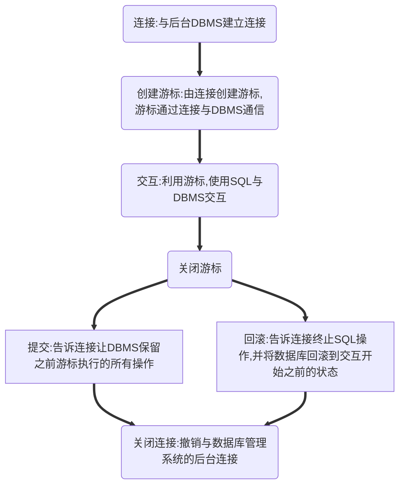

# 数据库API(v2.0)使用流程
> GitHub@[orca-j35](https://github.com/orca-j35)，所有笔记均托管于 [python_notes](https://github.com/orca-j35/python_notes) 仓库
>
> 参考:
>
> - 《headfirst python》 第 314 页，与 SQLite 相关的部分

数据库 API 规范 v2.0 (PEP 249) 为"数据驱动模块"的实现者提供了一种访问不同数据库标准机制。因此，只要是遵循 PEP 249 的"数据库驱动模块"，无论其后台使用何种数据库管理系统(DBMS)，操作 DBMS 的代码都遵循相同的使用流程:

PEP 249 的目标是让"数据库访问模块"提供相似的接口，实现一致性，从而让代码便于移植。

