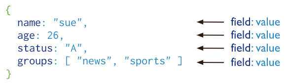
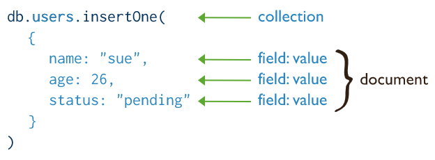

# MongoDB
> GitHub@[orca-j35](https://github.com/orca-j35)，所有笔记均托管于 [python_notes](https://github.com/orca-j35/python_notes) 仓库
>
> 参考：
>
> - [Introduction to MongoDB and Python - realpython](https://realpython.com/introduction-to-mongodb-and-python/) 


## 概述

相关资源:

- Home - https://www.mongodb.com/
- GitHub - https://github.com/mongodb
- StackOverflow - https://stackoverflow.com/tags/mongodb/info?jmp=footer
- Download - https://www.mongodb.com/download-center/community
- Docs - https://docs.mongodb.com/
- 术语表 - https://docs.mongodb.com/manual/reference/glossary/
- 教程 - runoob: http://www.runoob.com/mongodb/mongodb-tutorial.html

MongoDB 是一个跨平台的面向"文档"（*document*-*oriented*）的开源数据库程序，由 C++ 编写。和某些 NoSQL 数据库一样（但不完全相同），MongoDB 在["文档"](#document)中使用类似 JSON 的结构来存放数据。这使得数据非常灵活，并不需要数据符合预设的架构（*schema*）。

MongoDB 的部分重要功能如下：

- 支持许多标准查询类型，如，匹配（==）、比较（<>），甚至支持正则表达式
- 几乎可以存储任何种类的数据，包括结构化数据、部分结构化的数据，or even polymorphic
- 当要扩展（*scale* *up*）和处理更多查询，只需扩增计算机设备即可
- 具备高灵活性（*flexible*）和敏捷性（*agile*），允许你快速开发应用程序
- 作为基于"文档"（*document*-*based*）的数据，意味着你可以将和数据模型相关的所有信息存放在单个"文档"中
- 可以动态更改数据库的构架
- MongoDB 中也提供了许多关系型数据库中的功能（比如，索引）

从数据库支持的操作方面来看，MongoDB 拥有许多其它任何数据库系统都没有的工具和功能：

- 无论你是需要独立服务器，还是完整的独立服务器集群，MongoD B都可以根据您的需要进行扩展
- MongoDB 通过在各个分片（*shards*）中自动移动数据来提供负载平衡支持
- MongoDB 具备自动故障转移（*failover*）支持 - 如果主服务器出现故障，新主服务器将自动启动并运行
- MongoDB Management Service 或 MMS 是一个非常好的 Web 工具，使您能够跟踪您的计算机设备
- 由于采用了内存器映射文件（与关系数据库不同）可节省相当多的 RAM

如果使用索引功能，将带来一些优势：大部分数据将保留在内存中以便快速检索。即使是没有执行索引的特定"文档" key，Mongo 也会使用 [least recently used](https://en.wikipedia.org/wiki/Cache_replacement_policies#Least_Recently_Used_.28LRU.29) 方法来缓存相当多的数据。

在接触到 Mongo 以后，你可能会认为它就是许多数据库问题的解决方案，但是它并非没有缺点。其中一个人们常常提及的缺点是 Mongo 不支持 [ACID](https://en.wikipedia.org/wiki/ACID) 事务。事实上 Mongo 仅对 ACID 事务提供[有限的支持](https://en.wikipedia.org/wiki/ACID)，不是在所有情况下都支持 ACID 事务。在"单文档"（*single-document*）级别， Mongo 支持 ACID 事务。但是，由于 Mongo 的分布式特性，Mongo 不支持多"文档"的事务处理。

Mongo 还缺乏对本地连接（*native* *joins*）的支持，必须手动完成（因此要慢得多）。"文档"中可以存放任意内容，这意味着，一般来说，它们不需要引用其他"文档"。在现实世界中，这并不总是起作用，因为我们使用的数据本质上是关系性的。因此，许多人会争辩说 Mongo 应该被用作 SQL DB 的补充数据库，但是当你使用 MongoDB 时，你会发现这不一定是真的。

MongoDB 官方提供以下两种版本的数据库：

> - Community - MongoDB Community is the [source available and free to use](https://github.com/mongodb/mongo/) edition of MongoDB.
> - Enterprise - MongoDB Enterprise is available as part of the MongoDB Enterprise Advanced subscription and includes comprehensive support for your MongoDB deployment. MongoDB Enterprise also adds enterprise-focused features such as LDAP and Kerberos support, on-disk encryption, and auditing.

### Install on Windows

MongoDB 官方在 [Install MongoDB Community Edition on Windows](https://docs.mongodb.com/manual/tutorial/install-mongodb-on-windows/) 中给出了详细的安装指导，遵循此文档即可顺利完成安装。

安装器(`.msi`)会同时安装 MongoDB 的二进制文件和默认[配置文件](https://docs.mongodb.com/manual/reference/configuration-options/)( `<install directory>\bin\mongod.cfg` )。

从 MongoDB 4.0 开始，如果在安装器中选择 "Complete" 安装选项，便可在安装过程中将 MongoDB 设置为服务(免去了手动设置的麻烦)，此时也可以只安装二进制文件。如果只安装了二进制文件或是选择 "Custom" 安装选项，则需手动配置 MongoDB 服务，具体配置过程可参考如下资料:

- http://www.runoob.com/mongodb/mongodb-window-install.html
- 《python3网络爬虫开发实战》-> MongDB 的安装
- 崔庆才_Python3爬虫视频 -> 课时02：MongoDB环境配置.mp4

#### bin

简要介绍一下 `<install directory>\bin` 中的文件:

- mongod.exe - 用于建立 MongoDB 服务器
- mongo.exe - 交互式的 JavaScript shell 用于连接 MongoDB 服务器，详见 [The mongo Shell](https://docs.mongodb.com/manual/mongo/?searchProperty=current&query=y%27y)
- mongod.cfg - 配置文件，可查看各种配置信息(如, 端口、IP 地址、数据库路径、日志路径等)

在安装完 MongoDB 后，可以先运行一下 mongo.exe，以测试是否安装成功。


### 可视化管理工具

以下是适用于 MongoDB  的可视化管理工具:

- [Robo 3T](https://robomongo.org/) - 十分轻便的管理工具
- [Studio 3T](https://studio3t.com) - 比 Robo 3T 功能更加丰富
- [MongoDB Compass](https://www.mongodb.com/products/compass) - MongoDB 官方提供的可视化管理工具
- [navicat](https://www.navicat.com.cn/) - 支持中文，破解参考 [1](https://github.com/Deltafox79/Navicat_Keygen) , [2](https://www.jianshu.com/p/5f693b4c9468?mType=Group) (目前能够顺利破解 12.1 版)


## 术语解释

> 参考：
>
> - https://docs.mongodb.com/manual/crud/
> - https://docs.mongodb.com/manual/introduction/
> - [MongoDB 概念解析](https://www.runoob.com/mongodb/mongodb-databases-documents-collections.html)
> - https://docs.mongodb.com/manual/reference/glossary/
> - https://www.runoob.com/mongodb/mongodb-databases-documents-collections.html

下面是 SQL 和 MongoDB 所用术语的对应关系：

| SQL Terms/Concepts                                           | MongoDB Terms/Concepts                                       |
| :----------------------------------------------------------- | :----------------------------------------------------------- |
| database                                                     | [database](https://docs.mongodb.com/v3.4/reference/glossary/#term-database) |
| table                                                        | [collection](https://docs.mongodb.com/v3.4/reference/glossary/#term-collection) |
| row                                                          | [document](https://docs.mongodb.com/v3.4/reference/glossary/#term-document) or [BSON](https://docs.mongodb.com/v3.4/reference/glossary/#term-bson) document |
| column                                                       | [field](https://docs.mongodb.com/v3.4/reference/glossary/#term-field) |
| index                                                        | [index](https://docs.mongodb.com/v3.4/reference/glossary/#term-index) |
| table joins                                                  | [`$lookup`](https://docs.mongodb.com/v3.4/reference/operator/aggregation/lookup/#pipe._S_lookup), embedded documents |
| primary keySpecify any unique column or column combination as primary key. | [primary key](https://docs.mongodb.com/v3.4/reference/glossary/#term-primary-key)In MongoDB, the primary key is automatically set to the [_id](https://docs.mongodb.com/v3.4/reference/glossary/#term-id) field. |
| aggregation (e.g. group by)                                  | aggregation pipelineSee the [SQL to Aggregation Mapping Chart](https://docs.mongodb.com/v3.4/reference/sql-aggregation-comparison/). |

详见：https://docs.mongodb.com/manual/reference/sql-comparison/

### "文档"

"文档"是由 field-value 对组成的数据结构，相当于 [RDBMS](https://docs.mongodb.com/manual/reference/glossary/#term-rdbms) record。字段（*field*）的值可以是其它"文档"、数组或"文档数组"。在数据库中"文档"以 [BSON](https://docs.mongodb.com/manual/reference/glossary/#term-bson) 格式存放，详见 [Documents](https://docs.mongodb.com/manual/core/document/) 。




### "集合"

"集合"（collection）由一组 MongoDB "文档"构成。MongoDB "集合"相当于 [RDBMS](https://docs.mongodb.com/manual/reference/glossary/#term-rdbms) table。"集合"存在于单个[数据库](https://docs.mongodb.com/manual/reference/glossary/#term-database)中。"集合"不强制执行构架（*schema*）。虽然，"集合"中的"文档"可以拥有不同的字段。但通常来说，"集合"中的所有"文档"都具有一定的相似性。详见 [Collections](https://docs.mongodb.com/manual/core/databases-and-collections/#collections)




### BSON

MongoDB 将数据"文档"存储为 BSON 格式，BSON 是 JSON 的二进制表示，类似于 JSON，但 BSON 包含的数据类型多于 JSON。有关 BSON 规范，请参阅 [bsonspec.org](http://bsonspec.org/) 和  [BSON Types](https://docs.mongodb.com/manual/reference/bson-types/)。


## Python Drivers

相关资源:

- [MongoDB Python Drivers](https://docs.mongodb.com/ecosystem/drivers/python/) 
- [MongoDB Drivers and ODM](https://docs.mongodb.com/ecosystem/drivers/) 
- [Getting Started](https://docs.mongodb.com/manual/tutorial/getting-started/) 

### PyMongo

PyMongo 是由 Mongo 官方发布的 Python 驱动程序，本节将简要介绍 PyMongo 的使用用方法，但不会完全覆盖 PyMongo 的所有知识点，如需进一步了解 PyMongo，请参考 [PyMongo Documentation](http://api.mongodb.com/python/current/index.html) ；如需了解 CRUD 操作的技巧，请参考 [MongoDB CRUD Operations](https://docs.mongodb.com/manual/crud/)。

相关资源:

- GitHub: https://github.com/mongodb/mongo-python-driver

- PyPI: https://pypi.org/project/pymongo/

- [PyMongo Documentation](http://api.mongodb.com/python/current/index.html) 

  - [Installing / Upgrading](https://api.mongodb.com/python/current/installation.html)
  - [PyMongo Tutorial](http://api.mongodb.com/python/current/tutorial.html) 

  - [API Documentation](http://api.mongodb.com/python/current/api/index.html) 

- [MongoDB Python Drivers](https://docs.mongodb.com/ecosystem/drivers/python/)

- [MongoDB CRUD Operations](https://docs.mongodb.com/manual/crud/) 🧀

如果不确定 PyMongo 的版本，可查看 `version` 字段：

```python
import pymongo
print(pymongo.version)
```


#### 建立连接

使用 `pymongo.MongoClient` 类和 MongoDB 服务器建立连接：

```python
from pymongo import MongoClient
# MongoClient 支持上下文管理
with MongoClient(host='localhost', port=27017) as client:
    print(client)
#> MongoClient(host=['localhost:27017'], document_class=dict, tz_aware=False, connect=True)
```

还可以使用 Mongo URI 格式：

```python
client = MongoClient('mongodb://localhost:27017')
```


#### 选择数据库

可以通过 `MongoClient` 实例来访问 Mongo 服务器上的任意数据库，有以下两种选取目标数据库的方法：

- 以字段方式访问目标数据库

  ```python
  from pymongo import MongoClient
  with MongoClient(host='localhost', port=27017) as client:
      # 访问名为pymongo_test的数据库
      db = client.pymongo_test
      print(db)
  #> Database(MongoClient(host=['localhost:27017'], document_class=dict, tz_aware=False, connect=True), 'pymongo_test')
  #> <class 'pymongo.database.Database'>
  ```

- 以字典方式访问目标数据库

  ```python
  db = client['pymongo_test']
  ```

> ❓ Q：如果目标数据库并不存在，会发生什么？
>
> A：只要向数据库中保存数据，便会自动创建该数据库。


#### 选择集合

在获得数据库实例 `pymongo.database.Database()` 后，便可访问其中的"集合"，有以下两种选取目标"集合"的方法：

- 以字段方式访问目标"集合"

  ```python
  from pymongo import MongoClient
  with MongoClient(host='localhost', port=27017) as client:
      db = client.pymongo_test
      posts = db.posts
      print(posts)
      print(type(posts))
  #> Collection(Database(MongoClient(host=['localhost:27017'], document_class=dict, tz_aware=False, connect=True), 'pymongo_test'), 'posts')
  #> <class 'pymongo.collection.Collection'>
  ```

- 以字典方式访问目标"集合"

  ```python
  posts = db.posts
  ```

在 PyMongo 中"集合"被表示为 `pymongo.collection.Collection()` 对象

> ❓ Q：如果目标"集合"并不存在，会发生什么？
>
> A：只要向数据库中保存数据，便会自动创建该"集合"。

#### 插入"文档"...

> 详见：https://docs.mongodb.com/manual/tutorial/insert-documents/
>
> ⚠：存储在"集合"中的每条"文档"都需要一个具备唯一值的 [\_id](https://docs.mongodb.com/manual/reference/glossary/#term-id) 字段来作为[主键](https://docs.mongodb.com/manual/reference/glossary/#term-primary-key)。如果在插入"文档"时省略了 `_id` 字段，MongoDB Driver 便会为 `_id` 字段生成一个 [ObjectId](https://docs.mongodb.com/manual/reference/bson-types/#objectid) 类型的值，详见 https://docs.mongodb.com/manual/reference/bson-types/#objectid

向"集合"中插入"文档"的操作是通过 `pymongo.collection.Collection()` 对象来执行的 ，本节统一将 `pymongo.collection.Collection()` 简写为 `Collection()`。

- 🔨[Collection.insert_one()](https://api.mongodb.com/python/current/api/pymongo/collection.html#pymongo.collection.Collection.insert_one) - 向"集合"中插入一条"文档"

  ```python
  from pymongo import MongoClient
  with MongoClient(host='localhost', port=27017) as client:
      db = client.pymongo_test
      posts = db.posts
      post_data = {
          'title': 'Python and MongoDB',
          'content': 'PyMongo is fun, you guys',
          'author': 'orca-j35'
      }
      result = posts.insert_one(post_data)
      print(f'return: {result}')
      print(f'_id: {result.inserted_id}')
  """ Out:
  return: <pymongo.results.InsertOneResult object at 0x000001DE8E743DC8>
  _id: 5d70c089564f842ef8abbf99
  """
  ```


- 🔨[Collection.insert_many()](https://api.mongodb.com/python/current/api/pymongo/collection.html#pymongo.collection.Collection.insert_many) - 向"集合"中插入多条"文档"

  ```python
  from pymongo import MongoClient
  post_1 = {
      'title': 'Python and MongoDB',
      'content': 'PyMongo is fun, you guys',
      'author': 'orca-j35'
  }
  post_2 = {
      'title': 'Virtual Environments',
      'content': 'Use virtual environments, you guys',
      'author': 'orca-j35'
  }
  post_3 = {
      'title': 'Learning Python',
      'content': 'Learn Python, it is easy',
      'author': 'whale'
  }
  
  with MongoClient(host='localhost', port=27017) as client:
      db = client.pymongo_test
      posts = db.posts
      result = posts.insert_many([post_1, post_2, post_3])
      print(f'return: {result}')
      print(f'_id: {result.inserted_ids}')
  """ Out:
  return: <pymongo.results.InsertManyResult object at 0x000001E3141BBBC8>
  _id: [ObjectId('5d70c4b2564f8422c4072deb'), ObjectId('5d70c4b2564f8422c4072dec'), ObjectId('5d70c4b2564f8422c4072ded')]
  """
  ```


- 🔨[Collection.insert()](https://api.mongodb.com/python/current/api/pymongo/collection.html#pymongo.collection.Collection.insert) - 已弃用

  插入单个"文档"：

  ```python
  from pymongo import MongoClient
  with MongoClient(host='localhost', port=27017) as client:
      db = client.pymongo_test
      posts = db.posts
      post_data = {
          'title': 'Python and MongoDB',
          'content': 'PyMongo is fun, you guys',
          'author': 'orca-j35'
      }
      result = posts.insert(post_data)
      print(type(result))
      print(f'return: {result}')
  """ Out:
  DeprecationWarning: insert is deprecated. Use insert_one or insert_many instead.
    result = posts.insert(post_data)
  <class 'bson.objectid.ObjectId'>
  return: 5d70c131564f84209c040baa
  """
  ```

  插入多个"文档"：

  ```python
  from pymongo import MongoClient
  post_1 = {
      'title': 'Python and MongoDB',
      'content': 'PyMongo is fun, you guys',
      'author': 'orca-j35'
  }
  post_2 = {
      'title': 'Virtual Environments',
      'content': 'Use virtual environments, you guys',
      'author': 'orca-j35'
  }
  post_3 = {
      'title': 'Learning Python',
      'content': 'Learn Python, it is easy',
      'author': 'whale'
  }
  
  with MongoClient(host='localhost', port=27017) as client:
      db = client.pymongo_test
      posts = db.posts
      result = posts.insert([post_1, post_2, post_3])
      print(type(result))
      print(f'return: {result}')
  
  """ Out:
  DeprecationWarning: insert is deprecated. Use 
  insert_one or insert_many instead.
    result = posts.insert([post_1, post_2, post_3])
  <class 'list'>
  return: [ObjectId('5d70c2a5564f8443b01706cc'), ObjectId('5d70c2a5564f8443b01706cd'), ObjectId('5d70c2a5564f8443b01706ce')]
  """
  ```

  

#### 检索"文档"...

> 详见：https://docs.mongodb.com/manual/tutorial/query-documents/
>
> ⚠：存储在"集合"中的每条"文档"都需要一个具备唯一值的 [\_id](https://docs.mongodb.com/manual/reference/glossary/#term-id) 字段来作为[主键](https://docs.mongodb.com/manual/reference/glossary/#term-primary-key)。如果在插入"文档"时省略了 `_id` 字段，MongoDB Driver 便会为 `_id` 字段生成一个 [ObjectId](https://docs.mongodb.com/manual/reference/bson-types/#objectid) 类型的值，详见 https://docs.mongodb.com/manual/reference/bson-types/#objectid

在"集合"中检索"文档"的操作是通过 `pymongo.collection.Collection()` 对象来执行的，本节统一将 `pymongo.collection.Collection()` 简写为 `Collection()`。

- 🔨[Collection.find_one(*filter=None*, ....)](https://api.mongodb.com/python/current/api/pymongo/collection.html#pymongo.collection.Collection.find_one) - 从"集合"中检索出第一个与过滤器匹配的"文档"，返回值是一个字典对象。如果没有符合条件的"文档"，则会返回 `None`。

  ```python
  from pymongo import MongoClient
  # 下面三个"文档"已插入到了posts"集合"中
  post_1 = {
      'title': 'Python and MongoDB',
      'content': 'PyMongo is fun, you guys',
      'author': 'orca-j35'
  }
  post_2 = {
      'title': 'Virtual Environments',
      'content': 'Use virtual environments, you guys',
      'author': 'orca-j35'
  }
  post_3 = {
      'title': 'Learning Python',
      'content': 'Learn Python, it is easy',
      'author': 'whale'
  }
  
  with MongoClient(host='localhost', port=27017) as client:
      db = client.pymongo_test
      posts = db.posts
      result = posts.find_one({'author': 'orca-j35'})
      print(f'return type: {type(result)}')
      print(f'return: {result}')
  """ Out:
  return type: <class 'dict'>
  return: {'_id': ObjectId('5d71cc12564f840bd8dd2328'), 'title': 'Python and MongoDB', 'content': 'PyMongo is fun, you guys', 'author': 'orca-j35'}
  """
  ```
  
- 🔨[Collection.find(*filter=None*, ....)](https://api.mongodb.com/python/current/api/pymongo/collection.html#pymongo.collection.Collection.find) - 从"集合"中检索出所有与过滤器匹配的"文档"，返回值是 [`Cursor`](https://api.mongodb.com/python/current/api/pymongo/cursor.html#pymongo.cursor.Cursor) 对象。如果没有符合条件的"文档"，那么 `Cursor` 将是一个空容器。

  ```python
  from pymongo import MongoClient
  from pprint import pprint
  
  with MongoClient(host='localhost', port=27017) as client:
      db = client.pymongo_test
      posts = db.posts
      result = posts.find({'author': 'orca-j35'})
      print(f'return type: {type(result)}')
      print(f'return: {result}')
      pprint([d for d in result])
  """ Out:
  return type: <class 'pymongo.cursor.Cursor'>
  return: <pymongo.cursor.Cursor object at 0x000002B61E982FD0>
  [{'_id': ObjectId('5d71cc12564f840bd8dd2328'),
    'author': 'orca-j35',
    'content': 'PyMongo is fun, you guys',
    'title': 'Python and MongoDB'},
   {'_id': ObjectId('5d71cc12564f840bd8dd2329'),
    'author': 'orca-j35',
    'content': 'Use virtual environments, you guys',
    'title': 'Virtual Environments'}]
  """
  ```

除了以上两个常用的检索方法外，还有以下几个检索：

- find_raw_batches
- find_one_and_delete
- find_one_and_replace
- find_one_and_update

##### 过滤器

> 参考：https://docs.mongodb.com/manual/tutorial/query-documents/
>
> 扩展阅读： 
>
> - [Query and Projection Operators](https://docs.mongodb.com/manual/reference/operator/query/) 
> - [Query Documents](https://docs.mongodb.com/manual/tutorial/query-documents/)
>   - [Query on Embedded/Nested Documents](https://docs.mongodb.com/manual/tutorial/query-embedded-documents/)
>   - [Query an Array](https://docs.mongodb.com/manual/tutorial/query-arrays/)
>   - [Query an Array of Embedded Documents](https://docs.mongodb.com/manual/tutorial/query-array-of-documents/)
>   - [Project Fields to Return from Query](https://docs.mongodb.com/manual/tutorial/project-fields-from-query-results/)
>   - [Query for Null or Missing Fields](https://docs.mongodb.com/manual/tutorial/query-for-null-fields/) 

`find*()` 的过滤器（*filter*）参数是用来检索数据的"原型文档"，`find*()` 会返回与过滤器匹配的结果。有以下几种过滤器可供使用：

- `{}` - 如果使用空"文档"作为过滤器，则会选取"集合"中的所有"文档"

  ```python
  cursor = db.inventory.find({})
  ```

- `{<field1>: <value1>, ...}` - 通过 field-value 对来检索"集合"

  ```python
  # 从inventory集合中筛选出status等于"D"的文档
  cursor = db.inventory.find({"status": "D"})
  ```

- `{<field1>: { <operator1>: <value1> }, ...}` - 在 field-value 对中使用查询操作符来检索"集合"

  ```python
  # 从inventory集合中筛选出status等于"A"或"D"的文档
  cursor = db.inventory.find({"status": {"$in": ["A", "D"]}})
  # 从inventory集合中筛选出item以字符p开头的文档
  cursor = db.inventory.find({"item": {"$regex": "^p"}})
  ```

  查询操作符不仅包含比较操作，还包含逻辑操作（`$and`,`$not` ...）、元素操作（`$exists`,`$type`）、估值操作（`$expr`,`$regex`...）等等操作。有关查询操作符的完整列表，请见  [Query and Projection Operators](https://docs.mongodb.com/manual/reference/operator/query/)，

复合过滤器是指存在多个 field-value 对的过滤器，默认使用 AND 逻辑连接这些键值对，也就是说会筛选出与过滤器完全匹配的"文档"：

```python
# 从inventory集合中筛选出status等于"A",且qty小于30的文档
cursor = db.inventory.find({"status": "A", "qty": {"$lt": 30}})
```

如果要使用 OR 逻辑连接键值对，则需使用 [`$or`](https://docs.mongodb.com/manual/reference/operator/query/or/#op._S_or) 运算符：

```python
# 从inventory集合中筛选出status等于"A",或qty小于30的文档
cursor = db.inventory.find(
    {"$or": [{"status": "A"}, {"qty": {"$lt": 30}}]})
```

还可以同时使用 AND 和 OR 逻辑：

```python
# 从inventory集合中筛选出status等于"A",且qty小于30的文档;
# 或status等于"A",且item以字符p开头的文档
cursor = db.inventory.find({
    "status": "A",
    "$or": [{"qty": {"$lt": 30}}, {"item": {"$regex": "^p"}}]})
```


##### Cursor 对象

> 参考：https://api.mongodb.com/python/current/api/pymongo/cursor.html#pymongo.cursor.Cursor

[`Cursor`](https://api.mongodb.com/python/current/api/pymongo/cursor.html#pymongo.cursor.Cursor) 是一个可迭代对象，要获取其中的"文档"，只需对其进行迭代即可：

```python
for post in scotts_posts:
    print(post)
```

`Cursor` 中包含许多用于处理数据的辅助方法：

- count(with_limit_and_skip=False) - 获取查询结果集的大小，不推荐使用该方法，请改用 [`count_documents()`](https://api.mongodb.com/python/current/api/pymongo/collection.html#pymongo.collection.Collection.count_documents) 方法，另见 [Counting](https://api.mongodb.com/python/current/tutorial.html#counting)
- sort(key_or_list, direction=None) - 对结果集进行排序
- skip(n) - 跳过结果集中的前 n 个结果
- limit(n) - 返回结果集中的前 n 个结果

除上述方法外，`Cursor` 中还包含很多方法和字段，详见 https://api.mongodb.com/python/current/api/pymongo/cursor.html#pymongo.cursor.Cursor

#### 更新"文档"

> 详见：https://docs.mongodb.com/manual/tutorial/update-documents/

在"集合"中更新"文档"的操作是通过 `pymongo.collection.Collection()` 对象来执行的，本节统一将 `pymongo.collection.Collection()` 简写为 `Collection()`。

- 🔨[Collection.update_one(*filter*, *update*, ...)](https://api.mongodb.com/python/current/api/pymongo/collection.html#pymongo.collection.Collection.update_one) 
- 🔨[Collection.update_many(*filter*, *update*, ...)](https://api.mongodb.com/python/current/api/pymongo/collection.html#pymongo.collection.Collection.update_many) 
- 🔨[Collection.update()](https://api.mongodb.com/python/current/api/pymongo/collection.html#pymongo.collection.Collection.update) - 已弃用


#### 删除"文档"

> 详见：https://docs.mongodb.com/manual/tutorial/remove-documents/

在"集合"中删除"文档"的操作是通过 `pymongo.collection.Collection()` 对象来执行的，本节统一将 `pymongo.collection.Collection()` 简写为 `Collection()`。

- 🔨[Collection.delete_one(*filter*, *collation=None*, *session=None*)](https://api.mongodb.com/python/current/api/pymongo/collection.html#pymongo.collection.Collection.delete_one) 
- 🔨[Collection.delete_many(*filter*, *collation=None*, *session=None*)](https://api.mongodb.com/python/current/api/pymongo/collection.html#pymongo.collection.Collection.delete_many) 
- 🔨[Collection.remove()](https://api.mongodb.com/python/current/api/pymongo/collection.html#pymongo.collection.Collection.remove) - 已弃用


### MongoEngine

> 参考：https://realpython.com/introduction-to-mongodb-and-python/#mongoengine

尽管 PyMongo 已经非常易于人们使用了，但是对于大多数项目而言，它的工作方式还是有点偏向于底层。也就是说，你必须编写很多代码来进行 CRUD 操作。

[MongoEngine](http://mongoengine.org/) 库在 PyMongo 的基础上提供了更加抽象的操作方式。MongoEngine 是一个对象文档映射器（object document mapper - ODM），它大致相当于基于 SQL 的对象关系映射器（object relational mapper - ORM）。MongoEngine 提供的抽象是基于类的，因此你创建的所有模型都是类。

在使用 MongoDB 时，虽然有很多 Python 库可以为我们提供帮助， MongoEngine 就是最好的选择之一，因为它提供了丰富的功能，有较好的灵活性，并且拥有社区的支持。

相关资源：

- Home - http://mongoengine.org/
- GitHub - https://github.com/MongoEngine/mongoengine
- PyPI - https://pypi.org/project/mongoengine/#description
- Docs - http://docs.mongoengine.org/
  - User Guide - http://docs.mongoengine.org/guide/index.html

安装：

```shell
pip install mongoengine
```

与 MongoDB 服务器建立连接：

```python
import mongoengine as me
me.connect('mongoengine_test', host='localhost', port=27017)
```

#### 定义"文档"

> 请交叉参考：http://docs.mongoengine.org/tutorial.html

在设置"文档"对象时，需要定义"文档"对象所需的数据。这类似于 ORM，需要创建一个继承自 `Document` 的子类，并在其中设置需要的数据类型（或说数据字段）：

```python
import datetime

class Post(Document):
    title = StringField(required=True, max_length=200)
    content = StringField(required=True)
    author = StringField(required=True, max_length=50)
    published = DateTimeField(default=datetime.datetime.now)
```

在上面这个简单的模型中，`Post` 实例将包含 `title`、`content`、`author` 和 `published`（发布时间），并且会验证数据的有效性。比如，当我们尝试保存缺少 `title` 数据的 `Post` 实例时，则会抛出异常。

在创建"文档"对象实例时，并不会验证其字段的有效性，只有在调用 `save()` 方法时才会验证数据的有效性。

在创建数据类型（或说数据字段）时，可以使用关键字参数（如 `required`、`max_length` ...）来进一步自定义字段的约束条件，详见 [2.3.3.1. Field arguments](http://docs.mongoengine.org/guide/defining-documents.html#field-arguments)

除了上述几种字段外，还有很多其它字段类型，详见 [2.3.3. Fields](http://docs.mongoengine.org/guide/defining-documents.html#fields) 和 [3.5. Fields](http://docs.mongoengine.org/apireference.html#fields)

每个 `Document` 的子类对应一个"集合"，例如 `Post` 类对应一个名为 post 的集合。

#### 保存"文档"

在保存"文档"时需调用 `save()` 方法。如果"集合"中已有该"文档"，则将在原子级别上对现有文档进行更改；如果"集合"中不包含该"文档"，则会创建该"文档"。

```python
import mongoengine as me
import datetime
me.connect('mongoengine_test', host='localhost', port=27017)


class Post(me.Document):
    title = me.StringField(required=True, max_length=200)
    content = me.StringField(required=True)
    author = me.StringField(required=True, max_length=50)
    published = me.DateTimeField(default=datetime.datetime.now)


post_1 = Post(
    title='Sample Post', content='Some engaging content', author='Scott')

post_1.save()  # This will perform an insert
print(post_1.title)
post_1.title = 'A Better Post Title'
post_1.save()  # This will perform an atomic edit on "title"
print(post_1.title)
'''Out:
Sample Post
A Better Post Title
'''
```

使用 `save()` 方法的注意事项：

> - PyMongo will perform validation when you call `.save()`. This means it will check the data you’re saving against the schema you declared in the class. If the schema (or a constraint) is violated, then an exception is thrown and the data is not saved.
> - Since Mongo doesn’t support true transactions, there is no way to “roll back” the `.save()` call like you can in SQL databases. Although you can get close to performing transactions with [two phase commits](https://docs.mongodb.com/v3.4/tutorial/perform-two-phase-commits/), they still don’t support rollbacks.

#### 查询数据

> 参考：http://docs.mongoengine.org/guide/querying.html#query-operators

[`Document`](http://docs.mongoengine.org/apireference.html#mongoengine.Document) 类有一个名为 `objects` 的字段，该字段被用来访问数据库中与类关联的对象。`objects` 字段实际上是一个 `QuerySetManager` 对象，在访问 `objects` 字段时会创建并返回一个新的 [`QuerySet`](http://docs.mongoengine.org/apireference.html#mongoengine.queryset.QuerySet) 对象。我们可以通过迭代 [`QuerySet`](http://docs.mongoengine.org/apireference.html#mongoengine.queryset.QuerySet) 对象来获取数据库中的"文档"：

```python
# Prints out the names of all the users in the database
for user in User.objects:
    print user.name
```

> As of MongoEngine 0.8 the querysets utilise a local cache. So iterating it multiple times will only cause a single query. If this is not the desired behaviour you can call `no_cache` (version **0.8.3+**) to return a non-caching queryset.

##### 过滤结果集

可以通过调用 [`QuerySet`](http://docs.mongoengine.org/apireference.html#mongoengine.queryset.QuerySet) 对象来过滤结果集：

```python
# This will return a QuerySet that will only iterate over users whose
# 'country' field is set to 'uk'
uk_users = User.objects(country='uk')
```

详见：http://docs.mongoengine.org/guide/querying.html#filtering-queries


#### 面向对象

> 详见：http://docs.mongoengine.org/guide/querying.html#default-document-queries

默认情况下，`Document` 对象的 [`objects`](http://docs.mongoengine.org/apireference.html#Document.objects) 属性会返回的 [`QuerySet`](http://docs.mongoengine.org/apireference.html#mongoengine.queryset.QuerySet) 不会对"集合"进行过滤，会保留"集合"中的所有"文档"。假如在 `Document` 对象中定义一个名为 `objects` 方法，便可以按照我们的期望来过滤结果集：

> The method should accept two arguments – `doc_cls` and `queryset`. The first argument is the [`Document`](http://docs.mongoengine.org/apireference.html#mongoengine.Document) class that the method is defined on (in this sense, the method is more like a `classmethod()` than a regular method), and the second argument is the initial queryset. The method needs to be decorated with [`queryset_manager()`](http://docs.mongoengine.org/apireference.html#mongoengine.queryset.queryset_manager) in order for it to be recognised.

```python
class BlogPost(Document):
    title = StringField()
    date = DateTimeField()

    @queryset_manager
    def objects(doc_cls, queryset):
        # This may actually also be done by defining a default ordering for
        # the document, but this illustrates the use of manager methods
        return queryset.order_by('-date')
```

MongoEngine 支持[面向对象](https://realpython.com/python3-object-oriented-programming/)，因此我们可以向 `Document` 的子类中添加方法。也就是说我们可以通过添加自定义方法来获取经过过滤的结果集：

```python
class BlogPost(Document):
    title = StringField()
    published = BooleanField()

    @queryset_manager
    def live_posts(doc_cls, queryset):
        return queryset.filter(published=True)

BlogPost(title='test1', published=False).save()
BlogPost(title='test2', published=True).save()
assert len(BlogPost.objects) == 2
assert len(BlogPost.live_posts()) == 1
```

#### 引用其它"文档"

> 详见：http://docs.mongoengine.org/guide/defining-documents.html#reference-fields

可以在 `Document` 类中使用 `ReferenceField` 对象来引用另一个 `Document` 对象中的子类。

> MongoEngine handles the lazy de-referencing automatically upon access, which is more robust and less error-prone than having to remember to do it yourself everywhere in your code. 

```python
class Author(Document):
    name = StringField()

class Post(Document):
    author = ReferenceField(Author)

# 使用"文档"引用来获取第一个post"文档"的author
Post.objects.first().author.name
```


### Motor

Mongo 官方推荐将 Motor 用作 MongoDB 的异步驱动。Motor 兼容 [Tornado](http://www.tornadoweb.org/) 和 [asyncio](https://docs.python.org/3/library/asyncio.html)，但不支持 Windows。

相关资源:

- GitHub: https://github.com/mongodb/motor/
- Docs: https://motor.readthedocs.io/en/stable/
- [Async Driver](https://docs.mongodb.com/ecosystem/drivers/python/#async-driver) 


## 术语

> 参考：https://docs.mongodb.com/manual/reference/glossary/#term-document

### BSON

A serialization format used to store [documents](https://docs.mongodb.com/manual/reference/glossary/#term-document) and make remote procedure calls in MongoDB. “BSON” is a portmanteau of the words “binary” and “JSON”. Think of BSON as a binary representation of JSON (JavaScript Object Notation) documents. See [BSON Types](https://docs.mongodb.com/manual/reference/bson-types/) and [MongoDB Extended JSON (v2)](https://docs.mongodb.com/manual/reference/mongodb-extended-json/).

### BSON types

The set of types supported by the [BSON](https://docs.mongodb.com/manual/reference/glossary/#term-bson) serialization format. For a list of BSON types, see [BSON Types](https://docs.mongodb.com/manual/reference/bson-types/).

### collection

A grouping of MongoDB [documents](https://docs.mongodb.com/manual/reference/glossary/#term-document). A collection is the equivalent of an [RDBMS](https://docs.mongodb.com/manual/reference/glossary/#term-rdbms) table. A collection exists within a single [database](https://docs.mongodb.com/manual/reference/glossary/#term-database). Collections do not enforce a schema. Documents within a collection can have different fields. Typically, all documents in a collection have a similar or related purpose. See [Namespaces](https://docs.mongodb.com/manual/reference/limits/#faq-dev-namespace).

### document

A record in a MongoDB [collection](https://docs.mongodb.com/manual/reference/glossary/#term-collection) and the basic unit of data in MongoDB. Documents are analogous to [JSON](https://docs.mongodb.com/manual/reference/glossary/#term-json) objects but exist in the database in a more type-rich format known as [BSON](https://docs.mongodb.com/manual/reference/glossary/#term-bson). See [Documents](https://docs.mongodb.com/manual/core/document/).

