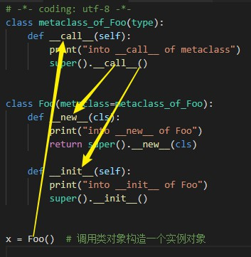

# Metaclasses

[TOC]

> 本文的目标是讨论如何使用自定义元类。由于自定义元类总继承自 `type`，且 `type` 只能构造新式类，所以自定元类也只能构造新式类。因此，本文仅针对新式类展开，不涉及旧式类。强调一点，本文中提到的"类"均指"新式类"。如果想了解新式类和旧式类的差异，可阅读笔记 [Old-Style vs. New-Style Classes](Old-Style vs. New-Style Classes.md) 
>
> 由于 Python 2 中同时存在新式类和旧式类，容易造成混淆。所以文本基于 Python 3 展开。

元编程(*metaprogramming*)是一种编程技术，采用元编程的计算机程序，能够将程序视为数据。这意味着利用元编程技术可以设计出一种能够读取、生成、分析或改变其它程序的程序，利用元编程技术甚至可以在运行时对自身进行修改。[^1]

Python 支持一种适用于类的元编程形式，即元类(*metaclasses*)。

## 1. 类的类型

在 Python 3 中，所有自定义类和内置类型([Built-in Types](https://docs.python.org/3.7/library/stdtypes.html#built-in-types))均是新式类。由于新式类将 "类(*class*)" 和 "类型(*type*)" 的概念进行了统一，所以在 Python 3 中 "类(*class*)" 和 "类型(*type*)" 是同义词，两者并没有任何区别。但我们通常会将术语 "类型(*type*)" 用于内置类型(如 `str` 类型)和元类(如 `type` 类型)；将术语 "类(*class*)" 用于自定义类。[^2] [^3] [^4]

由于[在 Python 中一切皆是对象](https://mail.python.org/pipermail/python-list/2015-June/691689.html)，并且所有对象均是"一类(first class)"对象。
因此，类在Python 中也是对象，并且可以对类执行如下操作：

- 把类赋值给一个变量
- 把类作为函数实参进行传递
- 把类作为函数的返回值
- 在运行时动态地创建类

**所有对象皆有类型**，类由元类构造，所以类的类型便是构造它的元类。
例如：在没有使用自定义元类的默认情况下，类由元类 `type` 构造，所以类的类型是元类 `type`。

```python
>>> # in Python3
>>> class Foo:
...     pass
...
>>> x = Foo()

>>> type(x) # 实例对象x的类型是类Foo
<class '__main__.Foo'>

>>> type(Foo) # 类Foo的类型是元类type
<class 'type'>
```

内置类型(*Built-in Types*)同样由元类 `type` 构造，所以内置类型的类型也是 `type`。

```python
>>> for t in int, float, dict, list, tuple:
...     print(type(t))
...
<class 'type'>
<class 'type'>
<class 'type'>
<class 'type'>
<class 'type'>
```

元类 `type` 的类型也是 `type`：

```python
>>> type(type)
<class 'type'>
```

综上可见，在没有使用自定义元类的默认情况下，类对象由元类 `type` 构造，每个类对象均是元类 `type` 的一个实例，元类 `type` 是类对象的类型(元类 `type` 的类型也是 `type`)

因此，对于之前创建的 `Foo` 类，便存在如下链式关系：

- `x` 是类 `Foo` 的一个实例
- 类 `Foo` 是元类 `type` 的一个实例
- 元类 `type` 也是自身的一个实例，因此 `type` 本身就是一个实例。


对上述链式关系做进一步的抽象，如下：


## 2. 动态创建类对象

在动态语言中类和函数是在运行时动态创建的；而在静态语言中它们在编译时被创建。

Python 作为动态语言，其"类对象"是在运行时由元类动态创建的：当解释器遇到[**类定义语句**](https://docs.python.org/3.7/reference/compound_stmts.html#class-definitions)时，会从中获取三个参数：类名、父类元组、包含类成员的字典；并**调用指定的元类**来处理这三个参数，从而构造出一个类对象。[^3] [^5] [^6] [^7] 

如果没有指定的元类，则默认调用元类 `type` 来处理参数，并构造类对象。下面我们就来仔细探究元类 `type` 的调用方式。

tips: <u>使用"类定义语句"创建类的方式</u>与<u>使用对应元类创建类的方式</u>完全等效。

### 2.1 type

内置函数 `type()` 其实是元类 `type` 的构造函数，有如下两种使用方式：

- type(*object*) -> the object's type：

  对于新式类，type(*object*) 的返回值通常与 [`object.__class__`](https://docs.python.org/3.7/library/stdtypes.html#instance.__class__) 相同。

  ```python
  >>> # in Python 3
  >>> type(3)
  <class 'int'>
  
  >>> type(['foo', 'bar', 'baz'])
  <class 'list'>
  
  >>> t = (1, 2, 3, 4, 5)
  >>> type(t)
  <class 'tuple'>
  
  >>> class Foo:
  ...     pass
  ...
  >>> type(Foo())
  <class '__main__.Foo'>
  ```

- type(*name*, *bases*, *dict*) -> a new type(or class) object：

  - *name* : a string specifies a name of  new type(or class) object. This becomes the `__name__` attribute of the type(or class).
  - *bases* : a tuple itemizes the base classes. This becomes the `__bases__` attribute of the type(or class).
  - *dict* : a dictionary is the namespace containing definitions for class body . This becomes the `__dict__` attribute of the type(or class).

tips: type(*name*, *bases*, *dict*) 是[**类定义语句**](https://docs.python.org/3.7/reference/compound_stmts.html#class-definitions)的动态形式。在保证参数一直的前提下，通过这两种方式构造出的类对象完全等效。

#### 最简单的情况

In this first example, the *bases*  and *dict* arguments passed to `type()` are both empty. No inheritance from any parent class is specified, and nothing is initially placed in the namespace dictionary. 

```python
>>> Foo = type('Foo', (), {})

>>> x = Foo()
>>> x
<__main__.Foo object at 0x04CFAD50>
>>> Foo.__bases__ # 基类列表为空，默认继承object
(<class 'object'>,)
```

`Foo` 类也可通过类定义语句构造，如下：(两种构造方式等效)

```python
>>> class Foo:
...     pass
...
>>> x = Foo()
>>> x
<__main__.Foo object at 0x0370AD50>
```

#### 有基类和字段的情况

*bases*  is a tuple with a single element `Foo`, specifying the parent class that `Bar` inherits from. An attribute, `attr`, is initially placed into the namespace dictionary:

```python
>>> Bar = type('Bar', (Foo,), dict(attr=100))

>>> x = Bar()
>>> x.attr
100
>>> x.__class__
<class '__main__.Bar'>
>>> x.__class__.__bases__
(<class '__main__.Foo'>,)
```

`Bar` 类也可通过类定义语句构造，如下：(两种构造方式等效)

```python
>>> class Bar(Foo):
...     attr = 100
...

>>> x = Bar()
>>> x.attr
100
>>> x.__class__
<class '__main__.Bar'>
>>> x.__class__.__bases__
(<class '__main__.Foo'>,)
```

#### 有字段和方法的情况

This time, *bases* is again empty. Two objects are placed into the namespace dictionary via the *dict*  argument. The first is an attribute named `attr` and the second a function named `attr_val`, which becomes a method of the defined class:

```python
>>> Foo = type(
...     'Foo',
...     (),
...     {
...         'attr': 100,
...         'attr_val': lambda x : x.attr # x相当于self
...     }
... )

>>> x = Foo()
>>> x.attr
100
>>> x.attr_val()
100
```

`Foo` 类也可通过类定义语句构造，如下：(两种构造方式等效)

```python
>>> class Foo:
...     attr = 100
...     def attr_val(self):
...         return self.attr
...

>>> x = Foo()
>>> x.attr
100
>>> x.attr_val()
100
```

#### 有字段和外置方法的情况

Only very simple functions can be defined with [`lambda` in Python](https://dbader.org/blog/python-lambda-functions). In the following example, a slightly more complex function is defined externally then assigned to `attr_val` in the namespace dictionary via the name `f`:

```python
>>> def f(obj): # obj相当于self
...     print('attr =', obj.attr)
...
>>> Foo = type(
...     'Foo',
...     (),
...     {
...         'attr': 100,
...         'attr_val': f
...     }
... )

>>> x = Foo()
>>> x.attr
100
>>> x.attr_val()
attr = 100
```

`Foo` 类也可通过类定义语句构造，如下：(两种构造方式等效)

```python
>>> def f(obj):
...     print('attr =', obj.attr)
...
>>> class Foo:
...     attr = 100
...     attr_val = f
...

>>> x = Foo()
>>> x.attr
100
>>> x.attr_val()
attr = 100
```

## 3. 自定义元类

Custom Metaclasses

[3.3.3.1. Metaclasses - Python 3](https://docs.python.org/3.7/reference/datamodel.html#metaclasses)

[3.4.3. Customizing class creation - Python 2](https://docs.python.org/2/reference/datamodel.html#customizing-class-creation)

在前面的两个小节中，我们已经逐步熟悉了元类。
让我们先再次回忆一下实例对象、类对象和元类间的关系：


简而言之，元类就是用于构造类对象的类，最常见的元类便是 `type`。
如果我们想创建自定义元类，只需继承 `type` 即可。
由于 `type` 只能创建新式类，所以自定义元类也只能创建新式类。

让我们来创建一个简单的自定义元类：

```python
# -*- coding: utf-8 -*-
class Meta(type):  # 自定义元类需继承自type
    def __new__(cls, name, bases, dct):  # __new__方法的参数需和type一致
        # 需通过super调用父类的__new__方法来构造新的类对象
        x = super().__new__(cls, name, bases, dct) 
        x.attr = 100 # 可为类对象添加自定义属性
        return x # 最后需返回类对象
```

让我们利用 `Meta` 元类构造来构造新的类对象：

```python
>>> class Foo(metaclass=Meta): # 需使用metaclass关键字指定目标元类
...     pass
...
>>> Foo.attr # Meta为Foo添加了attr属性
100
```


Note: 仅 Python 2 支持特殊变量 `__metaclass__`。


### \_\_call\_\_ 方法

因为类对象是其元类的实例，所以当我们调用某个类时，其实是在调用其元类的 `__call__` 方法。考虑下面这段代码：

```python
# -*- coding: utf-8 -*-
class metaclass_of_Foo(type):
    def __call__(self):
        print("into __call__ of metaclass")
        super().__call__()


class Foo(metaclass=metaclass_of_Foo):
    def __new__(cls):
        print("into __new__ of Foo")
        return super().__new__(cls)

    def __init__(self):
        print("into __init__ of Foo")
        super().__init__()


x = Foo()  # 调用类对象来构造一个实例对象
```

表达式 `x = Foo()` 会为 `Foo` 类构造一个新实例 `x`。
从细节上来说，当解释器遇到 `Foo()` 时，会执行如下操作：

- 首先，因为 `Foo` 是元类 `metaclass_of_Foo` 的实例，所以会调用 `metaclass_of_Foo.__call__(Foo)`；
- 然后，在 `metaclass_of_Foo.__call__(Foo)` 方法中，又会依次调用：
  - `Foo.__new__(Foo)` 
  - `Foo.__init__(x)`

大致过程如下图所示：



## 扩展阅读

- [oop - What is a metaclass in Python? - Stack Overflow](http://stackoverflow.com/questions/100003/what-is-a-metaclass-in-python)
  - 译文：[深刻理解Python中的元类(metaclass) - 伯乐在线](http://blog.jobbole.com/21351/)
- [Python基础：元类](http://www.cnblogs.com/russellluo/p/3409602.html)
- [在Python中使用class decorator和metaclass](http://blog.zhangyu.so/python/2016/02/19/class-decorator-and-metaclass-in-python/)
- [Meta-classes Made Easy](http://www.voidspace.org.uk/python/articles/metaclasses.shtml)

## 注脚

[^1]: https://en.wikipedia.org/wiki/Metaprogramming
[^2]: https://realpython.com/python-metaclasses/
[^3]: [Metaclasses in Five Minutes](http://www.voidspace.org.uk/python/articles/five-minutes.shtml)
[^4]: [陌生的 metaclass](https://funhacks.net/explore-python/Class/metaclass.html)
[^5]: [使用元类 - 廖雪峰](https://www.liaoxuefeng.com/wiki/0014316089557264a6b348958f449949df42a6d3a2e542c000/0014319106919344c4ef8b1e04c48778bb45796e0335839000#0)
[^6]: [3.3.3. Customizing class creation - Python 3](https://docs.python.org/3.7/reference/datamodel.html#customizing-class-creation)
[^7]: [3.4.3. Customizing class creation - Python 2](https://docs.python.org/2/reference/datamodel.html#customizing-class-creation)

 


## 术语

### object

Any data with state (attributes or value) and defined behavior (methods). Also the ultimate base class of any [new-style class](https://docs.python.org/3.7/glossary.html#term-new-style-class).

### class

A template for creating user-defined objects. Class definitions normally contain method definitions which operate on instances of the class.

### type

The type of a Python object determines what kind of object it is; every object has a type. An object’s type is accessible as its [`__class__`](https://docs.python.org/3.7/library/stdtypes.html#instance.__class__) attribute or can be retrieved with`type(obj)`.

### metaclass

The class of a class. Class definitions create a class name, a class dictionary, and a list of base classes. The metaclass is responsible for taking those three arguments and creating the class. Most object oriented programming languages provide a default implementation. What makes Python special is that it is possible to create custom metaclasses. Most users never need this tool, but when the need arises, metaclasses can provide powerful, elegant solutions. They have been used for logging attribute access, adding thread-safety, tracking object creation, implementing singletons, and many other tasks.

More information can be found in [Metaclasses](https://docs.python.org/3.7/reference/datamodel.html#metaclasses) and in  [Customizing class creation](https://docs.python.org/2/reference/datamodel.html#metaclasses).


