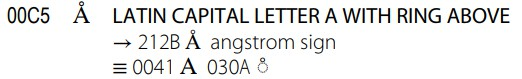

# 术语

# todo

> 到底什么是抽象字符
>
> utf 部分的翻译补全
>

***Unicode*** 是一种用数值表示字符的标准，适用于世界上所有的语言，它为不同语言提供了存储、搜索和替换文本的统一方法。Unicode 作为一种标准，其中包含了用于可视化参考的编码图表(code charts)、一组标准字符编码、一组编码方案、一组参考数据文件以及许多相关项目。我们在网络上看到的很多资料会将 Unicode 仅视作一个字符集，这种理解是不正确的。

***Unicode 转换格式*** (Unicode Transformation Format)：是 *Unicode encoding form*  或 *Unicode encoding scheme* 的模糊同义词，优先使用后两者。

***Unicode 签名*** (Unicode Signature)：是一个隐式标记，用于将文件标识为包含特定"编码模式"的 Unicode 文本。初始化字节顺序标记(BOM)可用作 Unicode 签名。

***Unicode 字符串*** (Unicode String)：一个"编码单元序列 "，其中包含了特定 Unicode "编码模式"下的"编码单元"。(See definition D80 in [Section 3.9, Unicode Encoding Forms](http://www.unicode.org/versions/latest/ch03.pdf#G7404).)

***Unicode 字符数据库*** (Unicode Character Database)：有关 Unicode 字符属性和映射关系的规范及详细信息的一组文件。

***字素*** (Grapheme)：在特定书写系统的背景下，最低限度的独特写作单位。示例：在英文书写系统中 ‹b› 和 ‹d› 是不同的字素，因为它们会形成不同的单词，如 big 和 dig。但是，小写拉丁字母 a 和小写罗马字母 a 并没有明显区别，因为在这两种不同形式的基础上不能区分出不同的单词。 (2) 用户认为的字符

## 字形

***字形*** (glyph)：(1)表示一个或多个"字形图形"的抽象形式。(2)与字形图像(glyph image)同义。在显示 Unicode 字符数据时，可以选择一个至多个字形来描绘特定字符。在合成(composition )和布局(layout)处理期间，会通过渲染引擎选择这些字形。(See also *character*.)

***字形代码*** (Glyph Code)：用于引用字形的数字代码。通常会通过字形代码来引用字体(font)中包含的字形。字形代码可以是特定字体的本地代码；也就是说，包含相同字形的不同字体可以使用不同的代码。

***字形标识符*** (Glyph Identifier)：与字形代码类似，字形标识符是用于引用字体内字形的标签。字体可以采用本地和全局字形标识符。

***字形图像*** (Glyph Image)：已经点阵化(rasterized)或以其它方式成像到某些显示表面的字形表示的具体图像。The actual, concrete image of a glyph representation having been rasterized or otherwise imaged onto some display surface.

***字体*** (Font)：字形的集合，用于字符数据的可视化描述。字体通常会关联一组参数[例如，size, posture, weight, serifness]，在为参数设置特定值后，便会生成一个图像化(imagable)的字形集合。

## 字符

***字符*** (Character)：(1)在书面语言中具备语义价值的最小组成部分，泛指抽象的意义和[或]形状(shape)，而非特定的形状 (see also *glyph*)；然而在编码表(code tables)中，为了便于读者理解，呈现某种形式的视觉表示是必不可少的。(2)抽象字符的同义词。(3)Unicode 字符编码的基本单元。(4) The English name for the ideographic written elements of Chinese origin. [See *ideograph* (2).]

***字符集*** (Character Set)：A collection of elements used to represent textual information.

***抽象字符***(Abstract Character)：用于组织、控制或表示文本数据的信息单元。(See definition D7 in [Section 3.4, Characters and Encoding](http://www.unicode.org/versions/latest/ch03.pdf#G2212).)。

- 抽象字符没有具体形式，不应与字形(glyph)混淆
- 抽象字符不一定与用户认为的“字符”相对应，不应与 grapheme 混淆。

***抽象字符序列*** (Abstract Character Sequence)：一个或多个抽象字符的有序序列(See definition D8 in Section [Section 3.4, Characters and Encoding](http://www.unicode.org/versions/latest/ch03.pdf#G2212).) 

***未分配字符***(Unassigned Character)：未分配给抽象字符的码点，包含代理(surrogate)码点、非字符(noncharacters)以及保留码点。 (See [Section 2.4, Code Points and Characters](http://www.unicode.org/versions/latest/ch02.pdf#G25564).)

***已分配字符*** (Assigned Character)：已被分配给抽象字符的码点，是指在 Unicode 标准中已编码的字符——graphic, format, control, and private-use characters。(See [Section 2.4, Code Points and Characters](http://www.unicode.org/versions/latest/ch02.pdf#G25564).)

### 已编码字符

***已编码字符*** (Encoded Character)：抽象字符(abstract character)和码点(code point)之间的关联(或映射)[See definition D11 in [Section 3.4, Characters and Encoding](http://www.unicode.org/versions/latest/ch03.pdf#G2212).]。抽象字符本身没有数值值，但"encoding a character"的步骤会将特定的码点与特定的抽象字符关联。已编码字符中不包含"未分配字符"。

- An encoded character is also referred to as a coded character.

- 虽然"已编码字符"在术语中的正式定义是，抽象字符和码点之间的映射；但非正式地来讲，"已编码字符"可被认为是与为其分配的码点一起使用的抽象字符。

- 有时，为了与其他标准兼容，单个抽象字符可能会对应多个码点，比如 "Å" 拥有两个对应的码点： U+00C5 和 U+212B。

- 单个字符也可由一系列码点表示，比如 "Å" 也可被表示为码点序列：U+0041 U+030A，而不再是被映射到单个码点。

  

***已编码字符序列*** (Coded Character Sequence)：一个或多个码点构成的有序序列。通常，由一系列编码字符组成，但也可能包含非字符(noncharacters)或保留(reserved)码点。(See definition D12 in [Section 3.4, Characters and Encoding](http://www.unicode.org/versions/latest/ch03.pdf#G2212).) 另外，Coded Character Representation 与 coded character sequence 同义

***已编码字符集***(coded character set)：是一个字符集，其中的每个字符都分配有数值码点，或说每个字符都拥有各自的码点。通常会简写为字符集(character set)、charset、编码集(code set)。A character set in which each character is assigned a numeric code point. 

## 码点

***码点***(code point)：(1) Unicode 编码空间(codespace)中的任意值，也就是说可以是 0 ~ 0x10FFFF 中的任意值。(See definition D10 in [Section 3.4, Characters and Encoding](http://www.unicode.org/versions/latest/ch03.pdf#G2212).) 不是所有码点都会被分配给已编码字符。(2) 指已编码字符集中某个字符的值或位置。
在 Unicode 标准中，码点采用 16 进制书写，并加上前缀 U+ (例如，拉丁字母 A 的码点是 U+0041 )。Unicode 的码点可以分成 17 个代码级别(code plane)：

- 第一个代码级别被称为基本多语言级别(basic multilingual plane - **BMP**)，码点从 U+0000 到 U+FFFF，其中包括经典的 Unicode 代码；

- 其余的 16 个级别码点从 U+10000 到 U+10FFFF，其中包括一些辅助字符(Supplementary character)

  tips: 可参考 [Code point planes and blocks](https://en.wikipedia.org/wiki/Unicode#Code_point_planes_and_blocks) 可获取更详细的解释

***码点类型*** (Code Point Type)：Unicode 标准中将码点分为 7 种基础类型：Graphic, Format, Control, Private-Use, Surrogate, Noncharacter, Reserved. (See definition D10a in [Section 3.4, Characters and Encoding](http://www.unicode.org/versions/latest/ch03.pdf#G2212).)

***保留码点***(Reserved Code Point)：Unicode 标准中留作将来使用的码点，也称未分配码点(unassigned code point)

***已指定码点*** (Designated Code Point)：任何已分配给抽象字符 [*assigned characters* ] 或已通过标准赋予了规定功能的码点[ *surrogate code points and noncharacters* ]。该定义排除了保留的代码点。Designated Code Point 与 assigned code point 同义。(See [Section 2.4 Code Points and Characters](http://www.unicode.org/versions/latest/ch02.pdf#G25564).)

## 标量值

***Unicode 标量值*** (Scalar Value)：除开高代理码点(high-surrogate)和低代理码点(low-surrogat )之外的任何 Unicode 码点都是标量值，具体范围是 0x0 ~ 0xD7FF 和 0xE000 ~ 0x10FFFF。代理码点不能通过"编码模式"映射为"编码单元序列"，只有标量值可被映射为"编码单元序列"。(See definition D76 in [Section 3.9, Unicode Encoding Forms](http://www.unicode.org/versions/latest/ch03.pdf#G7404).)

## 代理

***代理字符*** (Surrogate Character)：错误用词，它是指具有代理码点的已编码字符，不要使用该术语。

***代理码点*** (Surrogate Code Point)：位于 U+D800 ~ U+DFFF 之间的 Unicode 码点属于作代理码点，保留共 UTF-16 使用。UTF-16 使用一对代理编码单元"表示"辅助码点。

***代理对*** (Surrogate Pair)：用于表示单个抽象字符，由包含两个 16-bit 编码单元的序列构成。代理对中的第一个值被称作高代理(high-surrogate)编码单元，第二个值被称作低代理(low--surrogate)编码单元。(See definition D75 in [Section 3.8, Surrogates](http://www.unicode.org/versions/latest/ch03.pdf#G2630).)

***高代理码点*** (High-Surrogate Code Point)：位于 U+D800 ~ U+DBFF 间的 Unicode 码点属于高代理码点。(See definition D71 in [Section 3.8, Surrogates](http://www.unicode.org/versions/latest/ch03.pdf#G2630).)

***高代理编码单元*** (High-Surrogate Code Unit)：位于 0xD800 ~ 0xDBFF 间的 16-bit 编码单元，在 UTF-16 中被用作代理对的第一个编码单元。(See definition D72 in [Section 3.8, Surrogates](http://www.unicode.org/versions/latest/ch03.pdf#G2630).)

***低代理码点*** (Low-Surrogate Code Point)：位于 U+DC00 ~ U+DFFF 间的 Unicode 码点属于低代理码点。(See definition D73 in [Section 3.8, Surrogates](http://www.unicode.org/versions/latest/ch03.pdf#G2630).)

***低代理编码单元*** (Low-Surrogate Code Unit)：位于 DC0016~ DFFF16 间的 16-bit 编码单元，在 UTF-16 中被用作代理对的第二个编码单元。(See definition D74 in [Section 3.8, Surrogates](http://www.unicode.org/versions/latest/ch03.pdf#G2630).)

## 编码单元

**编码单元**(code unit)：也称编码值(Code Value)，表示用于处理或交换编码文本的基本单元。Unicode 标准在 UTF-8 编码模式中使用 8-bit 编码单元；在 UTF-16 编码模式中使用 16-bit 编码单元；在 UTF-32 编码模式中使用 32-bit 编码单元。

## 编码模式

***Unicode 编码模式*** (Unicode Encoding Form)：一类字符编码模式，用于为每个 Unicode 标量值(scalar value)分配一个唯一的"编码单元序列"。Unicode 标准定义了三种 Unicode 编码模式：UTF-8, UTF-16, and UTF-32。(See definition D79 in [Section 3.9, Unicode Encoding Forms](http://www.unicode.org/versions/latest/ch03.pdf#G7404).)

***字符编码模式*** (Character Encoding Form)：简称编码模式，将字符集中定义(definition)映射到表示数据的实际编码单元。另外，Encoding Form 与 character encoding form 同义

## 编码方案

***Unicode 编码方案*** (Encoding Scheme)：是指拥有特定字节序列的 Unicode 编码模式。如果允许的话，会包含字节顺序标记(byte order mark - BOM)。(See definition D94 in [Section 3.10, Unicode Encoding Schemes](http://www.unicode.org/versions/latest/ch03.pdf#G28070).)

***字符编码方案*** (Character Encoding Scheme)：字符编码模式加上字节序列。Unicode 中有 7 中编码方案：UTF-8, UTF-16, UTF-16BE, UTF-16LE, UTF-32, UTF-32BE, UTF-32LE。另外，Encoding Scheme 与 character encoding scheme 同义

### 字节序列

***字节序列*** (Byte Serialization)：The order of a series of bytes determined by a computer architecture.

***字节序列标记*** (byte order mark - BOM)：Unicode 字符 U+FEFF 用于表示文本的字节顺序(See [Section 2.13, Special Characters and Noncharacters](http://www.unicode.org/versions/latest/ch02.pdf#G27981), and [Section 23.8, Specials](http://www.unicode.org/versions/latest/ch23.pdf#G19635).)

***Little-endian*** ：A computer architecture that stores multiple-byte numerical values with the least significant byte (LSB) values first. 低字节优先，小端模式

***Big-endian***. A computer architecture that stores multiple-byte numerical values with the most significant byte (MSB) values first. 高字节优先，大端模式

## UTF

***UTF*** ：Unicode (or UCS) Transformation Format 的缩写。UTF 是从任意 Unicode 码点(代理码点)

 A *Unicode transformation format* (UTF) is an algorithmic mapping from every Unicode code point (except surrogate code points) to a unique byte sequence. The ISO/IEC 10646 standard uses the term “UCS transformation format” for UTF; the two terms are merely synonyms for the same concept.

Each UTF is reversible, thus every UTF supports *lossless round tripping*: mapping from any Unicode coded character sequence S to a sequence of bytes and back will produce S again. To ensure round tripping, a UTF mapping *must* map all code points (except surrogate code points) to unique byte sequences. This includes reserved (unassigned) code points and the 66 [noncharacters](http://www.unicode.org/faq/private_use.html#noncharacters) (including U+FFFE and U+FFFF).

The [SCSU](http://www.unicode.org/reports/tr6/) compression method, even though it is reversible, is not a UTF because the same string can map to very many different byte sequences, depending on the particular SCSU compressor. [[AF\]](https://www.unicode.org/faq/attribution.html#AF)

| Name                       | UTF-8  | UTF-16  | UTF-16BE   | UTF-16LE      | UTF-32  | UTF-32BE   | UTF-32LE      |
| -------------------------- | ------ | ------- | ---------- | ------------- | ------- | ---------- | ------------- |
| Smallest code point        | 0000   | 0000    | 0000       | 0000          | 0000    | 0000       | 0000          |
| Largest code point         | 10FFFF | 10FFFF  | 10FFFF     | 10FFFF        | 10FFFF  | 10FFFF     | 10FFFF        |
| Code unit size             | 8 bits | 16 bits | 16 bits    | 16 bits       | 32 bits | 32 bits    | 32 bits       |
| Byte order                 | N/A    | <BOM>   | big-endian | little-endian | <BOM>   | big-endian | little-endian |
| Fewest bytes per character | 1      | 2       | 2          | 2             | 4       | 4          | 4             |
| Most bytes per character   | 4      | 4       | 4          | 4             | 4       | 4          | 4             |

***UTF-2*** ：UTF-8 的曾用名，现已废弃。

***UTF-7*** ：Unicode (or UCS) Transformation Format, 7-bit 编码模式，由 RFC-2152 详细定义。

### UTF-8

***UTF-8*** ：用于文本的多字节编码，会使用 1 ~ 4 个字节来表示任意 Unicode 字符，并且向后兼容 ASCII。网页中的 Unicode 以 UTF-8 为主。

***UTF-8 编码模式*** (Encoding Form)：一种 Unicode 编码模式，会为每个 Unicode 标量值分配一个唯一的无符号字节序列，该序列的长度是 1 ~ 4 字节。下表展示了 UTF-8 中比特位编码方式： (See definition D92 in [Section 3.9, Unicode Encoding Forms](http://www.unicode.org/versions/latest/ch03.pdf#G7404).)

| Scalar Value               | First Byte | Second Byte | Third Byte | Fourth Byte |
| -------------------------- | ---------- | ----------- | ---------- | ----------- |
| 00000000 0xxxxxxx          | 0xxxxxxx   |             |            |             |
| 00000yyy yyxxxxxx          | 110yyyyy   | 10xxxxxx    |            |             |
| zzzzyyyy yyxxxxxx          | 1110zzzz   | 10yyyyyy    | 10xxxxxx   |             |
| 000uuuuu zzzzyyyy yyxxxxxx | 11110uuu   | 10uuzzzz    | 10yyyyyy   | 10xxxxxx    |

***UTF-8 编码方案*** (Encoding Scheme*)：一种 Unicode 编码方案，使用与 UTF-8 "编码单元序列"自身完全相同的顺序来序列化"编码单元序列"。(See definition D95 in [Section 3.10, Unicode Encoding Schemes](http://www.unicode.org/versions/latest/ch03.pdf#G28070).)The Unicode encoding scheme that serializes a UTF-8 code unit sequence in exactly the same order as the code unit sequence itself. 

### UTF-16

***UTF-16*** ：用于文本的多字节编码，会使用 2 或 4 个字节来表示任意 Unicode 字符，不向后兼容 ASCII 。UTF-16 是许多编程语言中 Unicode 的内部模式，如 Java、C#、JavaScript 以及许多操作系统。

***UTF-16 编码模式*** (Encoding Form)：一种 Unicode 编码模式，会为 U+0000..U+D7FF 和 U+E000..U+FFFF 中的每个 Unicode 标量值分配一个唯一的无符号 16-bit 编码单元(编码单元的值与 Unicode 标量值相等)；会为 U+10000..U+10FFFF 中的每个 Unicode 标量值分配一个唯一代理对。下表展示了 UTF-16 中比特位编码方式： (See definition D91 in [Section 3.9, Unicode Encoding Forms](http://www.unicode.org/versions/latest/ch03.pdf#G7404).)

| Scalar Value               | UTF-16                            |
| -------------------------- | --------------------------------- |
| xxxxxxx xxxxxxxxx          | xxxxxxxx xxxxxxxx                 |
| 000uuuuu xxxxxxxx xxxxxxxx | 110110wwwwxxxxxx 110111xxxxxxxxxx |

***UTF-16 编码方案*** (Encoding Scheme)：该编码方案会将 UTF-16 "编码单元序列"序列化为 big-endian 或 little-endian 格式的字节序列。(See definition D98 in [Section 3.10, Unicode Encoding Schemes](http://www.unicode.org/versions/latest/ch03.pdf#G28070).)

***UTF-16BE*** ：一种 Unicode 编码方案，会将 UTF-16 "编码单元序列"序列化为 big-endian 格式的字节序列。(See definition D96 in [Section 3.10, Unicode Encoding Schemes](http://www.unicode.org/versions/latest/ch03.pdf#G28070).)

***UTF-16LE*** ：一种 Unicode 编码方案，会将 UTF-16 "编码单元序列"序列化为 little-endian 格式的字节序列。(See definition D96 in [Section 3.10, Unicode Encoding Schemes](http://www.unicode.org/versions/latest/ch03.pdf#G28070).)

### UTF-32

***UTF-32*** ：用于文本的多字节编码，会使用 4 个字节来表示任意 Unicode 字符；不向后兼容 ASCII 。

***UTF-32 编码模式*** (Encoding Form)：一种 Unicode 编码模式，会为每个 Unicode 标量值分配一个唯一的无符号 32-bit 编码单元(编码单元的值与 Unicode 标量值相等)。(See definition D90 in [Section 3.9, Unicode Encoding Forms](http://www.unicode.org/versions/latest/ch03.pdf#G7404).)

***UTF-32 编码方案*** (Encoding Scheme)：该 Unicode 编码方案会将 UTF-32 "编码单元序列" 序列化为 big-endian 或 little-endian 格式的字节序列。(See definition D101 in [Section 3.10, Unicode Encoding Schemes](http://www.unicode.org/versions/latest/ch03.pdf#G28070).)

***UTF-32BE*** ：一种 Unicode 编码方案，会将 UTF-32 "编码单元序列"序列化为 big-endian 格式的字节序列。(See definition D99 in [Section 3.10, Unicode Encoding Schemes](http://www.unicode.org/versions/latest/ch03.pdf#G28070).)

***UTF-32LE*** ：一种 Unicode 编码方案，会将 UTF-32 "编码单元序列"序列化为 little-endian 格式的字节序列。 (See definition D100 in [Section 3.10, Unicode Encoding Schemes](http://www.unicode.org/versions/latest/ch03.pdf#G28070).)

## UCS

***UCS*** - Universal Character Set 通用字符集，由 International Standard ISO/IEC 10646 所规定，与 Unicode 标准相同。

***UCS-2*** ：ISO/IEC 10646 编码模式，使用两个 8 位编码通用字符集，仅限于基本多语言平面，不能编码辅助平面。

***UCS-4*** ：ISO/IEC 10646 编码模式：使用 4 个 8 位编码通用字符集，适用于所有平面。