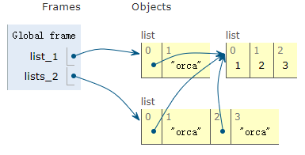

# 序列类型支持的操作

Python 中包含基本[序列类型](https://docs.python.org/3/library/stdtypes.html#sequence-types-list-tuple-range) ( [list](https://docs.python.org/3/library/stdtypes.html#list)、[tuple](https://docs.python.org/3/library/stdtypes.html#tuple)、[range](https://docs.python.org/3/library/stdtypes.html#range) ) 和专门用于处理 [text strings](https://docs.python.org/3/library/stdtypes.html#textseq) 和  [binary data](https://docs.python.org/3/library/stdtypes.html#binaryseq) 的附加序列类型。

## 1. 通用序列操作

> 本节涵盖了 [Common Sequence Operations](https://docs.python.org/3.7/library/stdtypes.html#common-sequence-operations) 中的所有知识点，并进行了扩展。

大多数的序列类型都支持下表中的操作(*operation*)，包括可变(*mutable*)序列和不可变(immutable)序列。如果需要在自定义序列类型中实现下列操作，可以实现抽象基类 [`collections.abc.Sequence`](https://docs.python.org/3/library/collections.abc.html#collections.abc.Sequence) ，这样可以使整个实现过程更加容易。

下表中越靠近底部的"序列操作"优先级越高，其中 *s* 和 *t* 是相同类型的序列，*n*、*i*、*j* 、*k* 是整数。*x* 是满足 *s* 给定的限制条件的任意对象，限制条件包含类型限制和值限制。例如，[`bytearray`](https://docs.python.org/3/library/stdtypes.html#bytearray) 对象只接受满足限制条件的整数：`0 <= x <= 255` 。

 `in` 和 `not in` 与比较操作具有相同的优先级。 `+` (连接) 和 `*` (重复)操作符和数学运算中的 `+` 和 `*` 具有相同的优先级。

| Operation              | Result                                                       | Notes      |
| ---------------------- | ------------------------------------------------------------ | ---------- |
| `x in s`               | `True` if an item of *s* is equal to *x*, else `False`       | (1.1)      |
| `x not in s`           | `False` if an item of *s* is equal to *x*, else `True`       | (1.1)      |
| `s + t`                | the concatenation of *s* and *t*                             | (1.6)(1.7) |
| `s * n` or `n * s`     | equivalent to adding *s* to itself *n* times                 | (1.2)(1.7) |
| `s[i]`                 | *i* th item of *s*, origin 0                                 | (1.3)      |
| `s[i:j]`               | slice of *s* from *i* to *j*                                 | (1.3)(1.4) |
| `s[i:j:k]`             | slice of *s* from *i* to *j* with step *k*                   | (1.3)(1.5) |
| `len(s)`               | length of *s*                                                |            |
| `min(s)`               | smallest item of *s*                                         |            |
| `max(s)`               | largest item of *s*                                          |            |
| `s.index(x[, i[, j]])` | index of the first occurrence of *x* in *s* (at or after index *i* and before index *j*) | (1.8)      |
| `s.count(x)`           | total number of occurrences of *x* in *s*                    |            |

相同类型的序列对象还支持比较操作，但只有当两个序列对象属于相同类型，且两个序列中的每个元素均相等，以及两个序列类型长度相同时，才认为两个序列相等(更多细节请参考 [Comparisons](https://docs.python.org/3/reference/expressions.html#comparisons) )。

```python
>>> [1,2,3,4]<[2,3]
True
>>> [1,2]==[1,2]
True
```

### 1.1 in / not in

`in` 和 `not in` 通常被用于测试序列中是否包含某个元素，但在某些特殊序列类型中(如 [`str`](https://docs.python.org/3/library/stdtypes.html#str) 、[`bytes`](https://docs.python.org/3/library/stdtypes.html#bytes) 、[`bytearray`](https://docs.python.org/3/library/stdtypes.html#bytearray))，也可用于测试是否包含某个子序列：

```python
>>> "gg" in "eggs"
True
```

### 1.2 s\*n / n\*s

小于 `0` 的 *n* 值被视为 `0` 。如果 *n* 小于等于 `0` 将生成一个与 *s* 具备相同类型的空序列，例如：

```python
>>> 'orca'*-1
''
>>> 'orca'*0
''
```

在序列 *s* 中引用的可变对象并不会产生多个新副本，仅会对可变对象的引用进行多次拷贝，例如：

```python
>>> lists = [[]] * 3 # 对内层的空列表的引用进行了三次拷贝
>>> lists
[[], [], []] # 内层的三个空列表均指向同一个对象
>>> lists[0] is lists[1] is lists[2]
True
>>> lists[0].append(3)
>>> lists
[[3], [3], [3]]
```

列表 `[[]]` 是内含一个空列表的列表，而列表 `[[]] * 3` 中的三个子列表其实是对同一个空列表引用了三次。因此，只要对任意一个子列表做出了修改，便会同时影响 `lists` 中的所有子列表。

示例 - lists_2 中的两个子列表和 `list_1[0]` 引用了相同的对象。

```python
list_1 = [[1,2],'orca']
lists_2 = list_1*2
lists_2[0].append(3)
```

运行结果如下：




如果需要的话，可以通过以下方式创建出不同的子列表：

```python
>>> lists = [[] for i in range(3)]
>>> lists[0].append(3)
>>> lists[1].append(5)
>>> lists[2].append(7)
>>> lists
[[3], [5], [7]]
```

还可参考 [How do I create a multidimensional list?](https://docs.python.org/3/faq/programming.html#faq-multidimensional-list)

### 1.3 索引

*i* 和 *j* 都是索引(*index*)，如果索引是正整数，则表示相对于序列 *s* 中第一个元素的偏移量(从 `0` 开始)；如果索引是负整数，则表示相对于序列 *s* 中最后一个元素的偏移量(从 `-1` 开始)。负索引 *i* 或 *j* 等于 `len(s) + i` 或 `len(s)+ j`，因此，负索引的绝对值不能大于序列的长度。另外， `-0` 仍然等于 `0`。

```python
 +---+---+---+---+---+---+
 | P | y | t | h | o | n |
 +---+---+---+---+---+---+
   0   1   2   3   4   5
  -6  -5  -4  -3  -2  -1
```

在 `s[i]` 中使用超过序列的长度的索引，会抛出 IndexError 异常。

### 1.4 s[i:j]

`s[i:j]` 表示切片，用于从序列 *s* 中获取子序列，范围是 `i≤x<j`。切片是由原序列中对应项的**浅拷贝**组成的新序列。在 `s[i:j]` 中，若 *i* 或 *j* 超出了序列长度，则会被替换为序列长度 `len(s)`；若 *i* 被省略或是 `None`，则将 *i* 视为 `0`；若 *j* 被省略或是 `None`，则将 *j* 视为 `len(s)`；如果 `i≥j`，则切片为空。

```python
>>> list_=[1, 4, 9, 16, 25]
>>> list_[:] # 返回一个新的浅拷贝(shallow)
[1, 4, 9, 16, 25]
>>> list(list_) # 也会返回一个浅拷贝
```

### 1.5 s[i:j:k]

`s[i:j:k]` 表示以特定步长(*step*) *k* 进行切片：

- 如果 *k* 是正数，每一步的索引是 `x=i+n*k`，且 `i≤x<j`。也就是说，在进行切片时每一步的索引依次是 `i`, `i+k`, `i+2*k`, `i+3*k` ... 直到 *j* 为止，但不包含 *j* 。*i* 的"终值"为 `0` ，*j* 的终值为 `len(s)` 

  ```python
  >>> a_list = [0,1,2,3,4,5]
  >>> a_list[0:4:2]
  [0, 2]
  >>> a_list[0:5:2]
  [0, 2, 4]
  ```

- 如果 *k* 是负数，每一步的索引是 `x=i+n*k`，且 `i≥x>j`。也就是说，在进行切片时每一步的索引依次是 `i`, `i+k`, `i+2*k`, `i+3*k` ... 直到 *j* 为止，但不包含 *j* 。*i* 的"终值"为 `len(s) - 1` ；如果省略 *j* ，则会使用 *j* 的"终值"。

  ```python
  >>> a_list = [0,1,2,3,4,5]
  >>> a_list[4:1:-2] # 注意: i>j
  [4, 2]
  >>> a_list[4::-2]
  [4, 2, 0]
  >>> a_list[len(a_list)-1::-1]
  [5, 4, 3, 2, 1, 0]
  ```

在 `s[i:j:k]` 中，如果 *i* 或 *j* 被省略或是 `None`，则会将 *i* 或 *j* 视为对应的"终值(end value)" - 注意，"终值"依赖于 *k* 的符号。*k* 不可以被设置为 `0`，如果 *k* 是 `None` ，则会被视为 `1` 。

### 1.6 s + t

使用 `+` 连接序列时，会产生一个新的对象，不会改变原序列。这意味着通过连接多个序列的方式来构建一个新序列时，会花费较高的时间成本。如果想要将时间复杂度变为线性，可采用以下替代方案：

- 如果需要连接 `str` 对象，可构建一个由 `str` 对象组成的列表并在最后使用 [`str.join()`](https://docs.python.org/3/library/stdtypes.html#str.join) 进行合并；或将 `str` 对象写入到一个 [`io.StringIO`](https://docs.python.org/3/library/io.html#io.StringIO) 实例中，并在写入完成了检索该实例的值。
- 如果需要连接 `bytes` 对象，可以使用 [`bytes.join()`](https://docs.python.org/3/library/stdtypes.html#bytes.join) 或 [`io.BytesIO`](https://docs.python.org/3/library/io.html#io.BytesIO)，另外还可以使用 [`bytearray`](https://docs.python.org/3/library/stdtypes.html#bytearray) 对象执行原地(*in-place*)合并。 [`bytearray`](https://docs.python.org/3/library/stdtypes.html#bytearray) 是可变对象，并拥有高效的过度分配(overallocation )机制。
- 如果需要连接 `tuple` 对象，可使用 `list` 替代
- 对于其他类型，请阅读相关文档

### 1.7 特定序列类型

某些序列类型(如 [`range`](https://docs.python.org/3/library/stdtypes.html#range)) 仅支持由遵循特定模式(*pattern*)的构成的序列，因此不支持连接操作和重复操作。

### 1.8 s.index()

如果在序列 *s* 中无法找到值为 *x* 的项，`s.index(x[, i[, j]])` 便会抛出 [`ValueError`](https://docs.python.org/3/library/exceptions.html#ValueError) 。附加参数 *i* 和 *j* 用于指定搜索范围，但并非所有 `index` 方法的实现都支持附加参数。`s.index(x,i,j)` 大致相当于 `s[i:j].index(x)`，但并不会像后者一样拷贝列表中的数据以创建切片；并且前者返回的索引是相对于序列 *s* 起点处的偏移量，而后者的返回的索引是相对于切片起点处的偏移量。

## 2. 不可变序列类型

> 本节涵盖了 [Immutable Sequence Types](https://docs.python.org/3.7/library/stdtypes.html#immutable-sequence-types) 中的所有知识点，并进行了扩展。

通常仅由不可变序列来实现的唯一一个操作是支持内置函数 [`hash()`](https://docs.python.org/3/library/functions.html#hash)，可变序列类型不会实现该操作。

```python
>>> hash('orca')
-4938345707532569492
>>> hash([1,2])
Traceback (most recent call last):
  File "<pyshell#6>", line 1, in <module>
    hash([1,2])
TypeError: unhashable type: 'list'
```

由于不可变序列支持 `hash` 函数，因此不可变序列可用作 [`dict`](https://docs.python.org/3/library/stdtypes.html#dict) 的键(*key*)，或是被存储在 [`set`](https://docs.python.org/3/library/stdtypes.html#set) 和 [`frozenset`](https://docs.python.org/3/library/stdtypes.html#frozenset) 中。

如果尝试哈希(*hash*)的不可变序列中包含了不可哈希(*unhashable*)的值，则会抛出  [`TypeError`](https://docs.python.org/3/library/exceptions.html#TypeError) ：

```python
>>> hash((1,[1,2]))
Traceback (most recent call last):
  File "<pyshell#8>", line 1, in <module>
    hash((1,[1,2]))
TypeError: unhashable type: 'list'
```

## 3. 可变序列类型

> 本节涵盖了 [Mutable Sequence Types](https://docs.python.org/3.7/library/stdtypes.html#immutable-sequence-types) 中的所有知识点，并进行了扩展。

可变序列类型包含了下表中的各种操作，通过这些操作可对序列对象自身进行修改。如果需要在自定义序列类型中实现下列操作，可以实现抽象基类 [`collections.abc.MutableSequence`](https://docs.python.org/3/library/collections.abc.html#collections.abc.MutableSequence) ，这样可以使整个实现过程更加容易。

在下表中，*s* 是可变类型序列的一个实例，*t* 是任意可迭代(*iterable*)对象，*x* 是满足 *s* 给定的限制条件的任意对象，限制条件包含类型限制和值限制。例如，[`bytearray`](https://docs.python.org/3/library/stdtypes.html#bytearray) 对象只接受满足限制条件的整数：`0 <= x <= 255` 。

| Operation                 | Result                                                       | Notes |
| ------------------------- | ------------------------------------------------------------ | ----- |
| `s[i] = x`                | item *i* of *s* is replaced by *x*                           |       |
| `s[i:j] = t`              | slice of *s* from *i* to *j* is replaced by the contents of the iterable *t* | (3.1) |
| `del s[i:j]`              | same as `s[i:j] = []`                                        |       |
| `s[i:j:k] = t`            | the elements of `s[i:j:k]` are replaced by those of *t*      | (3.2) |
| `del s[i:j:k]`            | removes the elements of `s[i:j:k]`from the list              |       |
| `s.append(x)`             | appends *x* to the end of the sequence (same as`s[len(s):len(s)] = [x]` ); return `None` |       |
| `s.clear()`               | removes all items from `s` (same as `del s[:]`); return `None` | (3.6) |
| `s.copy()`                | creates a shallow copy of `s` (same as `s[:]`)               | (3.6) |
| `s.extend(t)` or `s += t` | extends *s* with the contents of *t* (for the most part the same as `s[len(s):len(s)] = t` / `s[len(s):] = t`); return `None` |       |
| `s *= n`                  | updates *s* with its contents repeated *n* times             | (3.7) |
| `s.insert(i, x)`          | inserts *x* into *s* at the index given by *i* (same as `s[i:i] = [x]`); return `None` |       |
| `s.pop([i])`              | retrieves the item at *i* and also removes it from *s*       | (3.3) |
| `s.remove(x)`             | remove the first item from *s* where `s[i] == x`; return `None` | (3.4) |
| `s.reverse()`             | reverses the items of *s* in place; return `None`            | (3.5) |

### 3.1 s[i:j] = t

`j-i` 并不一定等于 `len(t)`，应理解为先从 `s[i]` 开始依次填充 *t* 中的内容，如果 `len(t)>(j-i)` ，便会继续填充 `s[j]` 之后的内容；反之则压缩 *s* 的长度：

```python
>>> list_1 = [1,2,3,4,5]
>>> list_1[0:3]=['#','#','#','#','#','#']
>>> list_1
['#', '#', '#', '#', '#', '#', 4, 5]
>>> list_2 = [1,2,3,4,5]
>>> list_2[0:3]=['#','#']
>>> list_2
['#', '#', 4, 5]
```

### 3.2 s[i:j:k] = t

*t* 必须和被替换的切片具有相同的长度。

```python
>>> list_1 = [1,2,3,4,5]
>>> list_1[::2] = ['#','#']
Traceback (most recent call last):
  File "<pyshell#27>", line 1, in <module>
    list_1[::2] = ['#','#']
ValueError: attempt to assign sequence of size 2 to extended slice of size 3
>>> list_1[::2] = ['#','#','#','#']
Traceback (most recent call last):
  File "<pyshell#28>", line 1, in <module>
    list_1[::2] = ['#','#','#','#']
ValueError: attempt to assign sequence of size 4 to extended slice of size 3
>>>
>>> list_1[::2] = ['#','#','#']
>>> list_1
['#', 2, '#', 4, '#']
```

### 3.3 s.pop([i])

可选实参 *i* 的默认值是 `-1`，因此在默认情况下会移除并返回最后一项

```python
>>> list_1 = [0,1,2]
>>> list_1.pop()
2
```

### 3.4 s.remove(x)

如果在 *s* 中并没有值为 *x* 的项，则会抛出 [`ValueError`](https://docs.python.org/3/library/exceptions.html#ValueError) 异常。

```python
>>> list_ = [0,1,2]
>>> list_.remove(2)
>>> list_.remove(2)
Traceback (most recent call last):
  File "<pyshell#37>", line 1, in <module>
    list_.remove(2)
ValueError: list.remove(x): x not in list
```

该方法的返回值是 `None`。

### 3.5 s.reverse()

在反转序列时，`reverse()` 方法会在原地(*in-place*)修改序列以节省空间。为了提醒用户该操作的副作用，该操作并不会返回反转后的序列，而是返回 `None`。

```python
>>> list_=[0,1,2]
>>> id(list_)
2688950370056
>>> list_.reverse()
>>> list_
[2, 1, 0]
>>> id(list_) # 内存地址保持一致
2688950370056
```

### 3.6 s.clear()和s.copy()

在不支持切片操作的可变容器中(如  [`dict`](https://docs.python.org/3/library/stdtypes.html#dict) 和 [`set`](https://docs.python.org/3/library/stdtypes.html#set))，也包含了 `clear()` 和 `copy()`，以保持接口的一致性。

New in version 3.3: `clear()` and `copy()` methods.

### 3.7 s *= n

*n* 是一个整数，或是一个实现了 [`__index__()`](https://docs.python.org/3/reference/datamodel.html#object.__index__) 方法的对象。如果 *n* 值为 `0` 或负整数，将清空序列。

```python
>>> list_=[0,1,2]
>>> list_ *= 0
>>> list_
[]
```

在序列 *s* 中引用的可变对象并不会产生多个新副本，仅会对可变对象的引用进行多次拷贝，效果和 `s * n` 相同。例如：

```python
list_ = [[1,2],'orca']
list_ *= 3
```

运行结果如下：


## 4. 序列拆封

> 本节参考了 [5.3. Tuples and Sequences](https://docs.python.org/3.7/tutorial/datastructures.html#tuples-and-sequences) 中的相关内容

序列封装(*packing*)是指将数据封装到某种序列类型中，比如列表封装、元组封装等。

序列拆封(*sequence unpacking*)又称序列解包，会将等号右侧的序列中的元素依次分配给等号左侧的各个变量。执行序列拆封时，等号右侧可以是**任何序列类型**，并且左侧变量的数目必须和右侧序列中元素的个数相同。

```python
>>> t = 12345, 54321, 'hello!' # 封装数据到一个元组中
>>> x, y, z = t # 拆封
>>> i, j = [1,2] 
>>> a, b = range(2)
>>> n, m = "hi"
>>> c, d = b'ab'
```

注意：我们可对任何序列进行拆封。

多重赋值(*multiple assignment*) 实际上就是元组封装和序列拆封的联合应用。

```
>>> list_ = [(1,2,3),(4,5,6)]
>>> for a,b,c in list_:
	print(a,b,c)

	
1 2 3
4 5 6
```

还可 一次性拆封多层嵌套的元组：

```python
>>> rgb = ("red" ,"green", "blue")
>>> hexString = 0xFF
>>> rgbTuple = (rgb, hexString)
>>> ((r, g, b), hexStr) = rgbTuple
```

在调用函数时，可使用 `*` 号对打包到序列中的参数进行拆封：

```python
>>> def func(a,b,c):
	print(a,b,c)

>>> j = (1,2,3)
>>> func(*j)
1 2 3
>>> func(*"123")
1 2 3
>>> func(*['a','b','c'])
a b c
```

