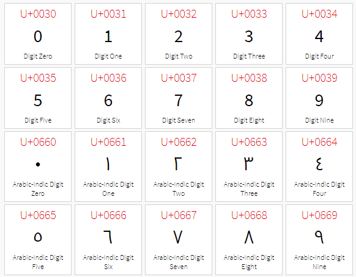
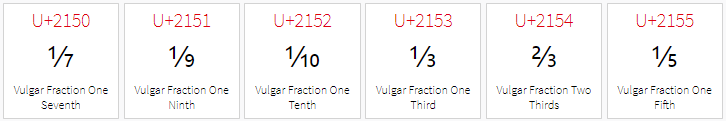

# 字符串方法

> 本文概述了 [String Methods](https://docs.python.org/3.7/library/stdtypes.html#string-methods) 中的知识点，并补充了具体示例。

## 2.1 条件判断

### endswith

🔨 str.endswith(*suffix*[, *start*[, *end*]])

Return `True` if the string ends with the specified *suffix*, otherwise return `False`. *suffix* can also be a tuple of suffixes to look for. With optional *start*, test beginning at that position. With optional *end*, stop comparing at that position.

```python
# 测试字符串是否以suffix结尾
text = 'stop comparing at that position'
assert text.endswith('tion') is True
assert text.endswith(('tom', 'tion')) is True
# 测试 suffix 是否等于 str_obj[start:end]
assert text.endswith('top', 1, 4) is True
assert text.endswith('top', 1, 3) is False
```

### startswith

🔨 str.startswith(*prefix*[, *start*[, *end*]])

Return `True` if string starts with the *prefix*, otherwise return `False`. *prefix* can also be a tuple of prefixes to look for. With optional *start*, test string beginning at that position. With optional *end*, stop comparing string at that position.

```python
# 测试字符串是否以suffix开头
# 测试 suffix 是否等于 str_obj[start:end]
```

### isalnum

🔨 str.isalnum()

Return true if all characters in the string are alphanumeric and there is at least one character, false otherwise. A character `c` is alphanumeric if one of the following returns `True`: `c.isalpha()`, `c.isdecimal()`, `c.isdigit()`, or `c.isnumeric()`.

```python
# 测试字符串是否只包含数字和字母
assert 'abc123'.isalnum() is True
assert '逆戟鲸'.isalnum() is True
assert 'abc_123'.isalnum() is False
assert 'abc 123'.isalnum() is False
assert '!'.isalnum() is False
```

### isalpha

🔨 str.isalpha()

Return true if all characters in the string are alphabetic and there is at least one character, false otherwise. Alphabetic characters are those characters defined in the Unicode character database as “Letter”, i.e., those with general category property being one of “Lm”, “Lt”, “Lu”, “Ll”, or “Lo”. Note that this is different from the “Alphabetic” property defined in the Unicode Standard. —— 关于 “Letter” 和 “Lm”, “Lt”, “Lu”, “Ll”, or “Lo”，详见本文附录 Letter 小节。

```python
# 测试字符串是否只包含字母: Lu|Ll|Lt|Lm|Lo
assert 'abc'.isalpha() is True
assert '逆戟鲸'.isalpha() is True
assert 'abc def'.isalnum() is False
assert '123'.isalpha() is False
assert '!'.isalpha() is False
```

### isascii

🔨 str.isascii()

Return true if the string is empty or all characters in the string are ASCII, false otherwise. ASCII characters have code points in the range U+0000-U+007F.

New in version 3.7.

```python
# 测试字符是否只包含ASCII字符
from string import printable
assert r"""!"#$%&'()*+,-./:;<=>?@[\]^_`{|}~""".isascii() is True
assert printable.isascii() is True
assert '¡'.isascii() is False
# 空字符串也会返回 True
assert ''.isascii() is True
```

### isdecimal

🔨 str.isdecimal()

Return true if all characters in the string are **decimal** characters and there is **at least one** character, false otherwise. Decimal characters are those that can be used to form numbers in base 10, e.g. U+0660, ARABIC-INDIC DIGIT ZERO. Formally a decimal character is a character in the Unicode General Category “Nd”. 

```python
# 测试字符串是否只包含十进制字符:0,1,2,3,4,5,6,7,8,9
assert '0123456789'.isdecimal() is True
assert '0123456789abcdef'.isdecimal() is False
assert '1+j1'.isdecimal() is False
assert '6.1'.isdecimal() is False
# 包括各种语言中表示0,1,2,3,4,5,6,7,8,9的字符
# U+0660~U+0669表示ARABIC-INDIC语系中的0~9
assert ''.join([chr(i) for i in range(0x660, 0x66A)]).isdecimal() is True
```

就笔者目前的知识而言，我认为 **Nd** 属性和 **Numeric_Type=Decimal** 是充要条件。也就是说，当 Numeric_Type=Decimal 时，`isdecimal()` 必定返回 `True`。关于 Nd 和 Numeric_Type，详见本文附录部分。

因为 Decimal ⊂ Digit ⊂ Numeric，所以当 `isdecimal()` 为真，`isdigit()` 和 `isnumeric()` 必定为真：

```python
# 十进制字符
assert '0123456789'.isdecimal() is True
assert '0123456789'.isdigit() is True
assert '0123456789'.isnumeric() is True
# 上标'⁸'
assert '⁸'.isdecimal() is False
assert '⁸'.isdigit() is True
assert '⁸'.isnumeric() is True
# 分数
assert '⅕'.isdecimal() is False
assert '⅕'.isdigit() is False
assert '⅕'.isnumeric() is True
```

### isdigit

🔨 str.isdigit()

Return true if all characters in the string are digits and there is at least one character, false otherwise. Digits include decimal characters and digits that need special handling, such as the compatibility superscript digits. This covers digits which cannot be used to form numbers in base 10, like the Kharosthi(Kharoshthi) numbers. Formally, a digit is a character that has the property value **Numeric_Type=Digit** or **Numeric_Type=Decimal** —— 详见本文附录Numeric_Type。

```python
# 测试字符串是否只包含：十进制字符和需要特殊处理的数字(例如兼容性上标数字)
assert '0123456789'.isdigit() is True
assert '⁸'.isdigit() is True
# 包括不是基于10进制构建数值的数字，如U+10A40表示Kharoshthi语系中的数字1
# 即 '\U00010A40' -> '𐩀'
assert '\U00010A40'.isdecimal() is False
assert '\U00010A40'.isdigit() is True
assert '\U00010A40'.isnumeric() is True
```

Kharosthi(Kharoshthi) 语系的计数方式不是十进制，只有数字 1、2、3、4、10、20、100、1000，详细介绍可查看[Kharosthi - 维基百科](https://en.wikipedia.org/wiki/Kharosthi#Numerals)。

因为 Decimal ⊂ Digit ⊂ Numeric，所以当 `isdigit()` 为真，则 `isnumeric()` 必定为真：

```python
# 十进制字符
assert '0123456789'.isdecimal() is True
assert '0123456789'.isdigit() is True
assert '0123456789'.isnumeric() is True
# 上标'⁸'
assert '⁸'.isdecimal() is False
assert '⁸'.isdigit() is True
assert '⁸'.isnumeric() is True
# 分数
assert '⅕'.isdecimal() is False
assert '⅕'.isdigit() is False
assert '⅕'.isnumeric() is True
```

### isnumeric

🔨 str.isnumeric()

Return true if all characters in the string are numeric characters, and there is at least one character, false otherwise. Numeric characters include digit characters, and all characters that have the Unicode numeric value property, e.g. U+2155, VULGAR FRACTION ONE FIFTH. Formally, numeric characters are those with the property value **Numeric_Type=Digit**, **Numeric_Type=Decimal** or **Numeric_Type=Numeric**. —— 详见本文附录Numeric_Type。

```python
assert '⅕'.isnumeric() is True
assert 'Ⅵ'.isnumeric() is True
assert '贰'.isnumeric() is True
```

因为 Decimal ⊂ Digit ⊂ Numeric，所以当 `isnumeric()` 为真，`isdecimal` 和 `isdigit` 不一定为真：

```python
# 十进制字符
assert '0123456789'.isdecimal() is True
assert '0123456789'.isdigit() is True
assert '0123456789'.isnumeric() is True
# 上标'⁸'
assert '⁸'.isdecimal() is False
assert '⁸'.isdigit() is True
assert '⁸'.isnumeric() is True
# 分数
assert '⅕'.isdecimal() is False
assert '⅕'.isdigit() is False
assert '⅕'.isnumeric() is True
# 罗马数字
assert 'Ⅵ'.isdecimal() is False
assert 'Ⅵ'.isdigit() is False
assert 'Ⅵ'.isnumeric() is True
# 中文
assert '贰'.isdecimal() is False
assert '贰'.isdigit() is False
assert '贰'.isnumeric() is True
```

### isidentifier

🔨 str.isidentifier()

Return true if the string is a valid identifier according to the language definition, section [Identifiers and keywords](https://docs.python.org/3.7/reference/lexical_analysis.html#identifiers).

Use [`keyword.iskeyword()`](https://docs.python.org/3.7/library/keyword.html#keyword.iskeyword) to test for reserved identifiers such as [`def`](https://docs.python.org/3.7/reference/compound_stmts.html#def) and [`class`](https://docs.python.org/3.7/reference/compound_stmts.html#class).

```python
# 测试字符串是否是合法标识符
assert 'if'.isidentifier() is True
assert '_orca_j35'.isidentifier() is True
assert '123_abc'.isidentifier() is False
# keyword.iskeyword()用于测试是否是保留标识符
import keyword
assert keyword.iskeyword('def') is True
```

### islower

🔨 str.islower()

Return true if all cased characters in the string are lowercase and there is at least one cased character, false otherwise.

Cased characters are those with general category property being one of “Lu” (Letter, uppercase), “Ll” (Letter, lowercase), or “Lt” (Letter, titlecase). —— 详见本文附录 Letter 小节。

小写字符是指 [General_Category](http://unicode.org/reports/tr44/#GC_Values_Table) 中 Ll 下的字符，可查考 [Lowercase Letter 列表](https://www.compart.com/en/unicode/category/Ll)。

```python
# 测试字符串是否只包含小写字符，即Ll 
assert 'a'.islower() is True
assert 'ƺ'.islower() is True # Latin Small Letter Ezh with Tail
assert '逆戟鲸'.islower() is False
```

### isprintable

🔨 str.isprintable()

Return true if all characters in the string are printable or the string is empty, false otherwise. Nonprintable characters are those characters defined in the Unicode character database as “**Other**” or “**Separator**”, excepting the ASCII space (0x20) which is considered printable. (Note that printable characters in this context are those which should not be escaped when [`repr()`](https://docs.python.org/3.7/library/functions.html#repr) is invoked on a string. It has no bearing on the handling of strings written to [`sys.stdout`](https://docs.python.org/3.7/library/sys.html#sys.stdout) or [`sys.stderr`](https://docs.python.org/3.7/library/sys.html#sys.stderr).)

注意，这里所说的可打印字符是指 `repr()` 函数不会转义的字符，与如何处理字符串的写入([`sys.stdout`](https://docs.python.org/3.7/library/sys.html#sys.stdout) 或 [`sys.stderr`](https://docs.python.org/3.7/library/sys.html#sys.stderr) )无关。

```python
# 测试字符串是否只包含可打印字符
assert 'orca_j35'.isprintable() is True
# Unicode字符集中Other或Separator被定义为不可打印字符，但ASCII空格(0x20)除外
assert '\t'.isprintable() is False
assert ' '.isprintable() is True
# 空字符串也会返回 True
assert ''.isprintable() is True
```

在 [General_Category Values](http://unicode.org/reports/tr44/#GC_Values_Table) 中列举了一般分类属性(*general category property*)，其中关于 "Separator" 和 "Other" 的部分如下：

| Abbr | Long                                                         | Description                                        |
| ---- | ------------------------------------------------------------ | -------------------------------------------------- |
| Zs   | [Space_Separator](https://www.compart.com/en/unicode/category/Zs) | a space character (of various non-zero widths)     |
| Zl   | Line_Separator                                               | U+2028 LINE SEPARATOR only                         |
| Zp   | Paragraph_Separator                                          | U+2029 PARAGRAPH SEPARATOR only                    |
| Z    | **Separator**                                                | Zs \| Zl \| Zp                                     |
| Cc   | Control                                                      | a C0 or C1 control code                            |
| Cf   | Format                                                       | a format control character                         |
| Cs   | Surrogate                                                    | a surrogate code point                             |
| Co   | Private_Use                                                  | a private-use character                            |
| Cn   | Unassigned                                                   | a reserved unassigned code point or a noncharacter |
| C    | **Other**                                                    | Cc \| Cf \| Cs \| Co \| Cn                         |

### isspace

🔨 str.isspace()

Return true if there are only whitespace characters in the string and there is at least one character, false otherwise. Whitespace characters are those characters defined in the Unicode character database as “**Other**” or “**Separator**” and those with [bidirectional property](https://www.compart.com/en/unicode/bidiclass) being one of “**WS**”, “**B**”, or “**S**”.

```python
# 测试字符串是否只包含空白字符
# Unicode字符集中Other或Separator被定义为空白字符，以及具备双向属性(WS,B,S)的字符
assert ' \t\n\r\v\f'.isspace() is True
assert 'orca_j35'.isspace() is False
# 空字符串会返回False
assert ''.isspace() is False
```

关于 [bidirectional property](https://www.compart.com/en/unicode/bidiclass)，可阅读 [Bidi_Class](http://unicode.org/reports/tr44/#Bidi_Class) 和 [Bidirectional Class Values](http://unicode.org/reports/tr44/#Bidi_Class_Values) 

### istitle

🔨 str.istitle()

Return true if the string is a titlecased string and there is at least one character, for example uppercase characters may only follow uncased characters and lowercase characters only cased ones. Return false otherwise.

```python
# 测试字符串是否是首字母大写的字符串
# 大写字符只能位于非大小字符之后，小写字符只能位于小写字符之后

# 首字母可以是 Lt 中的字符，详见本文附录 Letter 小节。
assert 'ᾯabc'.istitle() is True
```


### isupper

🔨 str.isupper()

Return true if all cased characters [[4\]](https://docs.python.org/3.7/library/stdtypes.html#id15) in the string are uppercase and there is at least one cased character, false otherwise.

## 附录

### Letter

在 [General_Category Values](http://unicode.org/reports/tr44/#GC_Values_Table) 中列举了一般分类属性(*general category property*)，其中关于 "Letter" 的部分如下：

| Abbr | Long             | Description                                       |
| ---- | ---------------- | ------------------------------------------------- |
| L    | Letter           | Lu \| Ll \| Lt \| Lm \| Lo                        |
| LC   | Cased_Letter     | Lu \| Ll \| Lt                                    |
| Lu   | Uppercase_Letter | an uppercase letter                               |
| Ll   | Lowercase_Letter | a lowercase letter                                |
| Lt   | Titlecase_Letter | a digraphic character, with first part uppercase  |
| Lm   | Modifier_Letter  | a modifier letter                                 |
| Lo   | Other_Letter     | other letters, including syllables and ideographs |

字符的第 3 的字段便是其一般分类属性(这里的字段是指 [UnicodeData.txt](https://www.unicode.org/Public/UCD/latest/ucd/) 中每个码点后的字段)，详见 [General_Category](http://unicode.org/reports/tr44/#General_Category)。示例：

```
# 下面是拉丁小写字母'a'/'b'/'c'/'d'
0061;LATIN SMALL LETTER A;Ll;0;L;;;;;N;;;0041;;0041
0062;LATIN SMALL LETTER B;Ll;0;L;;;;;N;;;0042;;0042
0063;LATIN SMALL LETTER C;Ll;0;L;;;;;N;;;0043;;0043
0064;LATIN SMALL LETTER D;Ll;0;L;;;;;N;;;0044;;0044
```

"[Alphabetic](http://unicode.org/reports/tr44/#Alphabetic)" 是一个枚举属性，由 Lowercase + Uppercase + Lt + Lm + Lo + Nl + Other_Alphabetic 构成 —— 欲了解 "Alphabetic " 的详细信息，可阅读 [Property Table](http://unicode.org/reports/tr44/#Property_List_Table) - [Alphabetic](http://unicode.org/reports/tr44/#Alphabetic)。

可见，在标准 Unicode 中 "[Alphabetic](http://unicode.org/reports/tr44/#Alphabetic)" 涵盖范围大于 "Letter"。

欲了解 Unicode 一般分类属性，可阅读：

- https://www.compart.com/en/unicode/category
- http://www.fileformat.info/info/unicode/category/index.htm

### Nd

在 [General_Category Values](http://unicode.org/reports/tr44/#GC_Values_Table) 中列举了一般分类属性，其中关于 "Number" 的部分如下：

| Abbr | Long                                                         | Description                       |
| ---- | ------------------------------------------------------------ | --------------------------------- |
| N    | Number                                                       | Nd \| Nl \| No                    |
| Nd   | [Decimal_Number](https://www.compart.com/en/unicode/category/Nd) | a decimal digit                   |
| Nl   | [Letter_Number](https://www.compart.com/en/unicode/category/Nl) | a letterlike numeric character    |
| No   | [Other_Number](https://www.compart.com/en/unicode/category/No#UNC_CAT) | a numeric character of other type |

字符的第 3 的字段便是其一般分类属性(这里的字段是指 [UnicodeData.txt](https://www.unicode.org/Public/UCD/latest/ucd/) 中每个码点后的字段)，详见 [General_Category](http://unicode.org/reports/tr44/#General_Category)。

如果需要查看 Nd 中的码点和抽象字符，可阅读 [List of Unicode Characters of Category “Decimal Number”](https://www.compart.com/en/unicode/category/Nd#UNC_CAT)

### Numeric_Type

Decimal、Digit、Numeric 三者的关系是：Decimal⊂Digit⊂Numeric

#### Decimal

如果字符的 Numeric_Type 属性等于 **Decimal**，那么该字符的 6、7、8 三个字段都会包含同一个数字(这里的字段是指 [UnicodeData.txt](https://www.unicode.org/Public/UCD/latest/ucd/) 中每个码点后的字段)，且该数字是位于 0~9 之间的某个值。也就是说 Numeric_Type=Decemal 的字符是指用于十进制计数系统的字符。详见 [Numeric_Type](http://unicode.org/reports/tr44/#Numeric_Type)。

Numeric_Type=Decemal 的示例，这些字符的 6、7、8 三个字段均包含同一个数字：



```
# 下面是常见的10进制数字
0030;DIGIT ZERO;Nd;0;EN;;0;0;0;N;;;;;
0031;DIGIT ONE;Nd;0;EN;;1;1;1;N;;;;;
0032;DIGIT TWO;Nd;0;EN;;2;2;2;N;;;;;
0033;DIGIT THREE;Nd;0;EN;;3;3;3;N;;;;;
0034;DIGIT FOUR;Nd;0;EN;;4;4;4;N;;;;;
0035;DIGIT FIVE;Nd;0;EN;;5;5;5;N;;;;;
0036;DIGIT SIX;Nd;0;EN;;6;6;6;N;;;;;
0037;DIGIT SEVEN;Nd;0;EN;;7;7;7;N;;;;;
0038;DIGIT EIGHT;Nd;0;EN;;8;8;8;N;;;;;
0039;DIGIT NINE;Nd;0;EN;;9;9;9;N;;;;;
# 下面是Kharoshthi语系中的数字
0660;ARABIC-INDIC DIGIT ZERO;Nd;0;AN;;0;0;0;N;;;;;
0661;ARABIC-INDIC DIGIT ONE;Nd;0;AN;;1;1;1;N;;;;;
0662;ARABIC-INDIC DIGIT TWO;Nd;0;AN;;2;2;2;N;;;;;
0663;ARABIC-INDIC DIGIT THREE;Nd;0;AN;;3;3;3;N;;;;;
0664;ARABIC-INDIC DIGIT FOUR;Nd;0;AN;;4;4;4;N;;;;;
0665;ARABIC-INDIC DIGIT FIVE;Nd;0;AN;;5;5;5;N;;;;;
0666;ARABIC-INDIC DIGIT SIX;Nd;0;AN;;6;6;6;N;;;;;
0667;ARABIC-INDIC DIGIT SEVEN;Nd;0;AN;;7;7;7;N;;;;;
0668;ARABIC-INDIC DIGIT EIGHT;Nd;0;AN;;8;8;8;N;;;;;
0669;ARABIC-INDIC DIGIT NINE;Nd;0;AN;;9;9;9;N;;;;;
```

#### Digit

如果字符的 Numeric_Type 属性等于 **Digit**，那么该字符的 7、8  两个字段会包含同一个数字，但字段 6 为空(这里的字段是指 [UnicodeData.txt](https://www.unicode.org/Public/UCD/latest/ucd/) 中每个码点后的字段)，且该数字是位于 0~9 之间的某个值。在 Decimal 的基础上包含需要特殊处理的数字(例如兼容性上标数字)。

从 Unicode 6.3.0 开始，不会给新编码的数字字符赋予 Numeric_Type=Digit，也不会将具备 Numeric_Type=Numeric 的现有字符字符改为 Numeric_Type=Digit，Digit 和 Numeric 之间的区别不再有实际意义。详见 [Numeric_Type](http://unicode.org/reports/tr44/#Numeric_Type)。

Numeric_Type=Digit  的示例，这些字符的 7、8 两个字段包含同一个数字，字段 6 为空：


```
# 下面是上标'⁸'和'⁹'
2078;SUPERSCRIPT EIGHT;No;0;EN;<super> 0038;;8;8;N;SUPERSCRIPT DIGIT EIGHT;;;;
2079;SUPERSCRIPT NINE;No;0;EN;<super> 0039;;9;9;N;SUPERSCRIPT DIGIT NINE;;;;
# 下面是下标'₀'和'₁'
2080;SUBSCRIPT ZERO;No;0;EN;<sub> 0030;;0;0;N;SUBSCRIPT DIGIT ZERO;;;;
2081;SUBSCRIPT ONE;No;0;EN;<sub> 0031;;1;1;N;SUBSCRIPT DIGIT ONE;;;;
```

#### Numeric

如果字符的 Numeric_Type 属性等于 **Numeric**，那个该字符的仅字段 8 会包含一个数值，字段 6、7 为空(这里的字段是指 [UnicodeData.txt](https://www.unicode.org/Public/UCD/latest/ucd/) 中每个码点后的字段)。在 Digit 的基础上包含了正(负)整数或有理数——包括分数，例如 U+2155 表示分数 '⅕'，详见 [Numeric_Type](http://unicode.org/reports/tr44/#Numeric_Type)。在 Unihan 中某些字符也具备此属性，见 [Numeric_Type, Han](http://unicode.org/reports/tr44/#Numeric_Type_Han)。

Numeric_Type=Numeric 的示例，这些字符仅字段 8 会包含一个数值，字段 6、7 为空：



```
# 下面是一些分数
2150;VULGAR FRACTION ONE SEVENTH;No;0;ON;<fraction> 0031 2044 0037;;;1/7;N;;;;;
2151;VULGAR FRACTION ONE NINTH;No;0;ON;<fraction> 0031 2044 0039;;;1/9;N;;;;;
2152;VULGAR FRACTION ONE TENTH;No;0;ON;<fraction> 0031 2044 0031 0030;;;1/10;N;;;;;
2153;VULGAR FRACTION ONE THIRD;No;0;ON;<fraction> 0031 2044 0033;;;1/3;N;FRACTION ONE THIRD;;;;
2154;VULGAR FRACTION TWO THIRDS;No;0;ON;<fraction> 0032 2044 0033;;;2/3;N;FRACTION TWO THIRDS;;;;
2155;VULGAR FRACTION ONE FIFTH;No;0;ON;<fraction> 0031 2044 0035;;;1/5;N;FRACTION ONE FIFTH;;;;
```


