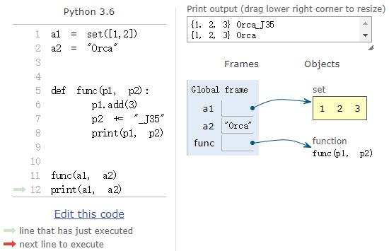

# 0x07 函数

[TOC]

在编程语言中，函数(function)是指用于执行特定操作的语句(statements)序列。

## 1. 函数定义

**函数定义**(*function definition*)是用于创建新函数的**语句**，指定了函数名、形参以及所包含的语句，语法如下：

```
def <function name> (<list of paramaters>):
	<sequence of statements>
```

函数定义的第一行被称作**函数头**(*header*)，必须以冒号结尾； 其余部分被称作**函数体**(*body*)。函数体必须缩进——按照惯例，缩进总是4个空格。

函数定义和其它语句一样都会被执行，其作用是创建**函数对象**(*function object*)，函数名便是指向该函数对象的变量，函数定义不会产生任何输出。函数内部的语句在函数被调用之前，是不会执行的。

所有函数的对象的类型均是 `<class 'function'>`

```python
>>> def print_lyrics():
    print("I'm a lumberjack, and I'm okay.")
    print("I sleep all night and I work all day.")

    
>>> type(print_lyrics)
<class 'function'>
>>> print(print_lyrics)
<function print_lyrics at 0x000001F3B42D2048>
```

### 1.1 参数检查

通过在函数体中对参数进行检查，可避免用户输入错误的参数。

参数错误可分为以下两类：

- 实参和形参的数量不匹配：Python 会自动检查

- 实参类型错误：可使用内置函数 `isinstance` 检查实参类型，然后通过 `raise` 抛出异常

  ```python
  def my_abs(x):
      if not isinstance(x, (int, float)):
          raise TypeError('bad operand type')
      if x >= 0:
          return x
      else:
          return -x
  ```

### 1.2 使用别名

函数名其实就是一个指向函数对象的变量，因此完全可以使用别的变量来引用函数对象，这好比为函数起了一个"别名(*aliasing*)"：

```python
>>> a = abs # 变量a指向abs函数
>>> a(-1) # 所以也可以通过a调用abs函数
1
```

### 1.3 return 语句

`return` 语句用于从函数中返回，并将 `return` 关键字之后的表达式作为返回值。一旦函数中的某条 `return` 语句被执行，便会立即跳出当前函数。

- `return None`：如果当前函数没有显式包含 `return` 语句，便会在函数执行完毕后自动返回 `None`。`return None` 可简写为 `return`。

  ```python
  >>> def func(): pass
  
  >>> print(func())
  None
  ```

- 多返回值：在这种情况下，返回值实际上是一个元组。只是语法上，将元组作为返回值时，可以省略括号。因此，"多返回值"只是一种假象，实际上返回的仍是单一值，值类型是元组。在获取"多返回值"时，可利用元组的解包特性，将返回值解包到多个变量中。

  ```python
  >>> import math
  >>> def move(x, y, step, angle=0):
      nx = x + step * math.cos(angle)
      ny = y - step * math.sin(angle)
      return nx, ny
      
  >>> x, y = move(100, 100, 60, math.pi / 6)
  >>> print(x, y)
  151.96152422706632 70.0
  
  >>> r = move(100, 100, 60, math.pi / 6)
  >>> print(r)
  (151.96152422706632, 70.0)
  ```

### 1.4 pass 语句

如果需要定义一个什么事也不做的空函数，可使用 `pass` 语句：

```python
>>> def nop(): pass
```

`pass` 语句还可用于创建最小类：

```python
>>> class MyEmptyClass: pass
```

`pass` 还可以用在其他语句中：

```python
>>> if age >= 18: pass
```

将 `pass` 语句用作函数或条件语句的占位符时，可帮助我们在更抽象的级别上思考问题。

## 2. 函数调用

在下面这个示例中，我们调用了内置函数 `type`：

```python
>>> type(42)
<class 'int'>
```

type 是函数对象的名称，括号中的表达式被称为函数的**实参**(*argument*)，函数的执行结果是打印出实参的类型。

人们通常会说函数"接受(*take*)"某个实参，并"返回(*return*)"某个结果，该结果也被称为返回值(*return value*)。

由于在使用函数对象前，需要先通过函数定义创建函数对象。因此，函数调用只能位于函数定义之后。

```python
# first() 这里的调用会抛出异常

def first():
    # 这里似乎是在second定义之前对其进行了调用，
    # 而实际上要等到first被调用时，才会真正调用second，
    second() 
    print("first")

def second():
    print("second") 
       
first()
```

### 2.1 执行流

为了确保函数在调用之前已被定义，你需要了解语句执行的顺序，即**"执行流"**(*flow of execution*)。"执行流"总是从程序的第一条语句开始，自顶向下，每次执行一条语句。

函数定义不会改变程序的"执行流"。同时请记住，除非函数被调用，否则函数内部的语句是不会被执行的。

函数调用使得"执行流"不再以直线方式前进，而是会绕一个弯路。也就是说，在遇到函数调用时，"执行流"并不会接着执行下一条语句，而是会跳入函数体，并执行函数体中的语句，直到函数体被执行完毕后，"执行流"才会返回函数调用之前的位置。

这听起来似乎很简单，但是如果考虑到可以在一个函数中调用另一个函数的情况，这似乎就比较复杂了。当某个函数执行到一半时，可能会嵌套调用另一个函数。在被嵌套调用的函数中，同样有可能会再次嵌套调用别的函数。

Python 会记录程序"执行流"的位置，因此每当一个函数执行完毕时，程序便返回函数调用之前的位置，并继续执行之后的语句。当"执行流"抵达程序末尾时，便会结束。

因此，当你阅读某个程序时，没有必要总是从上往下阅读。有时跟着"执行流"阅读反而更加合理。

http://greenteapress.com/thinkpython2/html/thinkpython2004.html#sec32

### 2.2 数学函数

Python 内置的数学模块 `math` ，提供了许多常用数学函数。
在这里你可以将模块简单理解为：包含了一组相关函数及其他定义的的文件。

在使用模块前，我们需要通过**导入语句**(*import statement*)导入目标模块，如:

```python
>>> import math
```

上面这条导入语句会创建一个名为 math 的**模块对象**(*module object*)。我们可以通过打印语句获得该对象的相关信息：

```python
>>> math
<module 'math' (built-in)>
```

我们可以通过**点标记法**(*dot notation*)访问模块内部的定义的内容，如：

```python
>>> ratio = signal_power / noise_power
>>> decibels = 10 * math.log10(ratio)

>>> radians = 0.7
>>> height = math.sin(radians)
```

## 3. 形参和实参

**形参**(*parameter*)：定义函数时，在参数列表中声明的变量，用于接受实参对象的引用。

**实参**(*argument*)：在调用函数时，用初始化形参的对象。

实参向形参传递的是**实参对象的引用**，因此形参和与之对应的实参均指向同一对象。

```python
a1 = set((1, 2))
a2 = "Orca_J35"
def func(p1, p2):
    print(id(p1), id(p2))

print(id(a1), id(a2))
func(a1, a2)
"""Out:
2690344115784 2690344126000
2690344115784 2690344126000
"""
```

由于实参和形参均指向同一对象，所以如果实参对象是可变类型，便可在函数内部通过形参对其作出修改；如果实参是不可变类型，则不能在函数内部通过形参对其作出修改。例如：


可以看到 `a1` 和 `p1` 引用了同一个集合对象(可变类型)，可在函数内部对此集合进行修改。但是当我们试图对不可变对象重新赋值时，则会创建一个新对象，因此 `a2` 和 `p2` 是两个不同的字符串。最终执行结果如下：



当实参是可变类型时，如果需要避免函数对原实参对象进行修改，则可使用原参对象的副本：


在调用函数时使用了 `a1` 的副本，所以 `a1` 和 `p1` 引用的对象并不相同。

## 4. 局部变量

函数定义中，在函数头中声明的**形参**和在函数体中声明**变量**都属于该函数的**局部变量**(*local variable*)。局部变量与函数外部的同名变量没有任何联系，只在函数调用的生命周期内有效。例如：

```python
def foo():
    num = 10 # 局部变量
foo()
print(num)  # Out: NameError
```

当 `foo()` 执行完毕时，`num` 会被销毁，如果试图从函数外部访问该变量，则会抛出异常。

下面这个示例咋看起来可能会有点奇怪：

```python
b = 6
def f1(a):
    print(a)
    print(b)
    b = 9
f1(3)
```

输出：

```python
3
----------------------------------------------------------------
UnboundLocalError                         Traceback (most recent call last)
<ipython-input-14-e8c2542e004e> in <module>()
      4     print(b)
      5     b = 9
----> 6 f1(3)

<ipython-input-14-e8c2542e004e> in f1(a)
      2 def f1(a):
      3     print(a)
----> 4     print(b)
      5     b = 9
      6 f1(3)

UnboundLocalError: local variable 'b' referenced before assignment
```

注意，`print(b)` 会抛出异常，而不是打印数字 `6`。你可会认为 `b = 9` 在 `print(b)` 之后，因此会先打印全局变量 `6`。可事实是，Python 编译函数的定义体时，它判断 `b` 是局部变量，因为在函数中给它赋值了。生成的字节码(见后文)证实了这种判断，Python 会尝试从本地环境获取 `b`。后面调用 `f1(3)` 时， `f1` 的定义体会获取并打印局部变量 `a` 的值，但是尝试获取局部变量 `b` 的值时，发现 `b` 没有绑定值。

只要在函数体中对变量进行了赋值，便会认为该变量是局部变量，像 `a+=1` 或 `a=a+1` 同样会使得 `a` 被判定为局部变量。

这不是缺陷，而是人为设计：Python 不要求声明变量，但是假定在函数定义体中赋值的变量是局部变量。这比 JavaScript 的行为好多了，JavaScript 也不要求声明变量，但是如果忘记把变量声明为局部变量（使用 `var`），可能会在不知情的情况下获取全局变量。

以下内容参考自﹝流畅的 Python﹞-> 7.4 变量作用域规则

> 字节码：`dis` 模块为反汇编 Python 函数字节码提供了简单的方式。
>
> 使用全局变量 `b`，不在函数中对 `b` 赋值的情况：
>
> ```python
> def f2(a):
>     print(a)
>     print(b) # 使用全局变量b,不在函数中对b赋值
> dis(f2)
> ```
>
> 输出：
>
> ```python
>  2           0 LOAD_GLOBAL              0 (print) # 加载全局名称print
>               2 LOAD_FAST                0 (a) # 加载本地名称a
>               4 CALL_FUNCTION            1
>               6 POP_TOP
> 
>   3           8 LOAD_GLOBAL              0 (print)
>              10 LOAD_GLOBAL              1 (b) # 加载全局名称b
>              12 CALL_FUNCTION            1
>              14 POP_TOP
>              16 LOAD_CONST               0 (None)
>              18 RETURN_VALUE
> ```
>
> 使用局部变量 `b`，在函数中对 `b` 赋值的情况：
>
> ```python
> def f1(a):
>     print(a)
>     print(b)
>     b = 9
> dis(f1)
> ```
>
> 输出：
>
> ```python
> 3           0 LOAD_GLOBAL              0 (print)
>               2 LOAD_FAST                0 (a)
>               4 CALL_FUNCTION            1
>               6 POP_TOP
> 
>   4           8 LOAD_GLOBAL              0 (print)
>              10 LOAD_FAST                1 (b) # 加载本地名称b
>              12 CALL_FUNCTION            1
>              14 POP_TOP
> 
>   5          16 LOAD_CONST               1 (9)
>              18 STORE_FAST               1 (b) 
>              20 LOAD_CONST               0 (None)
>              22 RETURN_VALUE
> ```
>
> 可以看到编译器把 `b` 视作局部变量，即使在后面才为 `b` 赋值。
>
> 运行字节码的 CPython VM 是栈机器，因此 `LOAD` 和 `POP` 操作引用的是栈。深入说明 Python 操作码不在本书范畴之内，不过 [`dis`](http://docs.python.org/3/library/dis.html) 模块的文档对其进行了说明。

### 4.1 作用域

**作用域**(*scope*)是程序运行时变量可被访问的范围，所有变量都具有相应的作用域，作用域从变量被定义的地方开始。局部变量的作用域仅限于该函数内部，且对其它的函数或外围程序不可见。

```python
def foo():
    num = 10 # 局部变量
print(num)  # Out: NameError
```

定义在模块最外层的变量是**全局变量**，它在全局范围内可见。因此，在函数体中也可访问全局变量。例如：

```python
num = 10 # 全局变量
def foo():
    print(num)  # Out: 10
```

### 4.2 符号表

执行函数时，会为函数引入一个用于**记录局部变量分配关系**的新**符号表**(symbol table)。实参也是在调用函数时，被引入到函数的局部符号表中的。当一个函数调用另一个函数时，同样会为被调用的函数创建一个新的局部符号表。

当我们在函数中引用某个变量时，会依次查找：local symbol table -> local symbol tables of enclosing functions -> global symbol table -> the table of built-in names

因此，虽然可在函数中引用外部变量，但如果我们在函数中对外部变量进行赋值，却只会新建一个局部变量，并且该局部变量会屏蔽同名外部变量。因为，局部变量被记录在局部符号表中，在引用变量时会优先查找局部符号表。

```python
x = 50

def func(x):
    print('x is', x) 
    x = 2 # x是函数的本地变量
    print('Changed local x to', x)
func(x)
print('x is still', x)

"""Out:
x is 50
Changed local x to 2
x is still 50
"""
```

如果在函数中对外层变量进行了赋值，便不能再访问该外层变量，只能访问同名的局部变量。即便是在赋值前尝试访问外层变量，也是不可行的：

```python
name = 'hello'
def test():
    print (name) 
    name = name+' world'

test()
"""Out:
UnboundLocalError: local variable 'name' referenced before assignment
"""
```

### 4.3 global 语句

如果想要在局部作用域中重新绑定全局变量(位于全局符号表中的变量)，可使用 `global` 语句。在同一条 `global` 语句中可同时声明(*declare*)多个变量，例如 `global x,y,z`。

```python
x = 50

def func():
    global x
    print('x is', x)
    x = 2
    print('Changed global x to', x)

func()
print('Value of x is', x)
"""Out:
x is 50
Changed global x to 2
Value of x is 2
"""
```

如果全局变量是可变类型，当我们需要在函数内部修改全局变量自身时无需 `global` 语句。可见只有需要改变全局变量的引用时，才需要 `global` 语句。

```python
known = {0:0, 1:1}

def example4():
    known[2] = 1
```

### 4.4 nonlocal 语句 

如果想要重新绑定非局部变量(位于 *local symbol tables of enclosing functions* 中的变量)，可使用 `nonlocal ` 语句。在同一条 `nonlocal ` 语句中可同时声明多个变量，例如 `nonlocal  x,y,z`。

```python
def func():
    x = 50

    def inner():
        nonlocal x
        print('x is', x)
        x = 2
        print('Changed nonlocal x to', x)
    inner()
    print('Value of x is', x)

func()
"""Out:
x is 50
Changed nonlocal x to 2
Value of x is 2
"""
```

注意：Python 2 没有 `nonlocal`，在﹝[**PEP 3104**](https://www.python.org/dev/peps/pep-3104) - Access to Names in Outer Scopes﹞(该 PEP 引入了 `nonlocal`)中的第三个代码片段给出了一种解决方法。基本上，这种处理方式是把内部函数需要修改的变量(如 `x` )存储为可变对象(如字典或简单的实例)的元素或属性，并且把该对象绑定到一个自由变量。

## 2. 参数

https://docs.python.org/3.7/glossary.html#term-argument

https://docs.python.org/3/glossary.html#keyword-only-parameter

http://codingpy.com/books/thinkpython2/12-tuples.html#gather

http://codingpy.com/books/thinkpython2/13-case-study-data-structure-selection.html#id11

[Python 的 Keyword-Only Arguments (强制关键字参数)](https://segmentfault.com/a/1190000005173136)

定义函数时，一旦把参数的名称和位置确定下来，函数接口的定义就完成了。
对于函数的调用者，只需要知道如何传递正确的参数，以及返回值的类型就够了。函数内部的复杂逻辑被封装起来，调用者无需了解。

Python 中函数定义非常简单，但灵活度却很大。除了正常定义的必选参数外，还可以使用默认参数、可变参数和关键字参数，使得函数定义出来的接口，不但能处理复杂的参数，还可以简化调用者的代码。

在调用标准函数和 Python 的库函数时，它们会检查其参数的类型。程序员定义的函数可以接受任意类型的参数，包括函数和类型自身。

[参数列表的分拆](http://www.pythondoc.com/pythontutorial3/controlflow.html#tut-unpacking-arguments)


### 位置实参

```
def power(x, n):
    s = 1
    while n > 0:
        n = n - 1
        s = s * x
    return s
```

`x` 和 `n` 便是位置参数。
位置函数在调用时必须被传入，且需要按照顺序传入。

### 默认实参值

Default Argument Values

默认参数值应为不可变对象。

```
def power(x, n=2):
    s = 1
    while n > 0:
        n = n - 1
        s = s * x
    return s
    
>>> power(5)
25
>>> power(5, 2)
25
```

此处的 `n=2` 采用了默认参数值。

参数列表需满足：位置参数在前，默认参数在后，否则Python的解释器会报错。


当函数有多个参数时，把变化大的参数放前面，变化小的参数放后面。变化小的参数就可以作为默认参数。既减少了函数的调用难度，由保证了函数调用的灵活性。


```
def enroll(name, gender, age=6, city='Beijing'):
    print('name:', name)
    print('gender:', gender)
    print('age:', age)
    print('city:', city)
```


#### 默认实参值估算点

默认参数的值，在函数定义处被确定。

```
i = 5

def f(arg=i):
    print(arg)

i = 6
f()

>>> 5
```

**Important warning:** 

默认参数值一旦确定，就不会再被修改。
当默认参数值是可变对象时（list, dictionary,部分可变类实例），便会产生不同的效果。

```
def f(a, L=[]):
    L.append(a)
    return L

print(f(1))
print(f(2))
print(f(3))
```

output：

```
[1]
[1, 2]
[1, 2, 3]
```

如果不想在之后的调用中用到之前的可变默认参数，可使用如下定义方式：

```
def f(a, L=None):
    if L is None:
        L = []
    L.append(a)
    return L
```

所以**默认参数必须指向不变对象！** 因为不变对象一旦创建，对象内部的数据就不能修改，这样就减少了由于修改数据导致的错误。此外，由于对象不变，多任务环境下同时读取对象不需要加锁，同时读一点问题都没有。我们在编写程序时，如果可以设计一个不变对象，那就尽量设计成不变对象。

```python
a = [1, 2]
def func(a_list=a):
    print(a_list)

func()
a.pop()
func()
"""OUt:
[1, 2]
[1]
"""
```


### 可变参数 

VarArgs parameters

`*args` 表示可变参数，此时传入实参的数量是可变。
本质上是将 list/tuple 作为实参传递给函数。

-   可直接传入参数：`func(1, 2, 3)` 
-   也可接受组装好的 list/tuple：`func(*(1, 2, 3))` / `func(*[1, 2, 3])`

 `*args` 和 `**kw` 是惯用写法，虽然可以修改，但是建议保持。

示例：

```
>>> def calc(*numbers):
...     sum = 0
...     for n in numbers:
...         sum = sum + n * n
...     return sum
...
>>> calc(1, 2)
5
>>> calc(*[1, 2])
5
>>> calc([1, 2])
Traceback (most recent call last):
  File "<stdin>", line 1, in <module>
  File "<stdin>", line 4, in calc
TypeError: can't multiply sequence by non-int of type 'list'

# 没有参数也行
>>> calc()
0

# 在可变参数中对已有列表进行调用：
>>> nums = [1, 2, 3]
>>> calc(nums[0], nums[1], nums[2])
14
>>> calc(*nums)
14
>>> print(*nums)
1 2 3
>>> print(nums)
[1, 2, 3]
```

在函数内部，参数 `numbers` 会接收到一个tuple。


#### 参数列表分拆

Unpacking Argument Lists

有时实参已被打包到 list / tuple 中，但在调用函数时，却需要分离的位置参数。
这是便需要对 list / tuple 进行解包。
在调用函数时，可使用`*` 号对打包到 list / tuple 中的参数进行解包。

```
>>> list(range(3, 6))            # normal call with separate arguments
[3, 4, 5]
>>> args = [3, 6]
>>> list(range(*args))            # call with arguments unpacked from a list
[3, 4, 5]
```

类似的，字典可以使用 `**` 运算符传递关键字参数：

```
>>> def parrot(voltage, state='a stiff', action='voom'):
...     print("-- This parrot wouldn't", action, end=' ')
...     print("if you put", voltage, "volts through it.", end=' ')
...     print("E's", state, "!")
...
>>> d = {"voltage": "four million", "state": "bleedin' demised", "action": "VOOM"}
>>> parrot(**d)
-- This parrot wouldn't VOOM if you put four million volts through it. E's bleedin' demised !
```

```python
n = (1, 2)
def func1(*args):
    print(args)
    
func1(*n, *n)
func1(n, n)
'''out:
(1, 2, 1, 2)
((1, 2), (1, 2))
'''
```


### 关键字参数

VarArgs parameters

`**kw` 表示关键字参数，本质上是将字典作为实参传递给函数。

-   可以直接传入：`func(a=1, b=2)` 
-   也可接受组装好的字典：`func(**{'a': 1, 'b': 2})`。

 `*args` 和 `**kw` 是惯用写法，虽然可以修改，但是建议保持。
关键字参数允许向函数传入任意数量的键-值对，这些键-值对在函数内部自动组装为一个字典。

```
>>> def person(name, age, **kw):
...     print('name:', name, 'age:', age, 'other:', kw)
...
# 只传入必选参数
>>> person('Michael', 30)
name: Michael age: 30 other: {}
# 同时传入关键字参数
>>> person('Adam', 45, gender='M', job='Engineer')
name: Adam age: 45 other: {'gender': 'M', 'job': 'Engineer'}

# 直接调用字典
>>> extra = {'city': 'Beijing', 'job': 'Engineer'}
>>> person('Jack', 24, city=extra['city'], job=extra['job'])
name: Jack age: 24 other: {'city': 'Beijing', 'job': 'Engineer'}

>>> extra = {'city': 'Beijing', 'job': 'Engineer'}
>>> person('Jack', 24, **extra)
name: Jack age: 24 other: {'city': 'Beijing', 'job': 'Engineer'}
```

关键字参数可用于扩展函数的功能。比如注册时，收集必填项目以外的信息。

注意 `kw` 获得的dict是 `extra` 的一份拷贝，对 `kw` 的改动不会影响到函数外的`extra`。

#### 命名关键字参数

命名关键字参数

参考 https://segmentfault.com/a/1190000005173136

对于关键字参数，函数的调用者可以传入任意不受限制的关键字参数。
如果需要限制传入的关键字参数的名称，可以直接命名关键字参数。

“命名关键字参数” 在调用时，必须传入参数名。

例如：

```
# 只接受关键字参数 city和 job
def person(name, age, *, city, job):
    print(name, age, city, job)

# 调用时，必须包含关键字参数
>>> person('Jack', 24, city='Beijing', job='Engineer')
Jack 24 Beijing Engineer
```

“命名关键字参数”与“关键字参数 `**kw` ”的差异：

-   需要 `*` 分隔符，`*` 之后的部分被视为命名关键字参数
-   如果参数列表中已包含 “ 可变参数 `*args` ” ，则不需要 `*` 分隔符
-   如果缺少`*`，Python 会将“命名关键字参数”当作位置参数看待
-   “命名关键字参数” 可以有缺省值，从而简化调用：

```
def person(name, age, *, city='Beijing', job):
    print(name, age, city, job)

# 由于命名关键字参数 `city` 具有默认值，调用时，可不传入`city`参数
>>> person('Jack', 24, job='Engineer')
Jack 24 Beijing Engineer
```


### 参数组合使用

Python 中共有 5 种参数类型。
这 5 中参数类型的需按照如下顺序，从左到右依次定义：
位置参数 / 默认参数 / 可变参数 / 命名关键字参数 / 关键字参数 /

注意：“ 命名关键字参数 ” 独立于 “ 关键字参数 ” 在字典内部构成的字典。

```
def f1(a, b, c=0, *args, **kw):
    print('a =', a, 'b =', b, 'c =', c, 'args =', args, 'kw =', kw)

def f2(a, b, c=0, *, d, **kw):
    print('a =', a, 'b =', b, 'c =', c, 'd =', d, 'kw =', kw)
```

调用：

```
>>> f1(1, 2)
a = 1 b = 2 c = 0 args = () kw = {}
>>> f1(1, 2, c=3)
a = 1 b = 2 c = 3 args = () kw = {}
>>> f1(1, 2, 3, 'a', 'b')
a = 1 b = 2 c = 3 args = ('a', 'b') kw = {}
>>> f1(1, 2, 3, 'a', 'b', x=99)
a = 1 b = 2 c = 3 args = ('a', 'b') kw = {'x': 99}

>>> f2(1, 2, d=99, ext=None)
a = 1 b = 2 c = 0 d = 99 kw = {'ext': None}
```

通过 tuple / list / dict 进行调用：

```
>>> args = (1, 2, 3, 4)
>>> kw = {'d': 99, 'x': '#'}
>>> f1(*args, **kw)
a = 1 b = 2 c = 3 args = (4,) kw = {'d': 99, 'x': '#'}

In [83]: args = [1, 2, 3, 4]
In [84]: kw = {'d': 99, 'x': '#'}
In [85]: f1(*args, **kw)
a = 1 b = 2 c = 3 args = (4,) kw = {'d': 99, 'x': '#'}

>>> args = (1, 2, 3)
>>> kw = {'d': 88, 'x': '#'}
>>> f2(*args, **kw)
a = 1 b = 2 c = 3 d = 88 kw = {'x': '#'}
```

因此，对于任意函数，都可以通过类似 `func(*args, **kw)` 的形式调用。

**注意**：可变参数 `*args` 会尝试从位置参数的第一位起，为每个位置参数填充数值。

```
def f1(a, b=0, *args, **kw):
    print(a)
    print(b)
    print(args)
    print(kw)


kw = {'c': 1}
args = (1, 2, 3, 4)
f1(a='A', *args, **kw)

Traceback (most recent call last):
  File "c:/Users/iwhal/Desktop/learn_python/learn.py", line 15, in <module>
    f1(a='A', *args, **kw)
TypeError: f1() got multiple values for argument 'a'
```

可变参数 `*args` 会尝试从位置参数的第一位起，为每个位置参数填充数值。

## positional-only

```python
def func(*args):
    '''
    利用args实现接受一个positional-only参数
    '''
    if 0 < len(args) < 2:
        print(*args)
    else:
        raise TypeError('func() takes exactly one argument ({0} given)'.format(
            len(args)))
```


## 汇集(gather)

> The operation of assembling a variable-length argument tuple.

组装可变长度实参元组的一种操作。

*var-positional* 形参 `*args` 的作用便是将位置参数汇集到一个元组中：

```python
>>> def printall(*args):
    print(args)
  
>>> printall(1, 2.0, '3')
(1, 2.0, '3')
>>> printall(*(1,2,3))
(1, 2, 3)
```

## 分散(scatter)

> The operation of treating a sequence as a list of arguments.

将一个序列变换成一个参数列表的操作。

```python
>>> divmod(*(7,3))
(2, 1)
```


## 可选参数(optional argument)

> A function or method argument that is not required.

一个函数或者一个方法中不必要指定的参数。

## 参考

- [Chapter 3  Functions](http://greenteapress.com/thinkpython2/html/thinkpython2004.html)
  - [第三章：函数](http://codingpy.com/books/thinkpython2/03-functions.html)