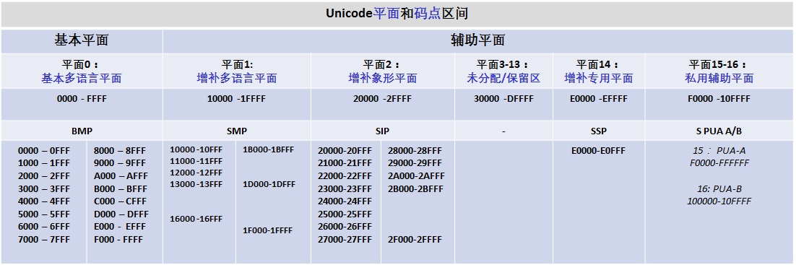

# 已编码字符集

Coded Character Set (CCS)

[TOC]

因为计算机硬件只能识别二进制数据，可抽象字符本身并不包含数值信息，所以导致计算机硬件无法识别抽象字符。为了解决这个问题，我们需要为抽象字符绑定数值信息，也就是在字符和码点间建立起映射关系，Unicode 标准中将这种映射关系称为"已编码字符"。

"已编码字符"在术语表中的正式定义是：抽象字符和码点之间的映射。这听起来有点拗口，也不便于理解，通常我们只需将"已编码字符"理解为与对应码点一同使用的抽象字符即可。**已编码字符**集则是已编码字符的集合，其中的每个字符都拥有相应的码点。

另外，在大多数语境中通常会将"已编码字符"简写为：字符集(*character set*)、*charset* 或编码集(*code set*)。

## 1. 相关术语

### 1.1 码点

码点 (*code point*) 是指"已编码字符集"中某个字符的值或位置。一个"已编码字符集"一般可以用一至多张二维表来表示，二维表中行与列交叉的点称之为码点，每个码点分配一个唯一的编号，称之为码点值或码点编号。除开某些特殊区域(比如代理区、专用区)的非字符码点和保留码点，每个码点唯一对应于一个字符。

码点可以是编码空间 (*codespace*) 中的任意值，对 Unicode 标准而言，可以是 0 ~ 0x10FFFF 中的任意值。Unicode 标准中将码点分为 7 种基础类型：Graphic、Format、Control、Private-Use、Surrogate、Noncharacter、Reserved。

在 Unicode 标准中，码点采用 16 进制书写，并加上前缀 U+ (例如，拉丁字母 A 的码点是 U+0041 )。Unicode 的码点可以分成 17 个代码级别(code plane)：

- 第一个代码级别被称为基本多语言级别(basic multilingual plane - **BMP**)，码点从 U+0000 到 U+FFFF，其中包括经典的 Unicode 代码；

- 其余的 16 个级别码点从 U+10000 到 U+10FFFF，其中包括一些辅助字符(Supplementary character)

  tips: 可参考 [Code point planes and blocks](https://en.wikipedia.org/wiki/Unicode#Code_point_planes_and_blocks) 可获取更详细的解释。

#### 1.1.1 码点和字符的对应关系

有时，为了与其他标准兼容，单个抽象字符可能会对应多个码点，比如 "Å" 拥有两个对应的码点： U+00C5 和 U+212B。

单个抽象字符也可被表示为一个码点序列，比如 "Å" 也可被表示为码点序列：U+0041 U+030A，而不再是被映射到单个码点。

由此可见抽象字符和码点并非一一对应。

#### 1.1.2 通过码点查找字符

为了便于观察码点和字符间的关系，我们可以在 [Unicode.org](https://www.unicode.org/) 中，点选 [Code Charts](https://www.unicode.org/charts/) 后，便会进入搜索页面。

在搜索框中输入 Unicode 码点后，便会找到该码点所在的编码图表(code chart)。
下载编码图标的 PDF 文件，并在其中搜索目标码点即可。

通过这种方式可以查询到较为详细的信息，甚至会为非字符(noncharacters)提供必要的说明。

### 1.2 编码空间

编码空间 (*Codespace*) ：在对抽象字符进行编码的过程中，用于映射抽象字符的非负整数的范围。编码空间中的某个具体值便是码点。在 Unicode 标准中，编码空间的范围是 0x0 ~ 0x10FFFF。

### 1.3 其他术语

以下内容直接翻译自 Unicode 术语表：

> - ***已编码字符*** (Encoded Character)：抽象字符(abstract character)和码点(code point)之间的关联(或映射)[See definition D11 in [Section 3.4, Characters and Encoding](http://www.unicode.org/versions/latest/ch03.pdf#G2212).]。抽象字符本身没有数值值，但"encoding a character"的步骤会将特定的码点与特定的抽象字符关联。
>
>   - An encoded character is also referred to as a coded character.
>
>   - 虽然"已编码字符"在术语中的正式定义是，抽象字符和码点之间的映射；但非正式地来讲，"已编码字符"可被认为是与为其分配的码点一起使用的抽象字符。
>
>   - 有时，为了与其他标准兼容，单个抽象字符可能会对应多个码点，比如 "Å" 拥有两个对应的码点： U+00C5 和 U+212B。
>
>   - 单个字符也可由一系列码点表示，比如 "Å" 也可被表示为码点序列：U+0041 U+030A，而不再是被映射到单个码点。
>
>     
>
> - ***已编码字符集***(coded character set)：是一个字符集，其中的每个字符都分配有数值码点，或说每个字符都拥有各自的码点。通常会简写为字符集(character set)、charset、编码集(code set)。A character set in which each character is assigned a numeric code point. 
>
> - ***Unicode 标量值*** (Scalar Value)：除开高代理码点(high-surrogate)和低代理码点(low-surrogat )之外的任何 Unicode 码点都是标量值，具体范围是 0x0 ~ 0xD7FF 和 0xE000 ~ 0x10FFFF。代理码点不能通过"编码模式"映射为"编码单元序列"，只有标量值可被映射为"编码单元序列"。(See definition D76 in [Section 3.9, Unicode Encoding Forms](http://www.unicode.org/versions/latest/ch03.pdf#G7404).)
>
> - ***编码空间*** (*Codespace*)：(1) 用于对字符进行编码的数值的范围。(2) 对于 Unicode 标准，编码空间的范围是 0x0 ~ 0x10FFFF。(See definition D9 in[Section 3.4, Characters and Encoding](http://www.unicode.org/versions/latest/ch03.pdf#G2212).)
>
> - ***码点*** (code point)：(1) Unicode 编码空间(codespace)中的任意值，也就是说可以是 0 ~ 0x10FFFF 中的任意值。(See definition D10 in [Section 3.4, Characters and Encoding](http://www.unicode.org/versions/latest/ch03.pdf#G2212).) 不是所有码点都会被分配给已编码字符。(2) 指已编码字符集中某个字符的值或位置。
>   在 Unicode 标准中，码点采用 16 进制书写，并加上前缀 U+ (例如，拉丁字母 A 的码点是 U+0041 )。Unicode 的码点可以分成 17 个代码级别(code plane)：
>
>   - 第一个代码级别被称为基本多语言级别(basic multilingual plane - **BMP**)，码点从 U+0000 到 U+FFFF，其中包括经典的 Unicode 代码；
>
>   - 其余的 16 个级别码点从 U+10000 到 U+10FFFF，其中包括一些辅助字符(Supplementary character)
>
>     tips: 可参考 [Code point planes and blocks](https://en.wikipedia.org/wiki/Unicode#Code_point_planes_and_blocks) 可获取更详细的解释，[Code point](https://en.wikipedia.org/wiki/Code_point)
>
> - ***码点类型*** (Code Point Type)：Unicode 标准中将码点分为 7 种基础类型：Graphic, Format, Control, Private-Use, Surrogate, Noncharacter, Reserved. (See definition D10a in [Section 3.4, Characters and Encoding](http://www.unicode.org/versions/latest/ch03.pdf#G2212).)
>
> - ***保留码点***(Reserved Code Point)：Unicode 标准中留作将来使用的码点，也称为未分配码点(*unassigned code point*)
>
> - ***已指定码点*** (Designated Code Point)：任何已分配给抽象字符 [*assigned characters* ] 或已通过标准赋予了规定功能的码点[ *surrogate code points and noncharacters* ]。该定义排除了保留的代码点。Designated Code Point 与 assigned code point 同义。(See [Section 2.4 Code Points and Characters](http://www.unicode.org/versions/latest/ch02.pdf#G25564).)
>
> - ***未分配字符***(Unassigned Character)：未分配给抽象字符的码点，包含代理(surrogate)码点、非字符(noncharacters)以及保留码点。 (See [Section 2.4, Code Points and Characters](http://www.unicode.org/versions/latest/ch02.pdf#G25564).)
>
> - ***已分配字符*** (Assigned Character)：已被分配给抽象字符的码点，是指在 Unicode 标准中已编码的字符——graphic, format, control, and private-use characters。(See [Section 2.4, Code Points and Characters](http://www.unicode.org/versions/latest/ch02.pdf#G25564).)