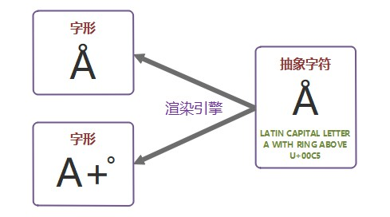
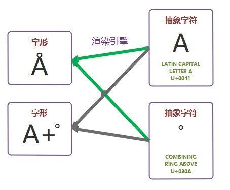

# 字符的编码过程

[TOC]

## waht's 抽象字符&字形

在显示 Unicode 字符数据时，通常只需使用一个字形即可绘制目标字符，但也存在通过多个字形来绘制目标字符的情况。比如抽象字符 "Å"，可以使用单个字形「Å」绘制，也可使用两个字形「A+̊」组合绘制。如下：

另外，一个字形也可能是由多个抽象字符的组合而成，极端情况下甚至可能存在多对多的情况。如下：

## 参考

- [Character encoding - Wikipedia](https://en.wikipedia.org/wiki/Character_encoding)
- [UNICODE CHARACTER ENCODING MODEL](https://www.unicode.org/reports/tr17/)
- [分享一下我所了解的字符编码知识](https://www.jianshu.com/p/2d4ad873b39f)
- [理解字符编码](https://mp.weixin.qq.com/s/JJhyw9ZetlWM_jNqcQCCQA)
- [Unicode 及编码方式概述](https://www.ibm.com/developerworks/cn/java/unicode-programming-language/index.html)
- [Character set encoding basics](https://scripts.sil.org/cms/scripts/page.php?site_id=nrsi&item_id=IWS-Chapter03#79e846db) 
- [刨根究底字符编码之一——关键术语解释(上)](https://zhuanlan.zhihu.com/p/27012967)

### 注脚

[^1]: [Unicode encoding model](https://en.wikipedia.org/wiki/Character_encoding#Unicode_encoding_model)
[^2]: [UNICODE CHARACTER ENCODING MODEL](https://www.unicode.org/reports/tr17/)

