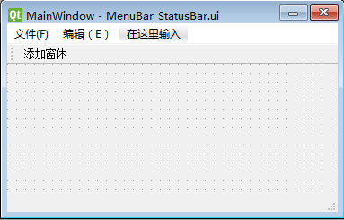
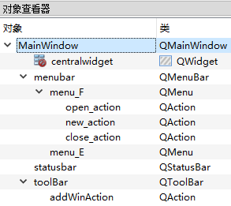
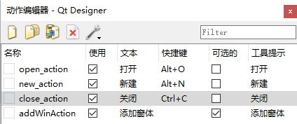

# MenuBar&ToolBar

[TOC]

## MenuBar

对于一级菜单，可使用 `&` 为选项添加<u>快捷键</u>。如， “文件(&F)” / “编辑(&E)”。

子菜单的<u>快捷键</u>也可以使用 `&` 添加，另外还可以在 “动作编辑器” 或 “属性编辑器 >  shortcat” 中设定。注意：两者可共存。

子菜单属于 `QAction` 类，可在 “动作编辑器” 中进行编辑。

## ToolBar

默认不显示，需要右键主窗口，选择 “添加工具栏” 。
添加工具：需先在 “动作编辑器” 中预先创建需要的 `QAction` ，然后从 “动作编辑器” 拖拽到工具栏中。
工具的具体属性，在属性编辑器中修改。

## 代码分析

创建如下窗体 `MenuBar_StatusBar.ui` ：



对象查看器内容如下：



动作编辑器内容如下：



源代码如下 `Ui_MenuBar_StatusBar.py` ：

```python
from PyQt5 import QtCore, QtGui, QtWidgets

class Ui_MainWindow(object):
    def setupUi(self, MainWindow):
        MainWindow.setObjectName("MainWindow")
        MainWindow.resize(333, 121)
        self.centralwidget = QtWidgets.QWidget(MainWindow)
        self.centralwidget.setObjectName("centralwidget")
        MainWindow.setCentralWidget(self.centralwidget)
        
        self.menubar = QtWidgets.QMenuBar(MainWindow)
        self.menubar.setGeometry(QtCore.QRect(0, 0, 333, 23))
        self.menubar.setObjectName("menubar")
        
        self.menu_F = QtWidgets.QMenu(self.menubar)
        self.menu_F.setObjectName("menu_F")
        self.menu_E = QtWidgets.QMenu(self.menubar)
        self.menu_E.setObjectName("menu_E")
        MainWindow.setMenuBar(self.menubar)
        
        self.statusbar = QtWidgets.QStatusBar(MainWindow)
        self.statusbar.setObjectName("statusbar")
        MainWindow.setStatusBar(self.statusbar)
        
        self.toolBar = QtWidgets.QToolBar(MainWindow)
        self.toolBar.setObjectName("toolBar")
        MainWindow.addToolBar(QtCore.Qt.TopToolBarArea, self.toolBar)
        
        self.open_action = QtWidgets.QAction(MainWindow)
        self.open_action.setObjectName("open_action")
        self.new_action = QtWidgets.QAction(MainWindow)
        self.new_action.setObjectName("new_action")
        self.close_action = QtWidgets.QAction(MainWindow)
        self.close_action.setObjectName("close_action")
        self.addWinAction = QtWidgets.QAction(MainWindow)
        self.addWinAction.setCheckable(True)
        self.addWinAction.setObjectName("addWinAction")
        
        self.menu_F.addAction(self.open_action)
        self.menu_F.addAction(self.new_action)
        self.menu_F.addAction(self.close_action)
        self.menubar.addAction(self.menu_F.menuAction())
        self.menubar.addAction(self.menu_E.menuAction())
        self.toolBar.addAction(self.addWinAction)

        self.retranslateUi(MainWindow)
        QtCore.QMetaObject.connectSlotsByName(MainWindow)

    def retranslateUi(self, MainWindow):
        _translate = QtCore.QCoreApplication.translate
        MainWindow.setWindowTitle(_translate("MainWindow", "MainWindow"))
        self.menu_F.setTitle(_translate("MainWindow", "文件(&F)"))
        self.menu_E.setTitle(_translate("MainWindow", "编辑（&E）"))
        self.toolBar.setWindowTitle(_translate("MainWindow", "toolBar"))
        self.open_action.setText(_translate("MainWindow", "打开"))
        self.open_action.setShortcut(_translate("MainWindow", "Alt+O"))
        self.new_action.setText(_translate("MainWindow", "新建"))
        self.new_action.setShortcut(_translate("MainWindow", "Alt+N"))
        self.close_action.setText(_translate("MainWindow", "关闭"))
        self.close_action.setToolTip(_translate("MainWindow", "关闭"))
        self.close_action.setShortcut(_translate("MainWindow", "Alt+C"))
        self.addWinAction.setText(_translate("MainWindow", "添加窗体"))
        self.addWinAction.setToolTip(_translate("MainWindow", "添加窗体"))
```

为了便于理解，省略无关代码：

```python
from PyQt5 import QtCore, QtGui, QtWidgets

class Ui_MainWindow(object):
    def setupUi(self, MainWindow):
        MainWindow.setObjectName("MainWindow")
        MainWindow.resize(333, 121)
        --snip--:centralwidget
        # 菜单栏
        self.menubar = QtWidgets.QMenuBar(MainWindow)
        self.menubar.setGeometry(QtCore.QRect(0, 0, 333, 23))
        self.menubar.setObjectName("menubar")
        self.menu_F = QtWidgets.QMenu(self.menubar)
        self.menu_F.setObjectName("menu_F")
        self.menu_E = QtWidgets.QMenu(self.menubar)
        self.menu_E.setObjectName("menu_E")
        MainWindow.setMenuBar(self.menubar)
        
        --snip--:statusbar
        # 工具栏
        self.toolBar = QtWidgets.QToolBar(MainWindow)
        self.toolBar.setObjectName("toolBar")
        MainWindow.addToolBar(QtCore.Qt.TopToolBarArea, self.toolBar)
        # action
        self.open_action = QtWidgets.QAction(MainWindow)
        self.open_action.setObjectName("open_action")
        --snip--:new_action
        --snip--:close_action
        self.addWinAction = QtWidgets.QAction(MainWindow)
        self.addWinAction.setCheckable(True)
        self.addWinAction.setObjectName("addWinAction")
        # 向QMenu添加action
        self.menu_F.addAction(self.open_action)
        self.menu_F.addAction(self.new_action)
        self.menu_F.addAction(self.close_action)
        # 向QMenuBar添加menuAction
        self.menubar.addAction(self.menu_F.menuAction())
        self.menubar.addAction(self.menu_E.menuAction())
        # 向QToolBar添加action
        self.toolBar.addAction(self.addWinAction)

        --snip--

    def retranslateUi(self, MainWindow):
        --snip--
```

## 测试

向 `open_action` 添加一个动作，用于打开文件。

### 添加信号/曹

这里我们分别使用了两种添加信号/曹的方法，两种方法等效。
尤其要注意对比两者的使用方法和参数类型。

在 `Ui_MenuBar_StatusBar.py` 的目录下新建 `win_logic.py` 

#### 直接连接信号/曹

```python
# -*- coding: utf-8 -*-

import sys 	
from PyQt5.QtWidgets import QApplication , QMainWindow, QWidget , QFileDialog 
from MainForm import Ui_MainWindow  

class MainForm(QMainWindow , Ui_MainWindow):  
	def __init__(self):  
		super(MainForm,self).__init__()  
		self.setupUi(self) 
		# 菜单的点击事件，当点击打开菜单时连接槽函数 openMsg()
        # 将函数对象作为参数，无需调用
		self.open_action.triggered.connect(self.openMsg)    

	def openMsg(self):  
		file,ok= QFileDialog.getOpenFileName(self,"打开","C:/","All Files (*);;Text Files (*.txt)") 
		# 在状态栏显示文件地址  		
		self.statusbar.showMessage(file)                   
    
if __name__=="__main__":  
	app = QApplication(sys.argv)  
	win = MainForm()  
	win.show()  
	sys.exit(app.exec_()) 
```

#### 使用@pyqtSlot

```python
from PyQt5.QtCore import pyqtSlot
from PyQt5.QtWidgets import QMainWindow, QFileDialog
from PyQt5 import QtWidgets

from Ui_MenuBar_StatusBar import Ui_MainWindow


class MainWindow(QMainWindow, Ui_MainWindow):
    def __init__(self, parent=None):
        super(MainWindow, self).__init__(parent)
        self.setupUi(self)

    @pyqtSlot()
    def on_open_action_triggered(self):
      	
        file, ok = QFileDialog.getOpenFileName(
            self, "打开", 'C:/', 'All Files (*);;Text Files (*.txt)')
        self.statusbar.showMessage(file)

if __name__ == "__main__":
    import sys

    app = QtWidgets.QApplication(sys.argv)
    win = MainWindow()
    win.show()
    sys.exit(app.exec_())
```


