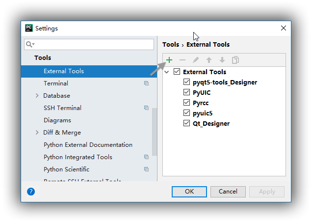
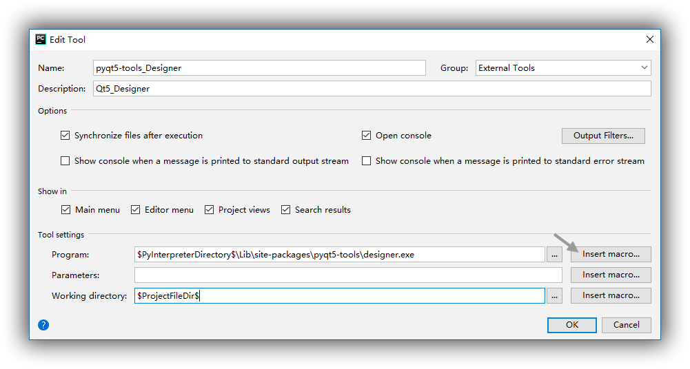
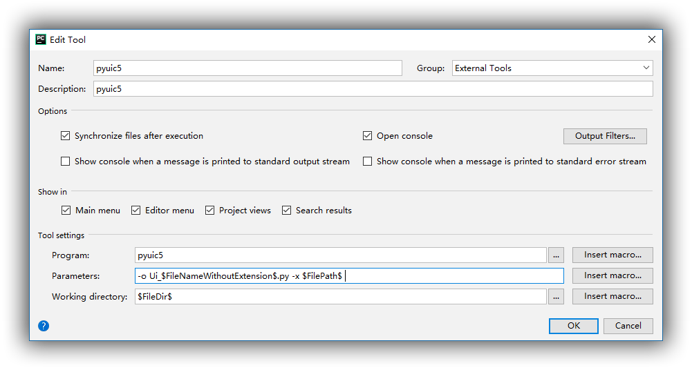
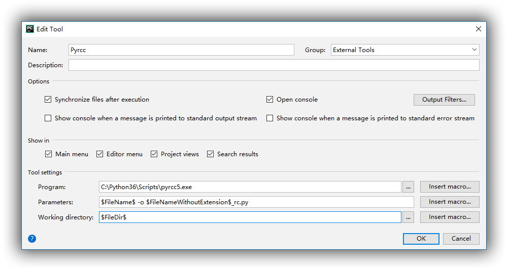
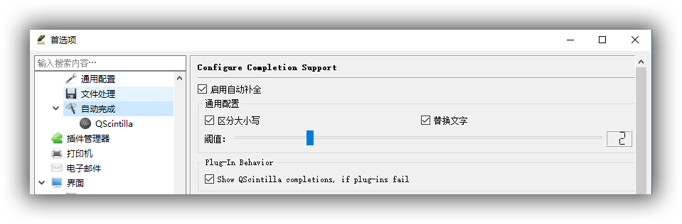
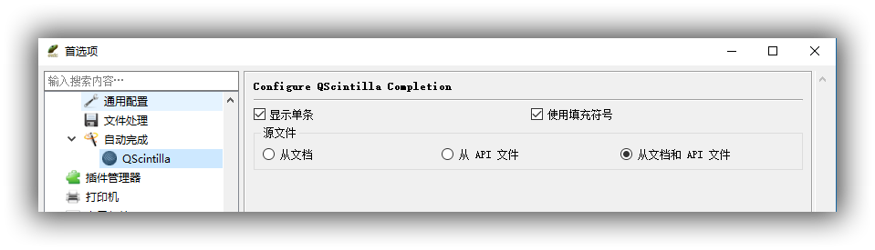
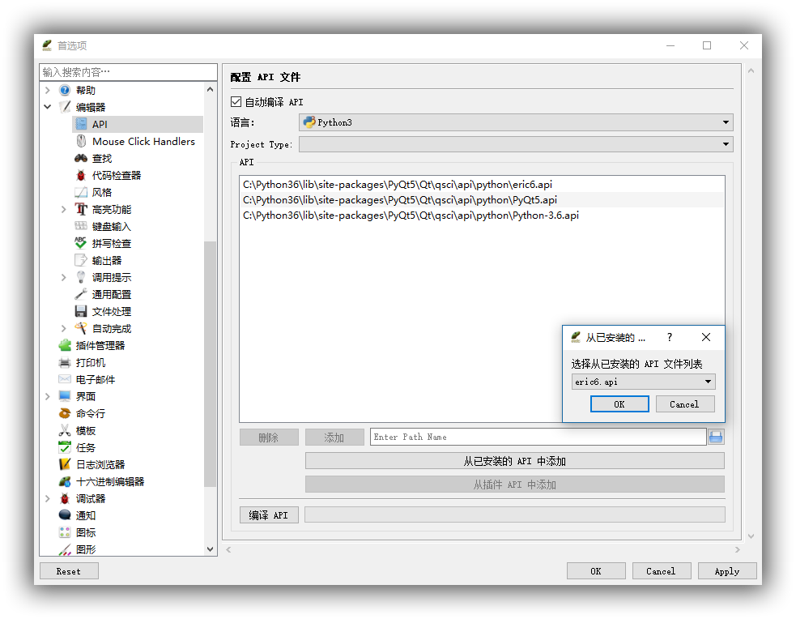
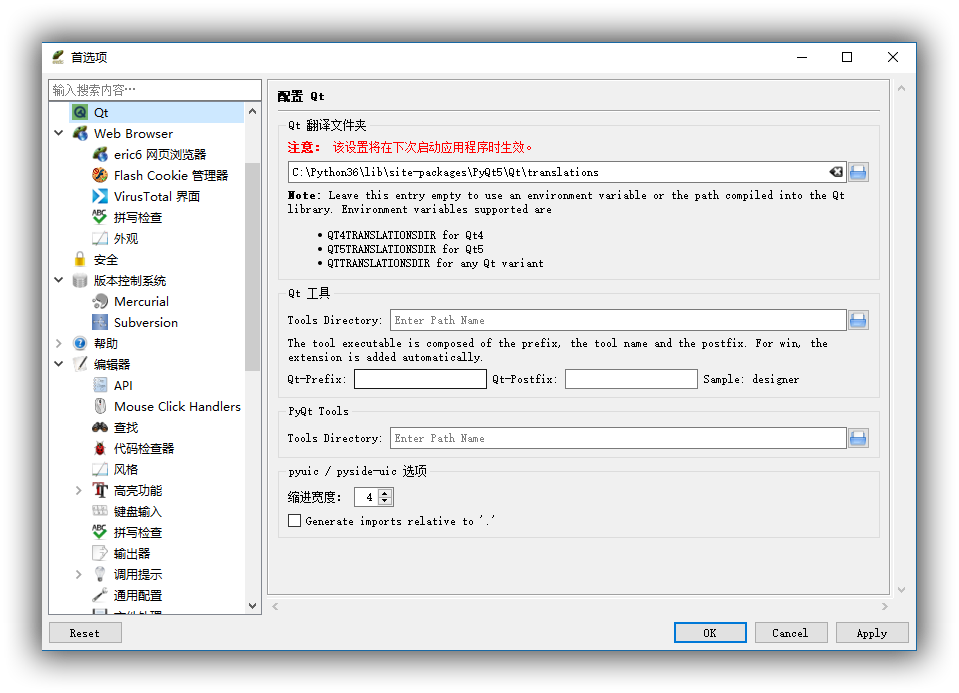

# 部署 PyQt5 开发环境

[TOC]

> 本文假设读者已经具备 Python 相关的基础知识，并不会介绍如何安装 Python，以及 pip 的使用方法。另外，我也是初学者，希望大家帮我指出错误，以求共同进步。
>
> 转载请注明出处：http://www.jianshu.com/u/5e6f798c903a

## 1. 基本环境

- Win10 64位
- Python 3.6.3
- [PyQt5](https://pypi.python.org/pypi/PyQt5): [PyQt5-5.9.2-5.9.3-cp35.cp36.cp37-none-win_amd64.whl](https://pypi.python.org/packages/67/ad/5ce6033bded3c39043a2c67cc46b3976427187f68c9dbaf5533884899086/PyQt5-5.9.2-5.9.3-cp35.cp36.cp37-none-win_amd64.whl#md5=87f07e234e60dfc3a81d8b59862fb258) 
  - 安装：`pip3 install PyQt5` 
  - ~~[官方安装指导(失效)](https://www.riverbankcomputing.com/software/pyqt/download5)~~ [官方指导手册](http://pyqt.sourceforge.net/Docs/PyQt5/installation.html) 
- [PyQt-tools:](https://pypi.python.org/pypi/pyqt5-tools) [pyqt5_tools-5.9.0.1.2-cp36-none-win_amd64.whl](https://pypi.python.org/packages/0e/a1/b2bbbb9e0c0f374fb77c85b014fc39fdb6e9e258c20906cc7ecb5f565e38/pyqt5_tools-5.9.0.1.2-cp36-none-win_amd64.whl#md5=5f42a111d7e12ac61a625a3a0889bc26) 
  - 安装：`pip install PyQt5-tools` 
  - 环境变量：将 PyQt-tools 的安装目录添加到系统环境变量中，如`C:\Python36\Lib\site-packages\pyqt5-tools` 
  - 说明：在旧版本的 PyQt5 `.whl` 文件中，会包含诸如 Qt Designer 等工具。
    但是在最新版本的 `.whl` 文件中不再提供这些工具，会更加专注于实现 PyQt5 应用程序的依赖。相关的工具转而由 PyQt5-tools 提供，比如 Qt Designer。一旦安装了 PyQt5-tools 便可不再安装 Qt 开发工具。

**关于 Anaconda**：就目前而言，我尝试了的 Anaconda3-5.0.0-Windows-x86_64。但是由于某些未知的原因（或说是因为我的无知），其自带的 Qt Designer 总会在启动时给出错误提示。我尝试过重新安装整个 Anaconda3，但问题依旧无法解决。另外，我曾在 Anaconda3-4.4 下，成功运行过其自带的 Qt Designer。但当我更新了 Qt 相关的一些包后， Qt Designer 也给出了相同的错误提示。因此，建议作为初学者，尽量避免使用 Anaconda3-5.0.0。尽管上诉问题都可以通过自己努力的到解决，但是我们当前的目标是快速认识 Qt，而非不停的折腾开发环境。

## 2. 关于 pyuic

> 参考资料：[Using Qt Designer](http://pyqt.sourceforge.net/Docs/PyQt5/designer.html#using-qt-designer) 

Qt Designer 使用 XML 格式的 `.ui` 文件储存 GUI 界面，但并不会生成任何 C++ / Python 代码。Qt 内含的 **uic** utility 用于从 `.ui` 文件生成用于创建 GUI 的 C++ 代码。Qt 还包含 `QUiLoader` 类，该类允许应用程序加载 `.ui` 文件，并动态创建相应的用户界面。

PyQt5 并没有打包 `QUiLoader` 类，而是包含了 [`uic`](http://pyqt.sourceforge.net/Docs/PyQt5/uic.html#PyQt5-uic) Python 模块。 [`uic`](http://pyqt.sourceforge.net/Docs/PyQt5/uic.html#PyQt5-uic) 模块一方面类似于 `QUiLoader` 类，可加载 `.ui` 文件，并动态创建用户界面。另一方面，也拥有和 **uic** utility 相似的功能， `uic` 模块也可用于从 `.ui` 文件生成用于创建 GUI 的 Python 代码。

PyQt5 的 **pyuic5** 程序是 [`uic`](http://pyqt.sourceforge.net/Docs/PyQt5/uic.html#PyQt5-uic) 模块的命令行接口，我们在配置 PyCharm 时，便会用到该命令。
**pyuic5** 命令的语法如下：

```
pyuic5 [options] .ui-file
```

所有的命令行选项如下：

- -h, --help：将帮助信息写入到 `stdout` 。
- --version：将版本号写入到 `stdout` 。
- -i \<N\>, --indent \<N\> ：定义由 pyuic5 生成 Python 代码时，代码缩进的空格数 `<N>` 。如果 `<N>` 是 0 ，表示使用制表符缩进。默认值是 4。
- -o\<FILE\>, --output \<FILE\> ：由 pyuic5 生成的 Python 代码被写入到文件 `<FILE>` 。
- -p, --preview ：动态创建并显示 GUI。不会生成 Python 代码。
- -x, --execute ：生成的 Python 代码会包含一些附加代码，以保证整段代码可作为独立应用被执行时，同样可以创建并显示 GUI。也就是说附加代码保证了所生成的整个代码段可以独立运行，当我们使用 Eric6 编译 `.ui` 文件时，所得到的 Python 代码便会拥有这样的效果。
- --import-from\<PACKAGE\> ：在 5.6 版本中新加入的功能。使用 `from <PACKAGE> import ...` 导入资源模块，而不是使用 `import ...` 。
- --from-imports ：相当于指定 `--import-from .` 。
- --resource-suffix\<SUFFIX\> ：后缀 `<SUFFIX>` 会被追加到所有在 `.ui` 文件中被指定的资源文件的原始名称后。附加 `<SUFFIX>` 的新名称被用于由 **pyrcc5** 从资源文件生成的 Python 模块的名称。例如，如果在 `.ui` 文件中指定了名为 `foo.qrc` 的资源文件，那么该资源文件对应的 Python 模块的名称则是 `foo_rc` 。

注意：由**pyuic5** 生成的代码不能保证与较久版本的 PyQt5 兼容。但是，可以保证这些代码与较高版本的 PyQt5 相兼容。如果无法你无法控制用户所使用的 PyQt5 的版本，那么在安装过程中则应该运行 **pyuic5** 或调用 [`compileUi()`](http://pyqt.sourceforge.net/Docs/PyQt5/designer.html#PyQt5.uic.compileUi) 。另一种办法是分发 `.ui` 文件（可被作为资源文件的一部分），并在应用程序中动态加载 `.ui` 文件。

**PyQt5.uic.pyuic.py** 和 **pyuic5.exe** 都是同一个对象，只是调用的方法不同。
pyuic5 可被直接调用，pyuic 则需通过 python 调用。

```
C:\Users\iwhal>python -m PyQt5.uic.pyuic --version
Python User Interface Compiler 5.9.2 for Qt version 5.9.3

C:\Users\iwhal>pyuic5 --version
Python User Interface Compiler 5.9.2 for Qt version 5.9.3
```

## 3. 关于 pyrcc

> 参考资料：[PyQt5资源系统](http://pyqt.sourceforge.net/Docs/PyQt5/resources.html#the-pyqt5-resource-system)

- PyQt5 资源系统：
  PyQt5 支持 Qt 的资源系统。这是一种将资源（如 icon 和翻译文件）嵌入到应用程序中的工具。利用资源系统在打包和分发资源会更加轻松。
   `.qrc` 资源集合文件是一个 XML 格式的文件，用于指定需要被嵌入到应用程序中的资源文件。应用程序会以冒号作为开头，通过资源文件的原始名称引用相应的文件。
  相关的完整描述（包括 `.qrc` 文件的格式），请参考 Qt 文档中的 Qt Resource System。
- pyrcc5：
  PyQt5 的 **pyrcc5** 模块相当于 Qt 的 **rcc** utility，并且两者的使用方式完全相同。**pyrcc5** 会读取 `.qrc` 文件和资源文件，并生成相应的 Python 模块。只需要在应用程序中 `import` 相应的 Python 资源模块，便可以像使用原始文件一样，使用相应的资源。

## 4. 配置 PyCharm

- [PyCharm](https://www.jetbrains.com/pycharm/download/#section=windows): Version 2017.2.3

这一小节我们会对 PyCharm 进行配置，使其更加适合作为 PyQt 的开发工具。
在 PyCharm 中依次选择：`File -> Settings -> Tools -> External Tools` 。
然后使用下图中的 “+” 号，逐个添加下列三个外部工具。

> 1. Qt_Designer
> 2. PyUIC
> 3. Pyrcc



### 配置 Qt_Designer

此工具用于调用 `designer.exe` ，请依照下图进行设置。
注意：类似 `$ProjectFileDir$ ` 的宏变量可点击 `Insert macro...` 进行插入，同时也会看到相应宏变量的解释。



### 配置 PyUIC

前面，我们已近介绍了 pyuic 模块，下面只需要按照命令语法进行配置即可。
下图的配置方式会生成额外的代码，方便对模块进行测试。
这种方式与通过 Eric6 编译形成的 `.py` 文件相同。
Parameters：`-o Ui_$FileNameWithoutExtension$.py -x $FilePath$`



### 配置 Pyrcc

前面，我们已近介绍了 pyrcc 模块，这里只需要按照下图配置即可。



## 0x03 Eric6

- [eric6-17.09](https://eric-ide.python-projects.org/index.html) 

Eric 在 PyQt5 开发的过程中拥有一些比 Pycharm 更加便捷的特性，所以建议大家同时配置好这两个 IDE。

下载链接： [eric-download](https://eric-ide.python-projects.org/eric-download.html) 

### 安装 Eric6

- 首先请务必按照 “1. 基本环境” 中的内容配置好基本环境。
- 安装 QScintilla：`pip install qscintilla` 。
- 安装 eric6：将 eric6-17.09.zip 解压后，找到 `eric6-17.09` 目录下的 `install.py` ，双击安装。（这个版本自带汉化，无需安装额外的汉化包）
- 启动 eric6：点击 `eric6-17.09\eric` 目录下的 `eric6.pyw` 便可启动 eric6 了。

### 配置 Eric6

首次打开 Eric 时，会提示需要配置，点击 “确定” 后，便会进入配置界面。

#### 配置 自动完成：

请依照下图进行设置。





#### 配置 API

请依照下图进行设置。
点击 “从已安装的 API 中添加” 便可选取相应的 API。按图所示，选择好相应的 API 后，还需点击 “编译 API”。




#### 配置 Qt

一般而言，Eric 会自动调用相关 “Qt 工具”，无需对此项进行配置。
但是如果你的 Eric 无法启动 `designer.exe` ，那么请在 `Qt 工具 -> Tools Directory` 中填入`designer.exe` 的绝对路径。由于我们已经通过 [PyQt-tools](https://pypi.python.org/pypi/pyqt5-tools) 安装了 Qt Designer，`designer.exe` 通常会位于pyqt5-tools 包中。
我本机上的路径为 `C:\Python36\Lib\site-packages\pyqt5-tools` 。


