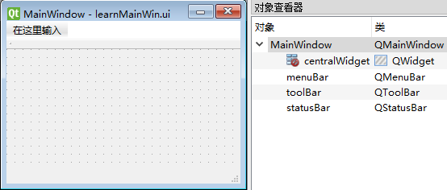
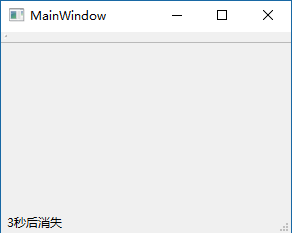

## 1 常用窗口

先介绍下常用窗口：QWidget / QDialog / QMainWinodw：

- The [QWidget](https://doc.qt.io/qt-5/qwidget.html) class is the base class of all user interface objects. 继承自 [QObject](https://doc.qt.io/qt-5/qobject.html) 和 [QPaintDevice](https://doc.qt.io/qt-5/qpaintdevice.html) 
- The [QDialog](https://doc.qt.io/qt-5/qdialog.html) class is the base class of dialog windows. 继承自 [QWidget](https://doc.qt.io/qt-5/qwidget.html) 
- The [QMainWindow](https://doc.qt.io/qt-5/qmainwindow.html) class provides a main application window. 继承自[QWidget](https://doc.qt.io/qt-5/qwidget.html) 。为用户提供一个应用程序框架，拥有自己的布局，可以在布局中添加控件。可包含菜单栏、工具栏、状态栏、标题栏等。

注意：QDialog 和 QMainWindow 之间没有直接关系。

### 1.1 使用原则

- 如果需要嵌入到其他窗体中，则基于QWidget创建。
- 如果是顶级对话框，则基于 QDialog 创建。用于执行短期任务，或者与用户进行互动，可以是模态或非模态。
- 如果是主应用窗口，则基于 QMainWindow 创建。

参考：http://blog.csdn.net/liang19890820/article/details/50533262

~~在 PyQt5 中 Widget 被分离出来，似乎用来替代 Dialog，并将 QWidget 放入了 QtWidgets~~ (书上说用于替代 Dialog ，但是目前并未看出原因)

## QMainWindow Class

The [QMainWindow](https://doc.qt.io/qt-5/qmainwindow.html) class provides a main application window. 
Inherits:	QWidget

### Qt主窗口框架

Qt Main Window Framework

主窗口提供一个用于构建应用程序的用户界面的框架。Qt 利用 [QMainWindow](https://doc.qt.io/qt-5/qmainwindow.html) 和 [相关的类](https://doc.qt.io/qt-5/widget-classes.html#main-window-and-related-classes) 管理主窗口。
[QMainWindow](https://doc.qt.io/qt-5/qmainwindow.html) 拥有自己的 layout，你可以向其中添加 [QToolBar](https://doc.qt.io/qt-5/qtoolbar.html)s, [QDockWidget](https://doc.qt.io/qt-5/qdockwidget.html)s, a [QMenuBar](https://doc.qt.io/qt-5/qmenubar.html), and a [QStatusBar](https://doc.qt.io/qt-5/qstatusbar.html) 。layout 的中心区域可以放置任何类型的 widget。下图是主窗口的 layout。


**Note: **Creating a main window without a central widget is not supported. You must have a central widget even if it is just a placeholder.

### Public Functions

#### setCentralWidget

void QMainWindow::setCentralWidget([QWidget](https://doc.qt.io/qt-5/qwidget.html#QWidget) **widget*)

Sets the given *widget* to be the main window's central widget.

Note: [QMainWindow](https://doc.qt.io/qt-5/qmainwindow.html) takes ownership of the *widget* pointer and deletes it at the appropriate time.

#### centralWidget

QWidget *QMainWindow::centralWidget() const

Returns the central widget for the main window. This function returns zero if the central widget has not been set.

Tip: 使用 pyuic5 从 `.ui` 生成 python 代码时，会创建一个名为 `centralWiget` 的 field。
比如下面这段代码：

```python
class Ui_MainWindow(object):
    def setupUi(self, MainWindow):
        MainWindow.setObjectName("MainWindow")
        MainWindow.resize(800, 600)
        self.centralWidget = QtWidgets.QWidget(MainWindow)
        self.centralWidget.setObjectName("centralWidget")
        MainWindow.setCentralWidget(self.centralWidget)
        --snip--
```

这时，若我们想在业务代码中调用 `centralWidget()` 方法，便会提示异常。
因为此时 centralWidget 已被作为一个 `QWidget` 实例对象的名称，不能被当作方法名。

#### setMenuBar

void QMainWindow::setMenuBar([QMenuBar](https://doc.qt.io/qt-5/qmenubar.html) **menuBar*)

Sets the menu bar for the main window to *menuBar*.

Note: [QMainWindow](https://doc.qt.io/qt-5/qmainwindow.html) takes ownership of the *menuBar* pointer and deletes it at the appropriate time.

#### menuBar

[QMenuBar](https://doc.qt.io/qt-5/qmenubar.html) *QMainWindow::menuBar() const

Returns the menu bar for the main window. This function creates and returns an empty menu bar if the menu bar does not exist.

If you want all windows in a Mac application to share one menu bar, don't use this function to create it, because the menu bar created here will have this [QMainWindow](https://doc.qt.io/qt-5/qmainwindow.html) as its parent. Instead, you must create a menu bar that does not have a parent, which you can then share among all the Mac windows. Create a parent-less menu bar this way:

```
QMenuBar *menuBar = new QMenuBar(0);
```

Tip: 使用 pyuic5 从 `.ui` 生成 python 代码时，会创建一个名为 `menuBar` 的 field。
比如下面这段代码：

```python
class Ui_MainWindow(object):
    def setupUi(self, MainWindow):
        MainWindow.setObjectName("MainWindow")
        MainWindow.resize(800, 600)
        --snip--
        self.menuBar = QtWidgets.QMenuBar(MainWindow)
        self.menuBar.setGeometry(QtCore.QRect(0, 0, 800, 23))
        self.menuBar.setObjectName("menuBar")
        MainWindow.setMenuBar(self.menuBar)
        --snip--
```

这时，若我们想在业务代码中调用 `menuBar()` 方法，便会提示异常。
因为此时 `menuBar` 已被作为一个 `QMenuBar` 实例对象的名称，不能被当作方法名。

#### setStatusBar

void QMainWindow::setStatusBar([QStatusBar](https://doc.qt.io/qt-5/qstatusbar.html) **statusbar*)

Sets the status bar for the main window to *statusbar*.

Setting the status bar to 0 will remove it from the main window. Note that [QMainWindow](https://doc.qt.io/qt-5/qmainwindow.html) takes ownership of the *statusbar* pointer and deletes it at the appropriate time.

#### statusBar

[QStatusBar](https://doc.qt.io/qt-5/qstatusbar.html) *QMainWindow::statusBar() const

Returns the status bar for the main window. This function creates and returns an empty status bar if the status bar does not exist.

Tip: 使用 pyuic5 从 `.ui` 生成 python 代码时，会创建一个名为 `statusBar` 的 field。
比如下面这段代码：

```python
class Ui_MainWindow(object):
    def setupUi(self, MainWindow):
        MainWindow.setObjectName("MainWindow")
        MainWindow.resize(800, 600)
        --snip--
        self.statusBar = QtWidgets.QStatusBar(MainWindow)
        self.statusBar.setObjectName("statusBar")
        MainWindow.setStatusBar(self.statusBar)
        --snip--
```

这时，若我们想在业务代码中调用 `statusBar()` 方法，便会提示异常。
因为此时 `statusBar` 已被作为一个 `QStatusBar` 实例对象的名称，不能被当作方法名。

#### addToolBar

1. void QMainWindow::addToolBar([Qt::ToolBarArea](https://doc.qt.io/qt-5/qt.html#ToolBarArea-enum) *area*, [QToolBar](https://doc.qt.io/qt-5/qtoolbar.html) **toolbar*)

Adds the *toolbar* into the specified *area* in this main window. The *toolbar* is placed at the end of the current tool bar block (i.e. line). If the main window already manages *toolbar* then it will only move the toolbar to *area*.

**See also **[insertToolBar](https://doc.qt.io/qt-5/qmainwindow.html#insertToolBar)(), [addToolBarBreak](https://doc.qt.io/qt-5/qmainwindow.html#addToolBarBreak)(), and [insertToolBarBreak](https://doc.qt.io/qt-5/qmainwindow.html#insertToolBarBreak)().

2. void QMainWindow::addToolBar([QToolBar](https://doc.qt.io/qt-5/qtoolbar.html) **toolbar*)

This is an overloaded function.

Equivalent of calling [addToolBar](https://doc.qt.io/qt-5/qmainwindow.html#addToolBar)([Qt::TopToolBarArea](https://doc.qt.io/qt-5/qt.html#ToolBarArea-enum), *toolbar*)

Tip: 使用 pyuic5 从 `.ui` 生成 python 代码时，会创建一个名为 `toolBar` 的 field。
比如下面这段代码：

```
class Ui_MainWindow(object):
    def setupUi(self, MainWindow):
        MainWindow.setObjectName("MainWindow")
        MainWindow.resize(800, 600)
        --snip--
        self.toolBar = QtWidgets.QToolBar(MainWindow)
        self.toolBar.setObjectName("toolBar")
        MainWindow.addToolBar(QtCore.Qt.TopToolBarArea, self.toolBar)
		--snip--
```

### statusBar 示例

本示例将会在状态栏显示 `'3秒后消失'` 的字样，并在 3 秒后消失。

#### 方案1_使用  pyuic5 生成的代码：

创建 `learnMainWin.ui` ，如下：



从 `learnMainWin.ui` 生成 `learnMainWindow.py` 。

```python
from PyQt5 import QtCore, QtGui, QtWidgets

class Ui_MainWindow(object):
    def setupUi(self, MainWindow):
        MainWindow.setObjectName("MainWindow")
        MainWindow.resize(290, 202)
        self.centralWidget = QtWidgets.QWidget(MainWindow)
        self.centralWidget.setObjectName("centralWidget")
        MainWindow.setCentralWidget(self.centralWidget)
        self.menuBar = QtWidgets.QMenuBar(MainWindow)
        self.menuBar.setGeometry(QtCore.QRect(0, 0, 290, 23))
        self.menuBar.setObjectName("menuBar")
        MainWindow.setMenuBar(self.menuBar)
        self.toolBar = QtWidgets.QToolBar(MainWindow)
        self.toolBar.setObjectName("toolBar")
        MainWindow.addToolBar(QtCore.Qt.TopToolBarArea, self.toolBar)
        self.statusBar = QtWidgets.QStatusBar(MainWindow)
        self.statusBar.setObjectName("statusBar")
        MainWindow.setStatusBar(self.statusBar)

        self.retranslateUi(MainWindow)
        QtCore.QMetaObject.connectSlotsByName(MainWindow)

    def retranslateUi(self, MainWindow):
        _translate = QtCore.QCoreApplication.translate
        MainWindow.setWindowTitle(_translate("MainWindow", "MainWindow"))
        self.toolBar.setWindowTitle(_translate("MainWindow", "toolBar"))
```

在同目录下创建主入口文件 `mainEntry.py` ，并写入以下代码。

```python
import sys
from Ui_learnMainWin import Ui_MainWindow
from PyQt5.QtWidgets import QMainWindow, QApplication


class MainEntry(QMainWindow, Ui_MainWindow):
    def __init__(self):
        super(MainEntry, self).__init__()
        self.setupUi(self)
        self.statusBar.showMessage('3秒后消失', 3000)
        # 不可以使用下面这种方式，因为此时statusBar不再是方法
        # self.status = self.statusBar()
        # self.status.showMessage('3秒后消失', 3000)


if __name__ == '__main__':
    app = QApplication(sys.argv)
    main_entry = MainEntry()
    main_entry.show()
    sys.exit(app.exec())
```

结果：



#### showMessage

void QStatusBar::[showMessage](https://doc.qt.io/qt-5/qstatusbar.html#showMessage) (const [QString](https://doc.qt.io/qt-5/qstring.html) &*message*, int*timeout* = 0)

Hides the normal status indications指示 and displays the given *message* for the specified number of milli-seconds (*timeout*). If *timeout* is 0 (default), the *message* remains保持 displayed until the [clearMessage](https://doc.qt.io/qt-5/qstatusbar.html#clearMessage)() slot曹 is called or until the showMessage() slot is called again to change the message.

Note that showMessage() is called to show temporary explanations of tool tip texts, so passing a *timeout* of 0 is not sufficient to display a [permanent message](https://doc.qt.io/qt-5/qstatusbar.html#permanent-message).

#### 方案2_手写代码

```
class MainWindow(QMainWindow):
    def __init__(self):
        super(MainWindow, self).__init__()
        self.resize(400, 200)
        self.status = self.statusBar()
        self.status.showMessage('3秒后消失', 3000)


if __name__ == '__main__':
    app = QApplication(sys.argv)
    main_entry = MainWindow()
    main_entry.show()
    sys.exit(app.exec())
```

此时 `statusBar()` 作为一个方法。在方案1中 `statusBar` 不能作为方法被调用。

### 居中主窗口 示例

会用到 `from PyQt5.QtWidgets import QDesktopWidget` 。P125

### exec

int QGuiApplication::exec()

Enters the main event loop and waits until [exit](https://doc.qt.io/qt-5/qcoreapplication.html#exit)() is called, and then returns the value that was set to [exit](https://doc.qt.io/qt-5/qcoreapplication.html#exit)() (which is 0 if [exit](https://doc.qt.io/qt-5/qcoreapplication.html#exit)() is called via [quit](https://doc.qt.io/qt-5/qcoreapplication.html#quit)()).
https://doc.qt.io/qt-5/qguiapplication.html#exec

### quit()/exit()/close()

#### quit

void QCoreApplication::quit() `[static slot]` 

Tells the application to exit with return code 0 (success). Equivalent to calling [QCoreApplication::exit](https://doc.qt.io/qt-5/qcoreapplication.html#exit)(0).

It's common to connect the [QGuiApplication::lastWindowClosed](https://doc.qt.io/qt-5/qguiapplication.html#lastWindowClosed)() signal to quit(), and you also often connect e.g. [QAbstractButton::clicked](https://doc.qt.io/qt-5/qabstractbutton.html#clicked)() or signals in [QAction](https://doc.qt.io/qt-5/qaction.html), [QMenu](https://doc.qt.io/qt-5/qmenu.html), or [QMenuBar](https://doc.qt.io/qt-5/qmenubar.html) to it.

Example:

```
QPushButton *quitButton = new QPushButton("Quit");
connect(quitButton, SIGNAL(clicked()), &app, SLOT(quit()));
```

**See also **[exit](https://doc.qt.io/qt-5/qcoreapplication.html#exit)(), [aboutToQuit](https://doc.qt.io/qt-5/qcoreapplication.html#aboutToQuit)(), and [QGuiApplication::lastWindowClosed](https://doc.qt.io/qt-5/qguiapplication.html#lastWindowClosed)().

#### exit

void <u>QCoreApplication</u>::exit(int *returnCode* = 0)
https://doc.qt.io/qt-5/qcoreapplication.html#exit

Tells the application to exit with a return code.

After this function has been called, the application leaves the main event loop and returns from the call to [exec](https://doc.qt.io/qt-5/qcoreapplication.html#exec)(). The [exec](https://doc.qt.io/qt-5/qcoreapplication.html#exec)() function returns *returnCode*. If the event loop is not running, this function does nothing.

By convention, a *returnCode* of 0 means success, and any non-zero value indicates an error.

Note that unlike the C library function of the same name, this function *does* return to the caller -- it is event processing that stops.

#### close

bool QWidget::close()

Closes this widget. Returns `true` if the widget was closed; otherwise returns `false`.

First it sends the widget a [QCloseEvent](https://doc.qt.io/qt-5/qcloseevent.html). The widget is [hidden](https://doc.qt.io/qt-5/qwidget.html#hide) if it [accepts](https://doc.qt.io/qt-5/qevent.html#accept) the close event. If it [ignores](https://doc.qt.io/qt-5/qevent.html#ignore) the event, nothing happens. The default implementation of [QWidget::closeEvent](https://doc.qt.io/qt-5/qwidget.html#closeEvent)() accepts the close event.

If the widget has the [Qt::WA_DeleteOnClose](https://doc.qt.io/qt-5/qt.html#WidgetAttribute-enum) flag, the widget is also deleted. A close events is delivered to the widget no matter if the widget is visible or not.

The [QApplication::lastWindowClosed](https://doc.qt.io/qt-5/qguiapplication.html#lastWindowClosed)() signal is emitted when the last visible primary window (i.e. window with no parent) with the [Qt::WA_QuitOnClose](https://doc.qt.io/qt-5/qt.html#WidgetAttribute-enum) attribute set is closed. By default this attribute is set for all widgets except transient windows such as splash screens, tool windows, and popup menus.

### lastWindowClosed

void QGuiApplication::lastWindowClosed()
https://doc.qt.io/qt-5/qguiapplication.html#lastWindowClosed

This signal is emitted from [exec](https://doc.qt.io/qt-5/qguiapplication.html#exec)() when the last visible primary window (i.e. window with no parent) is closed.

By default, [QGuiApplication](https://doc.qt.io/qt-5/qguiapplication.html) quits after this signal is emitted. This feature can be turned off by setting [quitOnLastWindowClosed](https://doc.qt.io/qt-5/qguiapplication.html#quitOnLastWindowClosed-prop) to `false`.

**See also **[QWindow::close](https://doc.qt.io/qt-5/qwindow.html#close)() and [QWindow::isTopLevel](https://doc.qt.io/qt-5/qwindow.html#isTopLevel)().


