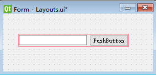
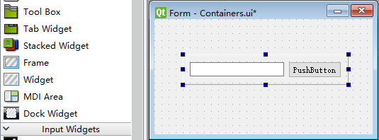

# Qt Designer

## 2 基础知识

- MVC：Qt Designer 符合 MVC (Model-View-Controller) 模式，模型：用于存储（以及有时处理）应用程序的数据的代码；视图：显示应用程序用户界面的代码；控制器：主要提供业务逻辑的代码。
- `.ui` ：Qt Designer 生成的文件以 `.ui` 作为后缀，本质是 XML 可扩展标记语言格式的文件。可通过 `pyuic5` 命令将 `.ui` 文件夹转换为 `.py` 格式，也可通过 Eric6 进行转换。

## 3 布局

通常有两种布局方式：

- 通过 Layouts 进行布局
- 通过容器控件布局

### 层次关系

在程序设计中，一般用父子关系来表示 widget 间的父子关系。
Qt Designer 中右侧的 “对象查看器 ” ，明确的给出了各个对象间的层次关系。

### 使用 Layouts 布局

- Vertical Layout 垂直布局
- Horizontal Layout 水平布局
- Grid Layout 栅格布局
- Form Layout 表单布局



当我们利用布局管理器创建出上图所示的布局时，可得到如下代码：
注意：这里有两层父widget。第一层是 `Form` ，第二层是 `self.widget` 。

```python
from PyQt5 import QtCore, QtGui, QtWidgets

class Ui_Form(object):
    def setupUi(self, Form):
        Form.setObjectName("Form")
        Form.resize(452, 403)
        
        # Form是self.widget的父控件
        self.widget = QtWidgets.QWidget(Form)
        
        # QRect类使用整数精度在平面中定义一个矩形。
        self.widget.setGeometry(QtCore.QRect(90, 160, 216, 25))        
        self.widget.setObjectName("widget")
        
        # self.widget是self.horizontalLayout的父控件
        # 注意：这里已经有两级父控件了
        self.horizontalLayout = QtWidgets.QHBoxLayout(self.widget)
        
        # setContentsMargins表示距离布局器四个边缘的距离
        self.horizontalLayout.setContentsMargins(0, 0, 0, 0)
        self.horizontalLayout.setObjectName("horizontalLayout")
        
        # self.widget是self.lineEdit的父控件
        self.lineEdit = QtWidgets.QLineEdit(self.widget)
        self.lineEdit.setObjectName("lineEdit")
        self.horizontalLayout.addWidget(self.lineEdit)
        
        # self.widget是self.pushButton的父控件
        self.pushButton = QtWidgets.QPushButton(self.widget)
        self.pushButton.setObjectName("pushButton")
        self.horizontalLayout.addWidget(self.pushButton)
        
        #raise_()用于将widget提升到父widget堆的顶部       
		#在这个调用之后，窗口小部件将在任何重叠的兄弟widgets的前面可视化。
        self.lineEdit.raise_()
        self.pushButton.raise_()
        
        self.retranslateUi(Form)
        QtCore.QMetaObject.connectSlotsByName(Form)

    def retranslateUi(self, Form):
        _translate = QtCore.QCoreApplication.translate
        Form.setWindowTitle(_translate("Form", "Form"))
        self.pushButton.setText(_translate("Form", "PushButton"))
```


### 使用 Containers 容器布局

容器是指能够容纳子控件的控件。
使用容器控件的目的是将容器控件中的控件归为一类，以有别于其他控件。
在容器控件中也可对其子控件进行布局。 
注意：使用容器控件布局的本质还是在调用 Layouts 进行布局。



使用 Frame 容器创建如图所示的窗体，可以得到如下代码：

```python
from PyQt5 import QtCore, QtGui, QtWidgets

class Ui_Form(object):
    def setupUi(self, Form):
        Form.setObjectName("Form")
        Form.resize(666, 481)

        self.frame = QtWidgets.QFrame(Form)
        self.frame.setGeometry(QtCore.QRect(30, 100, 234, 43))
        self.frame.setFrameShape(QtWidgets.QFrame.StyledPanel)#设置容器的形状
        self.frame.setFrameShadow(QtWidgets.QFrame.Raised) #设置阴影
        self.frame.setObjectName("frame")
		
        #此处同样调用了QHBoxLayout，可见本质是相同的
        self.horizontalLayout = QtWidgets.QHBoxLayout(self.frame)
        self.horizontalLayout.setObjectName("horizontalLayout")

        self.lineEdit = QtWidgets.QLineEdit(self.frame)
        self.lineEdit.setObjectName("lineEdit")
        self.horizontalLayout.addWidget(self.lineEdit)

        self.pushButton = QtWidgets.QPushButton(self.frame)
        self.pushButton.setObjectName("pushButton")
        self.horizontalLayout.addWidget(self.pushButton)

        self.frame.raise_()

        self.retranslateUi(Form)
        QtCore.QMetaObject.connectSlotsByName(Form)

    def retranslateUi(self, Form):
        _translate = QtCore.QCoreApplication.translate
        Form.setWindowTitle(_translate("Form", "Form"))
        self.pushButton.setText(_translate("Form", "PushButton"))
```

### sizePolicy

sizeHint：const [QSize](https://doc.qt.io/qt-5/qsize.html)

该属性用于保存 widget 的 recommended size。
如果该属性的值是一个无效 size，说明没有size 被推荐。
如果没有为 widget 布局，sizeHint() 的默认实现是返回一个无效的 size，否则返回布局的首选 size。

注意：以 Push_Button 为例，虽然 Push_Button 在 Designer 的属性编辑器中没有 sizeHint 属性。但在QPushButton Class 中确实对 `sizeHint()` 进行了重载。不过好像并没有什么实际用途。

#### 水平策略 & 垂直策略

##### QSizePolicy::Fixed

- 如果 minimumSize 和 maximumSize 保持默认值，widget 的尺寸可在 0 到 geometry 的默认值间变化。
- 如果改变了 minimumSize 和 maximumSize 中的数值，widget 的尺寸可在 minimumSize 和 maximumSize 间变化。当 Layout 的尺寸小于 widget 的尺寸时，widget 会被 Layout 遮挡，但是其尺寸不会再减小（选中相应 widget 时，会发现其实际尺寸大于 Layout 的范围）。

##### QSizePolicy::Minimum

- widget 的尺寸可在 minimumSize 和 maximumSize 间变化。当 Layout 的尺寸小于 widget 的尺寸时，widget 会被 Layout 遮挡，但是其尺寸不会再减小（选中相应 widget 时，会发现其实际尺寸大于 Layout 的范围）。与 geometry 无关。

##### QSizePolicy::Maximum

- 如果 minimumSize 和 maximumSize 保持默认值，widget 的尺寸可在 0 到 geometry 的默认值间变化。
- 如果改变了 minimumSize 和 maximumSize 中的数值，widget 的尺寸可在 minimumSize 和 maximumSize 间变化。当 Layout 的尺寸小于 widget 的尺寸时，widget 会被 Layout 遮挡，但是其尺寸不会再减小（选中相应 widget 时，会发现其实际尺寸大于 Layout 的范围）。

QSizePolicy::Preferred

- widget 的尺寸可在 minimumSize 和 maximumSize 间变化。当 Layout 的尺寸小于 widget 的尺寸时，widget 会被 Layout 遮挡，但是其尺寸不会再减小（选中相应 widget 时，会发现其实际尺寸大于 Layout 的范围）。与 geometry 无关。

##### QSizePolicy::Expanding

- widget 的尺寸可在 minimumSize 和 maximumSize 间变化。当 Layout 的尺寸小于 widget 的尺寸时，widget 会被 Layout 遮挡，但是其尺寸不会再减小（选中相应 widget 时，会发现其实际尺寸大于 Layout 的范围）。与 geometry 无关。

##### QSizePolicy::MinimumExpanding

- widget 的尺寸可在 minimumSize 和 maximumSize 间变化。当 Layout 的尺寸小于 widget 的尺寸时，widget 会被 Layout 遮挡，但是其尺寸不会再减小（选中相应 widget 时，会发现其实际尺寸大于 Layout 的范围）。与 geometry 无关。

##### QSizePolicy::Ignored

- widget 的尺寸可在 minimumSize 和 maximumSize 间变化。当 Layout 的尺寸小于 widget 的尺寸时，widget 会被 Layout 遮挡，但是其尺寸不会再减小（选中相应 widget 时，会发现其实际尺寸大于 Layout 的范围）。与 geometry 无关。

#### 水平伸展 & 垂直伸展

目前的使用过程中，只能在 QSizePolicy::Preferred 下使用，并且 layout 要有足够的空间。


