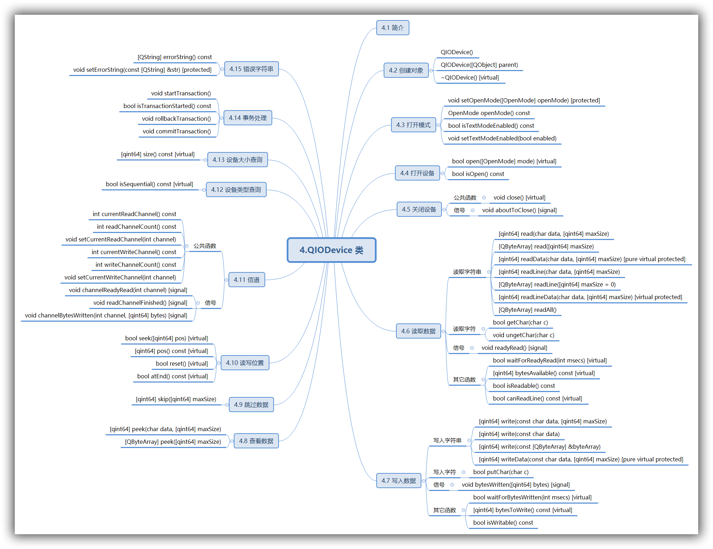

# Qt SerialPort 与 PyQt5 (三)

[TOC]

> 本文用于介绍 QIODevice 类，该类是 QSerialPort 的父类。
> 系统环境：Win10 64位
> 转载请注明出处：[http://www.jianshu.com/u/5e6f798c903a](https://www.jianshu.com/u/5e6f798c903a)

## 4.QIODevice 类

[官方文档](https://doc.qt.io/qt-5/qiodevice.html) 
Header:	#include \<QSerialPort\>
qmake:	QT += core
Inherits:	[QObject](https://doc.qt.io/qt-5/qobject.html)
Inherited By: [QAbstractSocket](https://doc.qt.io/qt-5/qabstractsocket.html), [QBluetoothSocket](https://doc.qt.io/qt-5/qbluetoothsocket.html), [QBuffer](https://doc.qt.io/qt-5/qbuffer.html), [QFileDevice](https://doc.qt.io/qt-5/qfiledevice.html), [QLocalSocket](https://doc.qt.io/qt-5/qlocalsocket.html), [QNetworkReply](https://doc.qt.io/qt-5/qnetworkreply.html), [QProcess](https://doc.qt.io/qt-5/qprocess.html), and [QSerialPort](https://doc.qt.io/qt-5/qserialport.html) 

为了便于理解，这里给出本节内容的思维导图：( 本节后面的内容也遵循此结构 )


### 4.1 简介

[QIODevice](https://doc.qt.io/qt-5/qiodevice.html) 类是 Qt 中所有 I/O 设备的基础接口类。
QIODevice 为支持数据块读写的设备 (如：[QFile](https://doc.qt.io/qt-5/qfile.html), [QBuffer](https://doc.qt.io/qt-5/qbuffer.html) 和 [QTcpSocket](https://doc.qt.io/qt-5/qtcpsocket.html)) 提供了通用实现和抽象接口。
QIODevice 属于抽象类，不能被实例化，但通常会使用由 QIODevice 定义的接口来提供设备共有的 I/O 特性。例如，Qt 的 XML 类运行在 QIODevice 指针上，以允许 XML 类可与各种设备( 如文件和缓存 )一同被使用。

在访问设备之前，必须调用 [open](https://doc.qt.io/qt-5/qiodevice.html#open)() 函数，以设置正确的 [OpenMode](https://doc.qt.io/qt-5/qiodevice.html#OpenModeFlag-enum)  (如 [ReadOnly](https://doc.qt.io/qt-5/qiodevice.html#OpenModeFlag-enum) 或 [ReadWrite](https://doc.qt.io/qt-5/qiodevice.html#OpenModeFlag-enum))。然后，可以调用 [write](https://doc.qt.io/qt-5/qiodevice.html#write)() 或 [putChar](https://doc.qt.io/qt-5/qiodevice.html#putChar)() 进行写入，或调用 [read](https://doc.qt.io/qt-5/qiodevice.html#read)()、[readLine](https://doc.qt.io/qt-5/qiodevice.html#readLine)()、[readAll](https://doc.qt.io/qt-5/qiodevice.html#readAll)() 进行读取。完成操作后，调用 [close](https://doc.qt.io/qt-5/qiodevice.html#close)() 关闭设备。

QIODevice 可识别两种设备类型（可调用 [isSequential](https://doc.qt.io/qt-5/qiodevice.html#isSequential)() 来确定设备的类型）：

1. 随机访问设备( random-access devices )，支持使用 [seek](https://doc.qt.io/qt-5/qiodevice.html#seek)() 来查找任意位置。通过调用 [pos](https://doc.qt.io/qt-5/qiodevice.html#pos)()，可获得在文件中的当前位置。QFile 和 QBuffer 便属于这类设备。
2. 顺序设备( sequential devices )，不支持查找任意位置。数据必须被一次性读取。函数 [pos](https://doc.qt.io/qt-5/qiodevice.html#pos)() and [size](https://doc.qt.io/qt-5/qiodevice.html#size)() 不适用于顺序设备。 [QTcpSocket](https://doc.qt.io/qt-5/qtcpsocket.html) and [QProcess](https://doc.qt.io/qt-5/qprocess.html) 便属于这类设备。

当有可供读取的新数据时，[QIODevice](https://doc.qt.io/qt-5/qiodevice.html) 会发出 readyRead() 信号（比如，网络上有新数据抵达时，或是有新数据被追加到正在读取的文件时）。bytesAvailable() 用于确定当前可供读取的字节数。为异步设备（如 QTcpSocket ）编写程序时，通常会同时使用  bytesAvailable() 和 readyRead() ，因为异步设备的数据片段可能会在任意时间点到达。每当数据载荷被写入设备时，QIODevice 便会发射 [bytesWritten](https://doc.qt.io/qt-5/qiodevice.html#bytesWritten)() 信号。[bytesToWrite](https://doc.qt.io/qt-5/qiodevice.html#bytesToWrite)() 用于确定当前等待写入的数据总量。

QIODevice 的某些子类属于异步子类，比如 [QTcpSocket](https://doc.qt.io/qt-5/qtcpsocket.html) 和 [QProcess](https://doc.qt.io/qt-5/qprocess.html) 。这些子类的 I/O 函数（如 write() 、read() ）总是立即返回，等控制权返回事件循环后，才会和设备本身进行通讯。QIODevice 还提供了相应的函数，以便强制 I/O 操作被立即执行，同时会阻塞调用线程，而不会进入事件循环。以下函数便具有这样的特性，但不要在事件循环中使用它们，或是在另外一个单独的线程中使用。

1. [waitForReadyRead](https://doc.qt.io/qt-5/qiodevice.html#waitForReadyRead)() - 该函数会在调用线程中挂起操作，直到有可供读取的新数据为止。
2. [waitForBytesWritten](https://doc.qt.io/qt-5/qiodevice.html#waitForBytesWritten)() - 该函数在调用线程中挂起操作，直到一个数据载荷被写入到设备为止。
3. waitFor....() - 在 QIODevice 的子类中，针对设备特有的操作实现的阻塞函数。例如，例如， [QProcess](https://doc.qt.io/qt-5/qprocess.html) 有一个叫做 waitForStarted() 的函数，可在调用线程中挂起操作直到进程启动。

在主线程或 GUI 线程中调用以上函数，可能会导致用户界面冻结。例如：

```c++
QProcess gzip;
gzip.start("gzip", QStringList() << "-c");
if (!gzip.waitForStarted())
    return false;

gzip.write("uncompressed data");

QByteArray compressed;
while (gzip.waitForReadyRead())
    compressed += gzip.readAll();
```

通过继承 QIODevice，便可为自有 I/O 设备提供相同的接口。QIODevice 的子类仅需要实现受保护的 [readData](https://doc.qt.io/qt-5/qiodevice.html#readData)() 和 [writeData](https://doc.qt.io/qt-5/qiodevice.html#writeData)() 函数。QIODevice 使用这两个函数来实现相关函数（如， [getChar](https://doc.qt.io/qt-5/qiodevice.html#getChar)()、[readLine](https://doc.qt.io/qt-5/qiodevice.html#readLine)() 和 [write](https://doc.qt.io/qt-5/qiodevice.html#write)()），使操作更加便捷。QIODevice 还会为我们处理访问控制，因此如果调用了 writeDate()，则可以安全地假定设备以写模式打开。

像 [QFile](https://doc.qt.io/qt-5/qfile.html) 和 [QTcpSocket](https://doc.qt.io/qt-5/qtcpsocket.html) 这样的子类，会使用内存缓冲区来实现中间数据的存储。这种方式减少了访问设备( 这里的设备指 file、socket 等 )的次数，但这种方式通常非常慢。使用 [getChar](https://doc.qt.io/qt-5/qiodevice.html#getChar)() 和 [putChar](https://doc.qt.io/qt-5/qiodevice.html#putChar)() 这样的函数访问缓冲区，会更加快捷。因为这些函数在内存缓冲区中运行，而非直接运行在设备中。但是，某些 I/O 操作对缓冲区不起作用，例如：如果多个用户都打开了相同的设备并逐一读取每个字符，那么当用户打算读取各自所需的数据块时，它们最终可能会读取到相同的数据。出于此原因，QIODevice 允许允许向 open() 函数传递 Unbuffered 标志来忽略任何缓冲。在创建 QIODevice 的子类时，当设备在 Unbuffered 模式下被打开后，记得忽略任何缓冲区。

通常情况下，来自异步设备的数据流是片段华的，数据块可能会在任意时间点到达。要处理读取到的不完整的数据结构，可使用由 QIODevice 实现的事务处理机制。详细信息，请参阅 [startTransaction](https://doc.qt.io/qt-5/qiodevice.html#startTransaction)() 及相关函数。

某些顺序设备支持通过多通道通讯。通道代表独立的数据流，拥有相互独立的发送顺序。一旦相应设备被打开，便可通过调用 readChannelCount() 和 writeChannelCount() 函数来确定通道的数量。需要切换通道时，请分别调用 setCurrentReadChannel() 和 setCurrentWriteChannel()。QIODevice 还提供了额外的信号，用于处理基于每个通道的异步通讯。

### 4.2 创建对象

- QIODevice::**QIODevice**() 
  构建一个 QIODevice 对象。


- QIODevice::**QIODevice**([QObject](https://doc.qt.io/qt-5/qobject.html#QObject) **parent*)
  使用给定的父对象构建一个 QIODevice 对象。


- QIODevice::**~QIODevice**() `[virtual]` 
  该析构函数是虚拟的，QIODevice 属于抽象基类。该析构函数不会调用 close()，但是其子类的析构函数可能会调用。如果有疑虑，请在销毁 QIODevice 前调用 close()。

### 4.3 打开模式

enum QIODevice::**OpenModeFlag** 枚举配合 `open()` 函数使用，用于描述设备的打开方式。可用通过 `openMode()` 函数可查看设备的打开模式。

| Constant                | Value                  | Description                              |
| ----------------------- | ---------------------- | ---------------------------------------- |
| `QIODevice::NotOpen`    | `0x0000`               | 设备没有被打开                                  |
| `QIODevice::ReadOnly`   | `0x0001`               | 以读模式被打开                                  |
| `QIODevice::WriteOnly`  | `0x0002`               | 以写模式被打开，该模式意味着截断                         |
| `QIODevice::ReadWrite`  | `ReadOnly | WriteOnly` | 以读/写模式打开                                 |
| `QIODevice::Append`     | `0x0004`               | 以追加模式打开设备，所有数据会被追加到文件的末尾。                |
| `QIODevice::Truncate`   | `0x0008`               | 如果可能的话，设备会在被打开之前截断。 调用 open() 函数之前的内容，都会丢失。 |
| `QIODevice::Text`       | `0x0010`               | 在读取时，行终止符被转换为 `\n` 。在写入时，行终止符被转换为平台相关的本地编码。比如 Win32 对应 `\r\n` 。 |
| `QIODevice::Unbuffered` | `0x0020`               | 设备中的任何缓冲区都将被忽略。                          |

因为子类表示的设备类型会隐含某些限制条件。所以某些标志 ( 如 `Unbuffered` 和 `Truncate` ) 配合某些子类使用时，可能没有实际意义。有些情况下，实现方式也会导致一些限制，另外底层平台也会施加一些限制。例如，[QTcpSocket](https://doc.qt.io/qt-5/qtcpsocket.html) 不支持 `Unbuffered` 模式；另外在 Windows 中由于本地 API 的限制，使得 QFile 不支持 Unbuffered模式。

flags QIODevice::OpenMode 是由 [QFlags](https://doc.qt.io/qt-5/qflags.html)\<PinoutSignal\> 定义的类型。该类型可使用 OR 运算对 OpenMode 中的值进行组合。

- void QIODevice::**setOpenMode**([OpenMode](https://doc.qt.io/qt-5/qiodevice.html#OpenModeFlag-enum) *openMode*) `[protected]`
  将设备的打开方式设置为 *openMode* 。
  如果需要在设备被打开后改变其打开方式，可调用该函数进行设置。
- OpenMode QIODevice::**openMode**() const
  返回已打开的设备的打开方式，比如：ReadOnly 或 WriteOnly。

- bool QIODevice::**isTextModeEnabled**() const
  如果打开模式中开启了 Text 标记，便会返回 `true` ；否则返回 `false` 。
- void QIODevice::**setTextModeEnabled**(bool *enabled*)
  假如 *enabled* 的值为 `true` ，则会在设备的打开模式中添加 Text 标记；如果 *enable* 的值为 `false` ，则会从打开模式中移除 Text 标记。该特性对于在 QIODevice 上提供具备自定义行尾处理功能的类非常有用。
  调用此函数前，应确保 IO 设备已被打开。

### 4.4 打开设备

- bool QIODevice::**open**([OpenMode](https://doc.qt.io/qt-5/qiodevice.html#OpenModeFlag-enum) *mode*) `[virtual]`
  打开设备，并将设备的打开方式设置为 *mode* 。如果设置成功，返回 `true` ；否则返回 `false` 。该函数应该在任何 open() 函数的重实现中被调用，或任何其它用于打开的设备的函数中被调用。


- bool QIODevice::**isOpen**() const
  如果设备已被打开，返回 `true` ，否则返回 `false` 。
  如果某设备可被读取和(或)写入，则该设备已被打开。默认情况下，如果 `openMode()` 返回 `NotOpen` ，则该函数返回 `false` 。


### 4.5 关闭设备

#### 公共函数

- void QIODevice::**close**() `[virtual]`
  调用该函数后，首先会发射 `aboutToClose()` 信号，然后关闭设备并将 [OpenMode](https://doc.qt.io/qt-5/qiodevice.html#OpenModeFlag-enum) 设置为 [NotOpen](https://doc.qt.io/qt-5/qiodevice.html#OpenModeFlag-enum)。错误字符串也会被重置。


#### 信号

- void QIODevice::**aboutToClose**() `[signal]` 
  当设备即将关闭时，便会发送此信号。如果在关闭设备之前需要执行某些操作，可将其连接到此信号。比如，在一个独立的缓冲区中，如果存在需要被写入到设备中的数据，便可利用该信号。以确保在设备关闭前，将这部分数据被写入到设备中。

### 4.6 读取数据

#### 读取字符串

- [qint64](https://doc.qt.io/qt-5/qtglobal.html#qint64-typedef) QIODevice::**read**(char **data*, [qint64](https://doc.qt.io/qt-5/qtglobal.html#qint64-typedef) *maxSize*)
  从设备中最多读取 *maxSize* 字节的数据到 *data* 中，并返回读取到的字节数。如果发生错误（比如尝试从 WriteOnly 模式的设备中读取数据），会返回 `-1` 。
  当没有更多的数据可供读取时，返回 `0` 。
  在数据流终止之后进行读取，同样会报错，即返回 `-1` 。比如读取已关闭的套接字，或读取已死掉的进程。


- [QByteArray](https://doc.qt.io/qt-5/qbytearray.html) QIODevice::**read**([qint64](https://doc.qt.io/qt-5/qtglobal.html#qint64-typedef) *maxSize*)
  这是一个重载函数。
  该函数会从设备读取最多 *maxSize* 字节的数据，并以 [QByteArray](https://doc.qt.io/qt-5/qbytearray.html) 类型返回。
  该函数不能报告错误，如果返回空 [QByteArray](https://doc.qt.io/qt-5/qbytearray.html) 数组，可能意味着当前没有可供读取的数据，也可能意味着发生了错误。

- [qint64](https://doc.qt.io/qt-5/qtglobal.html#qint64-typedef) QIODevice::**readData**(char **data*, [qint64](https://doc.qt.io/qt-5/qtglobal.html#qint64-typedef)*maxSize*) `[pure virtual protected]` 
  最多从设备中读取 *maxSize* 字节的数据到 *data* 中，并返回读取到的字节数。如果发生错误，则返回 `-1` 。
  如果没有读取到任何字节，并且以后也不会有更多可用字节时，该函数会返回 `-1` （比如套接字已关闭、管道已关闭、子进程已结束）。
  该函数由 QIODevice 调用。创建 QIODevice 的子类时，需要重实现该函数。
  重实现该函数时，最重要的是在函数返回前读取所有需要的数据。为了让 QDataStream 能够在类上运行，这是必需的。QDataStream 会假定所有请求的信息都已被读取，因此如果出现问题，也不会重新尝试读取数据。
  该函数可被调用（需要将参数 *maxSize* 设置为 0），用于执行 post-reading 操作。

- [qint64](https://doc.qt.io/qt-5/qtglobal.html#qint64-typedef) QIODevice::**readLine**(char **data*, [qint64](https://doc.qt.io/qt-5/qtglobal.html#qint64-typedef) *maxSize*)
  该函数会从设备中读取一行 ASCII 字符（最多会读取 *maxSize* -1 个字节），读取到的字符被储存在 *data* 中，返回值表示读取到的字节数。如果某行无法被读取，但也没有发生错误，该函数会返回 `0` 。如果发生错误，该函数会返回可供读取长度，如果此时没有可供读取的数据，则返回 `-1` 。
  Tips：该函数始终会在 *data* 的末尾添加终止符 `\0` ，因此 *maxSize*  必须大于 1。
  满足下列条件之一，便会停止读取数据：

  - 读取到 `\n` 字符；
  - 已读取到 *maxSize* - 1 个字节；
  - 检测到设备数据的结束。

  示例，以下代码会从文件中读取一行字符：

  ```
  QFile file("box.txt");
  if (file.open(QFile::ReadOnly)) {
      char buf[1024];
      qint64 lineLength = file.readLine(buf, sizeof(buf));
      if (lineLength != -1) {
          // the line is available in buf
      }
  }
  ```

  换行符 `\n` 同样会包含在缓冲器中，如果在前 *maxSize* - 1 个被读取到的字节中未包含换行符，则不会在缓冲器中插入换行符。在 Windows 中换行符会被替换为 `\n` 。
  该函数会调用 `readLineData()` ， `readLineData()` 通过重复调用 `getChar()` 实现。在自己的子类中可以重实现 `readLineData()` 函数，以为 `readLine()` 提供更高效的实现。

- [QByteArray](https://doc.qt.io/qt-5/qbytearray.html) QIODevice::**readLine**([qint64](https://doc.qt.io/qt-5/qtglobal.html#qint64-typedef) *maxSize* = 0)
  此函数为重载函数。
  该函数会从设备读取一行数据，但是数据的长度不超过 *maxSize* 个字符，返回值是 QByteArray 类型。
  该函数不能报告错误，如果返回空 [QByteArray](https://doc.qt.io/qt-5/qbytearray.html) 数组，可能意味着当前没有可供读取的数据，也可能意味着发生了错误。

- [qint64](https://doc.qt.io/qt-5/qtglobal.html#qint64-typedef) QIODevice::**readLineData**(char **data*, [qint64](https://doc.qt.io/qt-5/qtglobal.html#qint64-typedef)*maxSize*) `[virtual protected]`
  最多从设备中读取 *maxSize* 字节的数据到 *data* 中，并返回读取到的字节数。
  该函数由 `readLine()` 调用，并使用 `getChar()` 提供它的基本实现。带有缓冲区的设备可以通过重实现该函数来提高 `readLine()` 的性能。
  `readLine()` 会向 *data* 追加 `\0` 字符，但是 `readLineData()` 不需要这样做。
  如果需要重实现该函数，一定要注意是否返回了正确的值：该函数应返回在一行中读取到的字节数（包含末尾处的换行符）；如果此处没有可供读取的行，则返回 `0` 。如果发生错误，当且仅当没有字节被读取时，应该返回 `-1` 。在 EOF（文件结束符）后进行读取被认为错误的。

- [QByteArray](https://doc.qt.io/qt-5/qbytearray.html) QIODevice::**readAll**()
  从设备中读取所有剩余数据，并以 [QByteArray](https://doc.qt.io/qt-5/qbytearray.html) 类型返回。
  该函数不能报告错误，如果返回空 [QByteArray](https://doc.qt.io/qt-5/qbytearray.html) 数组，可能意味着当前没有可供读取的数据，也可能意味着发生了错误。


#### 读取字符

- bool QIODevice::**getChar**(char **c*)
  从设备中读取一个字符，并将其储存在 *c*  中。如果 *c* 是 0，该字符会被丢弃。
  成功读取，返回 `true` ；否则返回 `false` 。

- void QIODevice::**ungetChar**(char *c*)
  将字符 *c* 放回到设备中。字符 *c* 会被放置在缓冲区的首位，其它内容的位置依次后移一位,示例如下：

  ```
  port = QSerialPort('COM1')
  port.open(QIODevice.ReadWrite)

  print(port.readBufferSize())
  port.setReadBufferSize(2)
  print(port.readBufferSize())

  port.ungetChar(b'1')
  port.ungetChar(b'2')
  port.ungetChar(b'3')
  print(port.readAll())

  port.close()
  ```

  输出：

  ```
  0
  2
  b'321'
  ```

  该函数常被用于撤销 [getChar](https://doc.qt.io/qt-5/qiodevice.html#getChar)() 操作。比如编写回溯分析程序时，便可使用该函数。
  如果之前并没有从设备读取 *c* ，则无法确定具体行为。
  Note: This function is not available while a transaction is in progress.

#### 信号

- void QIODevice::**readyRead**() `[signal]`
  在设备当前的读取通道中，每当有可供读取的新数据时，该信号便会被发送一次。一旦有新数据可用，该信号便会被再次发送，比如当新的网络数据载荷已经到达网络套接字时，便会发送该信号。另外当新的数据块被追加到设备时，也会发送此信号。
  `readyRead()` 不会被递归发射，如果在连接到 `readyRead()` 的曹函数中重新进入事件循环，或在曹函数中调用 `waitForReadyRead()` ，那么 `readyRead()` 信号将不会重复发送（ 虽然 `waitForReadyRead()` 仍然可能返回 `true` ）。
  开发人员由 QIODevice 实现派生类时，应注意：每当有新数据到达时，总应该发送 `readyRead()` 信号（不要仅因为在缓冲区中任然有数据被读取，就发送该信号）。在其它情况下情不要发送 `readyRead()` 信号。

#### 其它函数

- bool QIODevice::**waitForReadyRead**(int *msecs*) `[virtual]`
  该函数会阻塞调用，直到有可供读取的新数据为止（同时会发送 [readyRead()](https://doc.qt.io/qt-5/qiodevice.html#readyRead) 信号）。该函数会在 *msecs* 毫秒后发生超时。如果 *msecs* 被设置为 -1，则不会发生超时。
  如果存在可供读取的新数据，则返回 `true` ；如果发生错误或操作超时，则返回 `false` 。
  执行该函数时，无需事件循环。在编写非 GUI 程序，以及在非 GUI 线程中执行 I/O 操作时，该函数会非常实用。
  如果在连接到 `readRead()` 信号的曹函数中调用 `waitForReadyRead()` ，那么 `readyRead()` 信号不会被重复发送。
  为自定义设备重实现该函数以提供非阻塞 API 时，默认的实现方式是什么也不做，并且返回 `false` 。
  <u>Warning：</u>从主(GUI)线程调用该函数，可能会导致用户界面冻结。

- [qint64](https://doc.qt.io/qt-5/qtglobal.html#qint64-typedef) QIODevice::**bytesAvailable**() const `[virtual]`
  返回可供读取的字节数。该函数通常配合顺序设备使用，以便在读取之前确定被分配到缓冲区中的字符数。
  重实现此函数的子类必须调用基本实现，以包含 QIODevice 的缓冲区的尺寸。例如：

  ```
  qint64 CustomDevice::bytesAvailable() const
  {
      return buffer.size() + QIODevice::bytesAvailable();
  }
  ```


- bool QIODevice::**isReadable**() const
  如果可以从设备读取数据返回 `true` ，否则返回 `false` 。使用 `byteAvailable()` 可以确定可被读取的字节数。
  该函数可以很方便的查询设备的打开模式中是否包含 `ReadOnly` 标识。

- bool QIODevice::**canReadLine**() const `[virtual]` 
  如果可以从设备读取一行完整的数据，会返回 `true` 。否则返回 `false` 。
  注意：无缓冲区的设备，由于无法确定可供读取的内容，因此总是返回 `false` 。
  该函数经常同 [readyRead](https://doc.qt.io/qt-5/qiodevice.html#readyRead)() 信号一起被调用。
  重新实现此函数的子类必须调用基本实现，以包含 QIODevice 的缓冲区的内容。例如：

  ```
  bool CustomDevice::canReadLine() const
  {
      return buffer.contains('\n') || QIODevice::canReadLine();
  }
  ```


### 4.7 写入数据

#### 写入字符串

- [qint64](https://doc.qt.io/qt-5/qtglobal.html#qint64-typedef) QIODevice::**write**(const char **data*, [qint64](https://doc.qt.io/qt-5/qtglobal.html#qint64-typedef) *maxSize*)
  从 *data*  中写入最多 *maxSize* 字节的数据到设备中。
  返回实际被写入的字节数；如果发生错误，则返回 -1。


- [qint64](https://doc.qt.io/qt-5/qtglobal.html#qint64-typedef) QIODevice::**write**(const char **data*)
  此函数是重载函数。
  将由 8-bit 字符组成的字符串（以 0 结尾），写入到设备。
  返回实际被写入的字节数；如果发生错误，则返回 -1。
  该函数相当于：

  ```
  ...
  QIODevice::write(data, qstrlen(data));
  ...
  ```

  该函数在 Qt 4.5 被引入。


- [qint64](https://doc.qt.io/qt-5/qtglobal.html#qint64-typedef) QIODevice::**write**(const [QByteArray](https://doc.qt.io/qt-5/qbytearray.html) &*byteArray*)
  此函数是重载函数。
  将 *byteArray* 中的内容写入到设备。
  返回实际被写入的字节数；如果发生错误，则返回 -1。

- [qint64](https://doc.qt.io/qt-5/qtglobal.html#qint64-typedef) QIODevice::**writeData**(const char **data*, [qint64](https://doc.qt.io/qt-5/qtglobal.html#qint64-typedef) *maxSize*) `[pure virtual protected]`
  从 *data*  中写入最多 *maxSize* 字节的数据到设备中。
  返回被写入的字节数；如果发生错误，则返回 -1。
  该函数由 QIODevice 调用。创建 QIODevice 的子类时，需要重实现该函数。
  重实现该函数时，最中要的是在函数返回前写入所有可用的数据。为了让 QDataStream 能够在类上运行，这是必需的。QDataStream 会假定所有的信息都已被写入，因此如果出现问题，也不会尝试重新写入数据。

#### 写入字符

- bool QIODevice::**putChar**(char *c*)
  将字符 *c* 写入到设备。返回 `true` 表示写入成功；否则返回 `false` 。

#### 信号

- void QIODevice::**bytesWritten**([qint64](https://doc.qt.io/qt-5/qtglobal.html#qint64-typedef) *bytes*) `[signal]`
  每当数据的有效载荷被写入设备的当前写入通道时，就会发出此信号。*bytes* 参数被设置为在有效载荷中被写入的字节数。
  bytesWritten() 不会递归发射; 如果重新进入事件循环，或在连接到 bytesWritten() 信号的插槽内调用 [waitForBytesWritten](https://doc.qt.io/qt-5/qiodevice.html#waitForBytesWritten)()，信号将不会被重新发送（虽然 [waitForBytesWritten](https://doc.qt.io/qt-5/qiodevice.html#waitForBytesWritten)() 仍然可以返回true）。

#### 其它函数

- bool QIODevice::**waitForBytesWritten**(int *msecs*) `[virtual]` 
  对于拥有缓冲区的设备，该函数会一直等待，直到缓冲区写入数据的有效载荷被写入设备（同时会发送 [bytesWritten](https://doc.qt.io/qt-5/qiodevice.html#bytesWritten)() 信号），或是等待 *msecs* 毫秒后发生超时。如果 *msecs* 被设置为 -1，则不会发生超时。
  对于没有缓冲区的设备，该函数会立即返回。
  如果数据的有效载荷已经被写入设备，则返回 `true` ；如果发生错误或操作超时，则返回 `false` 。
  执行该函数时，无需事件循环。在编写非 GUI 程序，以及在非 GUI 线程中执行 I/O 操作时，该函数会非常实用。
  如果在连接到 `bytesWritten()` 信号的曹函数中调用 `waitForBytesWritten()` ，那么 `bytesWritten()` 信号不会被重复发送。
  为自定义设备重实现该函数以提供非阻塞 API 时，默认的实现方式是什么也不做，并且返回 `false` 。
  <u>Warning：</u>从主(GUI)线程调用该函数，可能会导致用户界面冻结。


- [qint64](https://doc.qt.io/qt-5/qtglobal.html#qint64-typedef) QIODevice::**bytesToWrite**() const `[virtual]`
  对于拥有缓冲区的设备，该函数会返回等待写入的字符数。
  对于没有缓冲区的设备，该函数返回 0。
  重实现此函数的子类必须调用基本实现，以包含 QIODevice 的缓冲区的尺寸。
- bool QIODevice::**isWritable**() const
  如果可以向设备写入数据，则返回 `true` ；否则返回 `false` 。
  该函数可以很方便的查询设备的打开模式中是否包含 `WriteOnly` 标识。


### 4.8 查看数据

- [qint64](https://doc.qt.io/qt-5/qtglobal.html#qint64-typedef) QIODevice::**peek**(char **data*, [qint64](https://doc.qt.io/qt-5/qtglobal.html#qint64-typedef) *maxSize*)
  从设备中最多读取 *maxSize* 字节的数据到 *data* 中，并返回读取到的字节数。该函数不会有任何副作用，也就是所在 `peek()` 之后调用 `read()` ，将会获得相同的数据。
  如果发生错误（比如尝试从 WriteOnly 模式的设备中查看数据），会返回 `-1` 。
  当没有更多的数据可供读取时，返回 `0` 。

  示例：

  ```
  {
      char buf[2];
      if (file->peek(buf, sizeof(buf)) == sizeof(buf))
          return (buf[0] == 'M' && buf[1] == 'Z');
      return false;
  }
  ```

  该函数在 Qt 4.1 被引入。

- [QByteArray](https://doc.qt.io/qt-5/qbytearray.html) QIODevice::**peek**([qint64](https://doc.qt.io/qt-5/qtglobal.html#qint64-typedef) *maxSize*)
  这是一个重载函数。
  该函数会从设备查看最多 *maxSize* 字节的数据，并以 [QByteArray](https://doc.qt.io/qt-5/qbytearray.html) 类型返回。
  示例：

  ```
  bool isExeFile(QFile *file)
  {
      return file->peek(2) == "MZ";
  }
  ```

  该函数不能报告错误，如果返回空 [QByteArray](https://doc.qt.io/qt-5/qbytearray.html) 数组，可能意味着当前没有可供查看的数据，也可能意味着发生了错误。
  该函数在 Qt 4.1 被引入。

### 4.9 跳过数据

- [qint64](https://doc.qt.io/qt-5/qtglobal.html#qint64-typedef) QIODevice::**skip**([qint64](https://doc.qt.io/qt-5/qtglobal.html#qint64-typedef) *maxSize*)
  从设备中跳过最多 *maxSize* 字节。该函数会返回实际跳过的字节数；发生错误时，返回 `-1` 。该函数不会等待，只会直接丢弃已经存在的可供读取的数据。如果设备以 text 模式被打开，则行结束符会被翻译为 `\n` ，并在计数时被视作一个字节（这点同 `read()` 和 `peek()` 的行为相同）。此函数适用与所有设备，包含不能使用 `seek()` 的顺序设备。在 `peek()` 之后调用该函数，可以很方便的跳过不想要的数据。对于随机访问设备，`skip()` 被用于从当前位置向前查找。*maxSize* 不可使用负值。
  该函数在 Qt 5.11 被引入。


### 4.10 读写位置

- bool QIODevice::**seek**([qint64](https://doc.qt.io/qt-5/qtglobal.html#qint64-typedef) *pos*) `[virtual]`
  对于随机访问设备，该函数会将当前位置设置为 *pos* 。如果设置成功，则返回 `true` ；如果发生错误，则返回 `false` 。对于顺序设备，默认行为是产生警告并返回 `false` 。
  子类化 QIODevice 时，必须在函数的开头调用 `QIODevice::seek()` ，以确保 QIODevice 内建缓冲区的完整性。
- [qint64](https://doc.qt.io/qt-5/qtglobal.html#qint64-typedef) QIODevice::**pos**() const `[virtual]`
  对于随机访问设备，该函数会返回写入或读取数据的位置。对于顺序设备或已关闭的设备而言，它们并没有“当前位置”的概念，因此会返回 `0` 。
  设备当前的读/写位置由内部的 QIODevice 维护，因此该函数并非必须被重实现。在继承 `QIODevice` 时，需要使用 `QIODevice::seek()` 来通知 QIODevice 设备位置的变化。
- bool QIODevice::**reset**() `[virtual]`
  查找随机访问设备输入的起始位置。如果成功，返回 `true` ；否则返回 `false` （比如并未打开设备）
  注意，在 [QFile](https://doc.qt.io/qt-5/qfile.html) 中使用 [QTextStream](https://doc.qt.io/qt-5/qtextstream.html) 时，由于 [QTextStream](https://doc.qt.io/qt-5/qtextstream.html) 会缓存文件，所以在 [QFile](https://doc.qt.io/qt-5/qfile.html) 上调用 `reset()` 将不会产生预期的结果，此时需要改用 [QTextStream::seek](https://doc.qt.io/qt-5/qtextstream.html#seek)()  函数。
- bool QIODevice::**atEnd**() const `[virtual]`
  如果当前读写位置处于设备的末端（即设备中没有更多可供读取的数据），将返回 `true` ；否则返回 `false` 。
  对于某些设备，即使仍有可被读取的数据，但是 `atEnd()` 也会返回 `true` 。这种特殊的情况仅适用于，间接响应 `read()` 调用来生成数据的设备（比如，在 Unix 和 MacOS 中的  `/dev` or `/proc` 文件，或是所有平台上的  console input 和 `stdin` ）。

### 4.11 信道

#### 公共函数

- int QIODevice::**currentReadChannel**() const
  返回当前读信道的索引值。
  该函数在 Qt 5.7 被引入。
- int QIODevice::**readChannelCount**() const
  如果设备处于打开状态，则返回可用于读取的信道的数量；否则返回 0。
  该函数在 Qt 5.7 被引入。
- void QIODevice::**setCurrentReadChannel**(int *channel*)
  将 QIODevice 当前的读取通道设置为给定通道 *channel* 。当前输入通道会被  [read](https://doc.qt.io/qt-5/qiodevice.html#read)(), [readAll](https://doc.qt.io/qt-5/qiodevice.html#readAll)(), [readLine](https://doc.qt.io/qt-5/qiodevice.html#readLine)(), [getChar](https://doc.qt.io/qt-5/qiodevice.html#getChar)() 函数使用。还用于确定触发  [QIODevice](https://doc.qt.io/qt-5/qiodevice.html) 发送 `readyRead()` 信号的通道。
  该函数在 Qt 5.7 被引入。


- int QIODevice::**currentWriteChannel**() const
  返回当前写信道的索引值。
  该函数在 Qt 5.7 被引入。
- int QIODevice::**writeChannelCount**() const
  如果设备处于打开状态，则返回可用于写入的信道的数量；否则返回 0。
  该函数在 Qt 5.7 被引入。
- void QIODevice::**setCurrentWriteChannel**(int *channel*)
  将 QIODevice 当前的写入通道设置为给定通道 *channel* 。当前输出通道会被   [write](https://doc.qt.io/qt-5/qiodevice.html#write)(), [putChar](https://doc.qt.io/qt-5/qiodevice.html#putChar)() 函数使用。还用于确定了触发  [QIODevice](https://doc.qt.io/qt-5/qiodevice.html) 发送  [bytesWritten](https://doc.qt.io/qt-5/qiodevice.html#bytesWritten)() 信号的通道。
  该函数在 Qt 5.7 被引入。

#### 信号

- void QIODevice::**channelReadyRead**(int *channel*) `[signal]`
  当有来自设备的可供读取的新数据时，便会发送此信号。 会将收到新数据的读信道的索引值设置为 *channel* 的值。与 `readyRead()` 不同，无论当前处于哪一个读信道，该信号总会被发送。
  `channelReadyRead()` 可以被递归发送，即使处于同一的信道中。
  该函数在 Qt 5.7 被引入。
- void QIODevice::**readChannelFinished**() `[signal]`
  当设备中的输入（读取）流被关闭时，就会发送此信号。一旦检测到流被关闭，便会发送此信号，这意味着可能仍然存在可供读取 `read()` 的数据。
  该函数在 Qt 4.4 被引入。
- void QIODevice::**channelBytesWritten**(int *channel*, [qint64](https://doc.qt.io/qt-5/qtglobal.html#qint64-typedef) *bytes*) `[signal]`
  每当数据有效载荷被写入设备时，便会发送该信号。有效载荷中被写入的字节数会被设置为 *bytes* 的值；用于写入数的信道的索引值会被设置为 *channel* 的值。与 `bytesWritten()` 不同，无论当前处理哪一个写信道，该信号总会被发送。
  `channelBytesWritten() ` 可以被递归发送，即使处于同一信道中。
  该函数在 Qt 5.7 被引入。


### 4.12 设备类型查询

- bool QIODevice::**isSequential**() const `[virtual]`
  如果该设备是顺序设备，则返回 `true` ；否则返回 `false` 。
  与随机访问设备相反，顺序设备不具备如下概念：开始、结束、大小、当前位置，也不支持查找位置（seek）。当设备报告有可用数据时，我们也只能从设备读取数据。最常见的顺序设备时网络套接字。在 Unix 上，特殊文件也是顺序设备（如 /dev/zero 和 fifo pipes ）。
  另一方面，Regular files 支持随机访问。它们具备尺寸大小和当前位置的概念，同时还支持在数据流中向后和向前查找位置（seek）。Regular files 是非顺序设备。

### 4.13 设备大小查询

- [qint64](https://doc.qt.io/qt-5/qtglobal.html#qint64-typedef) QIODevice::**size**() const `[virtual]`
  对于已打开的随机访问设备，该函数会返回设备的 size。
  对于已打开的顺序设备，该函数会返回 [bytesAvailable](https://doc.qt.io/qt-5/qiodevice.html#bytesAvailable)()。
  如果设备已被关闭，返回值并不能反映出设备的实际 size。

### 4.14 事务处理

- void QIODevice::**startTransaction**()
  在设备上启动新的读取事务。
  在读操作序列的内部定义一个可还原点。对于顺序设备，读取的数据将在内部被复制，以便在没有完全读取的情况下进行恢复。对于随机访问设备，该函数会保存当前位置。调用 [commitTransaction](https://doc.qt.io/qt-5/qiodevice.html#commitTransaction)() 或 [rollbackTransaction](https://doc.qt.io/qt-5/qiodevice.html#rollbackTransaction)() 可结束事务。
  注意：不支持嵌套事务。
  该函数在 Qt 5.7 被引入。
- bool QIODevice::**isTransactionStarted**() const
  如果设备的进程中存在已启动的事务，则返回 `true` ，否则返回 `false` 。
  该函数在 Qt 5.7 被引入。
- void QIODevice::**rollbackTransaction**()
  回滚读取事务。
  将输入流恢复到 [startTransaction](https://doc.qt.io/qt-5/qiodevice.html#startTransaction)() 创建的还原点处。在提交事务之前，如果检测到被读取的数据并不完整，通常会使用该函数回滚事务。
  该函数在 Qt 5.7 被引入。
- void QIODevice::**commitTransaction**()
  完成读取事务。
  对于序列设备，在事务期间被记录在内部缓冲区中的所有数据都将被丢弃。
  该函数在 Qt 5.7 被引入。

### 4.15 错误字符串

- [QString](https://doc.qt.io/qt-5/qstring.html) QIODevice::**errorString**() const
  以易于人类阅读的方式，返回对最近发生的设备错误的描述。
- void QIODevice::**setErrorString**(const [QString](https://doc.qt.io/qt-5/qstring.html) &*str*) `[protected]`
  将 *str* 设置为最近发生的设备错误描述，*str* 包含的内容要易于人类阅读。