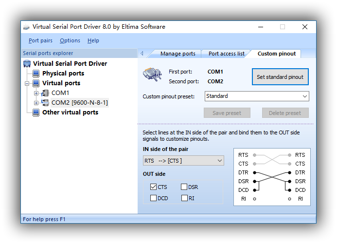
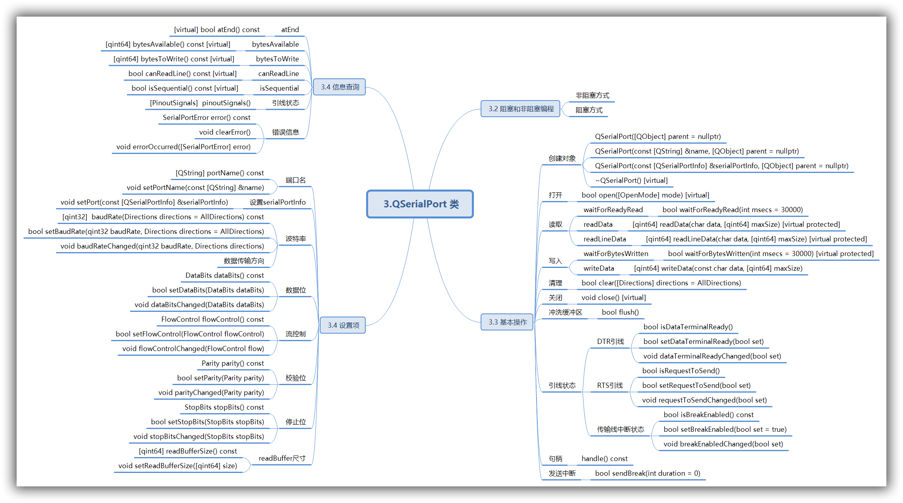

# Qt SerialPort 与 PyQt5 (二)

[TOC]

> 本文会先介绍 Qt 自带的串口模块，然后引出在 PyQt5 中使用这些模块的方法。
> 为了演示类和函数的具体使用方法，这里使用虚拟串口软件添加 “COM1” 和 “COM2”，并将两者互联。我会在 PyQt5 中使用 “COM1” ，并用串口调试软件连接 “COM2”。如下图：
> 系统环境：Win10 64位
> 转载请注明出处：[http://www.jianshu.com/u/5e6f798c903a](https://www.jianshu.com/u/5e6f798c903a)

## 3.QSerialPort 类

> [官方文档](https://doc.qt.io/qt-5/qserialport.html)
> Header:	#include \<QSerialPort\>
> qmake:	QT += serialport
> Since:	Qt 5.1
> Inherits:	QIODevice

### 3.1 简介

QSerialPort 被用于访问串行端口。该类继承自 QIODevice，本文不包含继承自 QIODevice 的函数（如 `read()` 、`write()` 等），这些函数会在第 (三) 节中中介绍。
前 (一) 节曾介绍过的 `QSerialPortInfo` 类，可用于获取各种串口信息，或用于列举出系统中所有可用的串口设备。当我们需要确定目标串口的名称时， `QSerialPortInfo` 便可帮助我们获得正确的串口名称。另外，将 `QSerialPortInfo` 实例作为参数传递给 [setPort](https://doc.qt.io/qt-5/qserialport.html#setPort)() 或 [setPortName](https://doc.qt.io/qt-5/qserialport.html#setPortName)() 时，便可为 `QSerialPort` 实例分配相应的串口设备。

当我们成功为 `QSerialPort` 实例设置相应端口后，便可使用 [open](https://doc.qt.io/qt-5/qserialport.html#open)() 方法以 read-only (r/o)、write-only (w/o)、read-write (r/w) 三种模式打开目标端口。
**注意: ** 串行端口总是以独占访问的方式被打开，也就是说其它进程或线程不能访问已经被打开的串行端口。

[close](https://doc.qt.io/qt-5/qserialport.html#close)() 方法用于关闭端口并取消 I/O 操作。

在成功打开串行端口后，[QSerialPort](https://doc.qt.io/qt-5/qserialport.html) 便会尝试确立当前端口的配置并完成自身的初始化。我们可以使用 [setBaudRate](https://doc.qt.io/qt-5/qserialport.html#baudRate-prop)(), [setDataBits](https://doc.qt.io/qt-5/qserialport.html#dataBits-prop)(), [setParity](https://doc.qt.io/qt-5/qserialport.html#parity-prop)(), [setStopBits](https://doc.qt.io/qt-5/qserialport.html#stopBits-prop)(),  [setFlowControl](https://doc.qt.io/qt-5/qserialport.html#flowControl-prop)() 方法，对端口进行重新配置，以将其设定为我们需要的状态。

[QSerialPort::dataTerminalReady](https://doc.qt.io/qt-5/qserialport.html#dataTerminalReady-prop) 和 [QSerialPort::requestToSend](https://doc.qt.io/qt-5/qserialport.html#requestToSend-prop) 这对属性被用于串口引脚信号。使用 [pinoutSignals](https://doc.qt.io/qt-5/qserialport.html#pinoutSignals)() 方法可以查询当前引脚信号设置。

一旦我们知道端口已准备好被读取或被写入时，便可对其使用 [read](https://doc.qt.io/qt-5/qiodevice.html#read)() 或 [write](https://doc.qt.io/qt-5/qiodevice.html#write)() 方法。另外，也可以调用 [readLine](https://doc.qt.io/qt-5/qiodevice.html#readLine)() 和 [readAll](https://doc.qt.io/qt-5/qiodevice.html#readAll)() 这种较便利的方法。如果并非一次性读取所有数据，那么剩余的数据会作为新进数据被附加到 [QSerialPort](https://doc.qt.io/qt-5/qserialport.html) 的内部读缓冲区，以便稍后使用。可以使用 [setReadBufferSize](https://doc.qt.io/qt-5/qserialport.html#setReadBufferSize)() 限制读缓冲区的大小。

[QSerialPort](https://doc.qt.io/qt-5/qserialport.html) 类也可以同 [QTextStream](https://doc.qt.io/qt-5/qtextstream.html) 和 [QDataStream](https://doc.qt.io/qt-5/qdatastream.html) 的流运算符( `<<()` 和 `>>()` )一起使用。需要注意的是，在尝试通过重载操作符 `>>()` 读取之前，需要确保有足够的可用数据。

为了便于理解，这里对 [QSerialPort](https://doc.qt.io/qt-5/qserialport.html) 类中的函数成员做如下分类：( 本节后面的内容也遵循此结构 )



### 3.2 阻塞和非阻塞编程

#### 非阻塞方式

 异步非阻塞方式 asynchronous (non-blocking) ：当控制器返回 Qt 事件循环时，操作会被列入计划并执行。执行完相应操作后 QSerialPort 类会发出一个信号。比如，`write()` 方法会立即返回。当数据被发送到串行端口后，QSerialPort 类会发送 `bytesWritten()` 信号。

#### 阻塞方式

同步阻塞方式 synchronous (blocking)：在 headless 和多线程应用程序中，可以调用 `wait` 方法( 比如 `waitForReadyRead()` ) 挂起正在调用线程，直到操作完成。

QSerialPort 提供了一系列可用于挂起调用线程直到发出特定信号的函数。这些函数被用于实现阻塞式串行端口编程：

1. `waitForReadyRead()` 阻塞调用，直到有新的可供读取的数据。
2. `waitForBytesWritten()` 阻塞调用，直到数据的一个有效载荷被写入到串口为止。

阻塞式串行端口编程与非阻塞式串行端口编程有着巨大的差异。阻塞式串行端口编程不需要事件循环，这通常会使代码更加简单。阻塞串行端口只能在非 GUI 线程中使用，以避免冻结用户界面。

C++ 示例：

```c++
int numRead = 0, numReadTotal = 0;
char buffer[50];

for (;;) {
    numRead  = serial.read(buffer, 50); //numRead读取的字节数

    // 在这里可以对buffer数组做任何事情

    numReadTotal += numRead;
    if (numRead == 0 && !serial.waitForReadyRead())
        //没有从串口读取到数据，且读取超时退出for循环
		//如果 waitForReadyRead() 返回 false ，则表示连接已关闭或发生错误。
        break;
}
```

如果 [waitForReadyRead()](https://doc.qt.io/qt-5/qiodevice.html#waitForReadyRead) 返回 false ，则表示连接已关闭或发生错误。在任何时间点发生错误时，[QSerialPort](https://doc.qt.io/qt-5/qserialport.html) 都会发出 [errorOccurred](https://doc.qt.io/qt-5/qserialport.html#errorOccurred)() 信号。我们可以调用 [error](https://doc.qt.io/qt-5/qserialport.html#error-prop)() 来查看最后发生的错误类型。

有关这些方法的更多详细信息，请参阅示 [示例](https://doc.qt.io/qt-5/qtserialport-examples.html) 。  

### 3.3 基本操作

#### 创建对象

- QSerialPort::QSerialPort([QObject](https://doc.qt.io/qt-5/qobject.html#QObject) **parent* = nullptr)
  用给定的父对象构造一个新的串口对象。
- QSerialPort::QSerialPort(const [QString](https://doc.qt.io/qt-5/qstring.html) &*name*, [QObject](https://doc.qt.io/qt-5/qobject.html#QObject) **parent* = nullptr)
  根据给定的串口名 *name* ，使用给定的父对象构造一个新的串口对象。
  名称应该具有特定格式，具体格式请参考 [setPort](https://doc.qt.io/qt-5/qserialport.html#setPort)() 方法。
- QSerialPort::QSerialPort(const [QSerialPortInfo](https://doc.qt.io/qt-5/qserialportinfo.html) &*serialPortInfo*, [QObject](https://doc.qt.io/qt-5/qobject.html#QObject)**parent* = nullptr)
  根据给定的 *serialPortInfo* 对象，使用给定的父对象构造一个新的串口对象。
- QSerialPort::~QSerialPort() `[virtual]`
  如果有必要，可用于关闭并销毁 QSerialPort 对象。

#### 打开

- bool QSerialPort::open([OpenMode](https://doc.qt.io/qt-5/qiodevice.html#OpenModeFlag-enum) *mode*) `[virtual]`

由 [QIODevice::open](https://doc.qt.io/qt-5/qiodevice.html#open)() 重实现。
打开串口时，需要使用 QIODevice :: OpenMode 枚举中的 *mode* 模式。
如果成功打开，则返回 `true` ；否则返回 `false` ，并会设置错误代码。
调用 `error()` 方法可查看错误代码。

<u>Note：</u>如果成功打开端口，但不能成功配置任何端口设置，也会返回 `false` 。在这种情况下，端口将自动关闭，不会留下存在错误设置的端口。

<u>Warning：</u> *mode* 参数必须是 [QIODevice::ReadOnly](https://doc.qt.io/qt-5/qiodevice.html#OpenModeFlag-enum)、 [QIODevice::WriteOnly](https://doc.qt.io/qt-5/qiodevice.html#OpenModeFlag-enum) 和 [QIODevice::ReadWrite](https://doc.qt.io/qt-5/qiodevice.html#OpenModeFlag-enum) 中的一个，不支持其它模式。

#### 读取

##### waitForReadyRead

- bool QSerialPort::waitForReadyRead(int *msecs* = 30000)

由 [QIODevice::waitForReadyRead](https://doc.qt.io/qt-5/qiodevice.html#waitForReadyRead)() 重实现。

该函数会阻塞调用，直到有可供读取的新数据为止（同时会发送 [readyRead()](https://doc.qt.io/qt-5/qiodevice.html#readyRead) 信号）。
该函数会在 *msecs* 毫秒后发生超时，默认超时时常为 30000 毫秒。如果 *msecs* 被设置为 -1，则不会发生超时。

如果 [readyRead](https://doc.qt.io/qt-5/qiodevice.html#readyRead)() 信号被发送。并且存在可供读取的新数据时，该函数会返回 `true` ；如果发生错误或操作超时，则返回 `false` 。

##### readData

- [qint64](https://doc.qt.io/qt-5/qtglobal.html#qint64-typedef) QSerialPort::readData(char **data*, [qint64](https://doc.qt.io/qt-5/qtglobal.html#qint64-typedef)*maxSize*) `[virtual protected]`

[由 QIODevice::readData](https://doc.qt.io/qt-5/qiodevice.html#readData)() 重实现。

##### readLineData

- [qint64](https://doc.qt.io/qt-5/qtglobal.html#qint64-typedef) QSerialPort::readLineData(char **data*, [qint64](https://doc.qt.io/qt-5/qtglobal.html#qint64-typedef)*maxSize*) `[virtual protected]`

由 [QIODevice::readLineData](https://doc.qt.io/qt-5/qiodevice.html#readLineData)() 重实现。

#### 写入

##### waitForBytesWritten

- bool QSerialPort::waitForBytesWritten(int *msecs* = 30000) `[virtual protected]`

由 [QIODevice::waitForBytesWritten](https://doc.qt.io/qt-5/qiodevice.html#waitForBytesWritten)() 重实现。
该函数会阻塞调用，直到至少一个字节被写入串口为止（同时会发送 [bytesWritten()](https://doc.qt.io/qt-5/qiodevice.html#bytesWritten) 信号）。
该函数会在 *msecs* 毫秒后发生超时，默认超时时常为 30000 毫秒。如果 *msecs* 被设置为 -1，则不会发生超时。

如果 [bytesWritten](https://doc.qt.io/qt-5/qiodevice.html#bytesWritten)() 信号被发送，该函数返回 `true` ；如果发生错误或操作超时，则返回 `false` 。

##### writeData

- [qint64](https://doc.qt.io/qt-5/qtglobal.html#qint64-typedef) QSerialPort::writeData(const char **data*, [qint64](https://doc.qt.io/qt-5/qtglobal.html#qint64-typedef) *maxSize*)

由 [QIODevice::writeData](https://doc.qt.io/qt-5/qiodevice.html#writeData)() 重实现。

#### 清理

- bool QSerialPort::clear([Directions](https://doc.qt.io/qt-5/qserialport.html#Direction-enum) *directions* = AllDirections)

丢弃输入或输出缓冲区中的所有字符，可用通过 *directions* 指定数据传输方向。会清理内置类缓冲区和 UART（驱动器）缓冲区，同时终止挂起的读写操作。如果清理成功，返回 `true` ，否则返回 `false` 。（Directions 的相关信息，请查看 波特率 > 数据传输方向）

<u>Note：</u>在尝试清理任何缓冲区数据前，请先打开串口；否则会返回 `false` 并设置 NotOpenError 错误代码。

#### 关闭

- void QSerialPort::close() `[virtual]`

由 [QIODevice::close](https://doc.qt.io/qt-5/qiodevice.html#close)() 重实现。

<u>Note：</u>在尝试关闭串口前，需要先打开该串口，否则会设置 NotOpenError 错误代码。

#### 冲洗缓冲区

- bool QSerialPort::flush()

该函数尽可能地从内部写缓冲器将数据写入底层串口，并且不会阻塞。如果有任何数据被成功写入则返回 `true` ，否则返回 `false` 。

调用此函数后，会将所缓冲的数据立即发送到串口。成功写入的字节数取决于操作系统。在大多数情况下，不需要调用此函数，因为一旦控制权重新返回到事件循环后，QSerialPort 类将自动开始发送数据。在没有事件循环的情况下，应改为调用 `waitForBytesWritten()` 。

<u>Note：</u>在冲洗任何缓冲数据前，请先打开串口；否则会返回 `false` 并设置 NotOpenError 错误代码。

#### 引线状态

##### DTR引线

Data Terminal Ready 数据终端已准备好，可简单理解为作为信源的一端已准备好。

**公共函数：**

- bool **isDataTerminalReady**()
- bool **setDataTerminalReady**(bool *set*)

 `isDataTerminalReady()` 返回值是 `true` ，表示 DTR 信号被设置为高电平，否则为低电平。
 `setBreakEnabled()` 用于设置 DTR 引线信号的状态(high or low)。

<u>Note：</u>试图设置或获取该属性之前，请先打开串口，否则会返回 `false` 并设置 NotOpenError 错误代码。

**信号：**[signal]

- void **dataTerminalReadyChanged**(bool *set*)

当 DRT 引线信号的状态(high or low)发生改变时，便会发送此信号。
*set* 表示 DRT 引线信号的新状态(high or low)，会在信号被发射时自动填入，并且最终传递给所连接的曹函数。

##### RTS引线

Request To Send  请求发送。

**公共函数：**

- bool **isRequestToSend**()
- bool **setRequestToSend**(bool *set*)

 `isRequestToSend()` 返回值是 `true` ，表示 RTS 信号被设置为高电平，否则为低电平。
 `setRequestToSend()` 用于设置 RTS 引线信号的状态(high or low)。

<u>Note：</u>试图设置或获取该属性之前，请先打开串口，否则会返回 `false` 并设置 NotOpenError 错误代码。

<u>Note：</u>在 [HardwareControl](https://doc.qt.io/qt-5/qserialport.html#FlowControl-enum) 模式下尝试控制 RTS 信号时，将会失败并设置 [UnsupportedOperationError](https://doc.qt.io/qt-5/qserialport.html#SerialPortError-enum) 错误代码。其原因是此时信号由驱动器自动控制。

**信号：**[signal]

- void **requestToSendChanged**(bool *set*)

当 RTS 引线信号的状态(high or low)发生改变时，便会发送此信号。
*set* 表示 RTS 引线信号的新状态(high or low)，会在信号被发射时自动填入，并且最终传递给所连接的曹函数。

##### 传输线中断状态

**公共函数：**

- bool **isBreakEnabled**() const
- bool **setBreakEnabled**(bool *set* = true)

 `isBreakEnabled()` 返回值是 `true` ，表示传输引线被中断。

 `setBreakEnabled()` 用于设置传输线是否处于中断状态。返回 `true` 表示设置成功，否则返回 `false` 。中断传输线路时，任然可以调用 `write()` ，只是此时并不会向 TXD 写入数据。如果在传输线路中断时，调用 `write()` 发送数据，那么在中断恢复后，还是发送该数据，并不会因为中断而丢失数据。python 示例代码如下：

```
port = QSerialPort('COM1')
port.open(QIODevice.ReadWrite)

if not port.isBreakEnabled():
    port.write(b'break disabled\n')
    port.waitForBytesWritten(10)

port.setBreakEnabled(True)
port.write(b'break enabled')
port.setBreakEnabled(False)
port.waitForBytesWritten(10)

port.close()
```

串口输出：

```
break disabled
break enabled
```

<u>Note：</u>试图设置或获取该属性之前，请先打开串口，否则会返回 `false` 并设置 NotOpenError 错误代码。该属性与类中常见的属性设置方式相反，是一个特殊的例子，因为该属性通过与内核和硬件的交互来进行设置。

该属性在 Qt 5.5 时被引入。

**信号：**[signal]

- void **breakEnabledChanged**(bool *set*)

当传输线的中断状态发生改变时，便会发送此信号。

#### 句柄

native serial port handle

- QSerialPort::handle() const

如果平台支持且串口已经被打开，该函数将返回本地串口句柄；否则返回 `-1` 。

<u>Warning：</u>该函数仅供专家使用，在使用时需要自担风险。此外，该函数在 Qt 的维护性版本(minor releases)之间也不能做出兼容性承诺。

该函数在 Qt 5.2 时被引入。

#### 发送中断

- bool QSerialPort::sendBreak(int *duration* = 0)

该函数已被启用。
如果终端使用异步串行数据，则在指定的时间周期 *duration* (毫秒) 内发送连续 0 比特位流。如果成功返回 `true` ，否则返回 `false` 。
如果持续时间 *duration* 为 0 ，则 0 比特位至少传输 `0.25` 秒，但是不会超过 `0.5` 秒。
如果持续时间不为 0 ，则根据实现情况在某段时间段内传输 0 比特位。

<u>Note：</u>在尝试清理任何缓冲区数据前，请先打开串口；否则会返回 `false` 并设置 NotOpenError 错误代码。

### 3.4 设置项

#### 端口名

- [QString](https://doc.qt.io/qt-5/qstring.html) QSerialPort::portName() const
- void QSerialPort::setPortName(const [QString](https://doc.qt.io/qt-5/qstring.html) &*name*)

`portName()` 函数会返回 [QSerialPort](https://doc.qt.io/qt-5/qserialport.html) 实例持有的串口名。串口名可通过 [setPort](https://doc.qt.io/qt-5/qserialport.html#setPort)() 进行设置，或是在构建 [QSerialPort](https://doc.qt.io/qt-5/qserialport.html) 实例时设置。该串口名实际上是缩写名（从设备的内部变量系统位置提取原始名称，进行转换后得出的）。

| 平台        | 简要说明                                  |
| --------- | ------------------------------------- |
| Windows   | 从系统位置删除前缀 "\\.\" 或 "//./"，然后字符串的剩余部分。 |
| Unix, BSD | 从系统位置删除前缀 "/dev/"，然后字符串的剩余部分。         |

`setPortName` 将 QSerialPort 实例的串口名称设置为  *name* 。
如果需要的话，可以将端口缩写名称或完整的系统位置传递给该函数。

#### 设置serialPortInfo

- void QSerialPort::setPort(const [QSerialPortInfo](https://doc.qt.io/qt-5/qserialportinfo.html) &*serialPortInfo*)

将 QSerialPort 实例中的端口设置为 *serialPortInfo* 中的端口。

#### 波特率

波特率的默认值是 Baud9600，即每秒 9600 bits。
enum QSerialPort::BaudRate 枚举用描述通信设备常用的一些标准波特率，如下：

| Constant                   | Value    | Description                              |
| -------------------------- | -------- | ---------------------------------------- |
| `QSerialPort::Baud1200`    | `1200`   | 1200 baud.                               |
| `QSerialPort::Baud2400`    | `2400`   | 2400 baud.                               |
| `QSerialPort::Baud4800`    | `4800`   | 4800 baud.                               |
| `QSerialPort::Baud9600`    | `9600`   | 9600 baud.                               |
| `QSerialPort::Baud19200`   | `19200`  | 19200 baud.                              |
| `QSerialPort::Baud38400`   | `38400`  | 38400 baud.                              |
| `QSerialPort::Baud57600`   | `57600`  | 57600 baud.                              |
| `QSerialPort::Baud115200`  | `115200` | 115200 baud.                             |
| `QSerialPort::UnknownBaud` | `-1`     | 波特率未知。已废弃该项，提供此项是为了保证旧代码可以正常工作。但强烈建议不要在新代码中使用该值。 |

**公共函数：**

- [qint32](https://doc.qt.io/qt-5/qtglobal.html#qint32-typedef)  **baudRate**(Directions *directions* = AllDirections) const
- bool  **setBaudRate**(qint32 *baudRate*, Directions *directions* = AllDirections)

`baudRate()` 方法会返回当前波特率的值。

`setBaudRate()` 方法用于设置波特率，*directions* 参数用于选定数据传输方向。如果设置成功，或是在打开串口前进行设置，将会返回 `true` 。否则，返回 `false` ，并会设置错误代码。通过访问 [QSerialPort::error](https://doc.qt.io/qt-5/qserialport.html#error-prop) 属性的值便可获得相应的错误代码。设置波特率时，可使用 [QSerialPort::BaudRate](https://doc.qt.io/qt-5/qserialport.html#BaudRate-enum) 枚举中的标识符，或使用正 qint32 类型的值。

<u>Tips：</u>如果在打开端口之前对此属性进行了设置（注，此时实际上并没有正真完成属性值的设定），那么当该端口被成功打开后， [QSerialPort::open](https://doc.qt.io/qt-5/qserialport.html#open)() 方法会自动完成该属性的设置（注，此时实际才正真完成了该属性的设置）。

<u>Warning：</u>当使用 *directions* 选定数据传输方向时，所有平台都支持 [AllDirections](https://doc.qt.io/qt-5/qserialport.html#Direction-enum) 标志。需要注意的是，在 Windows 平台下仅支持这种模式，也就是说在 Windows 下任何方向的波特率都相等。

python 示例：

```
port = QSerialPort('COM1')
port.open(QIODevice.ReadWrite)
print(port.baudRate())
if port.setBaudRate(QSerialPort.Baud19200):
    print(port.baudRate())
port.close()
```

输出：

```
9600
19200
```

**信号：**[signal]

- void **baudRateChanged**(qint32 *baudRate*, QSerialPort::Directions *directions*)

当波特率发生改变时，便会发射此信号。
*baudRate* 表示新的波特率，*directions* 表示相应的数据传输方向。
两者都会在信号被发射时自动填入，并且最终传递给所连接的曹函数。

##### 数据传输方向

enum QSerialPort::Direction 枚举用于描述数据传输方向。
用于在某些操作系统上 (比如，类POSIX 操作系统) ，为输入/输出两个方向分别设置波特率。另外还可用于 `clear()` 。

| Constant                     | Value            | Description   |
| ---------------------------- | ---------------- | ------------- |
| `QSerialPort::Input`         | `1`              | 输入方向          |
| `QSerialPort::Output`        | `2`              | 输出方向          |
| `QSerialPort::AllDirections` | `Input | Output` | 同时包含输入和输出两个方向 |

flags QSerialPort::Directions 是由 [QFlags](https://doc.qt.io/qt-5/qflags.html)\<PinoutSignal\> 定义的类型。
该类型使用 OR 运算对 enum Direction 中的值进行组合。
<u>Tips：</u>在 PyQt5 中 `AllDirections` 只是一个变量 `AllDirections = 3` 并不是 QFlags。

#### 数据位

数据位的默认值是 Data8，即 8 个数据位。
enum QSerialPort::DataBits 枚举描述了数据位可用的位数，如下：

| Constant                       | Value | Description                              |
| ------------------------------ | ----- | ---------------------------------------- |
| `QSerialPort::Data5`           | `5`   | 每个字符中有 5 个数据位，被用于 Baudot 编码。通常只适用于诸如电传打印机等老式设备。 |
| `QSerialPort::Data6`           | `6`   | 每个字符中有 6 个数据位 (很少被使用)                    |
| `QSerialPort::Data7`           | `7`   | 每个字符中有 7 个数据位，被用于真 ASCII 码。通常只适用于诸如电传打印机等老式设备。 |
| `QSerialPort::Data8`           | `8`   | 每个字符中有 8 个数据位。由于一个字节的尺寸正好也是 8 位，所以该值被用于大多数设备。较新的应用程序普遍采用该值。 |
| `QSerialPort::UnknownDataBits` | `-1`  | 数据位数未知。已废弃该项，提供该项是为了保证旧代码可以正常工作。并且强烈建议不要在新代码中使用该值。 |

**公共函数：**

- DataBits **dataBits**() const
- bool **setDataBits**(DataBits *dataBits*)

 `setDataBits(DataBits dataBits)` 被用于设置每个数据帧中数据位的位数。如果设置成功，或是在打开串口前进行设置，将会返回 `true` 。否则，返回 `false` ，并会设置错误代码。通过访问 [QSerialPort::error](https://doc.qt.io/qt-5/qserialport.html#error-prop) 属性的值便可获得相应的错误代码。

<u>Tips：</u>如果在打开端口之前对此属性进行了设置（注，此时实际上并没有正真完成属性值的设定），那么当该端口被成功打开后， [QSerialPort::open](https://doc.qt.io/qt-5/qserialport.html#open)() 方法会自动完成该属性的设置（注，此时实际才正真完成了该属性的设置）。

**信号：**[signal]

- void **dataBitsChanged**(QSerialPort::DataBits *dataBits*)

当数据帧中的数据位发生改变时，便会发送此信号。
*dataBits* 表示新的新数据位的位数，会在信号被发射时自动填入，并且最终传递给所连接的曹函数。

#### 流控制

流控制的默认值是  [NoFlowControl](https://doc.qt.io/qt-5/qserialport.html#FlowControl-enum)，即没有流控制。
enum QSerialPort::FlowControl 枚举描述了所使用的流控制。

| Constant                          | Value | Description                              |
| --------------------------------- | ----- | ---------------------------------------- |
| `QSerialPort::NoFlowControl`      | `0`   | 没有流控制                                    |
| `QSerialPort::HardwareControl`    | `1`   | 硬件流控制 (RTS/CTS).                         |
| `QSerialPort::SoftwareControl`    | `2`   | 软件流控制 (XON/XOFF).                        |
| `QSerialPort::UnknownFlowControl` | `-1`  | 流控制未知。已废弃该项，提供该项是为了保证旧代码可以正常工作。并且强烈建议不要在新代码中使用该值。 |

**公共函数：**

- FlowControl **flowControl**() const
- bool **setFlowControl**(FlowControl *flowControl*)

 `setFlowControl(FlowControl flowControl)` 用于设置流控制模式。如果设置成功，或是在打开串口前进行设置，将会返回 `true` 。否则，返回 `false` ，并会设置错误代码。通过访问 [QSerialPort::error](https://doc.qt.io/qt-5/qserialport.html#error-prop) 属性的值便可获得相应的错误代码。

<u>Tips：</u>如果在打开端口之前对此属性进行了设置（注，此时实际上并没有正真完成属性值的设定），那么当该端口被成功打开后， [QSerialPort::open](https://doc.qt.io/qt-5/qserialport.html#open)() 方法会自动完成该属性的设置（注，此时实际才正真完成了该属性的设置）。

**信号：**[signal]

- void **flowControlChanged**(QSerialPort::FlowControl *flow*)

当流控制模式发生改变时，便会发送此信号。
*flow* 表示新的流控制模式，会在信号被发射时自动填入，并且最终传递给所连接的曹函数。

#### 校验位

校验位的默认值是 [NoParity](https://doc.qt.io/qt-5/qserialport.html#Parity-enum)，即无校验。
enum QSerialPort::Parity 枚举描述了所使用的奇偶校验方式。

| Constant                     | Value | Description                              |
| ---------------------------- | ----- | ---------------------------------------- |
| `QSerialPort::NoParity`      | `0`   | 不发送校验位。这是最常见的设置方式。由通讯协议处理错误检测。           |
| `QSerialPort::EvenParity`    | `2`   | 每个字符中比特位为 1 的数量始终是偶数（包含校验位自身在内）。         |
| `QSerialPort::OddParity`     | `3`   | 每个字符中比特位为 1 的数量始终是奇数（包含校验位自身在内）。此方式保了每个字符至少出现一次状态转换。 |
| `QSerialPort::SpaceParity`   | `4`   | Space parity 校验位以 space 信号状态被发送，即校验位始终为 0 。此方式不提供错误检测信息。 |
| `QSerialPort::MarkParity`    | `5`   | Mark parity 校验位始终被设置为 mark 信号状态，即校验位始终为 1。此方式不提供错误检测信息。 |
| `QSerialPort::UnknownParity` | `-1`  | 校验方式未知。已废弃该项，提供该项是为了保证旧代码可以正常工作。并且强烈建议不要在新代码中使用该值。 |

**公共函数：**

- Parity **parity**() const
- bool **setParity**(Parity *parity*)

 `setParity()` 被用于设置所需的校验模式。如果设置成功，或是在打开串口前进行设置，将会返回 `true` 。否则，返回 `false` ，并会设置错误代码。通过访问 [QSerialPort::error](https://doc.qt.io/qt-5/qserialport.html#error-prop) 属性的值便可获得相应的错误代码。

<u>Tips：</u>如果在打开端口之前对此属性进行了设置（注，此时实际上并没有正真完成属性值的设定），那么当该端口被成功打开后， [QSerialPort::open](https://doc.qt.io/qt-5/qserialport.html#open)() 方法会自动完成该属性的设置（注，此时实际才正真完成了该属性的设置）。

**信号：**[signal]

- void  **parityChanged**(QSerialPort::Parity *parity*)

当校验方式发生改变时，便会发送此信号。
*parity* 表示新的校验方式，会在信号被发射时自动填入，并且最终传递给所连接的曹函数。

#### 停止位

停止位的默认值是  [OneStop](https://doc.qt.io/qt-5/qserialport.html#StopBits-enum)，即 1 位停止位。
enum QSerialPort::BaudRate 枚举描述了通信设备通常使用的一些标准波特率，如下：

| Constant                       | Value | Description                              |
| ------------------------------ | ----- | ---------------------------------------- |
| `QSerialPort::OneStop`         | `1`   | 1 位停止位。                                  |
| `QSerialPort::OneAndHalfStop`  | `3`   | 1.5 位停止位。仅适应于 windows 平台。                |
| `QSerialPort::TwoStop`         | `2`   | 2 位停止位。                                  |
| `QSerialPort::UnknownStopBits` | `-1`  | 停止位未知。已废弃该项，提供该项是为了保证旧代码可以正常工作。并且强烈建议不要在新代码中使用该值。 |

**公共函数：**

- StopBits  **stopBits**() const

- bool  **setStopBits**(StopBits *stopBits*)

`setStopBits()` 用于设置帧结构中停止位的数量。如果设置成功，或是在打开串口前进行设置，将会返回 `true` 。否则，返回 `false` ，并会设置错误代码。通过访问 [QSerialPort::error](https://doc.qt.io/qt-5/qserialport.html#error-prop) 属性的值便可获得相应的错误代码。

<u>Tips：</u>如果在打开端口之前对此属性进行了设置（注，此时实际上并没有正真完成属性值的设定），那么当该端口被成功打开后， [QSerialPort::open](https://doc.qt.io/qt-5/qserialport.html#open)() 方法会自动完成该属性的设置（注，此时实际才正真完成了该属性的设置）。

**信号：**[signal]

- void **stopBitsChanged**(QSerialPort::StopBits *stopBits*)

当帧结构中停止位的设置发生变化时，便会发射此信号。
*stopBits* 表示新的停止位的个数，会在信号被发射时自动填入，并且最终传递给所连接的曹函数。

#### readBuffer尺寸

- [qint64](https://doc.qt.io/qt-5/qtglobal.html#qint64-typedef) QSerialPort::readBufferSize() const
- void QSerialPort::setReadBufferSize([qint64](https://doc.qt.io/qt-5/qtglobal.html#qint64-typedef) *size*)

`readBufferSize()` 函数会返回内部读缓冲区的尺寸。该尺寸限制了客户端在调用 `read()` 和 `readAll()` 方法之前，可以接受的数据量。
如果读缓冲区的值为 `0` (默认值)，意味着缓冲区没有尺寸限制，这样可以确保没有数据丢失。

`setReadBufferSize()` 可将 [QSerialPort](https://doc.qt.io/qt-5/qserialport.html) 实例内部读缓冲器的尺寸设置为 *size* 字节。

如果将缓冲区的尺寸限制在某个固定尺寸，QSerialPort 实例将不会缓冲超过该尺寸的数据。特殊尺寸 `0` (默认值)表示读缓冲区无限大，所有传入的数据都会被缓存。

如果仅在特定时间点读取数据（例如，在实时流应用程序中），或者串行端口受到保护不能接收太多的数据时，该选项会非常有用。因为过多的数据最终会导致应用程序耗尽内存。


### 3.5 信息查询

#### atEnd

- `[virtual]` bool QSerialPort::atEnd() const

由 [QIODevice::atEnd](https://doc.qt.io/qt-5/qiodevice.html#atEnd)() 重实现。
如果当前没有更多可供读取的数据，则返回 `true` ；否则返回 `false` 。
当需要从串口循环读取数据时，此函数会被经常用到。例如：

```
// 下面这个曹函数已被连接到 QSerialPort::readyRead()
void QSerialPortClass::readyReadSlot()
{
    while (!port.atEnd()) {
        QByteArray data = port.read(100);
        ....
    }
}
```

#### bytesAvailable

- [qint64](https://doc.qt.io/qt-5/qtglobal.html#qint64-typedef) QSerialPort::bytesAvailable() const `[virtual]`

由 [QIODevice::bytesAvailable](https://doc.qt.io/qt-5/qiodevice.html#bytesAvailable)() 重实现。
返回正在等待被读取的已传入的字节数。 

#### bytesToWrite

- [qint64](https://doc.qt.io/qt-5/qtglobal.html#qint64-typedef) QSerialPort::bytesToWrite() const `[virtual]`

由 [QIODevice::bytesToWrite](https://doc.qt.io/qt-5/qiodevice.html#bytesToWrite)() 重实现。
返回正在等待被写入的字节数。
当控制权返回到事件循环或调用 `flush()` 时，字节会被写入。

#### canReadLine

- bool QSerialPort::canReadLine() const `[virtual]`

由 [QIODevice::canReadLine](https://doc.qt.io/qt-5/qiodevice.html#canReadLine)() 重实现。
如果可以从串口读取一行数据，则返回 `true` ；否则返回 `false` 。

#### isSequential

- bool QSerialPort::isSequential() const `[virtual]`

由 [QIODevice::isSequential](https://doc.qt.io/qt-5/qiodevice.html#isSequential)() 重实现
总是返回 `true` ，因为串口属于序列设备。

#### 引线状态

RS-232( DB-9 ) 接口的引脚分配表如下（配合此表格可更好理解枚举中各引脚信号）：

| 脚位   | 简写   | 意义                           |
| ---- | ---- | ---------------------------- |
| Pin1 | DCD  | Data Carrier Detect 数据载波检测   |
| Pin2 | RXD  | Receiver 接受数据                |
| Pin3 | TXD  | Transmit 发送数据                |
| Pin4 | DTR  | Data Terminal Ready 数据终端已准备好 |
| Pin5 | GND  | Ground                       |
| Pin6 | DSR  | Data Set Ready 数据集准备好        |
| Pin7 | RTS  | Request To Send  请求发送        |
| Pin8 | CTS  | Clear To Send  清除发送          |
| Pin9 | RI   | Ring Indicator  振铃提示         |

enum QSerialPort::PinoutSignal 枚举描述了用于 RS-232 的引线信号。

| Constant                                 | Value   | Description                              |
| ---------------------------------------- | ------- | ---------------------------------------- |
| `QSerialPort::NoSignal`                  | `0x00`  | 没有激活任何线路                                 |
| `QSerialPort::TransmittedDataSignal`     | `0x01`  | TxD (发送数据)。这个值已被废弃，提供该值是为了保证旧代码可以正常工作，并且强烈建议不要在新代码中使用该值。 |
| `QSerialPort::ReceivedDataSignal`        | `0x02`  | RxD (接受数据)。这个值已被废弃，提供该值是为了保证旧代码可以正常工作，并且强烈建议不要在新代码中使用该值。 |
| `QSerialPort::DataTerminalReadySignal`   | `0x04`  | DTR (数据终端已准备).                           |
| `QSerialPort::DataCarrierDetectSignal`   | `0x08`  | DCD (数据载波检测).                            |
| `QSerialPort::DataSetReadySignal`        | `0x10`  | DSR (数据集已准备好).                           |
| `QSerialPort::RingIndicatorSignal`       | `0x20`  | RNG (振铃提示).                              |
| `QSerialPort::RequestToSendSignal`       | `0x40`  | RTS (请求发送).                              |
| `QSerialPort::ClearToSendSignal`         | `0x80`  | CTS (清除发送).                              |
| `QSerialPort::SecondaryTransmittedDataSignal` | `0x100` | STD (二次传输数据).                            |
| `QSerialPort::SecondaryReceivedDataSignal` | `0x200` | SRD (二次接受数据).                            |

flags QSerialPort::PinoutSignals 是由 [QFlags](https://doc.qt.io/qt-5/qflags.html)\<PinoutSignal\> 定义的类型。
该类型可使用 OR 运算对 enum PinoutSignal 中的值进行组合。
操作 flags PinoutSignals 时，可对其调用 [QFlags](https://doc.qt.io/qt-5/qflags.html)\<PinoutSignal\> 中存在的各种方法。

**公共函数：**

- [PinoutSignals](https://doc.qt.io/qt-5/qserialport.html#PinoutSignal-enum)  pinoutSignals()

该方法会以 bitmap 格式返回引线信号的状态。这里的 bitmap 并非是 “位图” 的意思，而是指以二进制位表示 `PinoutSignal` 枚举中相应的信息。python 示例代码：

```
port = QSerialPort('COM1')
port.open(QIODevice.ReadWrite)
pinout = port.pinoutSignals()
print(pinout)
print(hex(int(pinout)))
port.close()
```

输出：

```
<PyQt5.QtSerialPort.PinoutSignals object at 0x00000170D763CC88>
0x1c
```

`0x1c` 便对应 `DataTerminalReadySignal` & `DataCarrierDetectSignal` &  `DataSetReadySignal` ，即 `0x04` & `0x08` & `0x10` 。

`pinoutSignals()` 的返回值属于 flags 类型，可以对其调用  [QFlags](https://doc.qt.io/qt-5/qflags.html)\<PinoutSignal\> 中的各种方法。因此通过 “AND” 进行掩码运算，便可获取对应引线信号的状态。所需掩码值就是目标信号在 PinoutSignal 枚举中的值。

<u>Note：</u>该方法执行系统调用，从而确保返回正确的线路信号状态。当底层操作系统无法提供有关信号改变的通知时，这样做是必须的。

<u>Note：</u>在尝试获得引脚信号之前，必须先打开串口。否则会返回 [NoSignal](https://doc.qt.io/qt-5/qserialport.html#PinoutSignal-enum) ，并设置 [NotOpenError](https://doc.qt.io/qt-5/qserialport.html#SerialPortError-enum) 错误代码。

#### 错误信息

enum QSerialPort::SerialPortError 枚举描述了 [QSerialPort::error](https://doc.qt.io/qt-5/qserialport.html#error-prop) 属性中可能包含的错误信息。

| Constant                                 | Value | Description                              |
| ---------------------------------------- | ----- | ---------------------------------------- |
| `QSerialPort::NoError`                   | `0`   | 没有发生错误                                   |
| `QSerialPort::DeviceNotFoundError`       | `1`   | 试图打开不存在的设备时，会发生该错误。                      |
| `QSerialPort::PermissionError`           | `2`   | 试图通过另一个进程打开一个已打开的设备，或是用户没有足够的权限和凭证打开相应设备时，便会给出该错误。 |
| `QSerialPort::OpenError`                 | `3`   | 试图在同一个设备对象中再次打开已被打开的设备时，便会给出该错误。         |
| `QSerialPort::NotOpenError`              | `13`  | 如果某个操作只能在设备被打开的情况下才能成功执行，那么假如在打开设备前执行了此操作，便会给出该错误。该值在 [QtSerialPort](https://doc.qt.io/qt-5/qtserialport-module.html) 5.2 时被引入。比如，在打开串口前调用 `PinoutSignal()` ，便会给出此错误代码。 |
| `QSerialPort::ParityError`               | `4`   | 在读取数据时，通过硬件检测到到校验错误。这个值已被废弃，强烈建议不要在新代码中使用该值。 |
| `QSerialPort::FramingError`              | `5`   | 在读取数据时，通过硬件检测到帧错误。这个值已被废弃，强烈建议不要在新代码中使用该值。 |
| `QSerialPort::BreakConditionError`       | `6`   | 在输入引脚上通过硬件检测到终端条件。这个值已被废弃，强烈建议不要在新代码中使用该值。 |
| `QSerialPort::WriteError`                | `7`   | 在写入数据时发生 I/O 错误。                         |
| `QSerialPort::ReadError`                 | `8`   | 在读取数据时发生 I/O 错误。                         |
| `QSerialPort::ResourceError`             | `9`   | 资源不可用时，便会给出此错误代码。比如，设备意外地从系统中移除时。        |
| `QSerialPort::UnsupportedOperationError` | `10`  | 当前运行的操作系统不支持或禁止对设备请求的操作。                 |
| `QSerialPort::TimeoutError`              | `12`  | 发生超时错误。该值在 [QtSerialPort](https://doc.qt.io/qt-5/qtserialport-module.html) 5.2 中被引入。 |
| `QSerialPort::UnknownError`              | `11`  | 发生了未定义的错误                                |

**公共函数：**

- SerialPortError **error**() const
- void **clearError**()

`error()` 方法会返回串口的错误状态值，其含义可在 QSerialPort::SerialPortError 枚举中查看。对设备进行 I/O 操作时，会返回一个错误代码。比如，如果当 `open()` 返回 `false` ，或 read/write 操作操作返回 -1 时，就可以使用 `error()` 方法查看操作失败的原因。

当调用 `clearError()` 方法后，错误代码会被设置为默认值 [QSerialPort::NoError](https://doc.qt.io/qt-5/qserialport.html#SerialPortError-enum) 。

**信号：**[signal]

- void QSerialPort::errorOccurred([QSerialPort::SerialPortError](https://doc.qt.io/qt-5/qserialport.html#SerialPortError-enum) *error*)

当串口中出现错误时，便会发送此信号。
*error* 表示当前的错误类型，会在信号被发射时自动填入，并且最终传递给所连接的曹函数。
该函数在 Qt 5.8 被引入。


