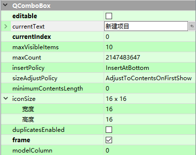

# QComboBox Class

[TOC]

## 属性介绍

在 Designer 中可编辑属性如下图：

### count

该属性用于记录 comboBox 中条目的数量。
默认情况下，对于空的 comboBox 而言，该属性的值是 0。

访问函数：
`int count() const`

### currentData 

该属性用于保存当前对象的数据 data。
默认情况下，对于空的 comboBox 或是没有设置当前条目的 comboBox，该属性会含有无效的 QVariant。
该属性在 Qt5.2 中被引入。

访问函数：

`QVariant currentData(int role = Qt::UserRole) const`

### currentIndex

保存当前 comboBox 中当前条目的索引。
在插入或移除条目时，当前索引会被改变。
默认情况下，对于空 comboBox 或 尚未设置当前条目的 comboBox ，该属性会返回 -1。

访问函数：
`int	currentIndex() const`
`void	setCurrentIndex(int index)`

通知信号：
`void	currentIndexChanged(int index)`
`void	currentIndexChanged(const QString &text)` 

### currentText

该属性会保存当前选择的文本。如果 comboBox 处于可编辑状态，currentText 则是 line edit 中显示的值。在不可编辑状态下，currentText 表示当前所选项的值；如果 comboBox 是没有任何内容，或是没有设置当前项目，则会返回空字符串。

访问函数：
`QString	currentText() const`
`void setCurrentText(const QString &text)`

通知信号：
`void currentTextChanged(const QString &text)`

### duplicatesEnabled

设置用户是否可以在复选框中输入重复的项目。注意，这会以编程的方式将重复的条目插入 comboBox。默认值是 `false` ( 不允许重复 )。

访问函数：
`bool duplicatesEnabled() const`
`void setDuplicatesEnabled(bool enable)`

### editable

用户是否可以编辑该 comboBox，默认值是 `false`。编辑的效果取决于插入策略InsertPolicy。注意：如果禁用 editable 状态，则会移除验证器(validator)和完成器(completer)。

访问函数：
`bool isEditable() const`
`void setEditable(bool *editable*)`

### frame

绘制 comboBox 时，是否包含框架。默认启用此项，comboBox 会在 frame 中绘制自身；否则 comboBox 绘制其自身时，不含有任何 frame。

访问函数：
`bool hasFrame() const`
`void setFrame(bool)`

### iconSize

设置 comboBox 中所显示的 icon 的尺寸。除非明确设置，否则返回当前样式的默认值。这个尺寸是图标可以具有的最大尺寸， 尺寸较小的图标不会按比例放大。

访问函数：
`QSize iconSize() const`
`void setIconSize(const QSize &size)`

### insertPolicy

设置用户输入录入新条目时的插入 combobox 规则。

访问函数：
`insertPolicy insertPolicy() const`
`void setInsertPolicy(InsertPolicy policy)`

| Constant                          | Value | Description                              |
| --------------------------------- | ----- | ---------------------------------------- |
| `QComboBox::NoInsert`             | `0`   | The string will not be inserted into the combobox. |
| `QComboBox::InsertAtTop`          | `1`   | The string will be inserted as the first item in the combobox. |
| `QComboBox::InsertAtCurrent`      | `2`   | The current item will be *replaced* by the string. |
| `QComboBox::InsertAtBottom`       | `3`   | The string will be inserted after the last item in the combobox. |
| `QComboBox::InsertAfterCurrent`   | `4`   | The string is inserted after the current item in the combobox. |
| `QComboBox::InsertBeforeCurrent`  | `5`   | The string is inserted before the current item in the combobox. |
| `QComboBox::InsertAlphabetically` | `6`   | The string is inserted in the alphabetic order in the combobox. |

### maxCount

表示 comboBox 中允许被保存的条目数的上限。如果该值小于当前的条目数，多出来的部分会被截断。如果在 comboBox 上设置了外部模型，这点同样适用。

访问函数：
`int maxCount() const`
`void setMaxCount(int max)`

### maxVisibleItems

表示 comboBox 在屏幕中允许被显示的最多条目数。当条目的数量大于这个值时，便会出现滚动条，用户依靠拖拽滚动条选择其余的条目。默认值是 10。
Note: This property is ignored for non-editable comboboxes in styles that returns true for [QStyle::SH_ComboBox_Popup](https://doc.qt.io/qt-5/qstyle.html#StyleHint-enum) such as the Mac style or the Gtk+ Style.

访问函数：
`int maxVisibleItems() const`
`void setMaxVisibleItems(int maxItems)`

### minimumContentsLength

用于设置适 comboBox 中最少的字符数，默认值是 0。If this property is set to a positive value, the [minimumSizeHint](https://doc.qt.io/qt-5/qcombobox.html#minimumSizeHint)() and [sizeHint](https://doc.qt.io/qt-5/qcombobox.html#sizeHint)() take it into account.

访问函数：
`int minimumContentsLength() const`
`void setMinimumContentsLength(int characters)`

### modelColumn

This property holds the column in the model that is visible.

If set prior to populating the combo box, the pop-up view will not be affected and will show the first column (using this property's default value).

By default, this property has a value of 0.

**Access functions:**
`int modelColumn() const`
`void setModelColumn(int visibleColumn)`

### sizeAdjustPolicy

用于描述当 comboBox 中的内容发生改变时，comboBox 尺寸的变化情况。默认设置是 AdjustToContentsOnFirstShow。

访问函数：
`SizeAdjustPolicy sizeAdjustPolicy() const`
`void setSizeAdjustPolicy(SizeAdjustPolicy policy)`

| Constant                                 | Value | Description                              |
| ---------------------------------------- | ----- | ---------------------------------------- |
| `QComboBox::AdjustToContents`            | `0`   | The combobox will always adjust to the contents |
| `QComboBox::AdjustToContentsOnFirstShow` | `1`   | The combobox will adjust to its contents the first time it is shown. |
| `QComboBox::AdjustToMinimumContentsLength` | `2`   | Use AdjustToContents or AdjustToContentsOnFirstShow instead. |
| `QComboBox::AdjustToMinimumContentsLengthWithIcon` | `3`   | The combobox will adjust to [minimumContentsLength](https://doc.qt.io/qt-5/qcombobox.html#minimumContentsLength-prop) plus space for an icon. For performance reasons use this policy on large models. |

### 继承的属性

- 59 properties inherited from [QWidget](https://doc.qt.io/qt-5/qwidget.html#properties)
- 1 property inherited from [QObject](https://doc.qt.io/qt-5/qobject.html#properties)

