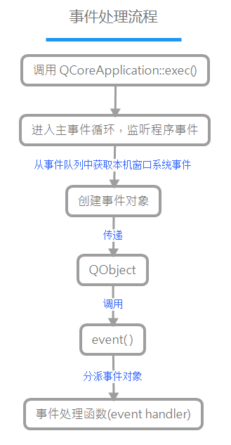

# 事件

[TOC]

## QEvent Class

### Detailed Description

> [QCoreApplication::exec](https://doc.qt.io/qt-5/qcoreapplication.html#exec)(): Enters the main event loop and waits until exit() is called. Returns the value that was passed to exit() (which is 0 if exit() is called via quit()).

Qt 程序需要在 `main()` 函数创建一个 `QCoreApplication` 对象，然后调用它的 `exec()` 函数。
在执行 `exec()`  函数后，便会进入主事件循环来监听应用程序的事件。
主事件循环会从事件队列中获取本机窗口系统事件，并为这些事件创建事件对象( [QEvent](https://doc.qt.io/qt-5/qevent.html) class 是所有事件类的基类，事件对象会包含事件参数 )。
事件对象创建完毕后，Qt 会将事件对象传递给 [QObject](https://doc.qt.io/qt-5/qobject.html)s。
[QObjects](https://doc.qt.io/qt-5/qobject.html) 通过调用其 [QObject::event](https://doc.qt.io/qt-5/qobject.html#event)() 函数来接受事件对象。
`event()` 函数并不直接处理事件，默认情况下会按照事件对象的类型分派给特定的事件处理函数(event handler)，比如 [QObject::timerEvent](https://doc.qt.io/qt-5/qobject.html#timerEvent)() 和 [QWidget::mouseMoveEvent](https://doc.qt.io/qt-5/qwidget.html#mouseMoveEvent)()。

Tip:

- `event()` 函数可以在子类中重新实现，以自定义事件处理并添加其他事件类型；[QWidget::event](https://doc.qt.io/qt-5/qwidget.html#event)() 就是这样一个例子，它是对 [QObject::event](https://doc.qt.io/qt-5/qobject.html#event)() 的重实现。
-  [QObject::installEventFilter](https://doc.qt.io/qt-5/qobject.html#installEventFilter)() 允许一个对象拦截发往另一个对象的事件。

[参考 1]: https://www.devbean.net/2012/09/qt-study-road-2-events/
[参考 2]: https://doc.qt.io/qt-5/qevent.html#details	"doc.qt"

