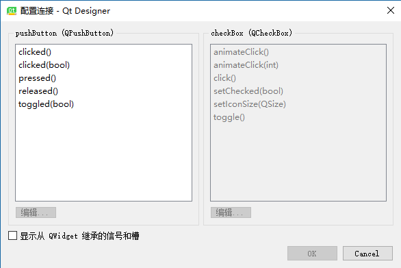
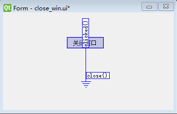
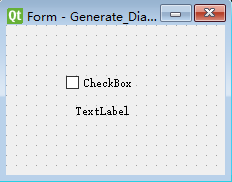
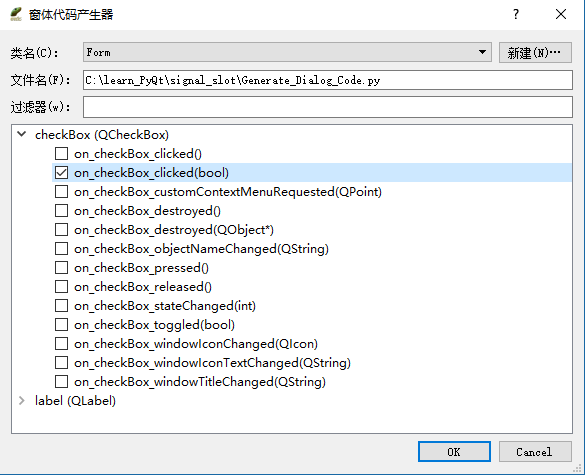
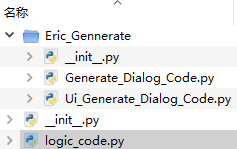
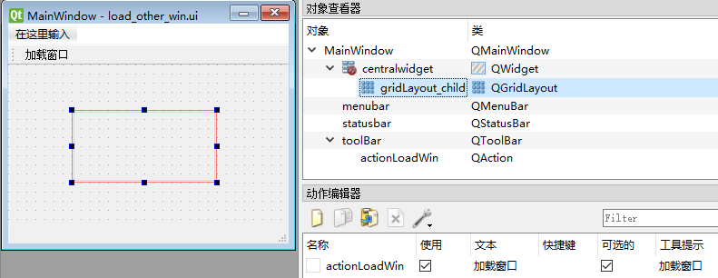

# 信号和曹

signal & slot

[TOC]

通过建立信号和槽间的连接，便可以实现对象间的通讯。
当信号对象改变其状态时，便会发出相应信号，此时该信号连接的曹函数将会自动自行。
所有继承自 `QObject` 的类，都可以作为信号源。曹可以是普通的对象成员函数。
在 PyQt5 中，信号和曹通过类似 `QObject.signal.connect(slot)` 的语句进行连接。

连接信号连接曹函数的方法：

- 使用 Qt Designer 的 “编辑信号/曹” 模式；
- 直接编写相应代码；
- 使用 Eric 的 “生成对话框代码” 功能。

继承自 `QObject` 的对象都支持信号与曹机制。 

## Designer  “编辑信号/曹” 

在 “编辑信号/曹” 模式下可见的 widget 对象都可以进行 “信号/曹” 编辑操作。
只需左键按住需要发出信号的 widget 对象，并在目标 widget 上释放左键即可。
此时，被选中的信号和曹都会变为红色，并且会弹出 ”配置连接“ 对话框。



左侧表示可选信号，右侧表示目标曹函数。
勾选下方 “显示从 QWidget 继承的信号和曹” 可以获得更多的 “信号和曹”。

- **信号/曹编辑器**：对于已有的信号和曹，可在右下角的 “信号/曹编辑器” 编辑器中查看和修改。

### 代码分析

为了分析代码，我们创建一个用于关闭当前窗口的按钮。如图：


编译窗体后的源代码：
```python
from PyQt5 import QtCore, QtGui, QtWidgets

class Ui_Form(object):
    def setupUi(self, Form):
        Form.setObjectName("Form")
        Form.resize(347, 198)
        self.pushButton = QtWidgets.QPushButton(Form)
        self.pushButton.setGeometry(QtCore.QRect(130, 50, 75, 23))
        self.pushButton.setObjectName("pushButton")

        self.retranslateUi(Form)
        self.pushButton.clicked.connect(Form.close)
        QtCore.QMetaObject.connectSlotsByName(Form)

    def retranslateUi(self, Form):
        _translate = QtCore.QCoreApplication.translate
        Form.setWindowTitle(_translate("Form", "Form"))
        self.pushButton.setText(_translate("Form", "关闭窗口"))
```

为了便于理解，省略无关代码：

```python
--snip--
class Ui_Form(object):
    def setupUi(self, Form):
        --snip--
        
        # 将信号和曹进行连接。
		# solt是函数对象，不可写作函数调用Form.close()
        self.pushButton.clicked.connect(Form.close)
        # Connecting Slots By Name
        QtCore.QMetaObject.connectSlotsByName(Form)
        
    def retranslateUi(self, Form):
        --snip--
```

solt 是函数对象，如果需要在 solt 中调用带有函数的对象，可以使用 `lambda` 。比如：

```
self.btn1.clicked.connect(lambda:self.whichbtn(self.btn1) )
def whichbtn(self,btn):
		print("clicked button is " + btn.text() ) 
```


## Eric  “生成对话框代码” 

1. 新建 `Generate_Dialog_Code.ui` 窗体文件，并添加如下 widget：



2. 编译 `Generate_Dialog_Code.ui` 窗体

3. 右键 `Generate_Dialog_Code.ui` 文件，选择 “生成对话框代码 ...” 。
   此时会打开窗体代码产生器，然后 “新建” 对话框窗体，直接点击 “OK” 即可。
   选择下图所示信号。然后点击 “OK”。

   

4. 此时我们会得到 `Generate_Dialog_Code.py` ，代码如下：

   ```python
   # -*- coding: utf-8 -*-

   """
   Module implementing Form.
   """

   from PyQt5.QtCore import pyqtSlot
   from PyQt5.QtWidgets import QWidget

   from .Ui_eric_Generate_dialog_code import Ui_Form
   class Form(QWidget, Ui_Form):

   """
   Class documentation goes here.
   """
   def __init__(self, parent=None):
       """
       Constructor
       
       @param parent reference to the parent widget
       @type QWidget
       """
       super(Form, self).__init__(parent)
       self.setupUi(self)

   @pyqtSlot(bool)
   def on_checkBox_clicked(self, checked):
       """
       Slot documentation goes here.
       
       @param checked DESCRIPTION
       @type bool
       """
       # TODO: not implemented yet
       raise NotImplementedError
   ```

5. 修改代码（这里省略了无关的代码，为了突出需要修改的部分）：

   ```python
   --snip--

   # 注意：这里使用了相对导入，因此Generate_Dialog_Code.py不能作为主程序的入口。
   # 和Generate_Dialog_Code.py同目录下的.py文件也不能作为主程序的入口。
   # 这和模块的相对导入有关，请参阅有关模块相对导入的资料
   # 如果从更上一级目录的.py文件调用Generate_Dialog_Code.py，便能正常运行
   # 如果想直接运行本文件，可去掉.号。
   # 有的资料将这一点描述为一种错误，但是我认为这样做肯定有其目的，只是我还没有接触到而已。
   from .Ui_eric_Generate_dialog_code import Ui_Form
   class Form(QWidget, Ui_Form):
   	--snip--
       def __init__(self, parent=None):
           --snip--
           
           # 设置widget的默认状态
           self.checkBox.setChecked(True)
       
       @pyqtSlot(bool)
       def on_checkBox_clicked(self, checked):
           """
           Slot documentation goes here.
           
           @param checked DESCRIPTION
           @type bool
           """
           # 注意这里需要调用方法，而Designer不需要调用。
           self.label.setVisible(checked)
           # 删除 raise NotImplementedError
   ```

6. 创建 `logic_code.py` 

   ```python
   import sys
   from PyQt5.QtWidgets import QApplication
   from Eric_Gennerate.Generate_Dialog_Code import Form

   if __name__ == '__main__':
       app = QApplication(sys.argv)
       my_dialog = Form()
       my_dialog.show()
       sys.exit(app.exec())
   ```

7. 确保整个目录结构如下图所示，然后直接运行 `logic_code.py` 便可。

   


## 应用：

### 加载其它窗口

1. 新建 `load_other_win.ui` 作为主窗口，用于加载子窗口。



```python
# -*- coding: utf-8 -*-

# Form implementation generated from reading ui file 'C:\learn_PyQt\load_other_win\load_other_win.ui'
#
# Created by: PyQt5 UI code generator 5.9
#
# WARNING! All changes made in this file will be lost!

from PyQt5 import QtCore, QtGui, QtWidgets

class Ui_MainWindow(object):
    def setupUi(self, MainWindow):
        MainWindow.setObjectName("MainWindow")
        MainWindow.resize(309, 242)
        self.centralwidget = QtWidgets.QWidget(MainWindow)
        self.centralwidget.setObjectName("centralwidget")
        self.gridLayoutWidget = QtWidgets.QWidget(self.centralwidget)
        self.gridLayoutWidget.setGeometry(QtCore.QRect(60, 50, 160, 80))
        self.gridLayoutWidget.setObjectName("gridLayoutWidget")
        self.gridLayout_child = QtWidgets.QGridLayout(self.gridLayoutWidget)
        self.gridLayout_child.setContentsMargins(0, 0, 0, 0)
        self.gridLayout_child.setObjectName("gridLayout_child")
        MainWindow.setCentralWidget(self.centralwidget)
        self.menubar = QtWidgets.QMenuBar(MainWindow)
        self.menubar.setGeometry(QtCore.QRect(0, 0, 309, 23))
        self.menubar.setObjectName("menubar")
        MainWindow.setMenuBar(self.menubar)
        self.statusbar = QtWidgets.QStatusBar(MainWindow)
        self.statusbar.setObjectName("statusbar")
        MainWindow.setStatusBar(self.statusbar)
        self.toolBar = QtWidgets.QToolBar(MainWindow)
        self.toolBar.setObjectName("toolBar")
        MainWindow.addToolBar(QtCore.Qt.TopToolBarArea, self.toolBar)
        self.actionLoadWin = QtWidgets.QAction(MainWindow)
        self.actionLoadWin.setCheckable(True)
        self.actionLoadWin.setObjectName("actionLoadWin")
        self.toolBar.addAction(self.actionLoadWin)

        self.retranslateUi(MainWindow)
        QtCore.QMetaObject.connectSlotsByName(MainWindow)

    def retranslateUi(self, MainWindow):
        _translate = QtCore.QCoreApplication.translate
        MainWindow.setWindowTitle(_translate("MainWindow", "MainWindow"))
        self.toolBar.setWindowTitle(_translate("MainWindow", "toolBar"))
        self.actionLoadWin.setText(_translate("MainWindow", "加载窗口"))


if __name__ == "__main__":
    import sys
    app = QtWidgets.QApplication(sys.argv)
    MainWindow = QtWidgets.QMainWindow()
    ui = Ui_MainWindow()
    ui.setupUi(MainWindow)
    MainWindow.show()
    sys.exit(app.exec_())


```


2. 新建 `child_win.ui` 作为被加载的子窗口


```python
# -*- coding: utf-8 -*-

# Form implementation generated from reading ui file 'C:\learn_PyQt\load_other_win\child_win.ui'
#
# Created by: PyQt5 UI code generator 5.9
#
# WARNING! All changes made in this file will be lost!

from PyQt5 import QtCore, QtGui, QtWidgets

class Ui_Form(object):
    def setupUi(self, Form):
        Form.setObjectName("Form")
        Form.resize(400, 300)
        self.textEdit = QtWidgets.QTextEdit(Form)
        self.textEdit.setGeometry(QtCore.QRect(13, 10, 201, 161))
        self.textEdit.setObjectName("textEdit")

        self.retranslateUi(Form)
        QtCore.QMetaObject.connectSlotsByName(Form)

    def retranslateUi(self, Form):
        _translate = QtCore.QCoreApplication.translate
        Form.setWindowTitle(_translate("Form", "Form"))
        self.textEdit.setHtml(_translate("Form", "<!DOCTYPE HTML PUBLIC \"-//W3C//DTD HTML 4.0//EN\" \"http://www.w3.org/TR/REC-html40/strict.dtd\">\n"
"<html><head><meta name=\"qrichtext\" content=\"1\" /><style type=\"text/css\">\n"
"p, li { white-space: pre-wrap; }\n"
"</style></head><body style=\" font-family:\'SimSun\'; font-size:9pt; font-weight:400; font-style:normal;\">\n"
"<p style=\" margin-top:0px; margin-bottom:0px; margin-left:0px; margin-right:0px; -qt-block-indent:0; text-indent:0px;\">子窗口</p>\n"
"<p style=\"-qt-paragraph-type:empty; margin-top:0px; margin-bottom:0px; margin-left:0px; margin-right:0px; -qt-block-indent:0; text-indent:0px;\"><br /></p></body></html>"))


if __name__ == "__main__":
    import sys
    app = QtWidgets.QApplication(sys.argv)
    Form = QtWidgets.QWidget()
    ui = Ui_Form()
    ui.setupUi(Form)
    Form.show()
    sys.exit(app.exec_())
```

3. 新建 `main_entry.py` 作为程序的主入口：

```python
import sys
from Ui_child_win import Ui_Form
from Ui_load_other_win import Ui_MainWindow
from PyQt5.QtWidgets import QMainWindow, QApplication, QWidget

# 对Ui_Form进行多重继承，方便使用
class ChildWidget(QWidget, Ui_Form):
    def __init__(self):
        super(ChildWidget, self).__init__()
        self.setupUi(self)

# 编写主入口类
class MainEntry(QMainWindow, Ui_MainWindow):
    def __init__(self):
        super(MainEntry, self).__init__()
        self.setupUi(self)
        #实例化ChildWidget
        self.child = ChildWidget()

        self.actionLoadWin.triggered['bool'].connect(self.child_show)

	# triggered就是triggered['bool']的值
    def child_show(self, triggered):
        if triggered:
            self.gridLayout_child.addWidget(self.child)
            self.child.show()
        else:
            self.child.close()

if __name__ == '__main__':
    app = QApplication(sys.argv)
    maim_entry = MainEntry()
    maim_entry.show()
    sys.exit(app.exec())

```

## Old-style Signals and Slots

Old-style Signals and Slots[¶](http://pyqt.sourceforge.net/Docs/PyQt5/pyqt4_differences.html#old-style-signals-and-slots)

PyQt5 不支持 PyQt4 中旧式的信号和曹。因此，PyQt5 中并没有实现以下函数：

- `QObject.connect()`
- `QObject.emit()`
- `SIGNAL()`
- `SLOT()`

All methods that had arguments that are usually the results of calls to `SIGNAL()` or `SLOT()` are no longer supported. There will always be an equivalent that takes a bound signal or callable respectively.

此外，以下方法有差异：

- `disconnect()` 不会获取任何任何参数，并且会断开与 [`QObject`](http://pyqt.sourceforge.net/Docs/PyQt5/api/QtCore/qobject.html#PyQt5-QtCore-QObject) 实例相连的所有连接。

## New-style Signals and Slots

New-style Signals and Slots[¶](http://pyqt.sourceforge.net/Docs/PyQt5/pyqt4_differences.html#new-style-signals-and-slots)

Qt 将拥有可选参数的信号实现为两个独立信号，一个信号含有参数，另一个信号没有参数。PyQt4 会暴露这两种信号，以便允许你连接到任何一个信号。

Qt implements signals with an optional argument as two separate signals, one with the argument and one without it. PyQt4 exposed both of these allowing you to connect to each of them. However, when emitting the signal, you had to use the signal appropriate to the number of arguments being emitted.

PyQt5 exposes only the signal where all arguments are specified. However it allows any optional arguments to be omitted when emitting the signal.

Unlike PyQt4, PyQt5 supports the definition of properties, signals and slots in classes not sub-classed from [`QObject`](http://pyqt.sourceforge.net/Docs/PyQt5/api/QtCore/qobject.html#PyQt5-QtCore-QObject) (i.e. in mixins).

# Support for Signals and Slots

Support for Signals and Slots[¶](http://pyqt.sourceforge.net/Docs/PyQt5/signals_slots.html#support-for-signals-and-slots)

Qt 的一个主要特点是在对象之间使用信号和曹进行通讯。Qt 鼓励开发可重复使用的组件。

当一些我们感兴趣的潜在动作发生时，会发送一个信号。曹可被 Python 调用。如果某个信号被连接到某个曹，那么当该信号发送时，便会调用该曹。如果某个信号没有连接到任何曹，那么发送该信号时，不会有任何动作。发出信号的代码(或组件)，不知道也并不关心该信号是否被使用。

Qt5 文档中会给出每个类中相关信号，这些信号中的参数会在信号被发射时自行填入，并且最终传递给所连接的曹。

信号/曹 机制具有以下特征：

- 一个信号可以被连接到多个曹
- 一个信号也可以被连接到另一个信号
- 信号的参数可以是任何 Python 类型
- 一个曹可以连接到多个信号
- 信号与曹之间的连接可以是 direct (ie. synchronous) ，或是 queued (ie. asynchronous).
- 信号与曹之间的连接可以跨线程
- 信号可以被断开

## 信号的绑定

Unbound and Bound Signals

信号(特指未绑定的信号)是类属性。当信号被作为类实例属性引用时，PyQt5 会自动将实例绑定到信号，以创建 *bound signal* 。这和 Python 自身从类函数创建绑定方法的机制相同。

一个 *bound signal* 拥有三个用于实现相应功能的方法： `connect()` / `disconnect()` / `emit()` 。 *bound signal* 还有一个 `signal` 属性，该属性是由 Qt 的 `SIGNAL()` 宏返回的信号签名。

信号可以被重载，比如具有特定名称的信号可能会支持多个签名。可以使用签名索引信号，以便选择所需的信号。A signature is a sequence of types. 类型是 Python 类型对象，或是用字符串表示的 C++ 类型名称。C++ 类型的名称会自动进行标准化，比如，`QVariant` 会替换非标准化的`const QVariant &` 。

如果某个信号被重载，那么它将会有一个默认值。当没有给出索引时，便会使用该默认值。

当某个信号被发出时，如果可能的话，任何参数都将转化为 C++ 类型。如果某个参数没有对应的 C++ 类型，那么它会被打包到一个特殊的 C++ 类型中，以允许它在 Qt 的 meta-type system 被传递，同时确保其引用计数被正确的维护。

## 定义新信号

Defining New Signals with pyqtSignal()[¶](http://pyqt.sourceforge.net/Docs/PyQt5/signals_slots.html#defining-new-signals-with-pyqtsignal)

PyQt5 自动为所有 Qt 内置信号定义相应的信号。新信号可以使用 [`pyqtSignal()`](http://pyqt.sourceforge.net/Docs/PyQt5/signals_slots.html#PyQt5.QtCore.pyqtSignal) factory 将其定义为类属性。

> PyQt5.QtCore.**pyqtSignal**(*types*[, *name*[, *revision=0*[, *arguments=[]*]]])

Parameters:

- **types** – 用于定义信号的 C++ 签名。当只给出一个 type 时，可以是 Python 类型对象，或是表示 C++ 类型名的字符串。当同是给出多个 type 时，即指定一个 type 参数序列。Alternatively 或者 each may be a sequence of type arguments.In this case each sequence defines the signature of a different signal overload. The first overload will be the default.
- **name** – the name of the signal. If it is omitted省略 then the name of the class attribute属性 is used. This may only be given as a keyword argument.
- **revision** – the revision of the signal that is exported导出 to QML. This may only be given as a keyword argument.
- **arguments** – the sequence of the names of the signal’s arguments that is exported to QML. This may only be given as a keyword argument.

The following example shows the definition of a number of new signals:

```python
from PyQt5.QtCore import QObject, pyqtSignal

class Foo(QObject):

    # This defines a signal called 'closed' that takes no arguments.
    closed = pyqtSignal()

    # This defines a signal called 'rangeChanged' that takes two
    # integer arguments.
    range_changed = pyqtSignal(int, int, name='rangeChanged')

    # This defines a signal called 'valueChanged' that has two overloads,
    # one that takes an integer argument and one that takes a QString
    # argument.  Note that because we use a string to specify the type of
    # the QString argument then this code will run under Python v2 and v3.
    valueChanged = pyqtSignal([int], ['QString'])
```

新信号只能在 [`QObject`](http://pyqt.sourceforge.net/Docs/PyQt5/api/QtCore/qobject.html#PyQt5-QtCore-QObject) 的子类中被定义。必须在类定义中定义新信号，在类定义之后不能动态添加为类属性。

以这种方式定义的新信号将被自动添加到类的 [`QMetaObject`](http://pyqt.sourceforge.net/Docs/PyQt5/api/QtCore/qmetaobject.html#PyQt5-QtCore-QMetaObject) 。这意味着，它们将出现在 Qt Designer 中，and can be introspected内省 using the [`QMetaObject`](http://pyqt.sourceforge.net/Docs/PyQt5/api/QtCore/qmetaobject.html#PyQt5-QtCore-QMetaObject) API.

> Overloaded重载 signals should be used with care小心 when an argument has a Python type that has no corresponding相应 C++ type. PyQt5 uses the same internal内部 C++ class to represent表示 such objects and so it is possible to have overloaded signals with different Python signatures that are implemented with identical C++ signatures with unexpected意外的 results. 

当参数的 Python 类型没有相应的 C++ 类型时，应该小心使用重载信号。PyQt5 使用相同的内部 C++ 类表示这些对象，因此可以使用不同 Python 签名重载信号。但是这些 Python 签名使用相同 C++ 签名实现，所以可能会导致一些意外的结果。下面就是这样一个例子：

```python
class Foo(QObject):

    # This will cause problems because each has the same C++ signature.
    valueChanged = pyqtSignal([dict], [list])
```

## 信号的连接/断开/发送

Connecting, Disconnecting and Emitting Signals[¶](http://pyqt.sourceforge.net/Docs/PyQt5/signals_slots.html#connecting-disconnecting-and-emitting-signals)

### connect

Signals are connected to slots using the [`connect()`](http://pyqt.sourceforge.net/Docs/PyQt5/signals_slots.html#connect) method of a bound signal.

> **connect**(*slot*[, *type=PyQt5.QtCore.Qt.AutoConnection*[, *no_receiver_check=False*]])

Connect a signal to a slot. An exception异常 will be raised if the connection failed.

Parameters:	

- **slot** – the slot to connect to, either a Python callable or another bound signal.
- **type** – the type of the connection to make.
- **no_receiver_check** – 禁止检查底层 C++ 接收器实例是否任然存在，并始终传递信号。

### disconnect

Signals are disconnected from slots using the [`disconnect()`](http://pyqt.sourceforge.net/Docs/PyQt5/signals_slots.html#disconnect) method of a bound signal.

> **disconnect**([*slot*]) 

Disconnect one or more slots from a signal. An exception异常 will be raised if the slot is not connected to the signal or if the signal has no connections at all.

Parameters:

- **slot** – the optional slot to disconnect from, either a Python callable or another bound signal. If it is omitted省略 then all slots connected to the signal are disconnected.

### emit

Signals are emitted from using the [`emit()`](http://pyqt.sourceforge.net/Docs/PyQt5/signals_slots.html#emit) method of a bound signal.

> **emit** (**args*)

Emit a signal.

Parameters:

- **args** – the optional sequence of arguments to pass to any connected slots.

### 示例

The following code demonstrates the definition, connection and emit of a signal without arguments:

```python
from PyQt5.QtCore import QObject, pyqtSignal

class Foo(QObject):

    # Define a new signal called 'trigger' that has no arguments.
    trigger = pyqtSignal()

    def connect_and_emit_trigger(self):
        # Connect the trigger signal to a slot.
        self.trigger.connect(self.handle_trigger)

        # Emit the signal.
        self.trigger.emit()

    def handle_trigger(self):
        # Show that the slot has been called.

        print ("trigger signal received")
```

The following code demonstrates the connection of overloaded signals:

```python
from PyQt5.QtWidgets import QComboBox

class Bar(QComboBox):

    def connect_activated(self):
        # The PyQt5 documentation will define what the default overload is.
        # In this case it is the overload with the single integer argument.
        self.activated.connect(self.handle_int)

        # For non-default overloads we have to specify which we want to
        # connect.  In this case the one with the single string argument.
        # (Note that we could also explicitly specify the default if we
        # wanted to.)
        self.activated[str].connect(self.handle_string)

    def handle_int(self, index):
        print ("activated signal passed integer", index)

    def handle_string(self, text):
        print ("activated signal passed QString", text)
```

## 使用关键字参数连接信号

Connecting Signals Using Keyword Arguments[¶](http://pyqt.sourceforge.net/Docs/PyQt5/signals_slots.html#connecting-signals-using-keyword-arguments)

It is also possible to connect signals by passing a slot as a keyword argument corresponding to the name of the signal when creating an object, or using the `pyqtConfigure()` method. For example the following three fragments are equivalent:

```python
act = QAction("Action", self)
act.triggered.connect(self.on_triggered)
#triggered是信号名称
act = QAction("Action", self, triggered=self.on_triggered)

act = QAction("Action", self)
act.pyqtConfigure(triggered=self.on_triggered)
```

##  pyqtSlot() 装饰器

The [`pyqtSlot()`](http://pyqt.sourceforge.net/Docs/PyQt5/signals_slots.html#PyQt5.QtCore.pyqtSlot) Decorator[¶](http://pyqt.sourceforge.net/Docs/PyQt5/signals_slots.html#the-pyqtslot-decorator)

尽管 PyQt5 允许任何 Python callable 在连接到信号时被用作曹，但有时需要显示的将某个 Python 方法标记为 Qt 插槽，并为其提供 C++ 签名。PyQt5 提供的 `pyqtSlot()` 函数装饰器便是用来完成这个工作的。

> PyQt5.QtCore.**pyqtSlot**(*types*[, *name*[, *result*[, *revision=0*]]])

Decorate a Python method to create a Qt slot.

Parameters:

- **types** – the types that define the C++ signature of the slot. Each type may be a Python type object or a string that is the name of a C++ type.
- **name** – the name of the slot that will be seen by C++. If omitted省略 the name of the Python method being decorated will be used. This may only be given as a keyword argument.
- **revision** – the revision of the slot that is exported to QML. This may only be given as a keyword argument.
- **result** – the type of the result and may be a Python type object or a string that specifies a C++ type. This may only be given as a keyword argument.

```python
from PyQt5.QtCore import QObject, pyqtSlot

class Foo(QObject):

    @pyqtSlot()
    def foo(self):
        """ C++: void foo() """

    @pyqtSlot(int, str)
    def foo(self, arg1, arg2):
        """ C++: void foo(int, QString) """

    @pyqtSlot(int, name='bar')
    def foo(self, arg1):
        """ C++: void bar(int) """

    @pyqtSlot(int, result=int)
    def foo(self, arg1):
        """ C++: int foo(int) """

    @pyqtSlot(int, QObject)
    def foo(self, arg1):
        """ C++: int foo(int, QObject *) """
```

It is also possible to chain the decorators in order to define a Python method several times with different signatures. 也可以链接装饰器，以便使用不同的签名多次定义Python方法。
For example:

```python
rom PyQt5.QtCore import QObject, pyqtSlot

class Foo(QObject):

    @pyqtSlot(int)
    @pyqtSlot('QString')
    def valueChanged(self, value):
        """ Two slots will be defined in the QMetaObject. """
```

## PyQt_PyObject 信号参数类型

The `PyQt_PyObject` Signal Argument Type

通过在签名中指定 `PyQt_PyObject` 作为参数类型，可以传递任何 Python 对象作为信号参数。

It is possible to pass any Python object as a signal argument by specifying `PyQt_PyObject` as the type of the argument in the signature. For example:

```
finished = pyqtSignal('PyQt_PyObject')

```

This would normally be used for passing objects where the actual Python type isn’t known. It can also be used to pass an integer, for example, so that the normal conversions from a Python object to a C++ integer and back again are not required.

The reference count of the object being passed is maintained automatically. There is no need for the emitter of a signal to keep a reference to the object after the call to `finished.emit()`, even if a connection is queued.

这通常用于传递实际Python类型不知道的对象。例如，它也可以用于传递整数，以便不需要从Python对象到C ++整数的正常转换。

要传递的对象的引用计数自动维护。`finished.emit()` 即使连接排队，信号发射器也不需要在调用之后保持对对象的引用。

## 按名称连接曹

Connecting Slots By Name

PyQt5 支持 `connectSlotsByName()` 函数，该函数常用于由 **pyuic5** 生成 Python 代码，可以将信号自动连接到符合简单命名约定的曹。但是，如果一个类重载了 Qt 信号( 即，具有相同名称但具有不同的参数)，则 PyQt5 需要额外的信息才能自动连接正确的信号

PyQt5 supports the `connectSlotsByName()` function that is most commonly used by **pyuic5** generated Python code to automatically connect signals to slots that conform to a simple naming convention. However, where a class has overloaded Qt signals (ie. with the same name but with different arguments) PyQt5 needs additional information in order to automatically connect the correct signal.

For example the [`QSpinBox`](http://pyqt.sourceforge.net/Docs/PyQt5/api/QtWidgets/qspinbox.html#PyQt5-QtWidgets-QSpinBox) class has the following signals:

```
void valueChanged(int i);
void valueChanged(const QString &text);

```

When the value of the spin box changes both of these signals will be emitted. If you have implemented a slot called `on_spinbox_valueChanged` (which assumes that you have given the `QSpinBox` instance the name `spinbox`) then it will be connected to both variations of the signal. Therefore, when the user changes the value, your slot will be called twice - once with an integer argument, and once with a string argument.

当旋转框的值改变时，这两个信号将被发出。如果你已经实现了一个调用的插槽`on_spinbox_valueChanged`（它假设你给了这个`QSpinBox`实例的名字`spinbox`），那么它将连接到信号的两个变体。因此，当用户更改值时，您的插槽将被调用两次 - 一次为整数参数，一次为字符串参数。

The [`pyqtSlot()`](http://pyqt.sourceforge.net/Docs/PyQt5/signals_slots.html#PyQt5.QtCore.pyqtSlot) decorator can be used to specify指定 which of the signals should be connected to the slot.

For example, if you were only interested in the integer variant of the signal then your slot definition would look like the following:例如，如果您只对信号的整数变体感兴趣，那么您的插槽定义将如下所示：

```python
@pyqtSlot(int)
def on_spinbox_valueChanged(self, i):
    # i will be an integer.
    pass

```

If you wanted to handle both variants of the signal, but with different Python methods, then your slot definitions might look like the following:如果要处理信号的两个变体，但是使用不同的Python方法，那么您的插槽定义可能如下所示：

```python
@pyqtSlot(int, name='on_spinbox_valueChanged')
def spinbox_int_value(self, i):
    # i will be an integer.
    pass

@pyqtSlot(str, name='on_spinbox_valueChanged')
def spinbox_qstring_value(self, s):
    # s will be a Python string object (or a QString if they are enabled).
    pass
```


