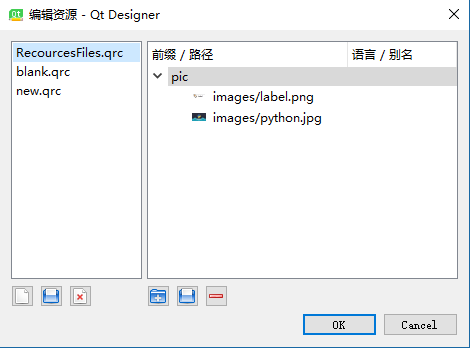
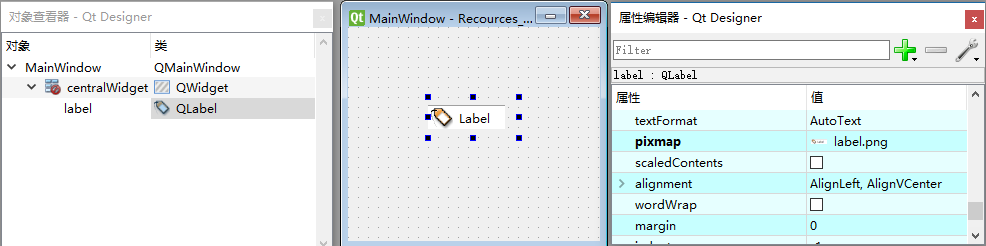

# 打包资源文件

[TOC]

## 使用资源文件

`*.qrc` 是 Qt Recources file 资源文件，存储各种资源的路径。
下面是一个 `.qrc` 文件的代码，依旧是 XML

```
<RCC>
  <qresource prefix="pic">
    <file>images/label.png</file>
    <file>images/python.jpg</file>
  </qresource>
</RCC>
```

对于 PyQt 而言，我们最终都会将 `.qrc` 文件和其指向的各种资源转换到 `*_rc.py` 文件中。转换后即使删除 `.qrc` 和资源文件， 也不会影响程序的运行。

注意：转换 `.qrc` 文件时，实际使用的是 `pyrcc5.exe` 。命令如下：
`pyrcc5 *.qrc -o *_rc.py` 

1. 新建 `RecourcesFiles.qrc`  文件

   - 可使用 Eric6 项目管理器下的 “资源” 新建 `RecourcesFiles.qrc.qrc` 文件。在 “资源” 中右键选择新建，即可。
   - 或使用 Designer 的 “资源浏览器” 直接 “新建资源文件” 。

2. 管理 `RecourcesFiles.qrc.qrc` 文件：使用Designer 的 “资源浏览器” 进行管理。
   在 “资源浏览器” 中向 `RecourcesFiles.qrc.qrc` 添加资源后，如下图：
   

   代码如下：(需要注意prefix，在调用资源时需要添加相应前缀)

   ```xml
   <RCC>
     <qresource prefix="pic">
       <file>images/label.png</file>
       <file>images/python.jpg</file>
     </qresource>
   </RCC>
   ```

3. 新建 `Recources_File.ui` ，然后添加 widget ，并使用资源：（以 Display Widgets > Label 为例）

   - 修改 Label 的 pixmap 属性，将其值改为资源文件中的一张图片。

     

4. 在 Eric6 中将 `Recources_File.ui` 和 `RecourcesFiles.qrc` 都编译为相应的 `.py` 文件。`Ui_Recources_File.py`  会自动包含导入 `RecourcesFiles_rc.py` 文件的代码：
   `import RecourcesFiles_rc` 。

   **注意**：资源文件的路径包含前缀。

   `Ui_Recources_File.py` 代码：

   ```python
   # -*- coding: utf-8 -*-

   # Form implementation generated from reading ui file 'C:\learn_PyQt\recources_files\Recources_File.ui'
   #
   # Created by: PyQt5 UI code generator 5.9
   #
   # WARNING! All changes made in this file will be lost!

   from PyQt5 import QtCore, QtGui, QtWidgets

   class Ui_MainWindow(object):
       def setupUi(self, MainWindow):
           MainWindow.setObjectName("MainWindow")
           MainWindow.resize(372, 307)
           self.centralWidget = QtWidgets.QWidget(MainWindow)
           self.centralWidget.setObjectName("centralWidget")
           self.label = QtWidgets.QLabel(self.centralWidget)
           self.label.setGeometry(QtCore.QRect(80, 70, 91, 41))
           self.label.setText("")
           self.label.setPixmap(QtGui.QPixmap(":/pic/images/label.png"))
           self.label.setObjectName("label")
           MainWindow.setCentralWidget(self.centralWidget)

           self.retranslateUi(MainWindow)
           QtCore.QMetaObject.connectSlotsByName(MainWindow)

       def retranslateUi(self, MainWindow):
           _translate = QtCore.QCoreApplication.translate
           MainWindow.setWindowTitle(_translate("MainWindow", "MainWindow"))
   # 导入资源文件
   import RecourcesFiles_rc

   if __name__ == "__main__":
       import sys
       app = QtWidgets.QApplication(sys.argv)
       MainWindow = QtWidgets.QMainWindow()
       ui = Ui_MainWindow()
       ui.setupUi(MainWindow)
       MainWindow.show()
       sys.exit(app.exec_())
       
   ```

   `RecourcesFiles_rc.py` 代码 ，省略部分代码：

   ```python
   # -*- coding: utf-8 -*-

   # Resource object code
   #
   # Created by: The Resource Compiler for PyQt5 (Qt v5.9.1)
   #
   # WARNING! All changes made in this file will be lost!

   from PyQt5 import QtCore
   #--snip--表示省略的代码
   qt_resource_data = b"\ --snip--"
   qt_resource_name = b"\ --snip--"
   qt_resource_struct_v1 = b"\ --snip--"
   qt_resource_struct_v2 = b"\ --snip--"

   qt_version = QtCore.qVersion().split('.')
   if qt_version < ['5', '8', '0']:
       rcc_version = 1
       qt_resource_struct = qt_resource_struct_v1
   else:
       rcc_version = 2
       qt_resource_struct = qt_resource_struct_v2

   def qInitResources():
   	# 初始化注册资源文件
       QtCore.qRegisterResourceData(rcc_version, qt_resource_struct, qt_resource_name, qt_resource_data)

   def qCleanupResources():
       QtCore.qUnregisterResourceData(rcc_version, qt_resource_struct, qt_resource_name, qt_resource_data)

   qInitResources()
   ```

   ​

## 使用相对路劲引用外部文件