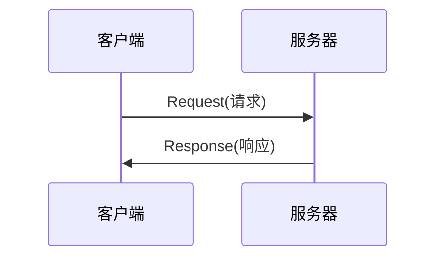

# HTTP
> GitHub@[orca-j35](https://github.com/orca-j35)，所有笔记均托管于 [python_notes](https://github.com/orca-j35/python_notes) 仓库

## URI/URL/URN

### URI

URI(Uniform Resource Identifier) - 统一资源标识符，RFC2396 分别对这 3 个单词进行了如下定义：

- Uniform - 规定统一的格式可方便处理多种不同类型的资源， 而不用根据上下文环境来识别资源指定的访问方式。 另外， 加入新增的协议方案（如 http: 或 ftp:） 也更容易。
- Resource - 资源的定义是“可标识的任何东西”。 除了文档文件、 图像或服务（例如当天的天气预报） 等能够区别于其他类型的， 全都可作为资源。 另外， 资源不仅可以是单一的， 也可以是多数的集合体。
- Identifier 表示可标识的对象。 也称为标识符。 

综上所述， URI 就是由某个协议方案表示的资源的定位标识符。 协议方案是指访问资源所使用的协议类型名称。 

"RFC3986： 统一资源标识符(URI)通用语法"中列举了几种 URI 例
子， 如下所示:

- ftp://ftp.is.co.za/rfc/rfc1808.txt
- http://www.ietf.org/rfc/rfc2396.txt
- ldap://[2001:db8::7]/c=GB?objectClass?one
- mailto:John.Doe@example.com
- news:comp.infosystems.www.servers.unix
- tel:+1-816-555-1212
- telnet://192.0.2.16:80/
- urn:oasis:names:specification:docbook:dtd:xml:4.1.2
- file:robots.txt

URL 和 URN 均属于 URI 的子集，URI/URL/URN 三者的关系如下:

### URL

URL(Uniform Resource Locator) - 统一资源定位符，在访问 Web 页面时需要输入的网页地址便属于 URL (如，http://hackr.jp/)。

URI 用字符串标识某一互联网资源， 而 URL表示资源的地点(互联网上所处的位置)，s所以 URL是 URI 的子集。 

### URN

URN(Universal Resource Name) - 统一资源名称，URN 只命名资源而不指定如何让定位资源。例如 urn:isbn:0451450523，此 URN 指定了一本书的 ISBN，可以唯一标识这一本书，但没有定位该书的位置。

## HTTP/HTTPS

HTTP(Hyper Text Transfer Protocol)是在网络中传输超文本(Hypertext)数据的传输协议。

HTTP 本身没有加密机制， 但可以通过将 HTTP 和 SSL（Secure Socket Layer， 安全套接层） 或 TLS（Transport Layer Security， 安全层传输协议） 组合使用，从而加密 HTTP 的通信内容。与 SSL 组合使用的 HTTP 被称为 HTTPS(HTTP Secure， 超文本传输安全协议)或 HTTP over SSL。用 SSL建立安全通信线路之后， 就可以在这条线路上进行 HTTP 通信了。 

HTTP + 加密 + 认证 + 完整性保护 = HTTPS

## HTTP 请求过程

