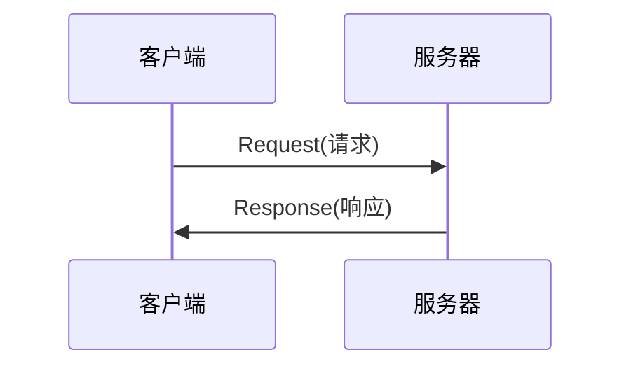

# HTTP
> GitHub@[orca-j35](https://github.com/orca-j35)，所有笔记均托管于 [python_notes](https://github.com/orca-j35/python_notes) 仓库
>

## 工具

[httpbin](http://httpbin.org/) - A simple HTTP Request & Response Service. 

可利用 [httpbin](http://httpbin.org/) 来测试 HTTP 请求，并观察响应结果。

## URI/URL/URN

### URI

URI(Uniform Resource Identifier) - 统一资源标识符，RFC2396 分别对这 3 个单词进行了如下定义：

- Uniform - 规定统一的格式可方便处理多种不同类型的资源， 而不用根据上下文环境来识别资源指定的访问方式。 另外， 加入新增的协议方案(如 http: 或 ftp:)也更容易。
- Resource - 资源的定义是“可标识的任何东西”。 除了文档文件、 图像或服务(例如当天的天气预报)等能够区别于其他类型的， 全都可作为资源。 另外， 资源不仅可以是单一的， 也可以是多数的集合体。
- Identifier 表示可标识的对象。 也称为标识符。 

综上所述， URI 就是由某个协议方案表示的资源的定位标识符。 协议方案是指访问资源所使用的协议类型名称。 

"RFC3986： 统一资源标识符(URI)通用语法"中列举了几种 URI 例
子， 如下所示:

- ftp://ftp.is.co.za/rfc/rfc1808.txt
- http://www.ietf.org/rfc/rfc2396.txt
- ldap://[2001:db8::7]/c=GB?objectClass?one
- mailto:John.Doe@example.com
- news:comp.infosystems.www.servers.unix
- tel:+1-816-555-1212
- telnet://192.0.2.16:80/
- urn:oasis:names:specification:docbook:dtd:xml:4.1.2
- file:robots.txt

URL 和 URN 均属于 URI 的子集，URI/URL/URN 三者的关系如下:


### URL

URL(Uniform Resource Locator) - 统一资源定位符，在访问 Web 页面时需要输入的网页地址便属于 URL (如，http://hackr.jp/)。

URI 用字符串标识某一互联网资源， 而 URL表示资源的地点(互联网上所处的位置)，s所以 URL是 URI 的子集。 

### URN

URN(Universal Resource Name) - 统一资源名称，URN 只命名资源而不指定如何让定位资源。例如 urn:isbn:0451450523，此 URN 指定了一本书的 ISBN，可以唯一标识这一本书，但没有定位该书的位置。

## HTTP/HTTPS

> 扩展阅读: 
>
> - [图解SSL/TLS协议](http://www.ruanyifeng.com/blog/2014/09/illustration-ssl.html)
> - [SSL/TLS协议运行机制的概述](SSL/TLS协议运行机制的概述)

HTTP(*Hyper* *Text* *Transfer* *Protocol*)是在网络中传输超文本(*Hypertext*)数据的传输协议。

HTTP 本身没有加密机制，但可以通过将 HTTP 和 SSL(*Secure* *Socket* *Layer* - 安全套接层)或 TLS(*Transport* *Layer* *Security* - 安全层传输协议) 组合使用，从而加密 HTTP 的通信内容。与 SSL 组合使用的 HTTP 被称为 HTTPS(HTTP Secure，超文本传输安全协议)或 HTTP over SSL。用 SSL建立安全通信线路之后， 就可以在这条线路上进行 HTTP 通信了。 

HTTP + 加密 + 认证 + 完整性保护 = HTTPS


## HTTP 请求过程



## HTTP 协议

> 参考:
>
> - [HTTP 协议入门](http://www.ruanyifeng.com/blog/2016/08/http.html)
>
> 扩展阅读:
>
> - [互联网协议入门（一）](http://www.ruanyifeng.com/blog/2012/05/internet_protocol_suite_part_i.html)
> - [互联网协议入门（二） ](http://www.ruanyifeng.com/blog/2012/06/internet_protocol_suite_part_ii.html)

HTTP(*Hyper* *Text* *Transfer* *Protocol*)是基于 TCP/IP 协议的[**应用层协议**](http://www.ruanyifeng.com/blog/2012/05/internet_protocol_suite_part_i.html)。它不涉及数据包(*packet*)传输，主要规定了客户端和服务器之间的通信格式，默认使用 80 端口。

### HTTP 请求格式

下面是一个 HTTP/1.0 的请求消息:

```http
GET / HTTP/1.0
User-Agent: Mozilla/5.0 (Macintosh; Intel Mac OS X 10_10_5)
Accept: */*
```

第一行是请求命令，必须在尾部添加协议版本(`HTTP/1.0`)。后面就是多行头信息，描述客户端的情况。

### 命令

GET

POST

HEAD

OPTIONS

DELETE

### HTTP 响应格式

下面是一个 HTTP/1.0 的响应消息

```http
HTTP/1.0 200 OK 
Content-Type: text/plain
Content-Length: 137582
Expires: Thu, 05 Dec 1997 16:00:00 GMT
Last-Modified: Wed, 5 August 1996 15:55:28 GMT
Server: Apache 0.84

<html>
  <body>Hello World</body>
</html>
```

响应消息的格式是:

```
头信息
一个空行(\r\n)
数据
```

头信息的第一行需为"协议版本+状态码(*status* *code*)+状态描述符"

### 状态码

#### Content-Type

在 HTTP 1.0 中，响应消息中的头信息必须是 ASCII 码，数据部分可以是任何格式。服务器在响应消息中必须告诉客户端数据部分的格式，这便是 `Content-Type` 字段的功能。

`Content-Type` 字段的常见值如下:

```http
text/plain
text/html
text/css
image/jpeg
image/png
image/svg+xml
audio/mp4
video/mp4
application/javascript
application/pdf
application/zip
application/atom+xml
```

这些数据类型总称为 `MIME type`，每个值包括一级类型和二级类型，之间用斜杠分隔。

除了预定义的类型，厂商也可以自定义类型，例如:

```http
application/vnd.debian.binary-package
```

上面的类型表明，发送的是Debian系统的二进制数据包。

`MIME type`还可以在尾部使用分号，添加参数。

```http
Content-Type: text/html; charset=utf-8
```

#### Accept

客户端请求的时候，可以使用 `Accept` 字段声明自己可以接受哪些数据格式。

```http
Accept: */*
```

上面代码中，客户端声明自己可以接受任何格式的数据。

`MIME type`不仅用在HTTP协议，还可以用在其他地方，比如HTML网页。

```html
<meta http-equiv="Content-Type" content="text/html; charset=UTF-8" />
<!-- 等同于 -->
<meta charset="utf-8" /> 
```

#### Content-Encoding

由于发送的数据可以是任何格式，因此可以把数据压缩后再发送。`Content-Encoding`字段说明数据的压缩方法。

```http
Content-Encoding: gzip
Content-Encoding: compress
Content-Encoding: deflate
```

客户端在请求时，用`Accept-Encoding`字段说明自己可以接受哪些压缩方法。

```http
Accept-Encoding: gzip, deflate
```

#### Connection

HTTP/1.0 版的主要缺点是，每个TCP连接只能发送一个请求。发送数据完毕，连接就关闭，如果还要请求其他资源，就必须再新建一个连接。

TCP连接的新建成本很高，因为需要客户端和服务器三次握手，并且开始时发送速率较慢（slow start）。所以，HTTP 1.0版本的性能比较差。随着网页加载的外部资源越来越多，这个问题就愈发突出了。


为了解决这个问题，有些浏览器在请求时，用了一个非标准的`Connection`字段。

```http
Connection: keep-alive
```

这个字段要求服务器不要关闭TCP连接，以便其他请求复用。服务器同样回应这个字段。

```http
Connection: keep-alive
```

一个可以复用的 TCP 连接就建立了，直到客户端或服务器主动关闭连接。但是，这不是标准字段，不同实现的行为可能不一致，因此不是根本的解决办法。

HTTP 1.1 版的最大变化，就是引入了持久连接（persistent connection），即TCP连接默认不关闭，可以被多个请求复用，不用声明`Connection: keep-alive`。

客户端和服务器发现对方一段时间没有活动，就可以主动关闭连接。不过，规范的做法是，客户端在最后一个请求时，发送`Connection: close`，明确要求服务器关闭TCP连接。

```http
Connection: close
```

目前，对于同一个域名，大多数浏览器允许同时建立6个持久连接。

#### Content-Length

HTTP 1.1 版引入了管道机制（*pipelining*），即在同一个 TCP 连接里面，客户端可以同时发送多个请求。这样就进一步改进了 HTTP 协议的效率。

举例来说，客户端需要请求两个资源。以前的做法是，在同一个TCP连接里面，先发送A请求，然后等待服务器做出回应，收到后再发出B请求。管道机制则是允许浏览器同时发出A请求和B请求，但是服务器还是按照顺序，先回应A请求，完成后再回应B请求。

一个 TCP 连接现在可以传送多个回应，势必就要有一种机制，区分数据包是属于哪一个回应的。这就是 `Content-length` 字段的作用，声明本次回应的数据长度。

```http
Content-Length: 3495
```

上面代码告诉浏览器，本次回应的长度是 3495 个字节，后面的字节就属于下一个回应了。

在 1.0 版中，`Content-Length` 字段不是必需的，因为浏览器发现服务器关闭了TCP连接，就表明收到的数据包已经全了。

#### Transfer-Encoding

使用 `Content-Length` 字段的前提条件是，服务器发送回应之前，必须知道回应的数据长度。

对于一些很耗时的动态操作来说，这意味着，服务器要等到所有操作完成，才能发送数据，显然这样的效率不高。更好的处理方法是，产生一块数据，就发送一块，采用"流模式"(*stream*)取代"缓存模式"(*buffer*)。

因此，1.1 版规定可以不使用 `Content-Length` 字段，而使用["分块传输编码"](https://zh.wikipedia.org/wiki/分块传输编码)(chunked transfer encoding)。只要请求或回应的头信息有 `Transfer-Encoding` 字段，就表明回应将由数量未定的数据块组成。

```http
Transfer-Encoding: chunked
```

每个非空的数据块之前，会有一个16进制的数值，表示这个块的长度。最后是一个大小为0的块，就表示本次回应的数据发送完了。下面是一个例子。

```http
HTTP/1.1 200 OK
Content-Type: text/plain
Transfer-Encoding: chunked

25
This is the data in the first chunk

1C
and this is the second one

3
con

8
sequence

0
```

#### Host

在 1.1 版中，客户端请求的头信息新增了`Host`字段，用来指定服务器的域名。

```http
Host: www.example.com
```

有了`Host`字段，就可以将请求发往同一台服务器上的不同网站，为虚拟主机的兴起打下了基础。