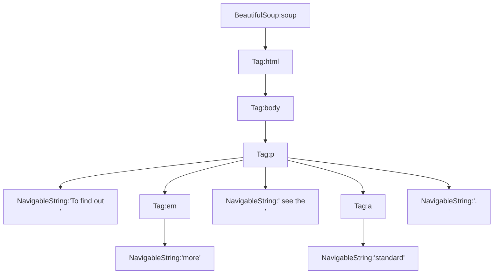

# BeautifulSoup - 解析树
> GitHub@[orca-j35](https://github.com/orca-j35)，所有笔记均托管于 [python_notes](https://github.com/orca-j35/python_notes) 仓库


## 在解析树中导航

> 参考: [Navigating the tree](https://www.crummy.com/software/BeautifulSoup/bs4/doc/#navigating-the-tree)

在学习与解析树相关的"导航字段"之前，我们需要先了解 BeautifulSoup 解析树的结构，下面这段 HTML 和其解析树如下:

```python
markup = '''
<p>To find out
    <em>more</em> see the
    <a href="http://www.w3.org/XML">standard</a>.
</p>'''
soup = BeautifulSoup(markup, 'lxml')
```



⚠"导航字段"的返回值总是节点对象(如，Tag 对象、NavigableString 对象)，或由节点对象组成的列表(或迭代器)。


### Going down

Tag 中包含的字符串或 Tag 等节点被视作该 Tag 的 children (或 descendants )节点。为了便于在 children (或 descendants )节点中进行导航，BeautifulSoup 提供了许多与此相关的方法。

⚠BeautifulSoup 中的字符串节点(如，NavigableString和注释)不支持与导航相关的属性，因为字符串节点永远不会包含任何 children 节点。

#### 节点名

可使用节点名来选取目标节点，此时会返回子孙节点中的第一个同名节点。

```python
html_doc = """
<html>
<head>
    <title>The Dormouse's story</title>
</head>
<body>
    <p class="title"><b>The Dormouse's story</b></p>

    <p class="story">Once upon a time there were three little sisters; and their names were
        <a href="http://example.com/elsie" class="sister" id="link1">Elsie</a>,
        <a href="http://example.com/lacie" class="sister" id="link2">Lacie</a> and
        <a href="http://example.com/tillie" class="sister" id="link3">Tillie</a>;
        and they lived at the bottom of a well.
    </p>

    <p class="story">...</p>
"""
from bs4 import BeautifulSoup
soup = BeautifulSoup(html_doc, 'html.parser')
print(repr(f"{type(soup.head)}:{soup.head}"))
print(repr(f"{type(soup.title)}:{soup.title}"))
print(repr(f"{type(soup.a)}:{soup.a}"))
```

输出:

```
"<class 'bs4.element.Tag'>:<head>\n<title>The Dormouse's story</title>\n</head>"
"<class 'bs4.element.Tag'>:<title>The Dormouse's story</title>"
'<class \'bs4.element.Tag\'>:<a class="sister" href="http://example.com/elsie" id="link1">Elsie</a>'
```

#### .contents🔧

`.contents` 字段会返回一个由"直接子节点"组成的列表:

```python
html_doc = """
<html>
<head>
    <title>The Dormouse's story</title>
</head>
<body>
    <p class="title"><b>The Dormouse's story</b></p>

    <p class="story">Once upon a time there were three little sisters; and their names were
        <a href="http://example.com/elsie" class="sister" id="link1">Elsie</a>,
        <a href="http://example.com/lacie" class="sister" id="link2">Lacie</a> and
        <a href="http://example.com/tillie" class="sister" id="link3">Tillie</a>;
        and they lived at the bottom of a well.
    </p>

    <p class="story">...</p>
"""
from pprint import pprint
from bs4 import BeautifulSoup

soup = BeautifulSoup(html_doc, 'html.parser')
p = soup.find('p', 'story')
pprint(p.contents)
pprint([type(i) for i in p.contents])
```

输出:

```
['Once upon a time there were three little sisters; and their names were\n'
 '        ',
 <a class="sister" href="http://example.com/elsie" id="link1">Elsie</a>,
 ',\n        ',
 <a class="sister" href="http://example.com/lacie" id="link2">Lacie</a>,
 ' and\n        ',
 <a class="sister" href="http://example.com/tillie" id="link3">Tillie</a>,
 ';\n        and they lived at the bottom of a well.\n    ']
[<class 'bs4.element.NavigableString'>,
 <class 'bs4.element.Tag'>,
 <class 'bs4.element.NavigableString'>,
 <class 'bs4.element.Tag'>,
 <class 'bs4.element.NavigableString'>,
 <class 'bs4.element.Tag'>,
 <class 'bs4.element.NavigableString'>]
```

⚠`.contents` 返回的列表中的元素是节点对象，不是字符串对象。

⚠BeautifulSoup 中的字符串节点(如，NavigableString和注释)不支持 `.contents` 字段，因为字符串节点永远不会包含任何 children 节点，强行获取会抛出异常:

```python
soup = BeautifulSoup(html_doc, 'html.parser')
pprint(soup.title.contents[0].contents)
#> AttributeError: 'NavigableString' object has no attribute 'contents'
```


#### .children🔧

`.children` 是 `.contents` 的迭代器版本，源代码如下:

```python
#Generator methods
@property
def children(self):
    # return iter() to make the purpose of the method clear
    return iter(self.contents)  # XXX This seems to be untested.
```


#### .descendants🔧

`.descendants` 字段会返回一个包含"所有子孙节点"的生成器，从而允许你以递归方式遍历当前节点的所有子孙节点。

```python
html_doc = """
<html>
<head>
    <title>The Dormouse's story</title>
</head>
<body>
    <p class="title"><b>The Dormouse's story</b></p>

    <p class="story">Once upon a time there were three little sisters; and their names were
        <a href="http://example.com/elsie" class="sister" id="link1">Elsie</a>,
        <a href="http://example.com/lacie" class="sister" id="link2">Lacie</a> and
        <a href="http://example.com/tillie" class="sister" id="link3">Tillie</a>;
        and they lived at the bottom of a well.
    </p>

    <p class="story">...</p>
"""
from pprint import pprint
from bs4 import BeautifulSoup

soup = BeautifulSoup(html_doc, 'html.parser')
print(soup.head.descendants)
print(list(soup.head.descendants))
```

输出:

```
<generator object Tag.descendants at 0x000001D502BA2750>
['\n', <title>The Dormouse's story</title>, "The Dormouse's story", '\n']
```


#### .string🔧

`.string` 属性被用于获取 tag 内部的字符串，其返回值可以是 `NavigableString` , `None` , `Comment`，具体如下:

- 如果 tag 仅含一个字符串子项，则返回一个包含该字符串的 `NavigableString` 对象:

  ```python
  from bs4 import BeautifulSoup
  soup = BeautifulSoup('<b class="boldest">Extremely bold</b>', 'lxml')
  tag = soup.b
  print(type(tag.string))
  #> <class 'bs4.element.NavigableString'>
  print(tag.string)
  #> Extremely bold
  ```

- 如果 tag 中仅包含一个子 tag，且该 tag 仅含一个字符串子项，则返回一个包含该字符串的 `NavigableString` 对象，该逻辑可递归:

  ```python
  soup = BeautifulSoup('<b class="boldest">
                       	<i>
                       	  <i>Extremely bold</i>
                       	</i></b>',
                       'lxml')
  tag = soup.b
  print(type(tag.string))
  #> <class 'bs4.element.NavigableString'>
  print(tag.string)
  #> Extremely bold
  ```

- 如果 tag 中没有子项，或单个子项中不包含字符串，或有多个子项，或有多个字符串子项，都将会返回 `None`:

  ```python
  # 没有子项
  soup = BeautifulSoup('<b class="boldest"></b>', 'lxml')
  tag = soup.b
  print(type(tag.string))
  #> <class 'NoneType'>
  print(tag.string)
  #> None
  
  # 子项中不包含字符串
  soup = BeautifulSoup('<b class="boldest"><i></i></b>', 'lxml')
  print(soup.b.string)
  #> None
  
  # 多个子项,即便包含字符串也返回None
  soup = BeautifulSoup('<b class="boldest">link to <i>example.com</i></b>',
                       'lxml')
  print(soup.b.string)
  #> None
  ```

- 如果 tag 仅含一个注释子项，则返回一个包含该注释的 `Comment` 对象:

  ```python
  from bs4 import BeautifulSoup
  markup = "<b><!--Hey, buddy. Want to buy a used parser?--></b>"
  soup = BeautifulSoup(markup, 'lxml')
  comment = soup.b.string
  print(type(comment))
  #> <class 'bs4.element.Comment'>
  print(comment)
  #> Hey, buddy. Want to buy a used parser?
  ```

#### .strings🔧

如果 tag 有数个内含字符串的子孙节点，`.stirng` 字段允许你以递归方式遍历这些字符串:

```python
html_doc = """
<html>
<head>
    <title>The Dormouse's story</title>
</head>
<body>
    <p class="title"><b>The Dormouse's story</b></p>

    <p class="story">Once upon a time there were three little sisters; and their names were
        <a href="http://example.com/elsie" class="sister" id="link1">Elsie</a>,
        <a href="http://example.com/lacie" class="sister" id="link2">Lacie</a> and
        <a href="http://example.com/tillie" class="sister" id="link3">Tillie</a>;
        and they lived at the bottom of a well.
    </p>

    <p class="story">...</p>
"""
from pprint import pprint
from bs4 import BeautifulSoup

soup = BeautifulSoup(html_doc, 'html.parser')
print(soup.strings)
pprint(list(soup.strings))
```

输出:

```
<generator object Tag._all_strings at 0x0000013C23342750>
['\n',
 '\n',
 '\n',
 "The Dormouse's story",
 '\n',
 '\n',
 '\n',
 "The Dormouse's story",
 '\n',
 'Once upon a time there were three little sisters; and their names were\n'
 '        ',
 'Elsie',
 ',\n        ',
 'Lacie',
 ' and\n        ',
 'Tillie',
 ';\n        and they lived at the bottom of a well.\n    ',
 '\n',
 '...',
 '\n']
```

#### stripped_strings🔧

`.stripped_strings` 的功能与 `.strings` 类似，但会剥离掉多余的空白符。`.stripped_strings` 会忽略掉完全由空白符组成的字符串，并删除字符串开头和结尾处的空白符。

```python
from pprint import pprint
from bs4 import BeautifulSoup

soup = BeautifulSoup(html_doc, 'html.parser')
print(soup.stripped_strings)
pprint(list(soup.stripped_strings))
```

输出:

```
<generator object Tag.stripped_strings at 0x000002644BE22750>
["The Dormouse's story",
 "The Dormouse's story",
 'Once upon a time there were three little sisters; and their names were',
 'Elsie',
 ',',
 'Lacie',
 'and',
 'Tillie',
 ';\n        and they lived at the bottom of a well.',
 '...']
```


### Going up

每个 tag 或字符串都有父节点: 包含当前 tag 的节点。

#### .parent🔧

`.parent` 字段用于访问当前节点的父节点。

```python
html_doc = """
<html>
<head>
    <title>The Dormouse's story</title>
</head>
<body>
    <p class="title"><b>The Dormouse's story</b></p>

    <p class="story">Once upon a time there were three little sisters; and their names were
        <a href="http://example.com/elsie" class="sister" id="link1">Elsie</a>,
        <a href="http://example.com/lacie" class="sister" id="link2">Lacie</a> and
        <a href="http://example.com/tillie" class="sister" id="link3">Tillie</a>;
        and they lived at the bottom of a well.
    </p>

    <p class="story">...</p>
"""
from pprint import pprint
from bs4 import BeautifulSoup

soup = BeautifulSoup(html_doc, 'html.parser')
print(soup.parent)
print(soup.html.parent.name)
print(soup.title.parent.name)
```

输出:

```
None
[document]
head
```

#### .parents🔧

`.parent` 字段会返回一个内含所有祖先节点的生成器，可用于迭代访问当前节点的所有祖先节点:

```python
from pprint import pprint
from bs4 import BeautifulSoup

soup = BeautifulSoup(html_doc, 'html.parser')
link = soup.a
print(link.parents)
print([i.name for i in link.parents])
```

输出:

```
<generator object PageElement.parents at 0x0000013D87571750>
['p', 'body', 'html', '[document]']
```

### Going sideways

先考虑下面这个示例:

```python
sibling_soup = BeautifulSoup("<a><b>text1</b><c>text2</c></b></a>",
                             'html.parser')
print(sibling_soup.prettify())
```

输出:

```
<a>
 <b>
  text1
 </b>
 <c>
  text2
 </c>
</a>
```

`<b>` 和 `<c>` 是兄弟节点，因为它们拥有相同的父节点；字符串 `'text1'` 和 `'text2'` 不是兄弟节点，因为它们的父节点不同。

#### .next_sibling🔧.previous_sibling🔧

`.next_sibling` 字段用于选取下一个兄弟节点，`.previous_sibling` 字段用于选取上一个兄弟节点:

```python
sibling_soup = BeautifulSoup("<a><b>text1</b><c>text2</c></b></a>",
                             'html.parser')
print(sibling_soup.b.previous_sibling)
print(sibling_soup.b.next_sibling)

print(sibling_soup.c.previous_sibling)
print(sibling_soup.c.next_sibling)
```

输出:

```
None
<c>text2</c>
<b>text1</b>
None
```

`<c>` 没有 `.next_sibling`，因为在 `<c>` 之后并没有兄弟节点；`<b>` 没有 `.previous_sibling`，因为在 `<b>` 之前并没有兄弟节点。

⚠在实际的文档中，节点的 `.next_sibling` ( 或 `.previous_sibling`) 字段可能是包含空白符的字符串:

```python
html_doc = """
<html>
<head>
    <title>The Dormouse's story</title>
</head>
<body>
    <p class="title"><b>The Dormouse's story</b></p>
    <b>The</b>
    <p class="story">Once upon a time there were three little sisters; and their names were
        <a href="http://example.com/elsie" class="sister" id="link1">Elsie</a>,
        <a href="http://example.com/lacie" class="sister" id="link2">Lacie</a> and
        <a href="http://example.com/tillie" class="sister" id="link3">Tillie</a>;
        and they lived at the bottom of a well.
    </p>

    <p class="story">...</p>
"""
from pprint import pprint
from bs4 import BeautifulSoup

soup = BeautifulSoup(html_doc, 'html.parser')
print(repr(soup.a.next_sibling))
```

输出:

```
',\n        '
```


#### .next_siblings🔧.previous_siblings🔧

`.next_siblings` 和 `.previous_siblings` 会返回由兄弟节点组成的生成器:

```python
html_doc = """
<html>
<head>
    <title>The Dormouse's story</title>
</head>
<body>
    <p class="title"><b>The Dormouse's story</b></p>
    <b>The</b>
    <p class="story">Once upon a time there were three little sisters; and their names were
        <a href="http://example.com/elsie" class="sister" id="link1">Elsie</a>,
        <a href="http://example.com/lacie" class="sister" id="link2">Lacie</a> and
        <a href="http://example.com/tillie" class="sister" id="link3">Tillie</a>;
        and they lived at the bottom of a well.
    </p>

    <p class="story">...</p>
"""
from pprint import pprint
from bs4 import BeautifulSoup

soup = BeautifulSoup(html_doc, 'html.parser')
print(soup.a.next_siblings)
pprint([repr(i) for i in soup.a.next_siblings])

pprint([repr(i) for i in soup.find(id='link3').previous_siblings])
```

输出:

```
<generator object PageElement.next_siblings at 0x000001DDDD0C2750>
["',\\n        '",
 '<a class="sister" href="http://example.com/lacie" id="link2">Lacie</a>',
 "' and\\n        '",
 '<a class="sister" href="http://example.com/tillie" id="link3">Tillie</a>',
 "';\\n        and they lived at the bottom of a well.\\n    '"]
["' and\\n        '",
 '<a class="sister" href="http://example.com/lacie" id="link2">Lacie</a>',
 "',\\n        '",
 '<a class="sister" href="http://example.com/elsie" id="link1">Elsie</a>',
 "'Once upon a time there were three little sisters; and their names "
 "were\\n        '"]
```


### Going back and forth

先看一段 "three sisters" 中的 HTML 文档:

```html
<html><head><title>The Dormouse's story</title></head>
<p class="title"><b>The Dormouse's story</b></p>
```

HTML 解析器在获得上面的 HTML 文档后，会将其转换成一连串事件: "打开 `<html>` 标签"，"打开一个 `<head>` 标签"，"打开一个 `<title>` 标签"，"添加一段字符串"，"关闭 `<title>` 标签"，"打开 `<p>` 标签"，等等。BeautifulSoup 提供了重现文档初始解析过程的工具。

#### .next_element🔧.previous_element🔧

`.next_element` 字段指向下一个被解析的节点，其结果通常与 `.next_sibling` 不同:

```python
html_doc = """
<html>
<head>
    <title>The Dormouse's story</title>
</head>
<body>
    <p class="title"><b>The Dormouse's story</b></p>
    <b>The</b>
    <p class="story">Once upon a time there were three little sisters; and their names were
        <a href="http://example.com/elsie" class="sister" id="link1">Elsie</a>,
        <a href="http://example.com/lacie" class="sister" id="link2">Lacie</a> and
        <a href="http://example.com/tillie" class="sister" id="link3">Tillie</a>;
        and they lived at the bottom of a well.
    </p>

    <p class="story">...</p>
"""
from pprint import pprint
from bs4 import BeautifulSoup

soup = BeautifulSoup(html_doc, 'html.parser')
print(repr(soup.find('a', id='link3').next_sibling)) # 下一个兄弟节点
print(repr(soup.find('a', id='link3').next_element)) # 下一个被解析的节点
```

输出:

```python
';\n        and they lived at the bottom of a well.\n    '
'Tillie'
```

`.previous_element` 字段指向前一个被解析的节点，其结果通常与 `.previous_sibling` 不同:

```python
sibling_soup = BeautifulSoup("<a><b>text1</b><c>text2</c></b></a>",
                             'html.parser')

print(repr(sibling_soup.c.next_element))
print(repr(sibling_soup.c.next_sibling))
```

输出:

```
'text2'
None
```

#### .next_elements🔧.previous_elements🔧

`.next_elements` 会返回一个生成器，该生成器会按照解析顺序逆向获取先前解析的节点； `.previous_elements` 会返回一个生成器，该生成器会按照解析顺序依次获取之后解析的节点。

```python
sibling_soup = BeautifulSoup("<a><b>text1</b><c>text2</c></b></a>",
                             'html.parser')

pprint([repr(i) for i in sibling_soup.a.next_elements])
print(repr(sibling_soup.c.next_sibling))
```


## 修改解析树

> GitHub@[orca-j35](https://github.com/orca-j35)，所有笔记均托管于 [python_notes](https://github.com/orca-j35/python_notes) 仓库

BeautifulSoup 的强项是搜索文档树，但是你也可以利用 BeautifulSoup 来修改文档树，并将修改后的文档树保存到一个新的 HTML 或 XML 文档中，具体功能如下:

- [修改 tag 名和属性](https://www.crummy.com/software/BeautifulSoup/bs4/doc/#changing-tag-names-and-attributes)
- [修改 `.string`](https://www.crummy.com/software/BeautifulSoup/bs4/doc/#modifying-string)
- [`append()`](https://www.crummy.com/software/BeautifulSoup/bs4/doc/#append) - 向 tag 中追加内容
- [`extend()`](https://www.crummy.com/software/BeautifulSoup/bs4/doc/#extend) - 4.7.0 新增方法，扩展 tag 中的内容
- [`NavigableString()` & `.new_tag()`](https://www.crummy.com/software/BeautifulSoup/bs4/doc/#navigablestring-and-new-tag) - 向 tag 中添加新文本或新标签
- [`insert()`](https://www.crummy.com/software/BeautifulSoup/bs4/doc/#insert) - 向 tag 中插入内容，可设定插入位置
- [`insert_before()` & `insert_after()`](https://www.crummy.com/software/BeautifulSoup/bs4/doc/#insert-before-and-insert-after) - 在当前 tag 前(或后)插入内容
- [`clear()`](https://www.crummy.com/software/BeautifulSoup/bs4/doc/#clear) - 清理当前 tag 中的内容
- [`extract()`](https://www.crummy.com/software/BeautifulSoup/bs4/doc/#extract) - 从文档树中移除当前 tag，并返回被移除的 tag
- [`decompose()`](https://www.crummy.com/software/BeautifulSoup/bs4/doc/#decompose) - 从文档树中移除当前 tag，并完全销毁
- [`replace_with()`](https://www.crummy.com/software/BeautifulSoup/bs4/doc/#replace-with) - 替换文档树中的内容
- [`wrap()`](https://www.crummy.com/software/BeautifulSoup/bs4/doc/#wrap) - 打包指定元素
- [`unwrap()`](https://www.crummy.com/software/BeautifulSoup/bs4/doc/#unwrap) - 解包指定元素