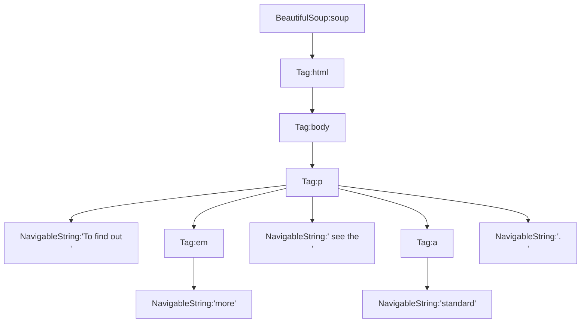

# BeautifulSoup
> GitHub@[orca-j35](https://github.com/orca-j35)，所有笔记均托管于 [python_notes](https://github.com/orca-j35/python_notes) 仓库

## 概述

⚠官方文档中混杂了 Py2 和 Py3 的术语和代码，本笔记针对 Py3 梳理了文档中的内容，在了解 BeautifulSoup 的过程中，建议将本笔记与官方文档配合食用。

[Beautiful Soup](http://www.crummy.com/software/BeautifulSoup/) 是一个用来从 HTML 或 XML 文件中提取数据的 Python 库。在使用 BeautifulSoup 时，我们选择自己喜欢的解析器，从而以自己熟悉的方式来导航、查找和修改解析树。

相关资源:

- Home: https://www.crummy.com/software/BeautifulSoup/
- PyPI: https://pypi.org/project/beautifulsoup4/
- Docs-EN: https://www.crummy.com/software/BeautifulSoup/bs4/doc/
- Docs-CN: https://www.crummy.com/software/BeautifulSoup/bs4/doc.zh/

安装:

```shell
pip install beautifulsoup4
```

如果遇到安装问题，可以参考:

- [Installing Beautiful Soup](https://www.crummy.com/software/BeautifulSoup/bs4/doc/#installing-beautiful-soup)
- [Problems after installation](https://www.crummy.com/software/BeautifulSoup/bs4/doc/#problems-after-installation)

如果能顺利执行以下代码，则说明安装成功:

```python
from bs4 import BeautifulSoup
soup = BeautifulSoup('<p>Hello</p>', 'lxml')
print(soup.p.string) #> Hello
```

⚠在安装 BeautifulSoup4 时，使用的名称是 `beautifulsoup4`；在导入时，使用的名称是 `bs4` (路径为 `~\Python\Lib\site-packages\bs4`)。由此可见，在安装库和导入库时使用的名称并不一定相同。

### Three sisters

下面这段名为 "Three sisters" 文档是本笔记的 HTML 示例文档(官方文档中也用的这段代码):

```html
html_doc = """
<html><head><title>The Dormouse's story</title></head>
<body>
<p class="title"><b>The Dormouse's story</b></p>

<p class="story">Once upon a time there were three little sisters; and their names were
<a href="http://example.com/elsie" class="sister" id="link1">Elsie</a>,
<a href="http://example.com/lacie" class="sister" id="link2">Lacie</a> and
<a href="http://example.com/tillie" class="sister" id="link3">Tillie</a>;
and they lived at the bottom of a well.</p>

<p class="story">...</p>
"""
```

这段 HTML 文档存在 "tag soup"，HTML 解析器会自动修复 "tag soup"

## BeautifulSoup()🛠

> 🛠BeautifulSoup(self, markup="", features=None, builder=None, parse_only=None, from_encoding=None, exclude_encodings=None, \*\*kwargs)
>

构造器 `BeautifulSoup()` 中各参数的含义如下:

- `markup` - 要解析的标签(*markup*)，可以是字符串或 file-like 对象。

  ```python
  from bs4 import BeautifulSoup
  
  with open("index.html") as fp:
      soup = BeautifulSoup(fp)
  
  soup = BeautifulSoup("<html>data</html>")
  ```

- `features` - 设置用来进行解析的解析器，可以是解析器的名称("lxml", "lxml-xml", "html.parser", "html5lib")，也可以是标签的类型("html", "html5", "xml")。建议明确给出需要使用的解析器，以便 BeautifulSoup 在不同的平台和虚拟环境中提供相同的结果。

  默认情况下，BeautifulSoup 会以 HTML 格式解析文档，如果要以 XML 格式解析文档，则需设置 `features='xml'`

  > If you don’t specify anything, you’ll get the best **HTML** parser that’s installed. Beautiful Soup ranks lxml’s parser as being the best, then html5lib’s, then Python’s built-in parser. You can override this by specifying one of the following:
  >
  > - What type of markup you want to parse. Currently supported are “html”, “xml”, and “html5”.
  > - The name of the parser library you want to use. Currently supported options are “lxml”, “html5lib”, and “html.parser” (Python’s built-in HTML parser)
  >
  > If you don’t have an appropriate parser installed, Beautiful Soup will ignore your request and pick a different parser. Right now, the only supported XML parser is lxml. If you don’t have lxml installed, asking for an XML parser won’t give you one, and asking for “lxml” won’t work either.
  >
  > -- https://www.crummy.com/software/BeautifulSoup/bs4/doc/#specifying-the-parser-to-use

- `builder` - 不需要使用的参数(A specific TreeBuilder to use instead of looking one up based on `features`)。

- `parse_only` - 以 SoupStrainer 对象作为实参值。在解析文档的过程中只会考虑与 SoupStrainer 匹配的部分。当我们只需要解析某部分文档时非常有用，比如由于文档太大而无法放全部放入内存时，便可以考虑只解析某部分文档。

- `from_encoding` - 一个字符串，表示被解析的文档的编码。如果 BeautifulSoup 在猜测文档编码时出现错误，请传递此参数。

- `exclude_encodings` - 一个字符串列表，表示已知的错误编码。如果你不知道文档编码，但你知道 BeautifulSoup 的猜测出现错误时，请传递此参数。

- `**kwargs` - 为了保证向后兼容，构造可接受 BeautifulSoup3 中使用的某些关键字参数，但这些关键字参数在 BeautifulSoup4 中并不会执行任何操作。


### 解析器

Beautiful Soup 支持 Python 标准库中的 HTML [解析器](https://www.crummy.com/software/BeautifulSoup/bs4/doc.zh/#id9)，同时还支持一些第三方的解析器(如 [lxml](http://lxml.de/)):

- Python’s html.parser - `BeautifulSoup(markup,"html.parser")`
- lxml’s HTML parser - `BeautifulSoup(markup, "lxml")`
- lxml’s XML parser - `BeautifulSoup(markup, "lxml-xml")` 或 `BeautifulSoup(markup, "xml")`
- html5lib - `BeautifulSoup(markup, "html5lib")`

第三方解析器的安装方法和优缺点对比: [Installing a parser](https://www.crummy.com/software/BeautifulSoup/bs4/doc/#installing-a-parser)

建议使用 lxml 解析器来提高解析速度。早于 2.7.3 和 3.2.2 的 Python 版本，必须使用 lxml 和 html5lib 解析器，因为这些版本的内置 HTML 解析器不够稳定。

Note: 如果试图解析无效的 HTML/XML 文档，不同解析器可能会给出不同的结果。

有关解析器间的具体差异，详见: [Specifying the parser to use](https://www.crummy.com/software/BeautifulSoup/bs4/doc/#specifying-the-parser-to-use)

## 对象的种类

> 参考: [Kinds of objects](https://www.crummy.com/software/BeautifulSoup/bs4/doc/#kinds-of-objects)

BeautifulSoup 会将复杂的 HTML 文档转换为复杂的 Python 对象树，树中的每个节点都是一个 Python 对象，共有四种需要处理对象: `Tag`, `NavigableString`, `BeautifulSoup`, `Comment`

### Tag 🐘

`Tag` 对象对应于原始文档中的 XML 或 HTML 标记(tag)。

```python
from bs4 import BeautifulSoup
soup = BeautifulSoup('<b class="boldest">Extremely bold</b>', 'lxml')
tag = soup.b
print(type(tag))
# <class 'bs4.element.Tag'>
```

`Tag` 对象拥有很多属性和方法，在 [Navigating the tree](https://www.crummy.com/software/BeautifulSoup/bs4/doc/#navigating-the-tree) 和 [Searching the tree](https://www.crummy.com/software/BeautifulSoup/bs4/doc/#searching-the-tree) 中有详细解释。本小节仅介绍 `Tag` 对象两个最重要的特性。

#### name

每个 `Tag` 对象都有自己的名字，通过 `.name` 字段访问:

```python
from bs4 import BeautifulSoup
soup = BeautifulSoup('<b class="boldest">Extremely bold</b>', 'lxml')
tag = soup.b
print(tag.name)
#> b
```

如果修改了 `Tag` 对象的 `.name` 字段，则会影响 `BeautifulSoup` 对象生成的 HTML 文档:

```python
from bs4 import BeautifulSoup
soup = BeautifulSoup('<b class="boldest">Extremely bold</b>', 'lxml')
tag = soup.b
tag.name = "blockquote"
print(tag)
#> <blockquote class="boldest">Extremely bold</blockquote>
print(soup)
#> <html><body><blockquote class="boldest">Extremely bold</blockquote></body></html>
```


#### Attributes

一个 HTML 标签可包含任意数量的属性(*attributes*)。例如，标签 `<b id="boldest">` 包含名为 `"id"` 的属性，其值为 `"boldest"`。

可将 `Tag` 对象视作存放标签属性的字典，键值对由属性名和属性值构成，使用方法也与字典相同。另外，还可通过 `.attrs` 字段来获取存放标签属性的字典。

```python
from bs4 import BeautifulSoup
soup = BeautifulSoup('<b id="boldest">Extremely bold</b>', 'lxml')
tag = soup.b
print(tag['id'])  #> boldest
print(tag.get('id'))  #> boldest
print(tag.attrs) #> {'id': 'boldest'}
```

`Tag` 对象支持对标签的属性进行添加、删除、修改:

```python
from bs4 import BeautifulSoup
soup = BeautifulSoup('<b id="boldest">Extremely bold</b>', 'lxml')
tag = soup.b
tag['id'] = 'verybold'
tag['another-attribute'] = 1
print(tag)
#> <b another-attribute="1" id="verybold">Extremely bold</b>
del tag['id']
del tag['another-attribute']
print(tag)
#> <b>Extremely bold</b>
print(tag.get('id', "Don't have"))
#> Don't have
print(tag['id']
#> KeyError: 'id'
```

`.has_attr()` 方法用于判断 `Tag` 对象是否包含某个属性:

```python
from bs4 import BeautifulSoup
soup = BeautifulSoup('<b id="boldest">Extremely bold</b>', 'lxml')
print(soup.b.has_attr('id'))
#> True
print(soup.b.has_attr('class'))
#> False
```


#### Multi-valued attributes

HTML 4 中某些属性可以具备多个值，HTML 5 在 HTML 4 的基础上删除了一些多值属性，但又引入了一些多值属性。最常见的多值属性是 `class` (HTML 标签可持有多个 CSS 类)，其它一些多值属性的例子: `rel`, `rev`, `accept-charset`, `headers`, `accesskey`。

BeautifulSoup 将多值属性的值表示为一个列表：

```python
from bs4 import BeautifulSoup
css_soup = BeautifulSoup('<p class="body"></p>', 'lxml')
print(css_soup.p['class'])
#> ["body"]

css_soup = BeautifulSoup('<p class="body strikeout"></p>', 'lxml')
print(css_soup.p['class'])
#> ["body", "strikeout"]
```

如果某个属性看起来好像有多个值，但在任何版本的 HTML 定义中都没有被定义为多值属性，那么 BeautifulSoup 会将这个属性作为字符组返回:

```python
id_soup = BeautifulSoup('<p id="my id"></p>', 'lxml')
print(id_soup.p['id'])
#> my id
```

将 `Tag` 转换成字符串时，会对多个属性值进行合并:

```python
print(rel_soup.a['rel'])
# ['index']
rel_soup.a['rel'] = ['index', 'contents']
print(rel_soup.p)
# <p>Back to the <a rel="index contents">homepage</a></p>
```

 ``.get_attribute_list()` 方法用于获取标签属性列表，无论属性是否是多值属性都会返回一个列表:

```python
id_soup = BeautifulSoup('<p class="body strikeout" id="my id"></p>', 'lxml')
print(id_soup.p['class'])
#> ['body', 'strikeout']
print(id_soup.p.get_attribute_list('class'))
#> ['body', 'strikeout']
print(id_soup.p['id'])
#> my id
print(id_soup.p.get_attribute_list('id'))
#> ['my id']
```

如果文档以 XML 格式进行解析，则不会包含多值属性:

```python
xml_soup = BeautifulSoup('<p class="body strikeout"></p>', 'xml')
print(xml_soup.p['class'])
#> body strikeout
```

### NavigableString 🐘

`NavigableString` 继承自 `str` 类和 `PageElement` 类，不能对 `NavigableString` 对象所含字符串进行编辑，但是可以使用 `replace_with()` 方法进行替换:

```python
from bs4 import BeautifulSoup
soup = BeautifulSoup('<b class="boldest">Extremely bold</b>', 'lxml')
tag = soup.b
tag.string.replace_with("No longer bold")
print(tag)
#> <b class="boldest">No longer bold</b>
```

`NavigableString` 支持  [Navigating the tree](https://www.crummy.com/software/BeautifulSoup/bs4/doc/#navigating-the-tree) 和 [Searching the tree](https://www.crummy.com/software/BeautifulSoup/bs4/doc/#searching-the-tree) 中描述大部分功能，但并非全部功能。由于 `NavigableString` 对象只能包含字符串，不能包含其它内容(`Tag` 对象可以包含字符串或子 tag)，所以 `NavigableString` 不支持 `.contents` 或 `.string` 字段，也不支持 `find()` 方法。在 `NavigableString` 上调用 `name` 字段时，会返回 `None`

如果想要在 `BeautifulSoup` 外部使用 `NavigableString` 中的字符串，你应该先调用 `str()` 把 `NavigableString` 对象转换为普通的字符串对象。如果不将其转换为普通字符串的话，你将始终持有对整个 `BeautifulSoup` 解析树的引用，这会浪费大量内存。

可通过 `.string` 对象获取 `NavigableString` 对象，详见 [.string🔧](#.string🔧) 小节


### BeautifulSoup 🐘

`BeautifulSoup` 对象表示整个文档，在大部分时候，你可以将其视为 `Tag` 对象。`BeautifulSoup` 对象支持  [Navigating the tree](https://www.crummy.com/software/BeautifulSoup/bs4/doc/#navigating-the-tree) 和 [Searching the tree](https://www.crummy.com/software/BeautifulSoup/bs4/doc/#searching-the-tree) 中描述大部分功。

由于并没有与 `BeautifulSoup` 对象对应的 HTML/XML tag，因此 `BeautifulSoup` 对象的 `name` 字段为 `'[document]'`，并且不包含 HTML attributes。

```python
from bs4 import BeautifulSoup
soup = BeautifulSoup('<b class="boldest">Extremely bold</b>', 'lxml')
print(type(soup))
#> <class 'bs4.BeautifulSoup'>
print(soup.name)
#> [document]
```

### 注释及特殊字符串

`Tag`, `NavigableString`, `BeautifulSoup` 几乎涵盖了你在 HTML 或 XML 文件中看到的所有内容，但是仍有一些没有覆盖到的内容，比如注释(*comment*):

```python
from bs4 import BeautifulSoup
markup = "<b><!--Hey, buddy. Want to buy a used parser?--></b>"
soup = BeautifulSoup(markup, 'lxml')
comment = soup.b.string
print(type(comment))
#> <class 'bs4.element.Comment'>
print(comment)
#> Hey, buddy. Want to buy a used parser?
```

`Comment` 类继承自 `PreformattedString`，`PreformattedString` 继承自 `NavigableString`。也就是说 `Comment` 是一种特殊的 `NavigableString` 类型。

但是当注释出现在HTML文档中时，`Comment` 对象会使用特殊的格式输出:

```python
from bs4 import BeautifulSoup
markup = "<b><!--Hey, buddy. Want to buy a used parser?--></b>"
soup = BeautifulSoup(markup, 'lxml')
print(soup.b.prettify())
'''Out:
<b>
 <!--Hey, buddy. Want to buy a used parser?-->
</b>
'''
```

BeautifulSoup 还为 XML 文档中可能会出现的其它内容定义了各种类: 

- `CData`
- `ProcessingInstruction`
- `Declaration`
- `Doctype`

与 `Comment` 类似，这些类都是 `NavigableString` 的子类，并进行了一些扩展。下面这个示例中，将使用 CDATA block 来替换 `Comment`:

```python
from bs4 import BeautifulSoup
from bs4 import CData
markup = "<b><!--Hey, buddy. Want to buy a used parser?--></b>"
soup = BeautifulSoup(markup, 'lxml')
cdata = CData("A CDATA block")
comment = soup.b.string
comment.replace_with(cdata)
print(soup.b.prettify())
'''Out:
<b>
 <![CDATA[A CDATA block]]>
</b>
'''
```


## Output

BeautifulSoup 兼容 Py2 和 Py3 ，但 Py2 和 Py3 中的 `str` 对象并不相同，这会导出输出结果存在差异，在获取输出时需注意区分。

### .decode()🔨

该方法会将 `BeautifulSoup` 对象和 `Tag` 对象中的内容转换为 Unicode 字符串。

源代码中的注释如下:

```python
def decode(self, indent_level=None,
           eventual_encoding=DEFAULT_OUTPUT_ENCODING,
           formatter="minimal"):
    """Returns a Unicode representation of this tag and its contents.

        :param eventual_encoding: The tag is destined to be
           encoded into this encoding. This method is _not_
           responsible for performing that encoding. This information
           is passed in so that it can be substituted in if the
           document contains a <META> tag that mentions the document's
           encoding.
        """
```

对 Py3 而言，`decode()` 将返回 `str` 对象(Uncode 字符串):

```python
# in Python3
from bs4 import BeautifulSoup
markup = '<a href="http://example.com/">连接到<i>example.com</i></a>'
soup = BeautifulSoup(markup, 'lxml')
print(type(soup.decode()))
#> <class 'str'>
print(soup.decode())
#> <html><body><a href="http://example.com/">连接到<i>example.com</i></a></body></html>
```

对 Py2 而言，`decode()` 将返回 `Unicode` 对象(Uncode 字符串):

```python
# in Python2
>>> markup = u'<a href="http://example.com/">连接到<i>example.com</i></a>'
>>> soup = BeautifulSoup(markup, 'lxml')
>>> print(type(soup.decode()))
<type 'unicode'>
>>> print(soup.decode())
<html><body><a href="http://example.com/">连接到<i>example.com</i></a></body></html>
```


### .encode()🔨

该方法会先将数据结构转换为 Unicode 字符串，再按照指定编码对 Unicode 字符串进行编码，默认采用 UTF-8 编码。源代码如下:

```python
def encode(self, encoding=DEFAULT_OUTPUT_ENCODING,
           indent_level=None, formatter="minimal",
           errors="xmlcharrefreplace"):
    # Turn the data structure into Unicode, then encode the
    # Unicode.
    u = self.decode(indent_level, encoding, formatter)
    return u.encode(encoding, errors)
```

对 Py3 而言，`encode()` 将返回以 `encoding` 编码(默认采用 UTF-8)的 `bytes` 对象:

```python
# in Python3
from bs4 import BeautifulSoup
markup = '<a href="http://example.com/">连接到<i>example.com</i></a>'
soup = BeautifulSoup(markup, 'lxml')
print(type(soup.encode()))
#> <class 'bytes'>
print(soup.encode())
#> b'<html><body><a href="http://example.com/">\xe8\xbf\x9e\xe6\x8e\xa5\xe5\x88\xb0<i>example.com</i></a></body></html>'
```

对 Py2 而言，`encode()` 将返回以 `encoding` 编码(默认采用 UTF-8)的 `str` 对象(Py2 和 Py3 中的 `str` 对象并不相同):

```python
# in Python2
>>> markup = u'<a href="http://example.com/">连接到<i>example.com</i></a>'
>>> soup = BeautifulSoup(markup, 'lxml')
>>> print(soup.encode())
<html><body><a href="http://example.com/">连接到<i>example.com</i></a></body></html>
>>> soup.encode()
'<html><body><a href="http://example.com/">\xe8\xbf\x9e\xe6\x8e\xa5\xe5\x88\xb0<i>example.com</i></a></body></html>'
>>> type(soup.encode())
<type 'str'>
```


### .prettify()🔨

> 参考: https://www.crummy.com/software/BeautifulSoup/bs4/doc/#pretty-printing

🔨prettify(self, encoding=None, formatter="minimal")

当 `encoding==None` 时，`prettify()` 会将 BeautifulSoup 解析树转换为格式良好的 Unicode 字符串，在字符串中每个 HTML/XML tag 和 字符串都会独占一行；当 `encoding!=None` 时，`prettify()` 会将 BeautifulSoup 解析树编码为格式良好的 `bytes` 字符串。

`prettify()` 的源代码如下:

```python
# prettify()的源代码
def prettify(self, encoding=None, formatter="minimal"):
    if encoding is None:
        return self.decode(True, formatter=formatter)
    else:
        return self.encode(encoding, True, formatter=formatter)
```

示例 - in Py3:

```python
# in Python3
from bs4 import BeautifulSoup
markup = '<a href="http://example.com/">I linked to <i>example.com</i></a>'
soup = BeautifulSoup(markup, 'lxml')
print(type(soup.prettify()))
#> <class 'str'>
print(soup.prettify())
'''Out:
<html>
 <body>
  <a href="http://example.com/">
   I linked to
   <i>
    example.com
   </i>
  </a>
 </body>
</html>
'''
```

`prettify()` 适用于 `BeautifulSoup` 对象和 `Tag` 对象:

```python
print(soup.a.prettify())
'''Out:
<a href="http://example.com/">
 I linked to
 <i>
  example.com
 </i>
</a>
'''
```

示例 - in Py2:

```python
# in Python2
from bs4 import BeautifulSoup
markup = u'<a href="http://example.com/">连接到<i>example.com</i></a>'
soup = BeautifulSoup(markup, 'lxml')
print(soup.prettify())
'''Out:
<html>
 <body>
  <a href="http://example.com/">
   I linked to
   <i>
    example.com
   </i>
  </a>
 </body>
</html>
'''
```


### formatter 参数

> 参考: [Output formatters](https://www.crummy.com/software/BeautifulSoup/bs4/doc/#output-formatters)

如果传递给 `BeautifulSoup()` 的文档中包含 HTML 实体(*entities*)，那么在输出文档时，这些 HTML 实体将被转换为 Unicode 字符:

```python
# in Python3
from bs4 import BeautifulSoup
soup = BeautifulSoup("&ldquo;Dammit!&rdquo; he said.", 'lxml')
print(soup)
#> <html><body><p>“Dammit!” he said.</p></body></html>
```

如果将文档编码为 `bytes` 对象，`encode()` 方法会先将 HTML 文档内容转换为 Unicode 字符串(此时 HTML 实体将被转换为 Unicode 字符)，然后再将 Unicode 字符串编码为 `bytes` 对象，默认采用 UTF-8 编码。HTML 实体将以 Unicode 字符的形式编码。

```python
# in Python3
# 注意观察HTML实体的变化
from bs4 import BeautifulSoup
soup = BeautifulSoup("&ldquo;Dammit!&rdquo; he said.", 'lxml')
print(soup.encode())
#> b'<html><body><p>\xe2\x80\x9cDammit!\xe2\x80\x9d he said.</p></body></html>'

print('“'.encode('utf-8'))
#> b'\xe2\x80\x9c'
```

默认情况下，在输出的 Unicode 字符串中，为了保证 BeautifulSoup 不会在无意中生成无效的 HTML 或 XML，独立的 `&`(*ampersand*)和尖括号会以 HTML 实体显示:

```python
# 独立的&会显示为&amp;   &amp;会保持原样
# 独立的<会显示为&lt;    &lt;会保持原样
# 独立的>会显示为&gt;    &gt;会保持原样

# in Python3
from bs4 import BeautifulSoup
soup = BeautifulSoup(
    "<p>The law firm of Dewey, Cheatem, > &gt; < &lt; & &amp; Howe</p>",
    'lxml')
p = soup.p
print(p)
#> <p>The law firm of Dewey, Cheatem, &gt; &gt; &lt; &lt; &amp; &amp; Howe</p>
soup = BeautifulSoup(
    '<a href="http://example.com/?foo=val1&bar=val2">A link</a>', 'lxml')
print(soup.a)
#> <a href="http://example.com/?foo=val1&amp;bar=val2">A link</a>
```

如果需要改变 HTML 实体的呈现方式，便需要向 `prettify()` , `encode()` , `decode()` 传递 `formatter` 参数。`formatter` 的实参值有 6 种情况，默认为 `formatter="minimal"`。另外，`__str__()` , `__unicode__()` , `__repr__()` 在输出时只能采用默认行为，不可修改。


#### minimal

当 `formatter="minimal"` 时，会按照前面叙述的规则来处理字符串，以确保生成有效的 HTML/XML:

```python
# in Python3
from bs4 import BeautifulSoup
french = "<p>Il a dit &lt;&lt;Sacr&eacute; bleu!&gt;&gt;</p>"
soup = BeautifulSoup(french, 'lxml')
print(soup.prettify(formatter="minimal"))
'''Out:
<html>
 <body>
  <p>
   Il a dit &lt;&lt;Sacré bleu!&gt;&gt;
  </p>
 </body>
</html>'''
```

#### html

当 `formatter="html"` 时，BeautifulSoup 会尽可能的将 Unicode 字符传唤为 HTML 实体:

```python
# in Python3
from bs4 import BeautifulSoup
french = "<p>Il a dit &lt;&lt;Sacr&eacute; bleu!&gt;&gt; é</p>"
soup = BeautifulSoup(french, 'lxml')
print(soup.prettify(formatter="html"))
'''Out:
<html>
 <body>
  <p>
   Il a dit &lt;&lt;Sacr&eacute; bleu!&gt;&gt; &eacute;
  </p>
 </body>
</html>'''

# If you pass in ``formatter="html5"``, it's the same as
```

#### html5

当 `formatter="html5"` 时，BeautifulSoup 会省略 HTML 空 tag 的结束斜杠，例如:

```python
# in Python3
from bs4 import BeautifulSoup
soup = BeautifulSoup("<br>", 'lxml')
print(soup.encode(formatter="html"))
# <html><body><br/></body></html>
print(soup.encode(formatter="html5"))
# <html><body><br></body></html>
```

#### None

当 `formatter=None` 时，BeautifulSoup 将不会在输出中修改字符串。此时的输出速度最快，但可能会导致 BeautifulSoup 生成无效的 HTML/XML，例如:

```python
# in Python3
from bs4 import BeautifulSoup
french = "<p>Il a dit &lt;&lt;Sacr&eacute; bleu!&gt;&gt;</p>"
soup = BeautifulSoup(french, 'lxml')
print(soup.prettify(formatter=None))
'''Out:
<html>
 <body>
  <p>
   Il a dit <<Sacré bleu!>>
  </p>
 </body>
</html>
'''

link_soup = BeautifulSoup('<a href="http://example.com/?foo=val1&bar=val2">A link</a>')
print(link_soup.a.encode(formatter=None))
# <a href="http://example.com/?foo=val1&bar=val2">A link</a>
```

#### 函数

还可以向 `formatter` 传递一个函数，BeautifulSoup 会为文档中的每个"字符串"和"属性值"调用一次该函数。你可以在这个函数中做任何你想做的事情。下面这个 formatter 函数会将字符串和属性值转换为大写，并不会执行其它操作:

```python
# in Python3
from bs4 import BeautifulSoup

def uppercase(str):
    return str.upper()

french = "<p>Il a dit &lt;&lt;Sacr&eacute; bleu!&gt;&gt;</p>"
soup = BeautifulSoup(french, 'lxml')
print(soup.prettify(formatter=uppercase))
'''Out:
<html>
 <body>
  <p>
   IL A DIT <<SACRÉ BLEU!>>
  </p>
 </body>
</html>'''

link_soup = BeautifulSoup(
    '<a href="http://example.com/?foo=val1&bar=val2">A link</a>', 'lxml')
print(link_soup.a.prettify(formatter=uppercase))
'''Out:
<a href="HTTP://EXAMPLE.COM/?FOO=VAL1&BAR=VAL2">
 A LINK
</a>
'''
```

如果你正在编写 formatter 函数，你应该先了解一下 `bs4.dammit` 模块中的 `EntitySubstitution` 类——该类将 BeautifulSoup 中的标准 formatter 实现为类方法:

- 'html' formatter 对应于 `EntitySubstitution.substitute_html`
- 'minimal' formatter 对应于 `EntitySubstitution.substitute_xml`

你可以使用上述函数来模拟 `formatter=html` 或 `formatter==minimal`，并添加一些你需要的扩展功能。

下面这个示例会尽可能的将 Unicode 字符传唤为 HTML 实体，并将所有字符串转换为大写:

```python
from bs4 import BeautifulSoup
from bs4.dammit import EntitySubstitution

def uppercase_and_substitute_html_entities(str):
    return EntitySubstitution.substitute_html(str.upper())

french = "<p>Il a dit &lt;&lt;Sacr&eacute; bleu!&gt;&gt; é</p>"
soup = BeautifulSoup(french, 'lxml')
print(soup.prettify(formatter=uppercase_and_substitute_html_entities))
'''Out:
<html>
 <body>
  <p>
   IL A DIT &lt;&lt;SACR&Eacute; BLEU!&gt;&gt; &Eacute;
  </p>
 </body>
</html>
'''
```


### CData 对象

如果创建创建了一个 `CData` 对象，则该对象内的文本将始终与其显示完全一致，并不会进行格式化操作。

> Beautiful Soup will call the formatter method, just in case you’ve written a custom method that counts all the strings in the document or something, but it will ignore the return value:

```python
from bs4.element import CData
soup = BeautifulSoup("<a></a>")
soup.a.string = CData("one < three")
print(soup.a.prettify(formatter="xml")) # ?"xml"是什么意思?
# <a>
#  <![CDATA[one < three]]>
# </a>
```


### Non-pretty printing

如果只想得到结果字符串，并且不在意输出格式，则可以在 `BeautifulSoup` 对象和 `Tag` 对象上调用以下方法: 

- `__unicode__()` - 对应内置函数 `unicode()`，适用于 Py2
- `__str__()` - 对应内置函数 `str()`，由于 Py2 中的 `str` 对象不是 Unicode 字符串，所以 `str()` 在 Py2 和 Py3 中的输出并不相同
- `__repr__()` - 对应于内置函数 `repr()`，由于 Py2 中的 `str` 对象不是 Unicode 字符串，所以 `repr()` 在 Py2 和 Py3 中的输出并不相同

这三个方法的源代码如下:

```python
def __repr__(self, encoding="unicode-escape"):
    """Renders this tag as a string."""
    if PY3K:
        # "The return value must be a string object", i.e. Unicode
        return self.decode()
    else:
        # "The return value must be a string object", i.e. a bytestring.
        # By convention, the return value of __repr__ should also be
        # an ASCII string.
        return self.encode(encoding)

def __unicode__(self):
    return self.decode()

def __str__(self):
    if PY3K:
        return self.decode()
    else:
        return self.encode()

if PY3K:
    __str__ = __repr__ = __unicode__
```

对 Py3 而言，上述三个方法完全等效，均返回 `str` 对象(Unicode 字符串):

```python
# in Python3
markup = '<a href="http://example.com/">I linked to <i>example.com</i></a>'
soup = BeautifulSoup(markup, 'lxml')
print(soup) # 调用__str__方法
#> <html><body><a href="http://example.com/">I linked to <i>example.com</i></a></body></html>
```

对 Py2 而言，`str()` 将返回以 UTF-8 编码的 `str` 对象(如果需要了解与编码相关的内容，可以参考 [Encodings](https://www.crummy.com/software/BeautifulSoup/bs4/doc/#encodings) )

```python
# in Python2
>>> markup = u'<a href="http://example.com/">I linked to 示例<i>example.com</i></a>'
>>> soup = BeautifulSoup(markup, 'lxml')
>>> str(soup)
'<html><body><a href="http://example.com/">I linked to \xe7\xa4\xba\xe4\xbe\x8b<i>example.com</i></a></body></html>'
```

对 Py2 而言，`repr()` 将返回以 unicode-escape 编码(详见 [Text Encodings](https://docs.python.org/3.7/library/codecs.html#text-encodings))的 `str` 对象:

```python
# in Python2
>>> markup = u'<a href="http://example.com/">I linked to 示例<i>example.com</i></a>'
>>> soup = BeautifulSoup(markup, 'lxml')
>>> repr(soup) # 以ASCII编码,并将Unicode字面值表示为quote形式
'<html><body><a href="http://example.com/">I linked to \\u793a\\u4f8b<i>example.com</i></a></body></html>'
```

### .get_text()🔨

🔨get_text(*self*, *separator*="", *strip*=False, *types*=(NavigableString, CData))

如果只需要获取文档或 tag 的文本部分，则可以使用 `get_text()` 方法，源代码如下:

```python
def get_text(self, separator="", strip=False,
             types=(NavigableString, CData)):
    """
        Get all child strings, concatenated using the given separator.
        """
    return separator.join([s for s in self._all_strings(
        strip, types=types)])
```

该方法会将文档或 tag 中的所有文本合并为一个 Unicode 字符串，并返回该字符串:

```python
from bs4 import BeautifulSoup
markup = '<a href="http://example.com/">\nI linked to <i>example.com</i>\n</a>'
soup = BeautifulSoup(markup, 'lxml')

print(soup.get_text())
print(soup.i.get_text())
```

输出:

```

I linked to example.com

example.com

```

*separator* 参数用于设置分隔符:

```python
from bs4 import BeautifulSoup
markup = '<a href="http://example.com/">\nI linked to <i>example.com</i>\n</a>'
soup = BeautifulSoup(markup, 'lxml')

print(repr(soup.get_text('|')))
#> '\nI linked to |example.com|\n'
```

*strip* 参数用于设置是否剥离每段文本开头和结尾处的空白符(*whitespace*)：

```python
from bs4 import BeautifulSoup
markup = '<a href="http://example.com/">\nI linked to <i>example.com</i>\n</a>'
soup = BeautifulSoup(markup, 'lxml')

print(repr(soup.get_text('|', strip=True)))
#> 'I linked to|example.com'
```

如果需要自己处理文本，则可以使用 [.stripped_strings](https://www.crummy.com/software/BeautifulSoup/bs4/doc/#string-generators) 生成器，它会为我们逐一提取每段文本:

```python
from bs4 import BeautifulSoup
markup = '<a href="http://example.com/">\nI linked to <i>example.com</i>\n</a>'
soup = BeautifulSoup(markup, 'lxml')

print([text for text in soup.stripped_strings])
#> ['I linked to', 'example.com']
```

#### .text

`text` 字段的源代码如下:

```python
text = property(get_text)
```


## 在解析树中导航

> 参考: [Navigating the tree](https://www.crummy.com/software/BeautifulSoup/bs4/doc/#navigating-the-tree)

在学习与解析树相关的"导航字段"之前，我们需要先了解 BeautifulSoup 解析树的结构，下面这段 HTML 和其解析树如下:

```python
markup = '''
<p>To find out
    <em>more</em> see the
    <a href="http://www.w3.org/XML">standard</a>.
</p>'''
soup = BeautifulSoup(markup, 'lxml')
```



⚠"导航字段"的返回值总是节点对象(如，Tag 对象、NavigableString 对象)，或由节点对象组成的列表(或迭代器)。


### Going down

Tag 中包含的字符串或 Tag 等节点被视作该 Tag 的 children (或 descendants )节点。为了便于在 children (或 descendants )节点中进行导航，BeautifulSoup 提供了许多与此相关的方法。

⚠BeautifulSoup 中的字符串节点(如，NavigableString和注释)不支持与导航相关的属性，因为字符串节点永远不会包含任何 children 节点。

#### 节点名

可使用节点名来选取目标节点，此时会返回子孙节点中的第一个同名节点。

```python
html_doc = """
<html>
<head>
    <title>The Dormouse's story</title>
</head>
<body>
    <p class="title"><b>The Dormouse's story</b></p>

    <p class="story">Once upon a time there were three little sisters; and their names were
        <a href="http://example.com/elsie" class="sister" id="link1">Elsie</a>,
        <a href="http://example.com/lacie" class="sister" id="link2">Lacie</a> and
        <a href="http://example.com/tillie" class="sister" id="link3">Tillie</a>;
        and they lived at the bottom of a well.
    </p>

    <p class="story">...</p>
"""
from bs4 import BeautifulSoup
soup = BeautifulSoup(html_doc, 'html.parser')
print(repr(f"{type(soup.head)}:{soup.head}"))
print(repr(f"{type(soup.title)}:{soup.title}"))
print(repr(f"{type(soup.a)}:{soup.a}"))
```

输出:

```
"<class 'bs4.element.Tag'>:<head>\n<title>The Dormouse's story</title>\n</head>"
"<class 'bs4.element.Tag'>:<title>The Dormouse's story</title>"
'<class \'bs4.element.Tag\'>:<a class="sister" href="http://example.com/elsie" id="link1">Elsie</a>'
```

#### .contents🔧

`.contents` 字段会返回一个由"直接子节点"组成的列表:

```python
html_doc = """
<html>
<head>
    <title>The Dormouse's story</title>
</head>
<body>
    <p class="title"><b>The Dormouse's story</b></p>

    <p class="story">Once upon a time there were three little sisters; and their names were
        <a href="http://example.com/elsie" class="sister" id="link1">Elsie</a>,
        <a href="http://example.com/lacie" class="sister" id="link2">Lacie</a> and
        <a href="http://example.com/tillie" class="sister" id="link3">Tillie</a>;
        and they lived at the bottom of a well.
    </p>

    <p class="story">...</p>
"""
from pprint import pprint
from bs4 import BeautifulSoup

soup = BeautifulSoup(html_doc, 'html.parser')
p = soup.find('p', 'story')
pprint(p.contents)
pprint([type(i) for i in p.contents])
```

输出:

```
['Once upon a time there were three little sisters; and their names were\n'
 '        ',
 <a class="sister" href="http://example.com/elsie" id="link1">Elsie</a>,
 ',\n        ',
 <a class="sister" href="http://example.com/lacie" id="link2">Lacie</a>,
 ' and\n        ',
 <a class="sister" href="http://example.com/tillie" id="link3">Tillie</a>,
 ';\n        and they lived at the bottom of a well.\n    ']
[<class 'bs4.element.NavigableString'>,
 <class 'bs4.element.Tag'>,
 <class 'bs4.element.NavigableString'>,
 <class 'bs4.element.Tag'>,
 <class 'bs4.element.NavigableString'>,
 <class 'bs4.element.Tag'>,
 <class 'bs4.element.NavigableString'>]
```

⚠`.contents` 返回的列表中的元素是节点对象，不是字符串对象。

⚠BeautifulSoup 中的字符串节点(如，NavigableString和注释)不支持 `.contents` 字段，因为字符串节点永远不会包含任何 children 节点，强行获取会抛出异常:

```python
soup = BeautifulSoup(html_doc, 'html.parser')
pprint(soup.title.contents[0].contents)
#> AttributeError: 'NavigableString' object has no attribute 'contents'
```


#### .children🔧

`.children` 是 `.contents` 的迭代器版本，源代码如下:

```python
#Generator methods
@property
def children(self):
    # return iter() to make the purpose of the method clear
    return iter(self.contents)  # XXX This seems to be untested.
```


#### .descendants🔧

`.descendants` 字段会返回一个包含"所有子孙节点"的生成器，从而允许你以递归方式遍历当前节点的所有子孙节点。

```python
html_doc = """
<html>
<head>
    <title>The Dormouse's story</title>
</head>
<body>
    <p class="title"><b>The Dormouse's story</b></p>

    <p class="story">Once upon a time there were three little sisters; and their names were
        <a href="http://example.com/elsie" class="sister" id="link1">Elsie</a>,
        <a href="http://example.com/lacie" class="sister" id="link2">Lacie</a> and
        <a href="http://example.com/tillie" class="sister" id="link3">Tillie</a>;
        and they lived at the bottom of a well.
    </p>

    <p class="story">...</p>
"""
from pprint import pprint
from bs4 import BeautifulSoup

soup = BeautifulSoup(html_doc, 'html.parser')
print(soup.head.descendants)
print(list(soup.head.descendants))
```

输出:

```
<generator object Tag.descendants at 0x000001D502BA2750>
['\n', <title>The Dormouse's story</title>, "The Dormouse's story", '\n']
```


#### .string🔧

`.string` 属性被用于获取 tag 内部的字符串，其返回值可以是 `NavigableString` , `None` , `Comment`，具体如下:

- 如果 tag 仅含一个字符串子项，则返回一个包含该字符串的 `NavigableString` 对象:

  ```python
  from bs4 import BeautifulSoup
  soup = BeautifulSoup('<b class="boldest">Extremely bold</b>', 'lxml')
  tag = soup.b
  print(type(tag.string))
  #> <class 'bs4.element.NavigableString'>
  print(tag.string)
  #> Extremely bold
  ```

- 如果 tag 中仅包含一个子 tag，且该 tag 仅含一个字符串子项，则返回一个包含该字符串的 `NavigableString` 对象，该逻辑可递归:

  ```python
  soup = BeautifulSoup('<b class="boldest">
                       	<i>
                       	  <i>Extremely bold</i>
                       	</i></b>',
                       'lxml')
  tag = soup.b
  print(type(tag.string))
  #> <class 'bs4.element.NavigableString'>
  print(tag.string)
  #> Extremely bold
  ```

- 如果 tag 中没有子项，或单个子项中不包含字符串，或有多个子项，或有多个字符串子项，都将会返回 `None`:

  ```python
  # 没有子项
  soup = BeautifulSoup('<b class="boldest"></b>', 'lxml')
  tag = soup.b
  print(type(tag.string))
  #> <class 'NoneType'>
  print(tag.string)
  #> None
  
  # 子项中不包含字符串
  soup = BeautifulSoup('<b class="boldest"><i></i></b>', 'lxml')
  print(soup.b.string)
  #> None
  
  # 多个子项,即便包含字符串也返回None
  soup = BeautifulSoup('<b class="boldest">link to <i>example.com</i></b>',
                       'lxml')
  print(soup.b.string)
  #> None
  ```

- 如果 tag 仅含一个注释子项，则返回一个包含该注释的 `Comment` 对象:

  ```python
  from bs4 import BeautifulSoup
  markup = "<b><!--Hey, buddy. Want to buy a used parser?--></b>"
  soup = BeautifulSoup(markup, 'lxml')
  comment = soup.b.string
  print(type(comment))
  #> <class 'bs4.element.Comment'>
  print(comment)
  #> Hey, buddy. Want to buy a used parser?
  ```

#### .strings🔧

如果 tag 有数个内含字符串的子孙节点，`.stirng` 字段允许你以递归方式遍历这些字符串:

```python
html_doc = """
<html>
<head>
    <title>The Dormouse's story</title>
</head>
<body>
    <p class="title"><b>The Dormouse's story</b></p>

    <p class="story">Once upon a time there were three little sisters; and their names were
        <a href="http://example.com/elsie" class="sister" id="link1">Elsie</a>,
        <a href="http://example.com/lacie" class="sister" id="link2">Lacie</a> and
        <a href="http://example.com/tillie" class="sister" id="link3">Tillie</a>;
        and they lived at the bottom of a well.
    </p>

    <p class="story">...</p>
"""
from pprint import pprint
from bs4 import BeautifulSoup

soup = BeautifulSoup(html_doc, 'html.parser')
print(soup.strings)
pprint(list(soup.strings))
```

输出:

```
<generator object Tag._all_strings at 0x0000013C23342750>
['\n',
 '\n',
 '\n',
 "The Dormouse's story",
 '\n',
 '\n',
 '\n',
 "The Dormouse's story",
 '\n',
 'Once upon a time there were three little sisters; and their names were\n'
 '        ',
 'Elsie',
 ',\n        ',
 'Lacie',
 ' and\n        ',
 'Tillie',
 ';\n        and they lived at the bottom of a well.\n    ',
 '\n',
 '...',
 '\n']
```

#### stripped_strings🔧

`.stripped_strings` 的功能与 `.strings` 类似，但会剥离掉多余的空白符。`.stripped_strings` 会忽略掉完全由空白符组成的字符串，并删除字符串开头和结尾处的空白符。

```python
from pprint import pprint
from bs4 import BeautifulSoup

soup = BeautifulSoup(html_doc, 'html.parser')
print(soup.stripped_strings)
pprint(list(soup.stripped_strings))
```

输出:

```
<generator object Tag.stripped_strings at 0x000002644BE22750>
["The Dormouse's story",
 "The Dormouse's story",
 'Once upon a time there were three little sisters; and their names were',
 'Elsie',
 ',',
 'Lacie',
 'and',
 'Tillie',
 ';\n        and they lived at the bottom of a well.',
 '...']
```


### Going up

每个 tag 或字符串都有父节点: 包含当前 tag 的节点。

#### .parent🔧

`.parent` 字段用于访问当前节点的父节点。

```python
html_doc = """
<html>
<head>
    <title>The Dormouse's story</title>
</head>
<body>
    <p class="title"><b>The Dormouse's story</b></p>

    <p class="story">Once upon a time there were three little sisters; and their names were
        <a href="http://example.com/elsie" class="sister" id="link1">Elsie</a>,
        <a href="http://example.com/lacie" class="sister" id="link2">Lacie</a> and
        <a href="http://example.com/tillie" class="sister" id="link3">Tillie</a>;
        and they lived at the bottom of a well.
    </p>

    <p class="story">...</p>
"""
from pprint import pprint
from bs4 import BeautifulSoup

soup = BeautifulSoup(html_doc, 'html.parser')
print(soup.parent)
print(soup.html.parent.name)
print(soup.title.parent.name)
```

输出:

```
None
[document]
head
```

#### .parents🔧

`.parent` 字段会返回一个内含所有祖先节点的生成器，可用于迭代访问当前节点的所有祖先节点:

```python
from pprint import pprint
from bs4 import BeautifulSoup

soup = BeautifulSoup(html_doc, 'html.parser')
link = soup.a
print(link.parents)
print([i.name for i in link.parents])
```

输出:

```
<generator object PageElement.parents at 0x0000013D87571750>
['p', 'body', 'html', '[document]']
```

### Going sideways

先考虑下面这个示例:

```python
sibling_soup = BeautifulSoup("<a><b>text1</b><c>text2</c></b></a>",
                             'html.parser')
print(sibling_soup.prettify())
```

输出:

```
<a>
 <b>
  text1
 </b>
 <c>
  text2
 </c>
</a>
```

`<b>` 和 `<c>` 是兄弟节点，因为它们拥有相同的父节点；字符串 `'text1'` 和 `'text2'` 不是兄弟节点，因为它们的父节点不同。

#### .next_sibling🔧.previous_sibling🔧

`.next_sibling` 字段用于选取下一个兄弟节点，`.previous_sibling` 字段用于选取上一个兄弟节点:

```python
sibling_soup = BeautifulSoup("<a><b>text1</b><c>text2</c></b></a>",
                             'html.parser')
print(sibling_soup.b.previous_sibling)
print(sibling_soup.b.next_sibling)

print(sibling_soup.c.previous_sibling)
print(sibling_soup.c.next_sibling)
```

输出:

```
None
<c>text2</c>
<b>text1</b>
None
```

`<c>` 没有 `.next_sibling`，因为在 `<c>` 之后并没有兄弟节点；`<b>` 没有 `.previous_sibling`，因为在 `<b>` 之前并没有兄弟节点。

⚠在实际的文档中，节点的 `.next_sibling` ( 或 `.previous_sibling`) 字段可能是包含空白符的字符串:

```python
html_doc = """
<html>
<head>
    <title>The Dormouse's story</title>
</head>
<body>
    <p class="title"><b>The Dormouse's story</b></p>
    <b>The</b>
    <p class="story">Once upon a time there were three little sisters; and their names were
        <a href="http://example.com/elsie" class="sister" id="link1">Elsie</a>,
        <a href="http://example.com/lacie" class="sister" id="link2">Lacie</a> and
        <a href="http://example.com/tillie" class="sister" id="link3">Tillie</a>;
        and they lived at the bottom of a well.
    </p>

    <p class="story">...</p>
"""
from pprint import pprint
from bs4 import BeautifulSoup

soup = BeautifulSoup(html_doc, 'html.parser')
print(repr(soup.a.next_sibling))
```

输出:

```
',\n        '
```


#### .next_siblings🔧.previous_siblings🔧

`.next_siblings` 和 `.previous_siblings` 会返回由兄弟节点组成的生成器:

```python
html_doc = """
<html>
<head>
    <title>The Dormouse's story</title>
</head>
<body>
    <p class="title"><b>The Dormouse's story</b></p>
    <b>The</b>
    <p class="story">Once upon a time there were three little sisters; and their names were
        <a href="http://example.com/elsie" class="sister" id="link1">Elsie</a>,
        <a href="http://example.com/lacie" class="sister" id="link2">Lacie</a> and
        <a href="http://example.com/tillie" class="sister" id="link3">Tillie</a>;
        and they lived at the bottom of a well.
    </p>

    <p class="story">...</p>
"""
from pprint import pprint
from bs4 import BeautifulSoup

soup = BeautifulSoup(html_doc, 'html.parser')
print(soup.a.next_siblings)
pprint([repr(i) for i in soup.a.next_siblings])

pprint([repr(i) for i in soup.find(id='link3').previous_siblings])
```

输出:

```
<generator object PageElement.next_siblings at 0x000001DDDD0C2750>
["',\\n        '",
 '<a class="sister" href="http://example.com/lacie" id="link2">Lacie</a>',
 "' and\\n        '",
 '<a class="sister" href="http://example.com/tillie" id="link3">Tillie</a>',
 "';\\n        and they lived at the bottom of a well.\\n    '"]
["' and\\n        '",
 '<a class="sister" href="http://example.com/lacie" id="link2">Lacie</a>',
 "',\\n        '",
 '<a class="sister" href="http://example.com/elsie" id="link1">Elsie</a>',
 "'Once upon a time there were three little sisters; and their names "
 "were\\n        '"]
```


### Going back and forth

先看一段 "three sisters" 中的 HTML 文档:

```html
<html><head><title>The Dormouse's story</title></head>
<p class="title"><b>The Dormouse's story</b></p>
```

HTML 解析器在获得上面的 HTML 文档后，会将其转换成一连串事件: "打开 `<html>` 标签"，"打开一个 `<head>` 标签"，"打开一个 `<title>` 标签"，"添加一段字符串"，"关闭 `<title>` 标签"，"打开 `<p>` 标签"，等等。BeautifulSoup 提供了重现文档初始解析过程的工具。

#### .next_element🔧.previous_element🔧

`.next_element` 字段指向下一个被解析的节点，其结果通常与 `.next_sibling` 不同:

```python
html_doc = """
<html>
<head>
    <title>The Dormouse's story</title>
</head>
<body>
    <p class="title"><b>The Dormouse's story</b></p>
    <b>The</b>
    <p class="story">Once upon a time there were three little sisters; and their names were
        <a href="http://example.com/elsie" class="sister" id="link1">Elsie</a>,
        <a href="http://example.com/lacie" class="sister" id="link2">Lacie</a> and
        <a href="http://example.com/tillie" class="sister" id="link3">Tillie</a>;
        and they lived at the bottom of a well.
    </p>

    <p class="story">...</p>
"""
from pprint import pprint
from bs4 import BeautifulSoup

soup = BeautifulSoup(html_doc, 'html.parser')
print(repr(soup.find('a', id='link3').next_sibling)) # 下一个兄弟节点
print(repr(soup.find('a', id='link3').next_element)) # 下一个被解析的节点
```

输出:

```python
';\n        and they lived at the bottom of a well.\n    '
'Tillie'
```

`.previous_element` 字段指向前一个被解析的节点，其结果通常与 `.previous_sibling` 不同:

```python
sibling_soup = BeautifulSoup("<a><b>text1</b><c>text2</c></b></a>",
                             'html.parser')

print(repr(sibling_soup.c.next_element))
print(repr(sibling_soup.c.next_sibling))
```

输出:

```
'text2'
None
```

#### .next_elements🔧.previous_elements🔧

`.next_elements` 会返回一个生成器，该生成器会按照解析顺序逆向获取先前解析的节点； `.previous_elements` 会返回一个生成器，该生成器会按照解析顺序依次获取之后解析的节点。

```python
sibling_soup = BeautifulSoup("<a><b>text1</b><c>text2</c></b></a>",
                             'html.parser')

pprint([repr(i) for i in sibling_soup.a.next_elements])
print(repr(sibling_soup.c.next_sibling))
```

## 搜索解析树

BeautifulSoup 中定义了许多搜索解析树的方法，但这些方法都非常类似。这里着重介绍 `find()` 和 `find_all()`，其它"搜索方法"也这两个类似。

本节会以 "three sister" 作为示例:

```python
html_doc = """
<html>
<head>
    <title>The Dormouse's story</title>
</head>
<body>
    <p class="title"><b>The Dormouse's story</b></p>
    <p class="story">Once upon a time there were three little sisters; and their names were
        <a href="http://example.com/elsie" class="sister" id="link1">Elsie</a>,
        <a href="http://example.com/lacie" class="sister" id="link2">Lacie</a> and
        <a href="http://example.com/tillie" class="sister" id="link3">Tillie</a>;
        and they lived at the bottom of a well.
    </p>

    <p class="story">...</p>
"""
from pprint import pprint
from bs4 import BeautifulSoup
import re

soup = BeautifulSoup(html_doc, 'html.parser')
```


### 过滤器

过滤器(*filter*)用于在解析树中筛选目标节点，被用作"搜索方法"的实参。


#### 字符串

字符串是最简单的过滤器，将字符串传递给"搜索方法"后，如果 tag 节点的名称与字符一致，BeautifulSoup 便会保留该 tag 节点。

如果将 `bytes` 对象用作过滤器，BeautifulSoup 会假定编码模式为 UTF-8。

示例 - 查找文档中所有的 `<b>` 标签:

```python
soup = BeautifulSoup(html_doc, 'html.parser')
b_tag = soup.find_all('b')
print([f"{type(i)}::{i}" for i in b_tag])
a_tag = soup.find_all(b'a')
pprint([f"{type(i)}::{i}" for i in a_tag])
```

输出:

```
["<class 'bs4.element.Tag'>::<b>The Dormouse's story</b>"]
['<class \'bs4.element.Tag\'>::<a class="sister" '
 'href="http://example.com/elsie" id="link1">Elsie</a>',
 '<class \'bs4.element.Tag\'>::<a class="sister" '
 'href="http://example.com/lacie" id="link2">Lacie</a>',
 '<class \'bs4.element.Tag\'>::<a class="sister" '
 'href="http://example.com/tillie" id="link3">Tillie</a>']
```

⚠总会过滤掉 HTML 文本节点

#### 正则表达式

过滤器可以是正则表达式对象，BeautifulSoup 会利用正则表达式对象的 `search()` 方法来过滤节点名，并保留符合条件的 tag 节点。

示例 - 查找名字中包含字母 `'b'` 的 tag:

```python
import re
soup = BeautifulSoup(html_doc, 'html.parser')
b_tag = soup.find_all(re.compile('b'))
print([f"{type(i)}::{i.name}" for i in b_tag])
```

输出:

```
["<class 'bs4.element.Tag'>::body", "<class 'bs4.element.Tag'>::b"]
```

⚠总会过滤掉 HTML 文本节点

#### 列表

过滤器可是一个列表，如果 tag 名与列表中的某一项匹配，BeautifulSoup 便会过保留该 tag 节点。列表中的项可以是:

- 字符串
- 正则表达式对象
- 可调用对象，详见 [函数](#函数)

示例 - 筛选出所有 `<a>` tags 和名称中包含字母 `'b'` 的 tag:

```python
import re
def func(tag):
    return tag.get('id') == "link1"

soup = BeautifulSoup(html_doc, 'html.parser')
tag = soup.find_all(['title', re.compile('b$'), func])
pprint([f"{type(i)}::{i.name}" for i in tag])
```

输出:

```
["<class 'bs4.element.Tag'>::title",
 "<class 'bs4.element.Tag'>::b",
 "<class 'bs4.element.Tag'>::a"]
```

⚠总会过滤掉 HTML 文本节点

#### True

如果将布尔值 `True` 用作过滤器，则会过滤掉所有文本节点，保留所有 tag 节点:

```python
soup = BeautifulSoup(html_doc, 'html.parser')
tag = soup.find_all(True)
pprint([f"{type(i)}::{i.name}" for i in tag])
```

输出:

```
["<class 'bs4.element.Tag'>::html",
 "<class 'bs4.element.Tag'>::head",
 "<class 'bs4.element.Tag'>::title",
 "<class 'bs4.element.Tag'>::body",
 "<class 'bs4.element.Tag'>::p",
 "<class 'bs4.element.Tag'>::b",
 "<class 'bs4.element.Tag'>::p",
 "<class 'bs4.element.Tag'>::a",
 "<class 'bs4.element.Tag'>::a",
 "<class 'bs4.element.Tag'>::a",
 "<class 'bs4.element.Tag'>::p"]
```

⚠总会过滤掉 HTML 文本节点

#### 函数

过滤器可以是某个函数:

- 以 tag 节点为筛选对象时，过滤器函数需以 tag 节点作为参数，如果函数返回 `True`，则保留该 tag 节点，否则抛弃该节点。

  示例 - 筛选出含 `class` 属性，但不含 `id` 属性的 tag 节点:

  ```python
  def has_class_but_no_id(tag):
      # Here’s a function that returns True if a tag defines the “class” attribute but doesn’t define the “id” attribute
      return tag.has_attr('class') and not tag.has_attr('id')
  
  
  soup = BeautifulSoup(html_doc, 'html.parser')
  tag = soup.find_all(has_class_but_no_id)
  pprint([f"{type(i)}::{i.name}" for i in tag])
  ```

  输出:

  ```
  ["<class 'bs4.element.Tag'>::p",
   "<class 'bs4.element.Tag'>::p",
   "<class 'bs4.element.Tag'>::p"]
  ```

- 针对 HTML 属性进行筛选时，过滤函数需以属性值作为参数，而非整个 tag 节点。如果 tag 节点包含目标属性，则会向过滤函数传递 `None`，否则传递实际值。如果函数返回 `True`，则保留该 tag 节点，否则抛弃该节点。

  ```python
  def not_lacie(href):
      # Here’s a function that finds all a tags whose href attribute does not match a regular expression
      return href and not re.compile("lacie").search(href)
  
  
  soup = BeautifulSoup(html_doc, 'html.parser')
  tag = soup.find_all(href=not_lacie)
  for i in tag:
      print(f"{type(i)}::{i.name}::{i}")
  ```

  输出:

  ```
  <class 'bs4.element.Tag'>::a::<a class="sister" href="http://example.com/elsie" id="link1">Elsie</a>
  <class 'bs4.element.Tag'>::a::<a class="sister" href="http://example.com/tillie" id="link3">Tillie</a>
  ```

过滤函数可以被设计的非常复杂，比如:

```python
html_doc = """
<html><head><title>The Dormouse's story</title></head>
<body>
<p class="title"><b>The Dormouse's story</b></p>

<p class="story">Once upon a time there were three little sisters; and their names were
<a href="http://example.com/elsie" class="sister" id="link1">Elsie</a>,
<a href="http://example.com/lacie" class="sister" id="link2">Lacie</a> and
<a href="http://example.com/tillie" class="sister" id="link3">Tillie</a>;
and they lived at the bottom of a well.</p>

<p class="story">...</p>
"""

def surrounded_by_strings(tag):
    # returns True if a tag is surrounded by string objects
    return (isinstance(tag.next_element, NavigableString)
            and isinstance(tag.previous_element, NavigableString))

soup = BeautifulSoup(html_doc, 'html.parser')
tag = soup.find_all(surrounded_by_strings)
pprint([f"{type(i)}::{i.name}" for i in tag])
# 注意空白符对输出结果的影响
```

输出:

```
["<class 'bs4.element.Tag'>::body",
 "<class 'bs4.element.Tag'>::p",
 "<class 'bs4.element.Tag'>::a",
 "<class 'bs4.element.Tag'>::a",
 "<class 'bs4.element.Tag'>::a",
 "<class 'bs4.element.Tag'>::p"]
```

⚠总会过滤掉 HTML 文本节点


### find_all()🔨

🔨find_all(*name*, *attrs*, recursive, *string*, *limit*, *\*\*kwargs*)

该方法会提取与给定条件匹配的 `Tag` 对象列表。

参数说明:

- *name* - 可以是 tag 名，或希望 tag 包含的属性名。
- *attrs* - 在 *attrs* 映射中，键值对的值可以是字符串，或是字符串列表，或是正则表达式对象，或是以字符串为输入的可调用对象(参考:[过滤器 - 函数](#函数))。

```python
def find_all(self, name=None, attrs={}, recursive=True, text=None,
                 limit=None, **kwargs):
        """Extracts a list of Tag objects that match the given
        criteria.  You can specify the name of the Tag and any
        attributes you want the Tag to have.

        The value of a key-value pair in the 'attrs' map can be a
        string, a list of strings, a regular expression object, or a
        callable that takes a string and returns whether or not the
        string matches for some custom definition of 'matches'. The
        same is true of the tag name."""
```


## CSS 选择器

如需了解 CSS 选择器，可参考:

- <http://www.w3school.com.cn/css/css_selector_type.asp>
- http://www.w3school.com.cn/cssref/css_selectors.asp
- https://www.runoob.com/cssref/css-selectors.html


