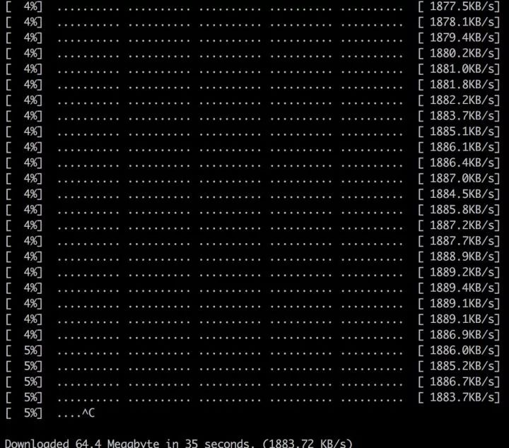

# 相关工具
> GitHub@[orca-j35](https://github.com/orca-j35)，所有笔记均托管于 [python_notes](https://github.com/orca-j35/python_notes) 仓库

## Chrome Developer Tools

Chrome Developer Tools - 谷歌浏览器内置的开发者工具。


参考: 

- https://developers.google.cn/web/tools/chrome-devtools/
- https://www.html.cn/doc/chrome-what/

Firefox、Safari、Opera 也包含类似的开发者工具。

在 Elements 中看到的 HTML 是经过 chrome 处理的后的，不是原始 HTML。因此可能存在差别。

## POSTMAN

POSTMAN - 功能强大的网页调试与 RESTful 请求工具。

- Home: <https://training.getpostman.com/catalog>


在 POSTMAN 中，我们可以对请求内容进行修改。

## httpbin

可使用 [httpbin](https://httpbin.org/) 来观察 HTTP 请求和响应的内容。由于众所周知的原因，直接访问 [httpbin](http://httpbin.org/) 可能会比较缓慢，因此建议在本地运行 httppin，详见 [httpbin - GitHub](https://github.com/postmanlabs/httpbin) 。

```python
docker pull kennethreitz/httpbin
docker run -p 80:80 kennethreitz/httpbin
```

然后访问 <http://localhost:80/> 即可。

httpbin 用于提供 HTTP 请求测试，当 httpbin 服务器获得请求消息后，它会将请求消息转换为 JSON 格式并将其置于响应体中。

## HTTPie

HTTPie - 命令行HTTP客户端。

- Home: <https://httpie.org/>
- GitHub: <https://github.com/jakubroztocil/httpie/#windows-etc>
- Docs: https://httpie.org/doc

```Shell
$ http --header http://www.scu.edu.cn
HTTP/1.1 200 OK
Accept-Ranges: bytes
Cache-Control: private, max-age=600
Connection: Keep-Alive
Content-Encoding: gzip
Content-Language: zh-CN
Content-Length: 14403
Content-Type: text/html
Date: Sun, 27 May 2018 15:38:25 GMT
ETag: "e6ec-56d3032d70a32-gzip"
Expires: Sun, 27 May 2018 15:48:25 GMT
Keep-Alive: timeout=5, max=100
Last-Modified: Sun, 27 May 2018 13:44:22 GMT
Server: VWebServer
Vary: User-Agent,Accept-Encoding
X-Frame-Options: SAMEORIGIN
```

类似工具 curl

## curl

command line tool and library for transferring data with URLs:

- Home: https://curl.haxx.se/

类似工具 HTTPie

参考:

- [curl网站开发指南](http://www.ruanyifeng.com/blog/2011/09/curl.html)

- [curl 命令(中译)](http://man.linuxde.net/curl)

- [windows（64位）下使用curl命令](https://www.cnblogs.com/xing901022/p/4652624.html)
- [You might already have curl](https://stackoverflow.com/questions/9507353/how-do-i-install-and-use-curl-on-windows)

如果 Windows 自带的 curl 运行异常，可使用 bash 自带的 curl，目前看来效果良好。


## BuiltWith

BuiltWith - 识别网站所用技术的工具。

```Python
>>> import builtwith
>>> builtwith.parse('http://www.bootcss.com/')
{'web-servers': ['Nginx'], 'font-scripts': ['Font Awesome'], 'javascript-frameworks': ['Lo-dash', 'Underscore.js', 'Vue.js', 'Zepto', 'jQuery'], 'web-frameworks': ['Twitter Bootstrap']}
>>>
>>> import ssl
>>> ssl._create_default_https_context = ssl._create_unverified_context
>>> builtwith.parse('https://www.jianshu.com/')
{'web-servers': ['Tengine'], 'web-frameworks': ['Twitter Bootstrap', 'Ruby on Rails'], 'programming-languages': ['Ruby']}
```

## python-whois

python-whois - 查询网站所有者的工具。

```Python
>>> import whois
>>> whois.whois('baidu.com')
{'domain_name': ['BAIDU.COM', 'baidu.com'], 'registrar': 'MarkMonitor, Inc.', 'whois_server': 'whois.markmonitor.com', 'referral_url': None, 'updated_date': [datetime.datetime(2017, 7, 28, 2, 36, 28), datetime.datetime(2017, 7, 27, 19, 36, 28)], 'creation_date': [datetime.datetime(1999, 10, 11, 11, 5, 17), datetime.datetime(1999, 10, 11, 4, 5, 17)], 'expiration_date': [datetime.datetime(2026, 10, 11, 11, 5, 17), datetime.datetime(2026, 10, 11, 0, 0)], 'name_servers': ['DNS.BAIDU.COM', 'NS2.BAIDU.COM', 'NS3.BAIDU.COM', 'NS4.BAIDU.COM', 'NS7.BAIDU.COM', 'dns.baidu.com', 'ns4.baidu.com', 'ns3.baidu.com', 'ns7.baidu.com', 'ns2.baidu.com'], 'status': ['clientDeleteProhibited https://icann.org/epp#clientDeleteProhibited', 'clientTransferProhibited https://icann.org/epp#clientTransferProhibited', 'clientUpdateProhibited https://icann.org/epp#clientUpdateProhibited', 'serverDeleteProhibited https://icann.org/epp#serverDeleteProhibited', 'serverTransferProhibited https://icann.org/epp#serverTransferProhibited', 'serverUpdateProhibited https://icann.org/epp#serverUpdateProhibited', 'clientUpdateProhibited (https://www.icann.org/epp#clientUpdateProhibited)', 'clientTransferProhibited (https://www.icann.org/epp#clientTransferProhibited)', 'clientDeleteProhibited (https://www.icann.org/epp#clientDeleteProhibited)', 'serverUpdateProhibited (https://www.icann.org/epp#serverUpdateProhibited)', 'serverTransferProhibited (https://www.icann.org/epp#serverTransferProhibited)', 'serverDeleteProhibited (https://www.icann.org/epp#serverDeleteProhibited)'], 'emails': ['abusecomplaints@markmonitor.com', 'whoisrelay@markmonitor.com'], 'dnssec': 'unsigned', 'name': None, 'org': 'Beijing Baidu Netcom Science Technology Co., Ltd.', 'address': None, 'city': None, 'state': 'Beijing', 'zipcode': None, 'country': 'CN'}
```

## robotparser

robotparser - 解析 robots.txt 的工具，详见笔记﹝urllib.robotparser - Parser for robots.txt.md﹞

```Python
>>> from urllib import robotparser
>>> parser = robotparser.RobotFileParser()
>>> parser.set_url('https://www.taobao.com/robots.txt')
>>> parser.read()
>>> parser.can_fetch('Hellokitty', 'http://www.taobao.com/article')
False
>>> parser.can_fetch('Baiduspider', 'http://www.taobao.com/article')
True
>>> parser.can_fetch('Baiduspider', 'http://www.taobao.com/product')
False
```

## 数据获取

- urllib
- equests
- aiohttp

## 数据提取

- re
- lxml
- beautifulsoup4
- pyquery

## 数据存储

- SQLAlchemy - ORM 框架
  - [使用SQLAlchemy - 廖雪峰](https://www.liaoxuefeng.com/wiki/1016959663602400/1017803857459008)
- peewee - ORM框架
  - [Peewee 使用](https://www.jianshu.com/p/8d1bdd7f4ff5)
  - [peewee-orm 官方文档](http://docs.peewee-orm.com/en/latest/)
- pymysql
- redis
- pymongo

## 数字签名

- [`hashlib` — Secure hashes and message digests](https://docs.python.org/3/library/hashlib.html)

## 序列化和压缩

- [`pickle` — Python object serialization](https://docs.python.org/3/library/pickle.html)
- [`json` — JSON encoder and decoder](https://docs.python.org/3/library/json.html)
- [`zlib` — Compression compatible with **gzip**](https://docs.python.org/3/library/zlib.html)

## 调度器

- 进程(multiprocessing)
- 线程(threading)
- 协程(coroutine)

## copyheader

直接将 HEADERS 转换为字段

```python
from copyheaders import headers_raw_to_dict
import requests


r_h = b
'''
Accept:text/html,application/xhtml+xml,application/xml;q=0.9,image/webp,image/apng,*/*;q=0.8

Accept-Encoding:gzip, deflate, br

Accept-Language:zh-CN,zh;q=0.9,zh-TW;q=0.8

Cache-Control:max-age=0

Connection:keep-alive

Cookie:_gauges_unique_month=1; _gauges_unique_year=1; _gauges_unique=1; _gauges_unique_hour=1; _gauges_unique_day=1

DNT:1

Host:httpbin.org

Referer:https://httpbin.org/

Upgrade-Insecure-Requests:1

User-Agent:Mozilla/5.0 (Windows NT 10.0; WOW64) AppleWebKit/537.36 (KHTML, like Gecko) Chrome/62.0.3202.94 Safari/537.36

'''

# 转换成字典
headers = headers_raw_to_dict(r_h)

# 然后就可以直接使用了~

z = requests.get('https://httpbin.org/headers',headers=headers)
```

## fake-useragent

> 如需分析 User-Agent，可访问此网站: http://useragentstring.com/

fake-useragent 库可以帮助我们自动(可随机)生成 User-Agent:

- GitHub - https://github.com/hellysmile/fake-useragent
- PyPi - https://pypi.org/project/fake-useragent/

用法如下:

```python
from fake_useragent import UserAgent
ua = UserAgent()

ua.ie
# Mozilla/5.0 (Windows; U; MSIE 9.0; Windows NT 9.0; en-US);
ua.msie
# Mozilla/5.0 (compatible; MSIE 10.0; Macintosh; Intel Mac OS X 10_7_3; Trident/6.0)'
ua['Internet Explorer']
# Mozilla/5.0 (compatible; MSIE 8.0; Windows NT 6.1; Trident/4.0; GTB7.4; InfoPath.2; SV1; .NET CLR 3.3.69573; WOW64; en-US)
ua.opera
# Opera/9.80 (X11; Linux i686; U; ru) Presto/2.8.131 Version/11.11
ua.chrome
# Mozilla/5.0 (Windows NT 6.1) AppleWebKit/537.2 (KHTML, like Gecko) Chrome/22.0.1216.0 Safari/537.2'
ua.google
# Mozilla/5.0 (Macintosh; Intel Mac OS X 10_7_4) AppleWebKit/537.13 (KHTML, like Gecko) Chrome/24.0.1290.1 Safari/537.13
ua['google chrome']
# Mozilla/5.0 (X11; CrOS i686 2268.111.0) AppleWebKit/536.11 (KHTML, like Gecko) Chrome/20.0.1132.57 Safari/536.11
ua.firefox
# Mozilla/5.0 (Windows NT 6.2; Win64; x64; rv:16.0.1) Gecko/20121011 Firefox/16.0.1
ua.ff
# Mozilla/5.0 (X11; Ubuntu; Linux i686; rv:15.0) Gecko/20100101 Firefox/15.0.1
ua.safari
# Mozilla/5.0 (iPad; CPU OS 6_0 like Mac OS X) AppleWebKit/536.26 (KHTML, like Gecko) Version/6.0 Mobile/10A5355d Safari/8536.25

# and the best one, random via real world browser usage statistic
ua.random
```

## 格式化操作

用于格式化操作的网站:

- https://www.freeformatter.com/ - JSON, HTML, XML, SQL, JavaScript ...
- https://beautifier.io/ - JavaScript, HTML, CSS

## EditThisCookie

Chrome 插件 EditThisCookie ，用于对 Cookies 里的信息进行增删改查操作


https://www.appinn.com/edit-this-cookie-for-chrome/

在设置中可以调整 cookies 的输出格式

## Sketch

当我们已经确定能爬取之后，我们不应该着急动手写爬虫。而是应该着手设计爬虫的结构。按照业务的需求，我们可以做一下简单的爬取分析，这有助于我们之后开发的效率，所谓磨刀不误砍柴工就是这个道理。比如可以考虑下，是搜索爬取还是遍历爬取？采用BFS还是DFS？并发的请求数大概多少？考虑一下这些问题后，我们可以通过Sketch来画一下简单的架构图

同类工具：Illustrator、 Photoshop


## XPath Helper

在提取网页数据时，我们一般需要使用xpath语法进行页面数据信息提取，一般地，但我们只能写完语法，发送请求给对方网页，然后打印出来，才知道我们提取的数据是否正确，这样一方面会发起很多不必要的请求，另外一方面，也浪费了我们的时间。这个就可以用到XPath Helper了，通过Chrome安装插件后，我们只需要点击它在对应的xpath中写入语法，然后便可以很直观地在右边看到我们的结果


## JSON

### JSONView

Chrome 插件 JSONView，用于格式化 JSON 数据


### JSON Editor Online

JSONView 是直接在网页端返回的数据结果是Json，但多数时候我们请求的结果，都是前端渲染后的HTML网页数据，我们发起请求后得到的json数据，在终端(即terminal)中无法很好的展现怎么办？借助JSON Editor Online就可以帮你很好的格式化数据啦，一秒格式化，并且实现了贴心得折叠Json数据功能

https://jsoneditoronline.org/

## ScreenFloat


## axel

axel：多线程下载工具，下载文件时可以替代curl、wget。

```
axel -n 20http://centos.ustc.edu.cn/centos/7/isos/x86_64/CentOS-7-x86_64-Minimal-1511.iso
```




## OpenRefine

OpenRefine（以前被叫做 Google Refine）是处理杂乱数据的强大工具：清除数据；将其从一种格式转换为另一种格式；并通过网络服务和外部数据进行扩展。

OpenRefine提供英语，中文，西班牙语，法语，俄语，葡萄牙语（巴西），德语，日语，意大利语，匈牙利语，希伯来语，菲律宾语，宿雾语，他加禄语可用

相关资源：

- Home - http://openrefine.org/
- GitHub - https://github.com/OpenRefine/OpenRefine
- Docs - https://github.com/OpenRefine/OpenRefine/wiki/Documentation-For-Users

## Natural Language Toolkit

自然语言处理工具，在《Python 网络爬虫权威指南（第 2 版）》"第九章自然语言处理"中有简要介绍相关知识。

相关资源：

- Home - http://www.nltk.org/index.html


