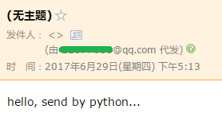

# 电子邮件

**MUA**：Mail User Agent 邮件用户代理，电子邮件软件
**MTA**：Mail Transfer Agent 邮件传输代理，邮件服务提供商
**MDA**：Mail Delivery Agent 邮件投递代理

### 发送/接收电子邮件的流程：

```
发件人 -> MUA -> MTA -> MTA -> 若干个MTA -> MDA <- MUA <- 收件人
```

假设发件方的email 是 `me@163.com` ，收件方的 email 地址是 `friend@sina.com` 。

首先，使用`Outlook`或 `Foxmail` 之类的 MUA 软件发送 Email。
Email 从 MUA 发出后，到达发件方的 MTA ，这里是 163 的 MTA 。再由 163 的MTA 发到对方服务商，也就是新浪的MTA。这个过程中间可能还会经过别的MTA。
Email 到达接收方的 MTA 后，该 MTA 会把 email 投递到邮件的最终目的地 MDA。Email 到达MDA后，存放在服务器中，即电子邮箱。

接收方要收取 Email，也必须通过 MUA 从 MDA 上取件。

### 邮件协议

基于以上概念，Email 发送和接受程序的本质是：

1.  编写MUA把邮件发到MTA；
2.  编写MUA从MDA上收邮件。

#### 发件协议

**SMTP**：Simple Mail Transfer Protocol
`MUA -> MTA -> MTA -> 若干个MTA `  这段过程使用的是 SMTP 协议

#### 取件协议

**POP**：Post Office Protocol 目前版本是3，俗称POP3
**IMAP**：Internet Message Access Protocol，目前版本是4。优点是不但能取邮件，还可以直接操作 MDA 上存储的邮件，比如从收件箱移到垃圾箱，等等。
`MDA <- MUA` 取件的时，可使用这两种协议

邮件客户端软件在发邮件时，会让你先配置SMTP服务器，也就是你要发到哪个MTA上。

类似的，从MDA收邮件时，MDA服务器也要求验证你的邮箱口令，确保不会有人冒充你收取你的邮件，所以，Outlook之类的邮件客户端会要求你填写POP3或IMAP服务器地址、邮箱地址和口令，这样，MUA才能顺利地通过POP或IMAP协议从MDA取到邮件。

注意，目前大多数邮件服务商都需要手动打开SMTP发信和POP收信的功能，否则只允许在网页登录：

## SMTP 发送邮件

Python 内置对 SMTP 的支持，可以发送纯文本邮件、HTML邮件以及带附件的邮件。

`smtplib` 和 `email` 两个模块对 SMTP 提供支持。
`email` 模块负责构造邮件
`smtplib` 模块负责发送邮件

### 构造邮件

```
from email.mime.text import MIMEText
msg = MIMEText('hello, send by Python...', 'plain', 'utf-8')
```

#### MIMEText( )

-   class MIMEText(_text, _subtype='plain', _charset=None, policy=None)

    Class for generating text/* type MIME documents.

注意到构造`MIMEText`对象时，第一个参数就是邮件正文，第二个参数是MIME的subtype，传入`'plain'`表示纯文本，最终的MIME就是`'text/plain'`，最后一定要用 `utf-8` 编码保证多语言兼容性。

### 发送plain邮件

```
# 输入Email地址和口令:
from_addr = input('From: ')
password = input('Password: ')
# 输入收件人地址:
to_addr = input('To: ')
# 输入SMTP服务器地址:
smtp_server = input('SMTP server: ')

import smtplib
server = smtplib.SMTP_SSL(smtp_server, 465)
server.set_debuglevel(1)
server.login(from_addr, password)
server.sendmail(from_addr, [to_addr], msg.as_string())
server.quit()
```

#### .SMTP_SSL( )

class SMTP_SSL(host='', port=0, local_hostname=None, keyfile=None, certfile=None, timeout=socket._GLOBAL_DEFAULT_TIMEOUT, source_address=None, context=None)

#### .set_debuglevel(debuglevel)

>   def set_debuglevel(debuglevel)
>
>   Set the debug output level.
>
>   A non-false value results in debug messages for connection and for all messages sent to and received from the server.

`set_debuglevel(1)` 可以打印出和SMTP服务器交互的所有信息。SMTP 协议就是简单的文本命令和响应。

#### .login( )

>   def login(user, password, initial_response_ok=True)
>
>   Log in on an SMTP server that requires authentication.
>
>   The arguments are:
>
>   -   user: The user name to authenticate with.
>   -   password: The password for the authentication.

`login()`方法用来登录SMTP服务器

#### .sendmail( )

>   def sendmail(from_addr, to_addrs, msg, mail_options=[], rcpt_options=[])
>
>   sendmail(self, from_addr, to_addrs, msg, mail_options=[], rcpt_options=[])
>
>   This command performs an entire mail transaction.
>
>   The arguments are:
>
>   -   from_addr : The address sending this mail.
>   -   to_addrs : A list of addresses to send this mail to. A bare       string will be treated as a list with 1 address.
>   -   msg : The message to send.
>   -   mail_options : List of ESMTP options (such as 8bitmime) for the       mail command.

`sendmail()`方法就是发邮件，由于可以一次发给多个人，所以传入一个`list`，邮件正文是一个`str`，

#### .as_string( )

>   def as_string(unixfrom=False, maxheaderlen=0, policy=None)
>   Return the entire formatted message as a string.
>   `as_string()`把`MIMEText`对象变成`str`。



可以观察到，如果使用上述代码发送邮件，发现如下问题：

1.  邮件没有主题；
2.  没有显示发件人的名字，如`Mr Green <green@example.com>` ；
3.  明明收到了邮件，却提示不在收件人中。

邮件主题、发件人、收件人等信息不能通过 SMTP 协议直接发送给 MTA ，而是需要将这些信息包含在发送给 MTA 的文本中。所以，需要把 `From` / `To` / `Subject` 添加到 MIMEText 中，才能构成一封完整的邮件：

```
from email import encoders
from email.header import Header
from email.mime.text import MIMEText
from email.utils import parseaddr, formataddr

import smtplib

def _format_addr(s):
    name, addr = parseaddr(s)
    return formataddr((Header(name, 'utf-8').encode(), addr))

from_addr = input('From: ')
password = input('Password: ')
to_addr = input('To: ')
smtp_server = input('SMTP server: ')

msg = MIMEText('hello, send by Python...', 'plain', 'utf-8')
msg['From'] = _format_addr('Python爱好者 <%s>' % from_addr)
msg['To'] = _format_addr('管理员 <%s>' % to_addr)
msg['Subject'] = Header('来自SMTP的问候……', 'utf-8').encode()

server = smtplib.SMTP(smtp_server, 25)
server.set_debuglevel(1)
server.login(from_addr, password)
server.sendmail(from_addr, [to_addr], msg.as_string())
server.quit()
```

函数 `_format_addr()` 用于格式化邮件地址。此处不能简单的传入`name <addr@example.com>` ，因为在包含中文的情况下，主要通过 `Hearder` 对象进行编码。

#### . parseaddr( )

#### .Header( )

>   class Header(s=None, charset=None, maxlinelen=None, header_name=None, continuation_ws=' ', errors='strict')
>   Header(self, s=None, charset=None, maxlinelen=None, header_name=None, continuation_ws=' ', errors='strict')
>   Create a MIME-compliant header that can contain many character sets.

`msg['To']` 接收的是字符串而不是list，如果有多个邮件地址，用`,`分隔即可。

再发送一遍邮件，就可以在收件人邮箱中看到正确的标题、发件人和收件人：


邮件服务商在显示发件人/收件人的名字时，会把名字自动替换为用户注册的名字，没有注册的名字则按原样显示。

如果我们查看Email的原始内容，可以看到如下经过编码的邮件头：

```
From: =?utf-8?b?UHl0aG9u54ix5aW96ICF?= <xxxxxx@163.com>
To: =?utf-8?b?566h55CG5ZGY?= <xxxxxx@qq.com>
Subject: =?utf-8?b?5p2l6IeqU01UUOeahOmXruWAmeKApuKApg==?=
```

这就是经过`Header`对象编码的文本，包含utf-8编码信息和Base64编码的文本。如果我们自己来手动构造这样的编码文本，显然比较复杂。

### 发送HTML邮件

如果我们要发送HTML邮件，而不是普通的纯文本文件怎么办？方法很简单，在构造`MIMEText`对象时，把HTML字符串传进去，再把第二个参数由`plain`变为`html`就可以了：

```
msg = MIMEText('<html><body><h1>Hello</h1>' +
    '<p>send by <a href="http://www.python.org">Python</a>...</p>' +
    '</body></html>', 'html', 'utf-8')

```

再发送一遍邮件，你将看到以HTML显示的邮件：


### 发送附件

带附件的邮件可以看做包含若干部分的邮件：文本和各个附件本身。所以，可以构造一个`MIMEMultipart`对象代表邮件本身，然后往里面加上一个`MIMEText`作为邮件正文，再继续往里面加上表示附件的`MIMEBase`对象即可：

```
# 邮件对象:
msg = MIMEMultipart()
msg['From'] = _format_addr('Python爱好者 <%s>' % from_addr)
msg['To'] = _format_addr('管理员 <%s>' % to_addr)
msg['Subject'] = Header('来自SMTP的问候……', 'utf-8').encode()

# 邮件正文是MIMEText:
msg.attach(MIMEText('send with file...', 'plain', 'utf-8'))

# 添加附件就是加上一个MIMEBase，从本地读取一个图片:
with open('/Users/michael/Downloads/test.png', 'rb') as f:
    # 设置附件的MIME和文件名，这里是png类型:
    mime = MIMEBase('image', 'png', filename='test.png')
    # 加上必要的头信息:
    mime.add_header('Content-Disposition', 'attachment', filename='test.png')
    mime.add_header('Content-ID', '<0>')
    mime.add_header('X-Attachment-Id', '0')
    # 把附件的内容读进来:
    mime.set_payload(f.read())
    # 用Base64编码:
    encoders.encode_base64(mime)
    # 添加到MIMEMultipart:
    msg.attach(mime)
```

然后，按正常发送流程把`msg`（注意类型已变为`MIMEMultipart`）发送出去，就可以收到如下带附件的邮件：


### 发送图片

如果要把一个图片嵌入到邮件正文中怎么做？直接在HTML邮件中链接图片地址行不行？答案是，大部分邮件服务商都会自动屏蔽带有外链的图片，因为不知道这些链接是否指向恶意网站。

要把图片嵌入到邮件正文中，我们只需按照发送附件的方式，先把邮件作为附件添加进去，然后，在HTML中通过引用`src="cid:0"`就可以把附件作为图片嵌入了。如果有多个图片，给它们依次编号，然后引用不同的`cid:x`即可。

把上面代码加入`MIMEMultipart`的`MIMEText`从`plain`改为`html`，然后在适当的位置引用图片：

```
msg.attach(MIMEText('<html><body><h1>Hello</h1>' +
    '<p></p>' +
    '</body></html>', 'html', 'utf-8'))

```

再次发送，就可以看到图片直接嵌入到邮件正文的效果：


### 同时支持HTML和Plain格式

如果我们发送HTML邮件，收件人通过浏览器或者Outlook之类的软件是可以正常浏览邮件内容的，但是，如果收件人使用的设备太古老，查看不了HTML邮件怎么办？

办法是在发送HTML的同时再附加一个纯文本，如果收件人无法查看HTML格式的邮件，就可以自动降级查看纯文本邮件。

利用`MIMEMultipart`就可以组合一个HTML和Plain，要注意指定subtype是`alternative`：

```
msg = MIMEMultipart('alternative')
msg['From'] = ...
msg['To'] = ...
msg['Subject'] = ...

msg.attach(MIMEText('hello', 'plain', 'utf-8'))
msg.attach(MIMEText('<html><body><h1>Hello</h1></body></html>', 'html', 'utf-8'))
# 正常发送msg对象...

```

### 加密SMTP

使用标准的25端口连接SMTP服务器时，使用的是明文传输，发送邮件的整个过程可能会被窃听。要更安全地发送邮件，可以加密SMTP会话，实际上就是先创建SSL安全连接，然后再使用SMTP协议发送邮件。

注意：本节之前都使用的是 `smtplib._SSL`，因为现在的邮件服务商都直接支持 SSL. 

某些邮件服务商，例如Gmail，提供的SMTP服务必须要加密传输。我们来看看如何通过Gmail提供的安全SMTP发送邮件。

必须知道，Gmail的SMTP端口是587，因此，修改代码如下：

```
smtp_server = 'smtp.gmail.com'
smtp_port = 587
server = smtplib(smtp_server, smtp_port)
server.starttls()
# 剩下的代码和前面的一模一样:
server.set_debuglevel(1)
...
```

只需要在创建`SMTP`对象后，立刻调用`starttls()`方法，就创建了安全连接。后面的代码和前面的发送邮件代码完全一样。

### 小结

使用Python的smtplib发送邮件十分简单，只要掌握了各种邮件类型的构造方法，正确设置好邮件头，就可以顺利发出。

构造一个邮件对象就是一个`Messag`对象，如果构造一个`MIMEText`对象，就表示一个文本邮件对象，如果构造一个`MIMEImage`对象，就表示一个作为附件的图片，要把多个对象组合起来，就用`MIMEMultipart`对象，而`MIMEBase`可以表示任何对象。它们的继承关系如下：

```
Message
+- MIMEBase
   +- MIMEMultipart
   +- MIMENonMultipart
      +- MIMEMessage
      +- MIMEText
      +- MIMEImage
```

这种嵌套关系就可以构造出任意复杂的邮件。你可以通过[email.mime文档](https://docs.python.org/3/library/email.mime.html)查看它们所在的包以及详细的用法。


## POP3 收取邮件

收取邮件就是编写一个 **MUA** 作为客户端，从 **MDA** 把邮件获取到用户的电脑或者手机上。收取邮件最常用的协议是**POP**协议，目前版本号是3，俗称**POP3**。

内置 `poplib`  模块，用于实现 POP3 协议，可直接用来收邮件。

注意：POP3 协议收取的是邮件的原始文本，并不是一个可以直接阅读的邮件，这和SMTP协议很像，SMTP发送的也是经过编码后的一大段文本。

要把POP3收取的文本变成可以阅读的邮件，还需要用`email`模块提供的各种类来解析原始文本，变成可阅读的邮件对象。

所以，收取邮件分两步：

第一步：用`poplib`把邮件的原始文本下载到本地；

第二部：用`email` 解析原始文本，还原为邮件对象。

### 通过POP3下载邮件

POP3协议本身很简单，以下面的代码为例，我们来获取最新的一封邮件内容：

```
import poplib

# 输入邮件地址, 口令和POP3服务器地址:
email = input('Email: ')
password = input('Password: ')
pop3_server = input('POP3 server: ')

# 连接到POP3服务器:
server = poplib.POP3(pop3_server)
# 可以打开或关闭调试信息:
server.set_debuglevel(1)
# 可选:打印POP3服务器的欢迎文字:
print(server.getwelcome().decode('utf-8'))

# 身份认证:
server.user(email)
server.pass_(password)

# stat()返回邮件数量和占用空间:
print('Messages: %s. Size: %s' % server.stat())
# list()返回所有邮件的编号:
resp, mails, octets = server.list()
# 可以查看返回的列表类似[b'1 82923', b'2 2184', ...]
print(mails)

# 获取最新一封邮件, 注意索引号从1开始:
index = len(mails)
resp, lines, octets = server.retr(index)

# lines存储了邮件的原始文本的每一行,
# 可以获得整个邮件的原始文本:
msg_content = b'\r\n'.join(lines).decode('utf-8')
# 稍后解析出邮件:
msg = Parser().parsestr(msg_content)

# 可以根据邮件索引号直接从服务器删除邮件:
# server.dele(index)
# 关闭连接:
server.quit()
```

用POP3获取邮件其实很简单，要获取所有邮件，只需要循环使用`retr()`把每一封邮件内容拿到即可。真正麻烦的是把邮件的原始内容解析为可以阅读的邮件对象。

### 解析邮件

解析邮件的过程和上一节构造邮件正好相反，因此，先导入必要的模块：

```
from email.parser import Parser
from email.header import decode_header
from email.utils import parseaddr

import poplib

```

只需要一行代码就可以把邮件内容解析为`Message`对象：

```
msg = Parser().parsestr(msg_content)

```

但是这个`Message`对象本身可能是一个`MIMEMultipart`对象，即包含嵌套的其他`MIMEBase`对象，嵌套可能还不止一层。

所以我们要递归地打印出`Message`对象的层次结构：

```
# indent用于缩进显示:
def print_info(msg, indent=0):
    if indent == 0:
        for header in ['From', 'To', 'Subject']:
            value = msg.get(header, '')
            if value:
                if header=='Subject':
                    value = decode_str(value)
                else:
                    hdr, addr = parseaddr(value)
                    name = decode_str(hdr)
                    value = u'%s <%s>' % (name, addr)
            print('%s%s: %s' % ('  ' * indent, header, value))
    if (msg.is_multipart()):
        parts = msg.get_payload()
        for n, part in enumerate(parts):
            print('%spart %s' % ('  ' * indent, n))
            print('%s--------------------' % ('  ' * indent))
            print_info(part, indent + 1)
    else:
        content_type = msg.get_content_type()
        if content_type=='text/plain' or content_type=='text/html':
            content = msg.get_payload(decode=True)
            charset = guess_charset(msg)
            if charset:
                content = content.decode(charset)
            print('%sText: %s' % ('  ' * indent, content + '...'))
        else:
            print('%sAttachment: %s' % ('  ' * indent, content_type))

```

邮件的Subject或者Email中包含的名字都是经过编码后的str，要正常显示，就必须decode：

```
def decode_str(s):
    value, charset = decode_header(s)[0]
    if charset:
        value = value.decode(charset)
    return value

```

`decode_header()`返回一个list，因为像`Cc`、`Bcc`这样的字段可能包含多个邮件地址，所以解析出来的会有多个元素。上面的代码我们偷了个懒，只取了第一个元素。

文本邮件的内容也是str，还需要检测编码，否则，非UTF-8编码的邮件都无法正常显示：

```
def guess_charset(msg):
    charset = msg.get_charset()
    if charset is None:
        content_type = msg.get('Content-Type', '').lower()
        pos = content_type.find('charset=')
        if pos >= 0:
            charset = content_type[pos + 8:].strip()
    return charset

```

把上面的代码整理好，我们就可以来试试收取一封邮件。先往自己的邮箱发一封邮件，然后用浏览器登录邮箱，看看邮件收到没，如果收到了，我们就来用Python程序把它收到本地：


运行程序，结果如下：

```
+OK Welcome to coremail Mail Pop3 Server (163coms[...])
Messages: 126. Size: 27228317

From: Test <xxxxxx@qq.com>
To: Python爱好者 <xxxxxx@163.com>
Subject: 用POP3收取邮件
part 0
--------------------
  part 0
  --------------------
    Text: Python可以使用POP3收取邮件……...
  part 1
  --------------------
    Text: Python可以<a href="...">使用POP3</a>收取邮件……...
part 1
--------------------
  Attachment: application/octet-stream

```

我们从打印的结构可以看出，这封邮件是一个`MIMEMultipart`，它包含两部分：第一部分又是一个`MIMEMultipart`，第二部分是一个附件。而内嵌的`MIMEMultipart`是一个`alternative`类型，它包含一个纯文本格式的`MIMEText`和一个HTML格式的`MIMEText`。

### 小结

用Python的`poplib`模块收取邮件分两步：第一步是用POP3协议把邮件获取到本地，第二步是用`email`模块把原始邮件解析为`Message`对象，然后，用适当的形式把邮件内容展示给用户即可。